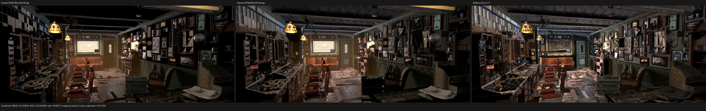
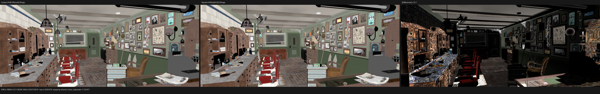
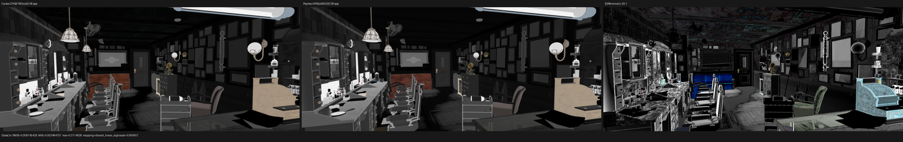
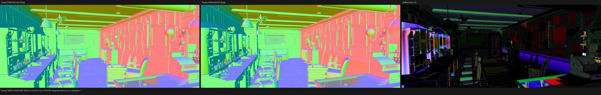
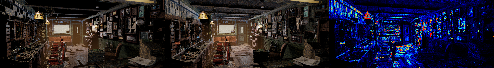
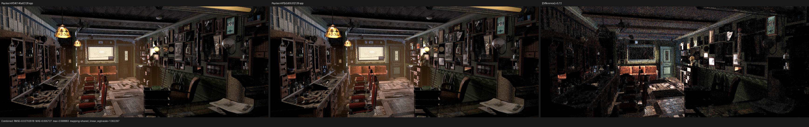
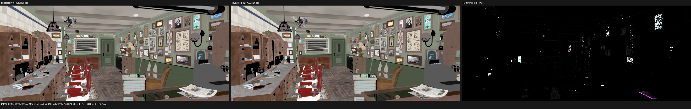

# Barbershop Cycles geometry-representation checkpoint

## Scope and conclusion

The remaining Barbershop texture report exposed a flaw below shader-node
evaluation. Blender exports several pairs of bit-identical triangle supports
at bit-identical transforms, but Cycles does not necessarily intersect both
members in the same numerical representation. A geometry with one user can
have its static transform applied to its vertices before BVH construction;
shared geometry remains in object space and receives an inverse-transformed
ray. Those two real-number constructions describe the same surface, but their
float32 intersection distances and barycentrics need not be equal.

The previous stable-order traversal inherited the backend candidate's
distance and barycentrics before resolving a coincident identity. It could
therefore select the Blender instance copy of a surface for which Cycles
selects the ordinary object. This is visible in procedural materials: Object
Info Random belongs to the selected Cycles object, so choosing the other copy
can change a live wood-texture coordinate even though position, topology, and
transform are identical.

Psycles commit `b2d0533` now reconstructs Cycles' source geometry
representation and evaluates every exact-support alias with an explicit
Embree-compatible Pluecker triangle relation. This is not an epsilon tie
patch. Exact support groups are bitwise equivalence classes, and each member
is evaluated through the representation selected by the same static-transform
predicate as Cycles. Source/light exclusions, visibility, the closed ray
interval, and the stable Cycles identity order are then applied to those
reconstructed candidates.

The official oracle is Blender/Cycles `main` commit
`61f93ccb14781f8f1f877a5bb8db04ede49672b3` (Blender 5.3 Alpha). The scene is
the unchanged official Barbershop Interior blend. Materials remain live
Blender graphs lowered to Luisa DSL, and their original closures enter the
path integrator. No image, material, closure, or lighting result is baked by
Blender/Cycles.

## Formal representation relation

Let a triangle support be the ordered pair of position and index arrays
`S = (P, I)`, and let `M` be its instance transform. Two instances enter the
same alias class exactly when

```text
bitwise_equal(S_a, S_b) && bitwise_equal(M_a, M_b).
```

Normals, UVs, tangents, material slots, and other shading attributes do not
change geometric support and therefore do not split the class. Conversely, a
one-bit position or transform change does split it. There is no spatial
tolerance or scene-specific name test.

For each member, Psycles applies the Cycles static-transform predicate:

```text
apply_transform =
    geometry_user_count == 1
    && !adaptive_subdivision
    && !object_motion
    && !surface_BSSRDF
    && !true_displacement
```

If `apply_transform` is true, vertices are uploaded as the host float32 FMA
tree `M * P` and the device relation consumes the world-space ray. Otherwise,
vertices remain in object space and the relation consumes the ray transformed
by the Cycles affine inverse. The inverse, point transform, device affine
transform, cross products, and dot products all have explicit operation
trees; they are not left to backend-dependent matrix lowering.

For ray origin `O`, direction `D`, and triangle vertices `p0,p1,p2`, the
device component evaluates the same Pluecker construction for every alias:

```text
v0 = p0 - O                 e0 = v2 - v0
v1 = p1 - O                 e1 = v0 - v1
v2 = p2 - O                 e2 = v1 - v2

u = dot(cross(e0, v2 + v0), D)
v = dot(cross(e1, v0 + v1), D)
w = dot(cross(e2, v1 + v2), D)
```

The edge sign relation, closed `[tmin,tmax]` interval, distance, and
barycentrics are derived from that one construction. The acceleration
backend is used to discover an exact-support class; it is not allowed to
choose which source representation wins inside that class. The existing
second traversal remains bounded by the closest backend distance plus one
representable value, so it folds equal-distance candidates without scanning
geometry behind the closest surface.

## Official sample-6 path differential

The decisive ray is output pixel `(1047,253)`, absolute sample 6, at
1152x480. The first surface is a pair of the same cream-bottle support:

| Candidate | Cycles object / primitive | representation | shader |
| --- | --- | --- | ---: |
| ordinary object | `2131 / 20474114` | statically transformed vertices | `3221225620` |
| Blender instance | `2372 / 3396299` | object-space vertices and transformed ray | `3221225623` |

The shaders are duplicate White Rough Glass graphs, but their Cycles object
identity is observably distinct. Before this correction Psycles chose
`2372 / 3396299` at event 0. The corrected HIP and fallback traces are:

| event | Cycles CPU | Psycles HIP | Psycles fallback |
| ---: | --- | --- | --- |
| 0 | `2131 / 20474114` | `2131 / 20474114` | `2131 / 20474114` |
| 1 | `2372 / 3396299` | `2372 / 3396299` | `2372 / 3396299` |
| 2 | `2131 / 20474664` | `2131 / 20474664` | `2131 / 20474664` |
| 3 | `2372 / 3394874` | `2131 / 20496478` | `2131 / 20496478` |

Thus the targeted representation error is fixed through the first three
surface identities on both Luisa backends, while the complete path still
fails at event 3. The HIP and fallback comparisons against Cycles CPU each
retain 170 failed fields out of 443 exact/float fields plus 49 separately
checked random fields. Initial camera Sobol dimensions are exact, but closure
selection is rescaled by a different evaluated closure weight, so the random
stream alone is not claimed to pass. The remaining continuous camera,
barycentric, normal, bump, and closure differences are recorded as residuals,
not hidden by a relaxed topology tolerance.

Machine-readable traces and comparisons are retained in
[the reports directory](reports/).

## Regression matrix

The host intersection-plan regression checks all of the following:

- exact support and transform group even when shading attributes differ;
- one-bit support and one-bit transform changes do not group;
- a unique geometry user receives static-transformed vertices;
- shared geometry, BSSRDF, true displacement, adaptive subdivision, and
  motion retain object-space geometry;
- Cycles' explicit affine transform and inverse round-trip representative
  points.

The Luisa traversal regression embeds the official bottle triangle values and
Cycles object/primitive identities. It verifies the default ordinary-object
selection, source exclusion selecting the Blender instance, light exclusion,
and exclusion in the opposite direction. The same records pass on fallback,
HIP, and Vulkan. Existing closed-endpoint, stable triangle, and curve-segment
cases remain in the same target.

The repository was built with all 32 workers. The complete suite passed
177/177 across the verification runs. The user's untracked
`tests/test_luisa_curve_primitive.cpp` was neither modified nor staged.

## Full-scene 128 spp result

The corrected export contains 1,649 meshes, six curve geometries, 2,565
instances, 547 source materials, and 190 available images. Its 2,565
instances contain 288 exact-support classes involving 578 members. Forty-two
of those classes belong to floor, wall, ceiling, or cupboard surface
families. All 1,649 meshes report adaptive subdivision disabled in this
scene.

The same bundle was rendered through Luisa/HIP at 1152x480, 128 fixed spp,
without denoising. Linear multilayer EXRs were compared against both Cycles
devices. `before` is commit `40145a0`; `after` is `b2d0533`. Ratios are
Psycles/reference mean luminance.

| Oracle | state | Combined RMSE | ratio | DiffCol RMSE | GlossCol RMSE | Normal RMSE | Emit RMSE |
| --- | --- | ---: | ---: | ---: | ---: | ---: | ---: |
| Cycles CPU | before | 0.0774203 | 1.097593 | 0.0115331 | 0.0089113 | 0.0506179 | 0.0003208 |
| Cycles CPU | after | 0.0764928 | 1.182822 | 0.0114927 | 0.0087454 | 0.0505941 | 0.0002850 |
| Cycles HIP | before | 0.0675017 | 1.126974 | 0.0116321 | 0.0084000 | 0.0506139 | 0.0004893 |
| Cycles HIP | after | 0.0663979 | 1.214485 | 0.0115951 | 0.0082391 | 0.0505905 | 0.0004868 |

Against Cycles CPU, the correction reduces Combined RMSE by 1.20%, DiffCol by
0.35%, GlossCol by 1.86%, Normal by 0.047%, and Emit by 11.15%. The HIP oracle
has the same direction for every listed pass. This validates the source
representation correction, but it does not validate the complete estimator.
Diffuse and glossy direct/indirect RMSE increase by roughly 1.4% to 6.1%, and
Combined mean luminance becomes 18.28% above Cycles CPU. Correct object
identity changes later finite-sample paths; the unresolved closure, sampling,
normal, and transport differences remain large enough to dominate their
contributions.











The direct before/after panels show where exact-support identity changes the
result:





### Surface-specific visual audit

The full-resolution linear and Filmic triptychs were inspected manually.
Diffuse Color shows the same floor-board direction and scale, ceiling
frequency, wall masks, and principal cabinet grain as Cycles. Approximate
image-space ROIs give the following before/after RMSE changes against Cycles
CPU; these are diagnostic regions rather than release gates:

| ROI | DiffCol change | GlossCol change | Normal change |
| --- | ---: | ---: | ---: |
| ceiling | -0.48% | -8.83% | -0.03% |
| floor | -0.02% | +0.001% | -0.001% |
| left cabinet/counter | -1.72% | -3.41% | -0.05% |
| right wall/cabinet | -0.72% | -1.04% | -0.07% |

This rules out one remaining global UV rotation, offset, or scale error. It
does not make the surfaces visually equal in Combined: Psycles remains
brighter across the floor, cabinets, and indirectly lit walls. Normal retains
structured differences around cabinet panels, wall trim, silhouettes, and
fine bump detail. Those are the next functional alignment targets.

The scene also contains live nodes referring to `generic_scratches.png` and
`guilder_ornament.png`, but the official blend stores both as unpacked FILE
images with `[0,0]` size and nonexistent external paths. Cycles' defined
missing-image result is `(1,0,1,1)`. Psycles image slot zero is the same 1x1
magenta RGBA texture, so no replacement image or baking is introduced and the
missing files are not a Cycles/Psycles discrepancy.

## Fallback full-scene execution

The same 1152x480 absolute sample-6 render completed through Luisa fallback
with Embree 4.4.1 and 32 CPU threads. It compiled all 1,649 geometries, 2,565
instances, and 564 runtime materials. This proves the software path no longer
falls into the earlier callback failure on the official scene.

| phase | fallback | HIP trace kernel |
| --- | ---: | ---: |
| scene compilation | 6.702 s | 17.795 s |
| cold shader JIT | 4207.41 s | 2314.14 s |
| 1152x480, 1 spp render | 122.929 s | 3.893 s |
| peak host RSS | 56.76 GiB | 30.63 GiB |

Fallback is therefore 31.58x slower than HIP for this one-sample trace-enabled
render, before considering its 70-minute cold compiler cost. It is
functionally available, but it is not yet a practical full-scene benchmark
backend. The fallback compiler reports a 980,466-instruction path function and
uses its minimal O0 IR pipeline plus O1 machine-code generation. This is a
compiler/kernel scalability item, not a reason to remove fallback coverage.

At one spp, fallback and HIP are not pixel-identical because small backend
float differences change discrete later path choices. Environment is exactly
identical; full Combined RMSE is dominated by high-energy single-sample
outliers. The per-path table above is the authoritative functional diagnosis.

## HIP timing

The first production kernel was intentionally cold and overlapped most of its
compile with the fallback LLVM process. It spent 242.040 s in Luisa/HIP LLVM
generation and 1867.756 s in AMD COMGR, for 2191.68 s total shader JIT. Since
that run shared all CPU cores and substantial memory pressure, it is retained
as a compiler-stage observation rather than used for a before/after speed
claim. Its code object is 27,270,664 bytes.

The cold process rendered 128 spp in 200.198 s after fallback had finished.
An independent exclusive warm-cache process spent 17.678 s compiling the
scene, 2.427 s loading/JITing shaders, and 200.398 s rendering; complete wall
time was 222.34 s with 11,620,476 KiB peak RSS. The previous `40145a0`
warm-cache render took 196.67 s, so the explicit source-representation
candidate evaluation currently costs 1.90% render throughput. This is a
measured regression, not hidden inside compiler time.

The two `b2d0533` processes are close but not fully deterministic. Combined
differs at 1,078 pixels (`0.195%`), with RMSE `0.0001716`, P99 pixel RMSE zero,
and a maximum channel error of `0.16394`. DiffCol differs at 162 pixels with
RMSE `4.08e-7`; Normal differs at 241 pixels with RMSE `3.43e-7`. Later
indirect paths amplify a sparse subset, including GlossInd RMSE `0.004121`.
The same pixel `(288,133)` contains NaNs in DiffInd and GlossInd in the old,
cold, and warm renders while Combined remains finite. This pre-existing
pass-splitting defect and the remaining rebuild-dependent paths are open
regressions; the checkpoint does not call the images byte-identical.

Full repeat metrics and timings are in the
[cold/warm report](reports/full-hip-128-cold-vs-warm.json) and
[timing record](reports/timings.json). Cycles renders the same scene in
28.107 s on CPU and 19.161 s on HIP. Psycles is therefore 7.13x slower than
Cycles CPU and 10.46x slower than Cycles HIP by the exclusive render interval.
Functional parity remains the priority, and no speedup is claimed.

## Remaining work

The sample-6 global camera dimensions match exactly, but the generated camera
ray still differs by a few float32 ULPs and its first barycentrics differ by
roughly `1e-5`. The White Rough Glass graph at that pixel uses a high-frequency
Generated-coordinate BOX texture, so those continuous differences are
amplified into a roughly 0.006 closure-weight error. Cycles CPU and HIP also
differ in reciprocal and intersection rounding, so the next correction must
preserve the Cycles camera/intersection expression and allow backend arithmetic
to follow from it; it must not add a barycentric epsilon or pixel/material
special case.

Full scene parity remains open for bump-normal setup, true displacement,
closure evaluation and selection, light sampling, and direct/indirect
transport. The official splash, Classroom, Monster, Lone Monk, and Barbershop
scenes remain release targets, together with fallback/HIP/Vulkan and Cycles
CPU/HIP measurements.
