# Barbershop render-UV and back-facing BOX projection checkpoint

## Scope and conclusion

The visible Barbershop texture discrepancy was real. Two independent,
general coordinate contracts differed from Blender/Cycles:

1. Psycles exported Blender's editing-active UV layer as the unnamed default
   UV. Cycles uses the render/default UV layer instead.
2. Image Texture `BOX` projection selected and oriented cube faces from the
   pre-backface shading normal. Cycles performs BOX projection after shader
   setup has flipped the shading normal for a back-facing hit.

Both corrections operate on the original Blender graph and geometry. Named UV
layers are retained, image texture nodes remain live, and the original surface
closures are passed to the Luisa path integrator. No texture, material, or
closure is baked through Blender/Cycles.

The oracle is Blender/Cycles `main` commit
`61f93ccb14781f8f1f877a5bb8db04ede49672b3` (Blender 5.3 Alpha), built locally
with HIP enabled. The Psycles fixes are commits `e52a044` and `40145a0`.

## Formal compatibility relations

### Default UV identity

Let `U` be the set of named Blender corner-domain UV attributes. Psycles now
uses

```text
default_uv = the unique U[i] for which U[i].active_render is true
default_uv_tangent = tangent(default_uv)
named_uv(name) = U[name]
```

The editing-active attribute is an independent UI state and has no role in the
first two equations. This follows Cycles' `attr_create_uv_map`: Blender's
`Mesh::default_uv_map_name()` is the only layer registered as `ATTR_STD_UV`.
The regression deliberately makes the editing-active and render-active layers
different, then checks the exported primary UV and tangent byte ranges against
the render-active named ranges.

In the official scene, `GEO-barbershop_walls.003` demonstrates the exact
failure:

```text
UVMap                 active=false  active_render=true
picture_frames_spots  active=true   active_render=false
```

The previous export therefore made every unnamed Texture Coordinate UV branch
on that mesh read `picture_frames_spots`.

The corrected full-scene `geometry.bin` provides a byte-level check. Its
primary UV range and named `UVMap` range have the same SHA-256,
`c13eb5c882313daa1135628f893de26e94bc2b113d933ee8b424f81a4cc19fae`;
`picture_frames_spots` instead hashes to
`7c0943602e4b510a5bef8c806ba02036ad3638de8c0aba675b6ce7673259d4b0`.
The primary tangent range and `UVMap` tangent range likewise both hash to
`ab2b6d0dd3a5f9e9c3e533b8b1df12724fb72bf59cce9aef1f31a4498d2ceb0d`.

### Back-facing BOX normal

Let `N_obj_raw` be Psycles' object-space shading normal before back-face
canonicalization, and let `b` be `point.back_facing`. The signed normal used by
Image Texture `BOX` is now

```text
N_obj_box = b ? -N_obj_raw : N_obj_raw
```

The absolute components determine Cycles' cube-face blend weights; the signed
components determine each face's two-dimensional orientation. Applying only
the absolute-value correction would therefore still be wrong. The sign law is
the object-space form of Cycles shader setup flipping `sd->N`, followed by
`svm_node_tex_image_box` transforming that post-setup normal back to object
space. It is local to BOX projection so that unrelated normal-node semantics
are not changed.

After correcting the default UV, a topological walk of the wall shader found
the next first divergent node at its Generated-coordinate BOX Image Texture,
`metal_grungy02_tileable.png-color.png.004` (projection blend zero, POINT
mapping scale 0.5). The Generated coordinate itself matched Cycles at relative
RMSE `5.30e-7`; replacing only the BOX normal relation reduced that image
branch from relative RMSE `0.130732` to `0.006893`. More than 95% of its pixels
then match at numerical precision, with the reported RMSE concentrated at
sparse silhouettes. Downstream mixes reduce the final material error further,
as reported below.

## Staged official-scene differential

Every row below compares a live intermediate node from the unchanged official
Barbershop graph against Cycles CPU at 1152x480 and 4 fixed spp. The values are
linear EXR data. Ratio means Psycles/reference mean luminance.

| Probe and state | Backend | RMSE | Relative RMSE | P99 pixel RMSE | Ratio |
| --- | --- | ---: | ---: | ---: | ---: |
| Right-wall default-UV Image Texture, before | fallback | 0.0238887 | 0.119869 | 0.0876175 | 1.002061 |
| Right-wall default-UV Image Texture, after | fallback | 0.00008086 | 0.0004057 | 0.00003625 | 0.999999 |
| Right-wall default-UV Image Texture, after | HIP | 0.00010580 | 0.0005309 | 0.00003759 | 1.000000 |
| Right-wall default-UV Image Texture, after | Vulkan | 0.00008954 | 0.0004493 | 0.00003393 | 1.000000 |
| Final right-wall Diffuse Color, after UV but before BOX fix | fallback | 0.00189723 | 0.0102003 | 0.0101011 | 1.000445 |
| Final right-wall Diffuse Color, after both fixes | fallback | 0.00010116 | 0.0005439 | 0.00000280 | 1.000000 |

The first correction reduces the isolated default-UV image's relative RMSE by
295.4x. The second reduces the final wall material's relative RMSE by 18.8x;
99% of pixels then differ by less than `2.8e-6` RMS. The remaining global RMSE
is concentrated at sparse rasterized silhouettes rather than in the texture
layout.

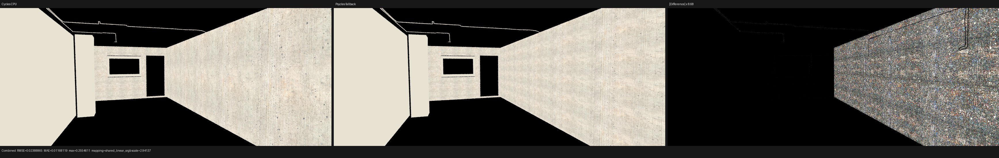

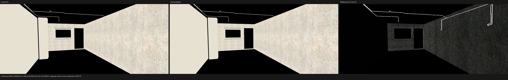

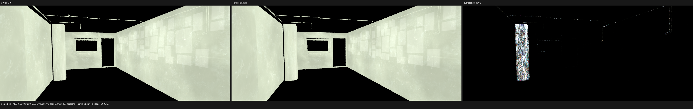

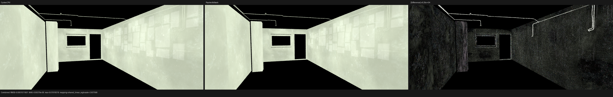

### Other surfaces named in the visual report

The same node-by-node method was applied to the other visibly questioned
surfaces. These probes do not hide the remaining full-path lighting and normal
differences; they isolate whether the raw texture chain itself is spatially
wrong.

| Surface / live graph output | Backend | RMSE | Relative RMSE | P99 pixel RMSE | Ratio |
| --- | --- | ---: | ---: | ---: | ---: |
| Floor final Glossy Color | fallback | 0.00140749 | 0.0067467 | 0.00003719 | 0.999973 |
| Ceiling Noise Texture, Scale 800 | fallback | 0.00011508 | 0.0005847 | 0.00008139 | 1.000003 |
| Cupboard final Diffuse Color | fallback | 0.00000676 | 0.0004950 | 0.00000131 | 0.999843 |

The floor RMSE is dominated by a very small set of edge pixels, as shown by
its much smaller P99. No repeated rotation, offset, or scale error remains in
these three isolated texture outputs. Their appearance in Combined is still
affected by the separately tracked bump-normal, closure, sampling, lighting,
and transport gaps.

## General projection regression

`image_texture_projection_modes` contains FLAT, SPHERE, TUBE, and BOX cases.
Its last BOX face is deliberately wound away from the camera and has a normal
whose three components are nonzero, so an incorrect back-face sign changes
all cube-face orientation tests. Cycles is rendered independently; the probe
does not contain a CPU reference implementation.

| Luisa backend | Combined relative RMSE | Combined ratio |
| --- | ---: | ---: |
| fallback | 0.000003394 | 1.000000304 |
| HIP | 0.000003397 | 1.000000304 |
| Vulkan | 0.000003411 | 1.000000304 |

The automated gates require relative RMSE at most `1e-5` and luminance ratio
within `[0.99999, 1.00001]` for both Combined and Emit.

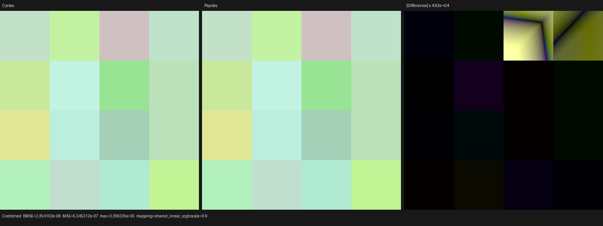

## Full-scene 128 spp validation

The complete corrected export contains 1,649 meshes, six curve geometries,
2,565 instances, 547 source materials, and 190 exported images. Psycles
specializes those graphs into 564 runtime materials. The same immutable
exported bundle was rendered through Luisa/HIP at 1152x480 and 128 fixed spp,
then compared with Cycles CPU and Cycles HIP images from the stated oracle
commit. Every comparison uses linear multilayer EXRs without denoising or a
display transform.

`before BOX` is commit `e52a044`, after the render-UV correction. `after BOX`
is commit `40145a0`. Ratios are Psycles/reference mean luminance.

| Cycles oracle | Psycles state | Combined RMSE | Combined ratio | DiffCol RMSE | DiffCol ratio | GlossCol RMSE | GlossCol ratio | Normal RMSE | Emit RMSE |
| --- | --- | ---: | ---: | ---: | ---: | ---: | ---: | ---: | ---: |
| CPU | before BOX | 0.0772792 | 1.097286 | 0.0115436 | 1.005804 | 0.0089860 | 1.003228 | 0.0506202 | 0.0003208 |
| CPU | after BOX | 0.0774203 | 1.097593 | 0.0115331 | 1.005867 | 0.0089113 | 1.002946 | 0.0506179 | 0.0003208 |
| HIP | before BOX | 0.0673371 | 1.126660 | 0.0116425 | 1.005586 | 0.0084735 | 1.001674 | 0.0506157 | 0.0004893 |
| HIP | after BOX | 0.0675017 | 1.126974 | 0.0116321 | 1.005649 | 0.0084000 | 1.001392 | 0.0506139 | 0.0004893 |

Against Cycles CPU, the BOX correction reduces DiffCol RMSE by 0.091%,
GlossCol RMSE by 0.831%, and Normal RMSE by 0.005%. The HIP oracle gives the
same direction. The small global percentages are expected because the
affected back-facing BOX surfaces occupy only part of the image. A direct
before/after comparison localizes the largest deterministic color changes to
the left cabinet/mirror panels and related BOX-projected surfaces: DiffCol
RMSE is `0.0005280`, GlossCol RMSE `0.0013124`, and Normal RMSE `0.0009261`.

Combined RMSE increases by 0.183% against CPU and 0.244% against HIP even
though the material color passes improve. Combined is dominated by the much
larger unresolved direct/indirect transport and normal differences; changing
the correct material input also changes those finite-sample path
contributions. This checkpoint therefore does not use Combined alone to judge
the coordinate correction.

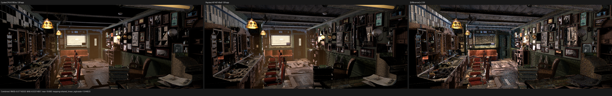

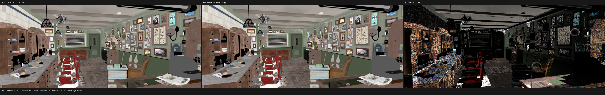

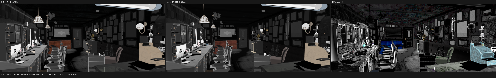

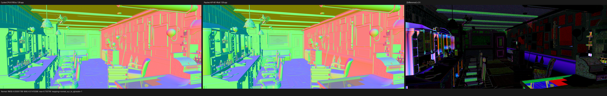

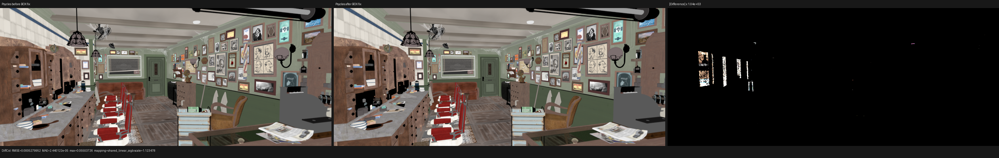

### Visual inspection

The original-resolution linear triptychs and the color-managed image were
inspected manually. DiffCol confirms that the floor-board direction, ceiling
frequency, right-wall picture-mask placement, and principal cabinet wood
grain now share the Cycles orientation and scale. The before/after panel makes
the corrected back-facing cabinet panels visible without confusing them with
lighting.

Combined is still visibly brighter in Psycles, especially across the floor,
cabinet fronts, and indirectly lit wall regions. Normal retains strong
structured differences on the left cabinets, wall panels, chair/floor edges,
and fine bump detail. GlossCol also retains smaller material/normal residuals.
These patterns are not a remaining global UV rotation or texture-scale error;
they identify bump-normal, true displacement, closure, light sampling, and
direct/indirect transport as the next parity work.

The following three-panel image applies the scene's Blender
`sRGB`/`Filmic`/`None` view to Cycles CPU and Psycles HIP while keeping the
difference panel derived from linear Combined.

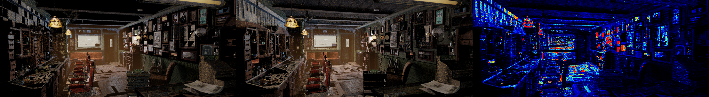

### Performance and compiler stages

The shader change invalidated the monolithic path-kernel cache, so the first
HIP process was intentionally cold. It spent 17.186 seconds compiling the
scene, 1,621.3 seconds in shader JIT, and 196.56 seconds rendering 128 spp. The
JIT contains 191.799 seconds of Luisa/HIP LLVM generation followed by
1,351.843 seconds in AMD COMGR's single-threaded IR-to-code-object step. The
resulting cached code object is 27,261,832 bytes. Complete cold wall time was
30:36.93 and peak host RSS was 31,413,000 KiB.

An independent cached process spent 17.182 seconds on the scene, 2.486 seconds
loading/JITing shaders, and 196.67 seconds rendering. Its complete wall time
was 3:38.07 and peak host RSS was 11,440,824 KiB. All material color, direct,
emission, environment, normal, and volume passes are pixel-identical to the
cold process. Twenty-seven pixels (`0.00488%`) differ in indirect passes;
Combined relative RMSE is `2.24e-5`, mean absolute error `1.17e-8`, and P99
pixel RMSE zero. The maximum difference is at `(1047, 226)` in GlossInd, near
the coincident-geometry region investigated by the stable-traversal
checkpoint. Its discrete indirect contribution is not floating accumulation
roundoff. The exact multi-bounce traversal cause remains to be isolated, so
the repeat is recorded as a residual rather than incorrectly described as
byte-identical or assigned an unproven cause. It does not affect the
deterministic texture/material-pass conclusions above.

The render-only interval remains the meaningful throughput boundary. The same
Cycles scene rendered 128 spp in 28.107 seconds on CPU and 19.161 seconds on
the Radeon RX 9070 XT through HIP. Psycles HIP is therefore 6.99x slower than
Cycles CPU and 10.26x slower than Cycles HIP at this checkpoint. No performance
speedup is claimed; functional and quality alignment remains the priority.

Machine-readable artifacts include the
[Cycles CPU comparison](reports/full-hip-128-vs-cycles-cpu.json),
[Cycles HIP comparison](reports/full-hip-128-vs-cycles-hip.json),
[BOX before/after comparison](reports/full-hip-128-before-vs-after-box.json),
[cold/warm repeat comparison](reports/full-hip-128-cold-vs-warm.json), and
[timing record](reports/timings.json). The staged and three-backend projection
reports are retained in the same directory.

## Verification

The repository was built with all 32 available workers. The complete CTest
suite passed 176/176 in 7.32 seconds, covering the exporter contract and Luisa
fallback, HIP, and Vulkan paths. The user's untracked
`tests/test_luisa_curve_primitive.cpp` was not modified or staged.

No Luisa backend defect was found in this investigation. Both failures were
Psycles-level Cycles compatibility contracts, so no change to LuisaCompute's
`next` branch was necessary.
