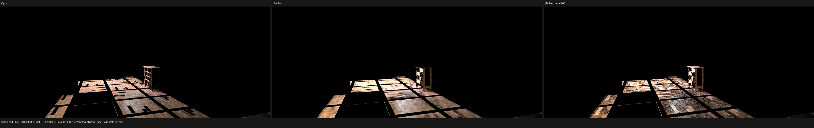
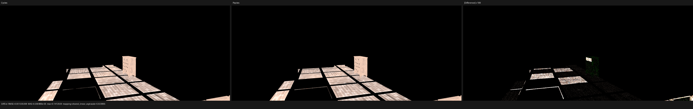
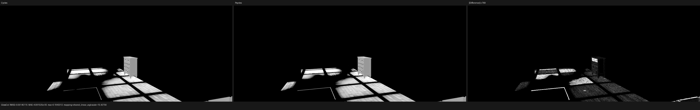
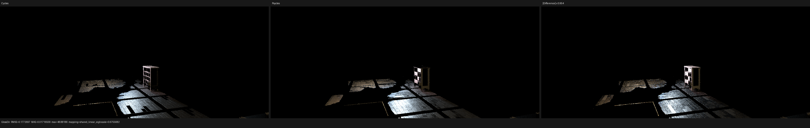
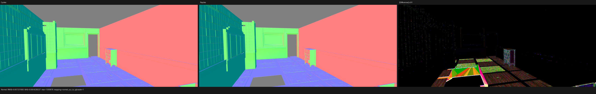

# Barbershop smooth-normal, Fresnel, and standalone-Glossy checkpoint

## Scope and conclusion

This checkpoint fixes three independent Cycles semantic mismatches exposed by
the official Barbershop scene: the effective smooth-normal domain, linked
Fresnel normals, and standalone Glossy BSDF construction. These are structural
shader/geometry rules, not Barbershop-specific branches.

The official rendering oracle is Blender/Cycles source commit
`29ccd5e2e824128c86fc6174c9c502c02212434a`; the instrumented Blender 5.3
Alpha binary reports hash `00030e71c441`. Psycles starts from commit
`0948cec9f561621143cc4de0d8b9bb2828adcdc2`, and LuisaCompute is
`next@73bfe5e9e0fefec543bd140c66d77c3404577d10`.

All materials remain live Blender node graphs lowered to Luisa DSL and all
closures are evaluated inside the Psycles path integrator. Cycles is the only
reference implementation. There is no CPU reference renderer, no texture or
material baking, and no displacement substitution. In particular, true
`DISPLACEMENT` still moves mesh vertices and rebuilds normals, light areas,
and acceleration structures; it is never downgraded to bump mapping.

The targeted standalone Glossy closure now agrees with Cycles essentially to
backend arithmetic precision on fallback, HIP, and Vulkan. The 128 spp
Barbershop isolation also shows that the floor and cabinet texture patterns
are spatially aligned. The remaining large scene error is concentrated in
direct lighting: Combined mean luminance is still 1.586x Cycles CPU and
Glossy Direct is 1.460x. This checkpoint therefore does not claim the scene is
fully aligned.

## Formal semantic rules

### Effective smooth-normal domain

Blender polygon `use_smooth` is not by itself the shading-normal contract.
Psycles exports the effective Cycles smooth domain after accounting for the
mesh corner-normal representation. The shader then interpolates only within
that domain; flat faces keep the geometric face normal. This removed the
large, coherent normal-domain error without changing UVs or material graphs.

### Linked Fresnel Normal

Cycles' Fresnel node has a topology-dependent rule:

```text
N = socket_is_linked(Normal) ? evaluate_socket_verbatim() : sd->N
f = fresnel_dielectric_cos(dot(N, I), IOR)
```

A linked vector is neither normalized nor replaced when it is zero. The
unlinked default alone selects `sd->N`. Psycles records `NormalLinked` as a
static graph fact and specializes the generated AST on that fact, preserving
the exact linked zero, non-unit, unit, and back-facing cases. The node's
existing IOR clamp remains separate from this topology rule.

### Standalone Glossy BSDF

For a legacy standalone Glossy node, Cycles' SVM lowering has already
multiplied the node Color into `closure_weight`. Closure allocation is
therefore

```text
weight = clamp_nonnegative(Color * incoming_mix_weight)
```

and not `incoming_mix_weight` with Color reinterpreted as a metallic Schlick
Fresnel term. `bsdf_microfacet_ggx_setup` uses constant directional Fresnel
(`MicrofacetFresnel::NONE`). `MULTI_GGX` retains the same constant-Fresnel
rule and applies its color-dependent energy-preservation scale; ordinary
`GGX` does not. Distribution is now preserved as a typed graph property from
the Blender adapter through the surface component instead of being discarded.

This rule is intentionally scoped to standalone Glossy. Principled BSDF keeps
its own layered closure allocation and Fresnel semantics.

## Canonical regression matrices

The Fresnel matrix covers linked and unlinked Normal sockets, zero and
non-unit vectors, back-facing vectors, and IOR clamps. It matches Cycles CPU
exactly on fallback and HIP; Vulkan Combined relative RMSE is `3.71e-9`.
Machine-readable reports are in
[`reports/fresnel-fallback.json`](reports/fresnel-fallback.json),
[`reports/fresnel-hip.json`](reports/fresnel-hip.json), and
[`reports/fresnel-vk.json`](reports/fresnel-vk.json).

The 4x4 standalone-Glossy matrix uses an off-axis sun, signed and colored
inputs, mix weights, a roughness sweep, linked unit/non-unit/zero normals, and
both `GGX` and `MULTI_GGX` distributions. At 64x64 and 256 spp:

| Backend | Combined mean ratio | Combined relative RMSE | GlossCol relative RMSE | GlossDir mean ratio | GlossDir relative RMSE |
| --- | ---: | ---: | ---: | ---: | ---: |
| fallback | 1.000000098 | 2.30e-7 | 0 | 1.000000183 | 1.44e-7 |
| HIP | 1.000000000 | 1.65e-9 | 0 | 1.000000000 | 9.30e-9 |
| Vulkan | 0.999993800 | 7.81e-6 | 1.41e-9 | 0.999994871 | 5.30e-6 |

The reports are
[`glossy-fallback.json`](reports/glossy-fallback.json),
[`glossy-hip.json`](reports/glossy-hip.json), and
[`glossy-vk.json`](reports/glossy-vk.json). The runner has strict energy and
relative-RMSE gates, so reverting to the former metallic-Schlick
interpretation or dropping `MULTI_GGX` energy preservation fails the test.

The C++ closure regressions and Blender import/runner contract tests pass on
fallback, HIP, and Vulkan. The repository is built and tested with all 32
workers. The user's untracked `tests/test_luisa_curve_primitive.cpp` is not
modified or staged.

## Barbershop floor path differential

The diagnostic pixel is lower-left `(550, 99)` in the 1152x480 render. At its
first glossy sample, the structural closure values changed as follows:

| value | Cycles CPU | before Fresnel fix | after Fresnel only | after standalone Glossy fix |
| --- | ---: | ---: | ---: | ---: |
| closure weight | 0.04672606 | 0.05913084 | 0.07227798 | 0.04665415 |
| sample weight | 0.04672606 | 0.03816791 | 0.04665415 | 0.04665415 |
| BSDF PDF | 1.34895277 | 1.18074453 | 1.34663725 | 1.34663725 |

After both corrections, the Psycles BSDF evaluation is
`(0.1655167, 0.1631030, 0.1620723)` versus Cycles
`(0.1658723, 0.1634603, 0.1624305)`, and throughput is
`(0.1229111, 0.1211187, 0.1203534)` versus
`(0.1229638, 0.1211757, 0.1204123)`. The remaining roughly 0.05% throughput
difference correlates with the fine bump normal and barycentric residual,
rather than closure topology. The complete comparison is
[`floor-path-cycles-cpu-vs-psycles-hip.json`](reports/floor-path-cycles-cpu-vs-psycles-hip.json).

## 1152x480, 128 spp scene result

The isolation retains the two brick, two wood-floor, and two wood-cupboard
materials from the unchanged official blend. Cycles CPU and Psycles HIP use
fixed 128 spp with no denoising. The HIP render itself took `2.190 s`; its
cold, non-trace shader AST took `136.791 s` to compile.

| Pass | previous RMSE | corrected RMSE | corrected mean ratio |
| --- | ---: | ---: | ---: |
| Combined | 0.0263553 | 0.0261130 | 1.58552 |
| DiffCol | 0.00136433 | 0.00133027 | 0.999421 |
| GlossCol | 0.00228206 | 0.00145115 | 1.00944 |
| DiffDir | 0.262154 | 0.261084 | 1.55605 |
| GlossDir | 0.206816 | 0.177270 | 1.46032 |
| Normal | 0.00723143 | 0.00723108 | 0.999654 |

The full machine report is
[`barbershop-isolated-128-hip-vs-cycles-cpu.json`](reports/barbershop-isolated-128-hip-vs-cycles-cpu.json).











## Visual audit and remaining work

The triptychs were inspected at full resolution. Floor-board direction and
scale, cabinet grain, and the broad brick pattern agree spatially. Diffuse
Color is visually near-identical except for high-frequency bump/detail and
boundaries. Glossy Color now has the same broad pattern and close energy.
Normal no longer contains the earlier coherent smooth-domain mismatch.

Combined and Glossy Direct remain visibly brighter throughout illuminated
floor and cabinet regions even though the selected floor event's closure
weight, BSDF PDF, evaluation, and throughput are already close. The next
formal comparison therefore targets Cycles' direct-light estimator: light
selection probability, emitted radiance, light PDF measure conversion, BSDF
PDF, MIS weight, shadow transmission, and pass accounting. Each correction
must be derived from the Cycles estimator and receive a standalone regression;
no scene-name branch, energy fudge factor, or displacement-to-bump fallback is
acceptable.
