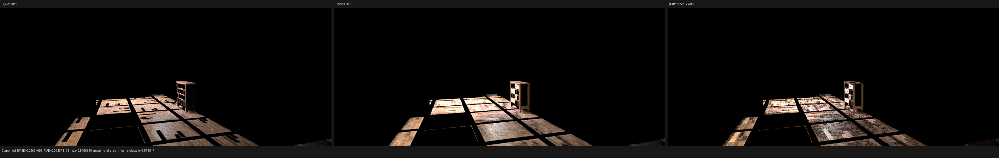
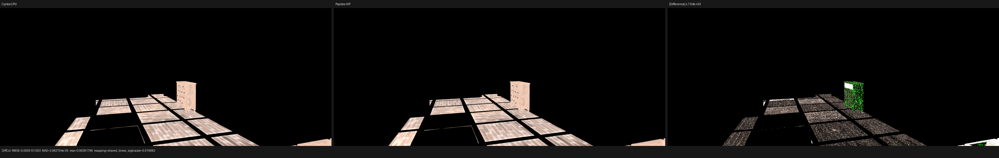
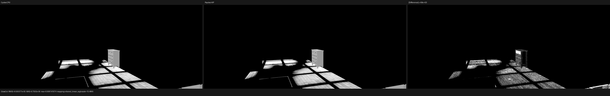
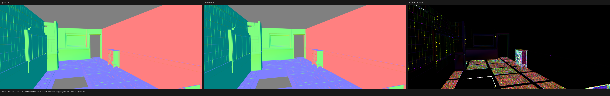
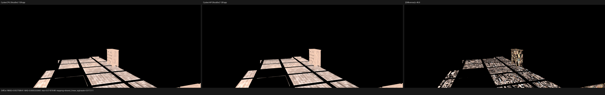

# Barbershop transform, displacement, and topology checkpoint

## Conclusion

The Barbershop floor/cupboard mismatch is not caused by a global handedness,
coordinate-system, or row/column-major transform error. Three independent
checks reject that hypothesis:

1. The problematic ordinary floor object and its collection-instance copy
   have bit-identical transforms. Their linear parts are identity and their
   translation is `(1.99999988, 1.69291162, 1.01143408)`.
2. Tracing the two copies separately produces exactly the same Psycles HIP
   distance, world position, and geometric normal. Only their Cycles object
   and shader identities differ.
3. A non-diagonal affine transform with negative determinant is locked by
   `test_cycles_shader_identity.cpp`. It maps `(1, 2, 3)` to `(6, -3, 15)`
   and round-trips through the explicit Cycles inverse. A transpose or an
   accidental handedness conversion fails that regression.

Two actual representation bugs were found and fixed instead:

- True displacement evaluation had used the authored flat-face normal for
  flat triangles. Cycles' `shader_setup_from_displace()` always evaluates
  displacement with interpolated vertex/corner normals and temporarily marks
  the triangle smooth. Commit `763ecd2` now implements that stage invariant
  and derives exact-support alias classes only after final displacement.
- The Blender exporter used BMesh `BEAUTY` triangulation for n-gons before
  export. Cycles copies the evaluated Blender `corner_tris` array verbatim.
  Re-triangulation changed primitive order and could therefore scramble
  triangle material slots, corner UV/color/normal flattening, and
  displacement vertex ownership. Commit `0d5817e` preserves `corner_tris`
  exactly and leaves Mikk tangent frames to the Luisa scene stage, where they
  are regenerated before and after displacement.

The official reference is Blender/Cycles main commit
`29ccd5e2e824128c86fc6174c9c502c02212434a`. The original Blender graphs and
closures are exported and lowered to Luisa DSL; no material, image, closure,
lighting, or geometry result is baked by Cycles.

## Exact target-pixel evidence

The decisive black-gap pixel is full-film `(373, 60)`, absolute sample zero,
at `1152x480`. After both fixes:

| Renderer/device | object / primitive | shader low 16 | distance | world `P` |
| --- | --- | ---: | ---: | --- |
| Cycles CPU | `0 / 54` | 22 | 3.71825361 | `(3.17313910, 5.28935337, -0.01497018)` |
| Cycles HIP | `80 / 1077458` | 45 | 3.71825385 | `(3.17313910, 5.28935385, -0.01497030)` |
| Psycles HIP | `80 / 1077458` | 45 | 3.71825147 | `(3.17313910, 5.28935623, -0.01497018)` |

Psycles traces with only object 0 or only object 80 camera-visible both give
the exact same `distance`, `P`, and `Ng`; object 0 resolves shader 22 and
object 80 resolves shader 45. This is incompatible with a transform error and
identifies an exact-overlap identity decision.

Cycles itself is device-dependent at this location: CPU selects the ordinary
object while HIP selects the collection instance. Psycles HIP agrees with
Cycles HIP on object, global primitive, and shader identity. Consequently the
CPU-only black holes are not a backend-independent scene invariant that can
be imposed on all Luisa backends. The device disagreement is visible in the
official 128-spp Diffuse Color comparison below and is retained as oracle
evidence rather than hidden by a scene-specific tie patch.

The complete values are recorded in
[target-pixel.json](reports/target-pixel.json). The raw semantic comparison
reports are also retained for
[Cycles CPU](reports/gap-cycles-cpu-vs-psycles-hip.json) and
[Cycles HIP](reports/gap-cycles-hip-vs-psycles-hip.json). The three apparent
Cycles-HIP closure failures in the latter are diagnostic slots containing the
three traced triangle vertices; the production Cycles diagnostic source was
restored clean after collecting those values.

## Source-topology proof

Before `0d5817e`, exported geometry 0 local primitive 54 had indices
`(39, 44, 46)`. The triangle reported by Cycles as primitive 54 was instead
at Psycles local primitive 185. With the evaluated `corner_tris` array copied
without mutation, local primitive 54 is `(92, 82, 58)`, exactly the three
vertices independently traced from Cycles. Material slots and corner-domain
attributes now remain in that same order.

The regression constructs an asymmetric concave seven-sided polygon followed
by a separate triangle. It requires byte-exact equality for the exported
triangle indices and material sequence, plus component equality for the UV
corner stream. That shape deliberately distinguishes Blender `corner_tris`
from the removed BMesh `BEAUTY` tessellation.

## 128-spp image comparison

The corrected isolated scene contains 126 geometries, 152 instances, and 564
materials. Psycles HIP rendered `1152x480` at 128 fixed spp in 2.18679 seconds
after scene compilation/JIT. The image was compared against both Cycles CPU
and Cycles HIP 128-spp EXRs. Timing intervals are not yet a canonical
end-to-end benchmark, so no speedup is claimed from these numbers.

Against Cycles CPU:

| Pass | previous RMSE | corrected RMSE | corrected mean ratio |
| --- | ---: | ---: | ---: |
| Combined | 0.0263461 | 0.0263469 | 1.73472 |
| Diffuse Color | 0.000519425 | 0.000515159 | 0.999572 |
| Glossy Color | 0.0000946331 | 0.0000950038 | 1.00112 |
| Normal | 0.00216069 | 0.00160018 | 1.00010 |
| Diffuse Direct | 0.266419 | 0.266450 | 1.70132 |
| Glossy Direct | 0.183586 | 0.183855 | 1.66152 |

Preserving source topology reduces Normal RMSE by 25.94% and Diffuse Color
RMSE by 0.82%. Glossy Color and Combined change by less than 0.4% and 0.01%,
respectively. Material colors and surface orientation are now close, but the
Combined result remains visibly too bright. The remaining error is dominated
by direct-light/transport behavior, not by a global geometry transform.

For context, Cycles CPU versus Cycles HIP on the same official scene and 128
spp already has Combined RMSE `0.00713250`, Diffuse Color RMSE `0.00275864`,
Glossy Color RMSE `0.000512444`, and Normal RMSE `0.00211065`. Exact-overlap
identity makes deterministic material passes device-dependent in this scene.

The full-resolution triptychs were inspected visually. Diffuse Color and
Glossy Color now preserve the same floor-board direction and cupboard lobe
layout as Cycles CPU. Normal silhouettes and broad faces align; amplified
residuals remain on fine brick/floor edges and cupboard details. Combined is
still substantially brighter across floor panels and the cupboard, matching
the 1.735 luminance ratio and the unresolved direct-light metrics.

Machine-readable full-pass reports are available for
[Psycles HIP versus Cycles CPU](reports/psycles-hip-vs-cycles-cpu.json),
[Psycles HIP versus Cycles HIP](reports/psycles-hip-vs-cycles-hip.json), and
[Cycles CPU versus Cycles HIP](reports/cycles-cpu-vs-hip.json).

## Regression matrix

- `psycles.cycles_shader_identity`: non-diagonal reflected transform and
  inverse round-trip.
- `psycles.cycles_instance_support`: exact final-support equivalence, one-bit
  position/index distinctions, and post-displacement splitting.
- `psycles.luisa_displacement_scene_{fallback,hip,vk}`: Cycles' forced-smooth
  displacement setup on a flat-authored triangle.
- `psycles.blender_export_triangle_order`: exact `corner_tris`, material, and
  corner-UV order.
- All 13 `psycles.blender_export_*` tests pass after a 32-worker build.

The user's untracked `tests/test_luisa_curve_primitive.cpp` was not modified,
staged, or committed.
