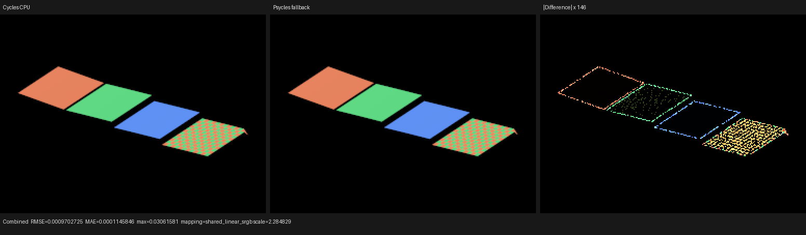
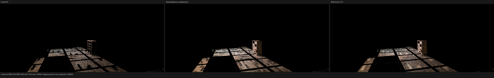
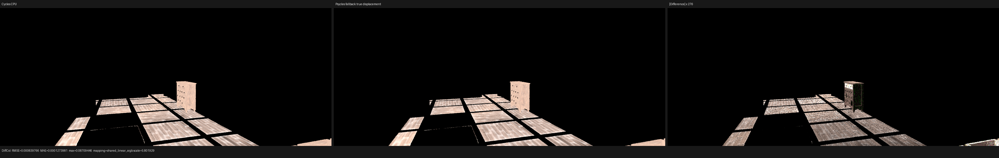
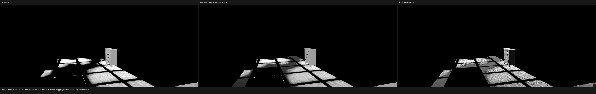
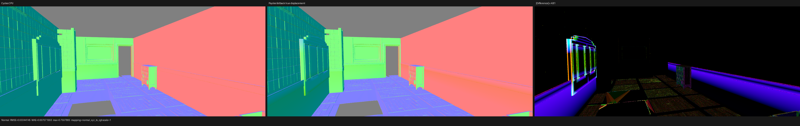

# Cycles geometry-displacement checkpoint

This checkpoint removes the invalid mapping of Cycles `DISPLACEMENT` to a
bump approximation. It is intentionally a checkpoint rather than a claim that
Barbershop is fully aligned: the remaining automatic-bump, tangent-frame,
closure, and light-sampling differences are recorded below and stay open.

## Oracle and revisions

| Component | Revision |
| --- | --- |
| Psycles base | `776f015fd4c1` plus this change |
| LuisaCompute | `next@73bfe5e9e0fe` |
| Blender/Cycles source | `29ccd5e2e824` |
| Blender binary | 5.2.0 LTS, 2026-07-15 build |

Cycles is the only rendering oracle. No CPU reference renderer or baked
material result is involved. The canonical probe is created as an ordinary
Blender node graph, rendered by Cycles CPU, exported without changing its
closures, and then evaluated by the same Luisa DSL surface implementations on
fallback, HIP, and Vulkan.

## Formal contract

The host displacement plan follows `GeometryManager::fill_shader_input` and
`read_shader_output` as an ordered operation over the mesh:

1. Visit source triangles and their three corners in source order.
2. Skip a triangle unless its material has a connected displacement root and
   uses `DISPLACEMENT` or `BOTH`.
3. Evaluate each shared vertex exactly once. Its owner is the first eligible
   triangle corner encountered by that order.
4. Evaluate the original displacement closure at barycentric coordinates
   `(0,0)`, `(1,0)`, or `(0,1)` with the first Cycles object that references
   the mesh. That object's material overrides are resolved before ownership.
   Evaluation uses time `0.5`, smooth shading forced, and triangle-size
   differentials.
5. Transform the world-space closure result back as an object-space direction,
   replace each non-finite component with zero, and add it to the original
   vertex.
6. `DISPLACEMENT` triangles participate in displaced-normal reconstruction;
   `BOTH` preserves the undisplaced normal so automatic bump is not applied
   twice. Corner-normal meshes use the pre/post vertex-normal delta rule and
   flat faces use their new face normal.
7. Upload the displaced positions and normals before rebuilding acceleration
   structures. Emissive triangle areas are computed from the displaced
   positions.

The ownership rule is a pure host component with a regression containing
bump-only, true, both, unconnected, out-of-range material-slot, and
mixed-material shared-vertex cases. The device evaluator is compiled once per
typed surface implementation and emits only that graph's displacement root
through the multistage `Surface::displacement` virtual boundary.

## Canonical four-grid probe

The probe contains bump-only, true-displacement, both, and alternating
bump/true faces sharing vertices. At 256×192 and 64 spp, all three Luisa
backends produced the same structural result:

| Backend | Combined RMSE | Combined mean ratio | Normal RMSE | DiffCol RMSE |
| --- | ---: | ---: | ---: | ---: |
| fallback | 0.000970273 | 0.99996396 | 0.00177516 | 0.00148547 |
| HIP | 0.000970273 | 0.99996388 | 0.00177516 | 0.00148547 |
| Vulkan | 0.000971721 | 0.99996594 | 0.00177522 | 0.00148767 |

The default gated run at 64×64 and 256 spp is more stable at silhouette
pixels: Combined relative RMSE `9.09e-6`, DiffCol RMSE `0`, and Normal relative
RMSE `2.05e-5`. The canonical runner now enforces energy and relative-RMSE
gates that reject either true-displacement mode becoming bump-only.

### fallback

### HIP

### Vulkan

Machine-readable reports are
[`probe-fallback-report.json`](probe-fallback-report.json),
[`probe-hip-report.json`](probe-hip-report.json), and
[`probe-vk-report.json`](probe-vk-report.json).

## Barbershop six-material isolation

The 1152×480, 4 spp isolation keeps the two `bricks`, two `wood_floor`, and
two `wood_cupboard` materials. `bricks` is true displacement; floor and
cupboard are bump-only. Compared with the pre-displacement run, DiffCol RMSE
fell from about `0.001660` to `0.000840`. This is real improvement in brick
geometry and coverage, not a bump substitution.

The residuals also prove that the user's broader report is not solved yet:

| Pass | RMSE | Psycles/Cycles mean | Interpretation |
| --- | ---: | ---: | --- |
| Combined | 0.0523883 | 1.74519 | direct/indirect transport still too bright |
| DiffCol | 0.000839766 | 1.00994 | base texture is close but not yet exact |
| GlossCol | 0.00218326 | 0.837651 | closure parameters remain structurally different |
| Normal | 0.0334415 | 0.992123 | bump/tangent and some geometric normals remain wrong |

The render log also reports the source asset `generic_scratches.png` as
unavailable for `wood_floor`; this is retained as a missing-image condition,
not replaced with a baked or fabricated texture.

The full report is
[`barbershop-isolated-report.json`](barbershop-isolated-report.json).

## Timing and remaining work

The first 2048×858 fallback run separated into scene compilation `0.93s`,
shader JIT `189.05s`, and 4 spp rendering `3.36s`. A warm 1152×480 run used
`0.86s` JIT/cache loading and `1.07s` rendering. The cold displacement AST for
the brick material generated about 333k fallback LLVM instructions, so
dependency-specialized JIT size remains an engineering target after semantic
alignment.

Before this checkpoint can be considered complete for production scenes,
Psycles still needs Cycles-aligned post-displacement MikkTSpace tangent
reconstruction (including named UV layers), motion-position displacement,
adaptive subdivision/dicing, and focused correction of the Barbershop
automatic-bump, glossy-closure, and light-sampling residuals. None of these is
silently downgraded.
