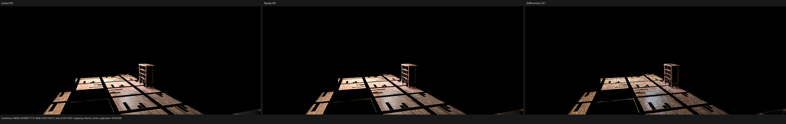
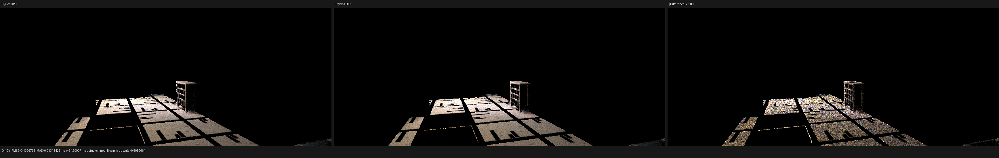
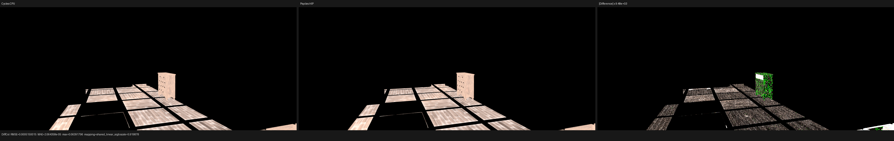
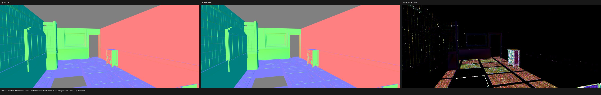
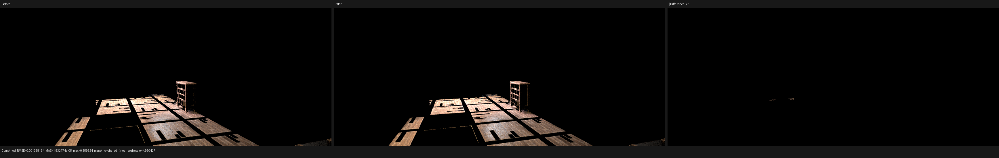
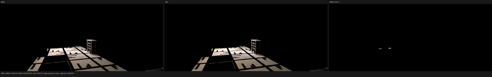

# Barbershop closed primitive completion

## Result

This checkpoint removes the next localized Barbershop direct-light leak. At
film coordinate `(429, 165)`, absolute sample `31`, the primary surface is
Cycles object `32`, primitive `504350`. The sampled object-`165` light produces
an unoccluded NEE estimate near `(5.6, 3.2, 1.6)`. Cycles CPU and HIP both
suppress it, while the preceding Psycles build retained the entire estimate.

The missing blocker is object `29`, primitive `457046`, at the closed `t == 0`
ray endpoint. Objects `29` and `32` have bitwise-equal final local triangle
arrays, but their two transforms make the three corresponding world vertices
differ by one ULP in `y`. The triangles overlap, so exact nine-word world
vertex equality was too strong a requirement for completing backend traversal.

Psycles now constructs a conservative, per-source closed-AABB overlap relation
between corresponding local primitives. This relation only supplies candidates.
Every candidate must still pass the original ray interval, visibility and
source/light exclusions, stable identity ordering, and the Cycles-compatible
Pluecker triangle predicate. There is no spatial epsilon, approximate matrix
comparison, scene-specific branch, or pre-baked Cycles result.

At `1152x480` and 128 fixed samples, Combined RMSE improves by `1.56%`
against both Cycles CPU and HIP. Diffuse Direct RMSE improves by `4.18%`
against CPU and `4.13%` against HIP. The full 195-test fallback/HIP/Vulkan
suite passes.

The reference renderer is Blender/Cycles base commit
`29ccd5e2e824128c86fc6174c9c502c02212434a` plus diagnostic-only path-trace
instrumentation. Psycles uses LuisaCompute `next@73bfe5e9e0fe`. Original
Blender shader graphs and closures are exported; no shading, lighting, image,
or geometry result is baked from Cycles.

## Oracle policy

Coincident BVH references do not have a universally meaningful identity.
Cycles CPU and HIP may choose different sibling references, and Psycles does
not require identity equality in that case. The required oracle is their
shared observable transport result: whether the ray is blocked and which
radiance survives. For this particular diagnostic, an instrumented opaque
intersection happened to report object `29`, primitive `457046` on both
Cycles devices (`t=+0` on CPU and `t=-0` on HIP), but the implementation does
not depend on that agreement.

| field | Cycles CPU | Cycles HIP | Psycles before | Psycles after |
| --- | ---: | ---: | ---: | ---: |
| primary object / primitive | `32 / 504350` | `32 / 504350` | `32 / 504350` | `32 / 504350` |
| sampled light object | `165` | `165` | `165` | `165` |
| unshadowed NEE RGB | `(5.6273, 3.2459, 1.6037)` | `(5.6273, 3.2459, 1.6037)` | `(5.6041, 3.2324, 1.5971)` | unchanged |
| retained NEE RGB | `(0, 0, 0)` | `(0, 0, 0)` | `(5.6041, 3.2324, 1.5971)` | `(0, 0, 0)` |
| Psycles blocker | n/a | n/a | miss | `29 / 457046`, `t=-0` |

Decoded traces are retained for [Cycles CPU](reports/cycles-cpu-trace-429-165-s31.json),
[Cycles HIP](reports/cycles-hip-trace-429-165-s31.json), and
[Psycles HIP](reports/psycles-hip-trace-429-165-s31.json).

## Formal model

Let `C(i)` be the exact final local-support class of instance `i`: complete
float position arrays and ordered triangle-index arrays must be bitwise equal.
For local primitive `p`, let `T(i,p)` be its three finite world vertices after
the explicit Cycles-compatible float affine transform, and let `B(i,p)` be
their minimal closed axis-aligned bounding box. Define

```text
i R_p j  iff  C(i) = C(j)
              and B(i,p) overlaps B(j,p) on x, y, and z
              using closed exact float comparisons.
```

`R_p` is reflexive for finite triangles and symmetric, but deliberately not
transitive. It is stored as a sorted adjacency list for every source primitive,
not collapsed into an equivalence class. If two closed triangles share an
endpoint or any other point `q`, then `q` belongs to both closed AABBs, so
their boxes necessarily overlap. The relation is therefore complete for the
candidate-recovery problem. AABB overlap is not sufficient for a triangle
hit; false positives are removed device-side by the exact ray predicate.

Pairs are enumerated by an `x`-axis sweep sorted on the lower bound. The sweep
stops only when the next lower bound exceeds the current upper bound, then
checks closed overlap on all three axes. This visits every and only broad-phase
overlap pair. Identical adjacency lists share storage, but deduplication never
changes the relation. Bitwise-equal whole-instance support remains represented
by the existing exact circular classes.

Traversal explicitly evaluates the source primitive's completion list even if
the hardware ray query omits a closed endpoint. Candidate resolution then uses
the original `[tmin, tmax]`, Cycles Pluecker intersection, visibility mask,
exact source/light exclusion, and deterministic Cycles identity order. Thus
the host relation is conservative while the final device result is geometric.

## Regression coverage

The host fixture contains the actual object `29`/`32` transforms and primitive
vertices. It proves that the one-ULP-different overlapping triangles are
completed, while a one-ULP translation that makes two zero-thickness planes
disjoint is not. A separate three-instance chain proves the crucial
non-transitive law: `A R B` and `B R C` do not imply `A R C`.

The device fixture uses the real source/light identities, origin, direction,
range, and primitive offsets. It finds object `29`, primitive `457046` at the
closed endpoint on fallback, HIP, and Vulkan. The final `ctest -j32` run passes
all `195/195` tests in `8.54 s`, including the source-size guard.

## Full-image comparison

The isolated bundle contains 126 geometries, 152 instances, 564 materials,
and 15 lights. All images use `1152x480`, 128 Tabulated Sobol samples, and the
same exported scene contract.

| pass | previous vs CPU | fixed vs CPU | change | fixed vs HIP | fixed/CPU mean |
| --- | ---: | ---: | ---: | ---: | ---: |
| Combined | 0.00708141 | 0.00697111 | -1.56% | 0.00734206 | 1.00111 |
| Diffuse Direct | 0.138460 | 0.132676 | -4.18% | 0.133213 | 0.997000 |
| Diffuse Indirect | 0.00612301 | 0.00615106 | +0.46% | 0.00595023 | 1.07004 |
| Glossy Direct | 0.141194 | 0.141192 | -0.00% | 0.163297 | 1.03614 |
| Glossy Indirect | 0.00877365 | 0.00878236 | +0.10% | 0.00750493 | 1.14651 |
| Diffuse Color | 0.000515001 | 0.000515001 | 0.00% | 0.00277074 | 0.999571 |
| Glossy Color | 0.0000946803 | 0.0000946804 | 0.00% | 0.000516517 | 1.00112 |
| Normal | 0.00159992 | 0.00159992 | 0.00% | 0.00263848 | 1.00011 |

Machine-readable comparisons are retained for
[Psycles HIP versus Cycles CPU](reports/psycles-hip-vs-cycles-cpu.json),
[Psycles HIP versus Cycles HIP](reports/psycles-hip-vs-cycles-hip.json), and
[the preceding checkpoint versus this fix](reports/before-vs-after.json).

## Visual inspection

Each three-panel image is reference, Psycles, and absolute difference under a
shared display transform.














Manual inspection confirms that the correction is confined to sparse dark
floor/cupboard slivers; no texture placement, silhouette, or normal field was
shifted. The remaining visible error is dominated by direct-light variance
and glossy-energy disagreement rather than a broad UV or transform mismatch.

The same path trace exposes a concrete next material issue at bounce one on
Cycles shader `24`: Cycles CPU/HIP create one diffuse closure, while Psycles
creates that diffuse closure plus a type-`12` glossy closure with sample weight
`0.366958`. That topology/conditional disagreement, not coincident primitive
identity, is the next investigation target.

The bundle still warns that `agent_face_bump`, `agent_face_bruises_color`, and
`generic_scratches.png` are unavailable. Asset completeness remains tracked
separately.

## Timing

The warm-cache RX 9070 XT run reports:

| phase | time |
| --- | ---: |
| scene compilation, including completion planning | 3.16279 s |
| shader cache lookup/load | 1.53559 s |
| 1152x480, 128-spp rendering | 2.44508 s |
| process wall time | 7.66 s |

The preceding checkpoint rendered in `2.46839 s`; this small difference is
normal run-to-run variation and is not claimed as a speedup.
