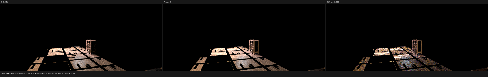
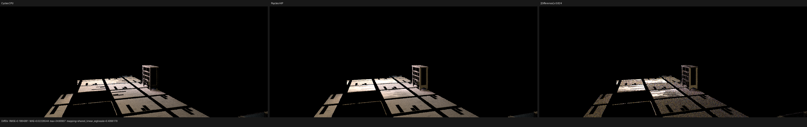
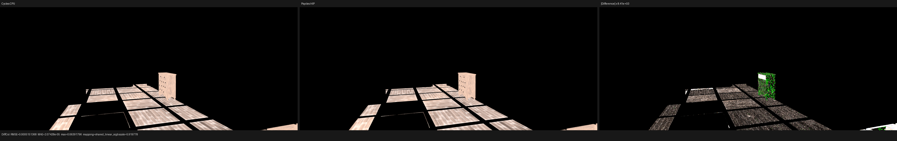
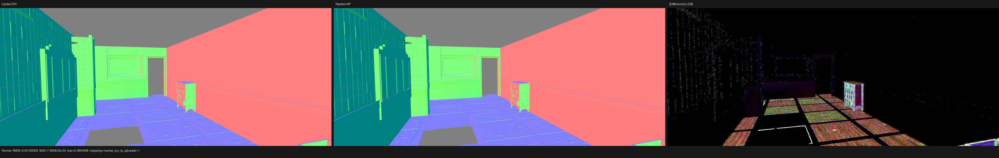
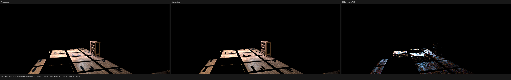
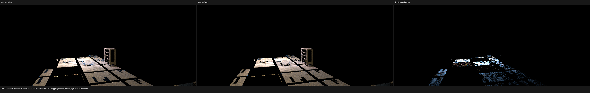

# Barbershop continuation source-support completion

## Result

A second exact-support endpoint miss was isolated in the official Barbershop
material-isolation scene. This time it was a forward BSDF continuation ray,
not a next-event shadow ray. Cycles CPU and HIP both intersect a distinct
coincident floor object at the closed `t == 0` endpoint after excluding the
exact source primitive. Psycles HIP previously received no hardware candidate,
continued to an emitter, and retained a false direct-light contribution.

The fix completes every explicitly self-excluding triangle query from the
source's bit-identical support class. Each completed candidate still has to
pass the actual ray interval, visibility, exact identity exclusions, and the
Cycles Pluecker intersection predicate. It therefore does not force a
topological hit after a geometric origin offset and introduces no epsilon.

At `1152x480`, 128 fixed samples, the Combined RMSE against Cycles CPU falls
from `0.0156328` to `0.0154328` (`-1.28%`) relative to the preceding affine-FMA
fix. Against Cycles HIP it falls from `0.0159066` to `0.0157116` (`-1.23%`).
Diffuse Color and Normal remain stable. The remaining visible disagreement is
still dominated by broadly excessive direct illumination, so this correction
does not close the Barbershop investigation.

The reference renderer is Blender/Cycles commit
`29ccd5e2e824128c86fc6174c9c502c02212434a`. Psycles uses LuisaCompute
`next@73bfe5e9e0fe`. Original Blender shader graphs and closures are exported;
no Cycles result is baked or used at runtime.

## CPU/HIP consensus trace

The decisive film coordinate is `(373, 143)`, absolute sample `2` of 128.
All three renderers use RNG hash `701060618`, filter sample
`(0.168729305, 0.722407043)`, and primary object `71`, primitive `950290`.
Small position and normal differences remain within the ordinary CPU/HIP
floating-point spread and are not used as identity requirements.

After the first BSDF sample, Cycles CPU and HIP both report the following
semantic event:

| field | Cycles CPU | Cycles HIP | Psycles after |
| --- | ---: | ---: | ---: |
| next object | `6` | `6` | `6` |
| next primitive | `94382` | `94382` | `94382` |
| distance | `+0.0` | `-0.0` | `-0.0` |
| geometric normal z | `-1` | `-1` | `-0.99999994` |

Before the fix, Psycles missed this event and the continuation reached an
emitter. The single-sample false AOV values were:

| pass | RGB before | RGB after |
| --- | --- | --- |
| Combined | `(0.0675936, 0.130283, 0.220214)` | `(0, 0, 0)` |
| Diffuse Direct | `(0.693164, 1.82830, 3.64251)` | `(0, 0, 0)` |
| Glossy Direct | `(0.0422516, 0.111448, 0.222040)` | `(0, 0, 0)` |

The source and sibling triangles have the same final accelerator support. The
actual world-space vertices retained in the regression are:

```text
(3.338683843612671, 2.507280349731445, -0.002984195947647095)
(3.289121150970459, 2.507280349731445, -0.002984195947647095)
(3.289410114288330, 2.214421749114990, -0.002984195947647095)
```

## Formal correction

Cycles' surface continuation contract has two independent parts:

1. `integrate_surface_ray_offset` tests the source triangle using the outgoing
   ray. If the exact source is intersectable, Cycles preserves the surface
   position; otherwise it applies the robust geometric-normal origin offset.
2. BVH traversal excludes only the exact previous `(object, primitive)`.

Consequently, when stage 1 preserves the position, a different object with
bit-identical triangle support remains a valid closed-endpoint intersection at
`t == 0`. Hardware acceleration is only a broad phase and does not promise to
enumerate that boundary candidate consistently. Restricting source-class
completion to shadow queries was therefore formally incomplete.

The unified traversal now applies the same source-support completion to shadow
and continuation queries. It locates the previous Cycles object, enumerates
only the host-proven bit-identical support equivalence class, and evaluates
each member with the original ray and exact Cycles triangle predicate. If the
origin was offset, the predicate rejects the class normally. Candidate
selection then uses the same stable closest-hit order as hardware candidates.

This construction follows from the conjunction of closed-interval traversal,
exact identity exclusion, and support equivalence; it is not a list of scene
cases or a distance tolerance.

## Full-image comparison

The validated bundle is `isolated-export-cycles-corner-tris`: 126 geometries,
152 instances, 564 materials, and 15 lights. References and Psycles use
`1152x480` and 128 fixed samples.

| pass | previous vs CPU | fixed vs CPU | change | fixed vs HIP | fixed/CPU mean |
| --- | ---: | ---: | ---: | ---: | ---: |
| Combined | 0.0156328 | 0.0154328 | -1.28% | 0.0157116 | 1.21553 |
| Diffuse Color | 0.000515396 | 0.000515137 | -0.05% | 0.00277067 | 0.999571 |
| Glossy Color | 0.0000951474 | 0.0000949786 | -0.18% | 0.000516549 | 1.00112 |
| Normal | 0.00160046 | 0.00160005 | -0.03% | 0.00263847 | 1.00011 |
| Diffuse Direct | 0.190031 | 0.188438 | -0.84% | 0.190015 | 1.21759 |
| Diffuse Indirect | 0.00609469 | 0.00625114 | +2.57% | 0.00606054 | 1.27431 |
| Glossy Direct | 0.157283 | 0.154185 | -1.97% | 0.174527 | 1.14039 |
| Glossy Indirect | 0.00858660 | 0.00881561 | +2.67% | 0.00753991 | 1.15303 |

The Combined mean-luminance ratio against Cycles CPU improves from `1.24996`
to `1.21553`. The small indirect-pass regressions are retained rather than
hidden; direct-pass and Combined errors improve on both Cycles devices.














The full-resolution triptychs were inspected manually. The correction darkens
the affected floor panels and paths near the cupboard, restoring additional
black gaps without rotating or smearing the floor texture. Diffuse Color and
Normal preserve the same structure. Psycles remains visibly too bright across
many lit panels and on the cupboard, identifying direct-light transport as the
next consensus target rather than a global UV or coordinate-handness failure.

Machine-readable reports are retained for
[Psycles HIP versus Cycles CPU](reports/psycles-hip-vs-cycles-cpu.json),
[Psycles HIP versus Cycles HIP](reports/psycles-hip-vs-cycles-hip.json), and
[the preceding Psycles image versus this fix](reports/before-vs-after.json).

## Timing and validation

On the local RX 9070 XT, the validated cold run measured:

| phase | time |
| --- | ---: |
| scene compilation / HIPRT build | 3.14908 s |
| changed non-trace shader cold JIT | 139.246 s |
| 1152x480, 128-spp rendering | 2.35734 s |
| warm shader-cache lookup/load | 1.52948 s |
| warm 1152x480, 128-spp rendering | 2.34859 s |

The JIT and render phases are reported separately. These numbers are not a
canonical Cycles/Psycles speed comparison, and no speedup claim is made.

Two warm repeats preserve exact zero Combined and Diffuse Direct at the traced
pixel. Whole-image cold-to-warm Combined RMSE is `8.73e-5`, and cold-to-second-
warm RMSE is `1.47e-4`, reflecting GPU accumulation-order variation. The
aggregate comparison against Cycles CPU remains stable: Combined RMSE is
`0.0154328` for the cold run and `0.0154315` for the second warm run. The exact
path event and backend regressions, rather than sub-ULP reduction order, are the
decisive correctness evidence.

`test_luisa_scene_traversal` now retains both the earlier shadow endpoint and
this continuation endpoint using actual Barbershop identities, triangle
support, origin, and direction. A third record offsets the same origin by
Cycles' robust normal displacement and verifies that source-class completion
does not force a hit behind the ray. All three records pass fallback, HIP, and
Vulkan. The complete suite passes all 195 tests, including the source-size
check, after a 32-worker build. The cold-heavy run completed in `176.62 s`;
the final submission-state warm-cache `ctest -j 32` rerun completed in
`8.73 s`.
