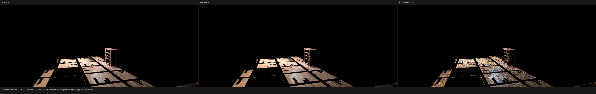
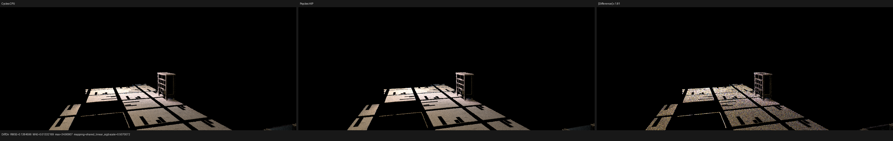
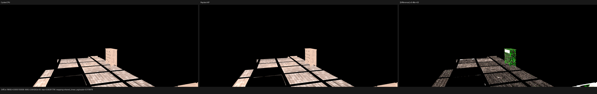
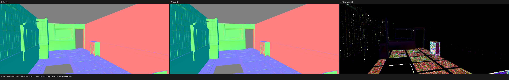
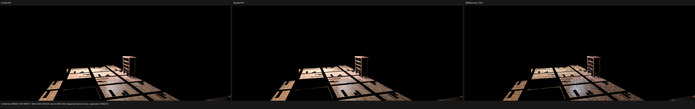
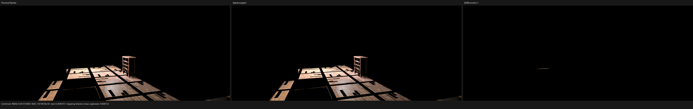

# Barbershop exact finite primitive support

## Result

This checkpoint removes another localized Barbershop direct-light leak. The
remaining failure was not a UV, texture, material-node, handedness, or matrix
layout error. Cycles objects `29` and `32` share the same final local mesh, but
their authored transforms produce a mixed result in finite float arithmetic:
some corresponding world triangles are bitwise identical while other
triangles differ. Whole-instance support classification therefore correctly
kept them separate, but source completion also needed the exact relation at
primitive granularity.

Psycles now represents those sparse exact-support classes explicitly and
resolves them with the same ray interval, visibility masks, source/light
exclusions, stable ordering, and Cycles Pluecker predicate as ordinary
candidates. No spatial tolerance, ray epsilon, scene-name branch, or baked
Cycles result is involved.

At `1152x480` and 128 fixed samples, Combined RMSE improves from
`0.00718931` to `0.00708141` against Cycles CPU (`-1.50%`) and from
`0.00757152` to `0.00745891` against Cycles HIP (`-1.49%`). Diffuse Direct
RMSE improves by `2.59%` and `2.43%`, respectively. Diffuse Color, Glossy
Color, and Normal are bit-identical to the preceding Psycles checkpoint,
which independently rules out an accidental shading-attribute or coordinate
rewrite.

The reference renderer is Blender/Cycles commit
`29ccd5e2e824128c86fc6174c9c502c02212434a`. Psycles uses LuisaCompute
`next@73bfe5e9e0fe`. Original Blender shader graphs and closures are exported;
no Cycles image, closure, lighting, or geometry result is pre-baked.

## Oracle policy: shared transport semantics

CPU and HIP are not required to choose the same identity when multiple BVH
references describe coincident geometry. The oracle is their shared
observable transport result. The decisive film coordinate is `(406, 163)`,
absolute sample `120`:

| field | Cycles CPU | Cycles HIP | Psycles before | Psycles after |
| --- | ---: | ---: | ---: | ---: |
| primary object | `32` | `32` | `32` | `32` |
| primary primitive | `504347` | `504347` | `504347` | `504347` |
| sampled light object | `165` | `165` | `165` | `165` |
| unshadowed NEE RGB | `(5.20778, 2.99684, 1.48163)` | `(5.20799, 2.99691, 1.48165)` | `(5.21489, 3.00088, 1.48362)` | `(5.21489, 3.00088, 1.48362)` |
| retained NEE RGB | `(0, 0, 0)` | `(0, 0, 0)` | `(5.21489, 3.00088, 1.48362)` | `(0, 0, 0)` |
| Psycles shadow candidate | n/a | n/a | miss | object `29`, primitive `457043`, `t=-0` |

Cycles CPU and HIP both suppress the direct-light contribution; their
particular internal shadow identity is intentionally not asserted. Before the
fix, Psycles retained the complete unshadowed contribution. After the fix,
its exact primitive completion finds the sibling at the closed `t == 0`
endpoint and reaches the same zero-transmittance result.

Decoded traces are retained for [Cycles CPU](reports/cycles-cpu-trace-406-163-s120.json),
[Cycles HIP](reports/cycles-hip-trace-406-163-s120.json), and
[Psycles HIP](reports/psycles-hip-trace-406-163-s120.json).

## Formal model

Let `C(i)` be the exact final local-support class of instance `i`; geometries
are in the same class exactly when their complete float position arrays and
ordered triangle-index arrays are bitwise equal. Let `I[p,c]` be corner `c` of
local primitive `p`, and let

```text
W(i, k) = cycles_float_affine(T(i), position[k])
S(i, p) = (bits(W(i, I[p,0])),
           bits(W(i, I[p,1])),
           bits(W(i, I[p,2])))
```

where each `bits` value contains all three IEEE-754 components and
`cycles_float_affine` is the explicit nested-FMA operation used by the
Cycles-compatible geometry path. The planner defines two exact finite
relations:

```text
i ~whole j  iff C(i) = C(j), every W value is finite,
                   and bits(W(i,k)) = bits(W(j,k)) for every k

i ~p j      iff C(i) = C(j), S(i,p) is finite,
                   and S(i,p) = S(j,p)
```

Whole classes use the existing circular instance representation. For each
primitive, a sparse class is emitted only when `~p` crosses whole-class
boundaries; otherwise the whole class already represents it. Primitive
signatures contain the complete ordered nine-word support, are sorted, and
are compared exactly. The four-vertex hash used for whole supports is only a
routing accelerator; every bucket match still compares the complete world
position array. Hashes never decide equality.

Per-instance sparse records are sorted by local primitive and found with a
device binary search. The alias list is then fed through the original Cycles
triangle intersection component. Non-finite supports are never classified,
and a one-ULP `nextafter` change that changes a target world vertex remains
outside the class. This is a finite equivalence construction, not an
accumulation of endpoint special cases.

## Full-image comparison

The isolated validation bundle contains 126 geometries, 152 instances, 564
materials, and 15 lights. All references and Psycles use `1152x480`, 128
Tabulated Sobol samples, and the same exported scene contract.

| pass | previous vs CPU | fixed vs CPU | change | fixed vs HIP | fixed/CPU mean |
| --- | ---: | ---: | ---: | ---: | ---: |
| Combined | 0.00718931 | 0.00708141 | -1.50% | 0.00745891 | 1.00388 |
| Diffuse Direct | 0.142136 | 0.138460 | -2.59% | 0.138953 | 1.00238 |
| Diffuse Indirect | 0.00611980 | 0.00612301 | +0.05% | 0.00592114 | 1.06788 |
| Glossy Direct | 0.141215 | 0.141194 | -0.01% | 0.163299 | 1.03643 |
| Glossy Indirect | 0.00877165 | 0.00877365 | +0.02% | 0.00749236 | 1.14390 |
| Diffuse Color | 0.000515001 | 0.000515001 | 0.00% | 0.00277074 | 0.999571 |
| Glossy Color | 0.0000946803 | 0.0000946803 | 0.00% | 0.000516518 | 1.00112 |
| Normal | 0.00159992 | 0.00159992 | 0.00% | 0.00263848 | 1.00011 |

Machine-readable comparisons are retained for
[Psycles HIP versus Cycles CPU](reports/psycles-hip-vs-cycles-cpu.json),
[Psycles HIP versus Cycles HIP](reports/psycles-hip-vs-cycles-hip.json), and
[the preceding Psycles checkpoint versus this fix](reports/before-vs-after.json).

## Visual inspection

Each three-panel image is reference, Psycles, and absolute difference under a
shared display transform.















Manual inspection confirms that the change is localized to the false light
leak over the floor/cupboard region. The corrected black gap agrees with both
Cycles references. Diffuse Color and Normal retain their exact previous
Psycles pixels, so the remaining visible difference is dominated by noisy
direct-light and smaller indirect/glossy-energy disagreement, not a new UV or
transform regression.

The exported bundle still warns that `agent_face_bump`,
`agent_face_bruises_color`, and `generic_scratches.png` are unavailable. They
are tracked as a separate asset-completeness issue; they do not explain this
sample because the first divergence occurs after matched primary shading and
light sampling, at shadow visibility.

## Regression, structure, and timing

The host regression uses the actual object `29`/`32` matrices and local
Barbershop vertices. It proves that whole-instance classes remain singleton,
the one exact primitive joins a two-member sparse class in stable instance
order, a non-equal primitive remains unclassified, and a one-ULP target change
is rejected. The device regression uses the actual source/light identities,
ray origin, direction, and range, and passes on fallback, HIP, and Vulkan.
The final 32-worker run passes all 195 tests in `8.70 s`, including curve-only
scene compilation on all three backends and the source-size guard.

The scene-size guard initially caught `path_tracer_scene.cpp` at 2021 lines.
Final-support view adaptation and primitive-table conversion were moved into
the real instance-support and scene-upload components; the orchestration file
is now 1993 lines. This is a header/source component split, not an `.inl`
relocation.

The final warm-cache RX 9070 XT run reports:

| phase | time |
| --- | ---: |
| scene compilation, including exact support planning | 3.17174 s |
| shader cache lookup/load | 1.53785 s |
| 1152x480, 128-spp rendering | 2.46839 s |
| process wall time | 7.70 s |

All 15 linear PFM passes from the post-refactor render are byte-identical to
the validated pre-refactor output; Combined SHA-256 is
`3d700604efb977e4bf3dc2892e52fcbf3956154441662f4fa58c0ab2a9580732`.
The immediately preceding render time was `2.43749 s`, so this run is within
normal measurement variation and does not establish either a speedup or a
regression. Canonical Cycles/Psycles speedup reporting remains a separate
benchmark task.
