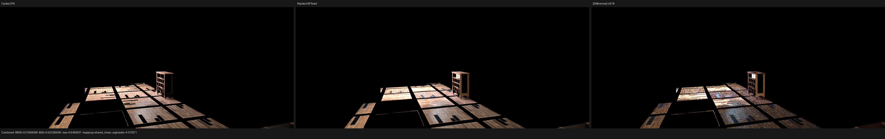
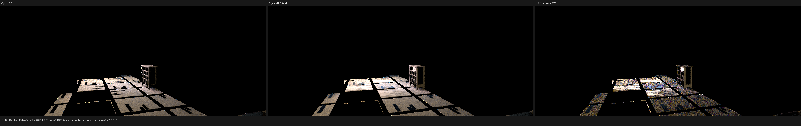
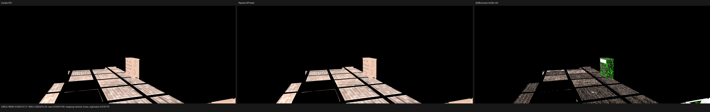
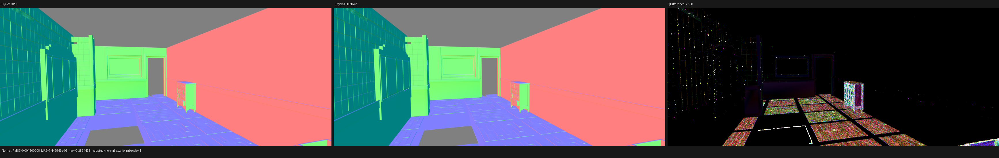
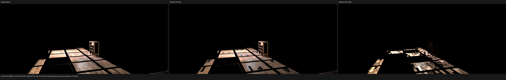

# Barbershop exact-source shadow support

## Result

An exact-support shadow miss, shared by all Luisa backends, was isolated and
fixed without an epsilon or a scene-specific exception. In the official
Barbershop material-isolation render, Cycles CPU and HIP both keep a duplicate
floor instance as a blocker at the closed `t == 0` endpoint after excluding
the exact source primitive. HIPRT did not return that endpoint candidate to
Psycles, so the direct-light contribution was incorrectly retained.

The correction reduces the `1152x480`, 128-spp Combined RMSE against Cycles
CPU by 30.33%, from `0.0239555` to `0.0166907`. Mean luminance falls from
`1.66526x` to `1.26804x` the Cycles CPU value. Diffuse Color and Normal remain
unchanged at RMSE `0.000515117` and `0.00160001`, respectively. This is a
transport correction, not a texture, UV, normal, material, or exposure change.

The reference renderer is Blender/Cycles commit
`29ccd5e2e824128c86fc6174c9c502c02212434a`. Psycles uses LuisaCompute
`next@73bfe5e9e0fe`. Original Blender shader graphs and closures are exported;
no Cycles result is baked or used as a runtime reference implementation.

## CPU/HIP consensus trace

The decisive full-film coordinate is `(399, 141)`, absolute sample `78`.
Cycles CPU, Cycles HIP, and Psycles HIP agree on the primary surface, light
sample, RNG dimensions, light shader, BSDF evaluation, PDFs, and unshadowed
next-event estimate:

| field | value |
| --- | --- |
| source | object `71`, primitive `950264`, local primitive `15314` |
| light | emitter `13`, object `165` |
| shadow origin | `(2.97453666, 2.43203902, -0.00298419595)` |
| shadow direction | `(-0.105760105, -0.393018901, 0.913428128)` |
| closed interval | `[0, 2.49967289]` |
| Psycles unshadowed RGB | `(4.805693, 2.744582, 1.345847)` |
| Cycles CPU/HIP final RGB | `(0, 0, 0)` |

The source geometry and object `6`, primitive `94356`, have bit-identical
final triangle support. Their local triangle indices are both
`(5687, 7479, 5705)` and their transforms are identical. The shared world
vertices are:

```text
(2.943859100341797, 2.507072448730469, -0.002984195947647095)
(2.943913221359253, 2.404776573181152, -0.002984195947647095)
(2.993475675582886, 2.404776573181152, -0.002984195947647095)
```

Cycles' `intersection_skip_self_shadow` excludes only the exact source
`(object, primitive)` and exact light identity. It therefore excludes
`(71, 950264)` but accepts `(6, 94356)` at `t == 0`. Before the correction,
Psycles reported a shadow miss and unit transmittance. Afterwards it reports
object `6`, primitive `94356`, distance `-0.0`, and zero transmittance, matching
the CPU/HIP consensus outcome.

## Formal correction

The existing host stage partitions instances by an exact equivalence relation:
final accelerator positions and triangle-index arrays must be bitwise equal.
Shading attributes deliberately do not participate. The device correction
adds a sorted map from Cycles object identity to TLAS instance identity. For a
shadow ray with an exact source identity it:

1. locates the source instance by binary search;
2. evaluates every member of its exact-support equivalence class with the
   Cycles Pluecker predicate over the original closed interval;
3. excludes only the exact source and light identities;
4. folds accepted members through the same stable Cycles identity order used
   for hardware candidates; and
5. uses the hardware ray query as the broad phase for the rest of the scene.

This is source-class completion, not a distance tolerance. A subsequent
CPU/HIP-consensus trace demonstrated that the same closed-endpoint rule also
applies to continuation rays whenever Cycles' source-triangle test preserves
the original surface position. The current implementation therefore completes
both traversal kinds, while still applying the actual ray and exact triangle
predicate so a geometrically offset origin cannot be forced to hit. See the
[continuation source-support validation](../barbershop-continuation-source-support/README.md).

Scene-table normalization, object-map validation, uploads, heap updates, and
acceleration builds now live in the real `SceneTableUploadComponent` `.h/.cpp`
component. `path_tracer_scene.cpp` remains below the repository's 2000-line
limit.

## Full-image comparison

The validated bundle is
`isolated-export-cycles-corner-tris`: 126 geometries, 152 instances, 564
materials, and 15 lights. Both reference EXRs and Psycles use `1152x480` and
128 fixed samples.

| pass | before vs CPU RMSE | after vs CPU RMSE | change | after vs HIP RMSE | after/CPU mean |
| --- | ---: | ---: | ---: | ---: | ---: |
| Combined | 0.0239555 | 0.0166907 | -30.33% | 0.0169472 | 1.26804 |
| Diffuse Color | 0.000514523 | 0.000515117 | +0.12% | 0.00277073 | 0.999572 |
| Glossy Color | 0.0000946278 | 0.0000948035 | +0.19% | 0.000516488 | 1.00112 |
| Normal | 0.00159998 | 0.00160001 | +0.00% | 0.00263849 | 1.00011 |
| Diffuse Direct | 0.249636 | 0.194746 | -21.99% | 0.196168 | 1.26763 |
| Diffuse Indirect | 0.00627925 | 0.00612550 | -2.45% | 0.00611083 | 1.13375 |
| Glossy Direct | 0.176966 | 0.161113 | -8.96% | 0.180270 | 1.21123 |
| Glossy Indirect | 0.00877106 | 0.00863579 | -1.54% | 0.00752287 | 0.931991 |

Cycles CPU versus Cycles HIP itself has Combined RMSE `0.00713250`, Diffuse
Direct RMSE `0.130167`, and Glossy Direct RMSE `0.114478` on this scene. Those
device-dependent residuals are retained as oracle uncertainty rather than
turned into mandatory Psycles targets.












The full-resolution triptychs were inspected manually. The black floor gaps
and separators move visibly toward Cycles while floor-board direction,
cupboard texture layout, Diffuse Color, and Normal remain stable. The remaining
visible discrepancy is concentrated in direct illumination: several floor
panels and the cupboard are still too bright. That residual is the next
CPU/HIP-consensus investigation target.

Machine-readable reports are retained for
[Psycles HIP versus Cycles CPU](reports/psycles-hip-vs-cycles-cpu.json),
[Psycles HIP versus Cycles HIP](reports/psycles-hip-vs-cycles-hip.json), and
[Psycles before versus after](reports/before-vs-after.json).

## Timing

On the local RX 9070 XT, the final validated run measured:

| phase | time |
| --- | ---: |
| scene compilation / HIPRT build | 3.13066 s |
| warm shader-cache lookup/load | 1.51465 s |
| 1152x480, 128-spp rendering | 2.15882 s |
| cold HIP shader JIT for this kernel | 141.593 s |

These are phase diagnostics, not a canonical end-to-end Cycles/Psycles
benchmark, so no speedup claim is made here.

## Validation hygiene and regressions

Two intermediate image runs were explicitly discarded. The first used the
full 1649-geometry export against isolated-scene references. The second used
the 12:58 pre-fix `isolated-export`, where object `145`, primitive `1212209`
still had an obsolete smooth bit of `1`; the current exporter and Cycles both
require `0`. The latter condition is already locked by
`test_blender_export_smooth_normals.py`, whose Barbershop-derived fixture
covers this exact FACE-domain-without-`sharp_face` representation. Only the
23:45 `isolated-export-cycles-corner-tris` results above are valid.

The new scene-traversal regression contains the actual Barbershop vertices,
ray, source object/primitive, duplicate object/primitive, and expected `t == 0`
blocker. It passes on fallback, HIP, and Vulkan. The complete 195-test suite
and the source-size check pass after a 32-worker build. The raw full-scene and
single-pixel EXR/JSON diagnostics remain in `/var/tmp` rather than becoming
large source fixtures.
