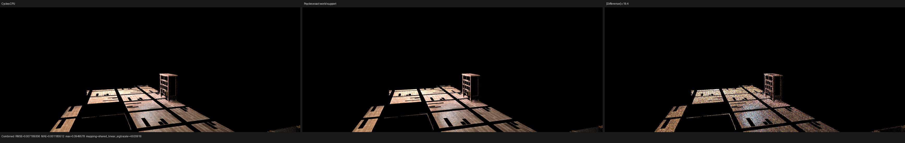
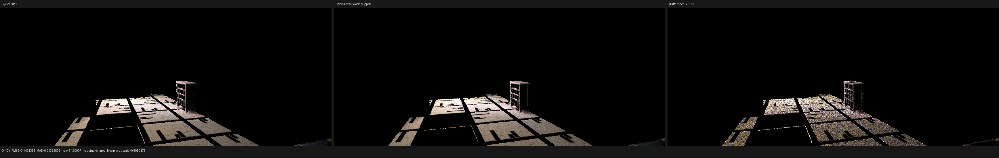
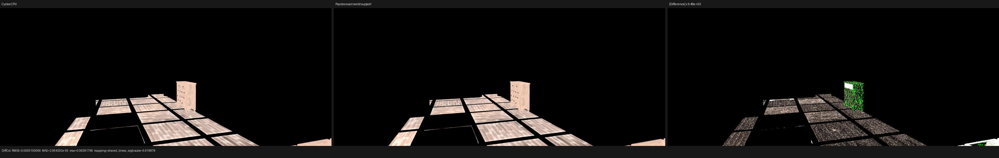
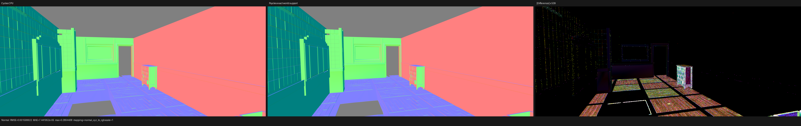
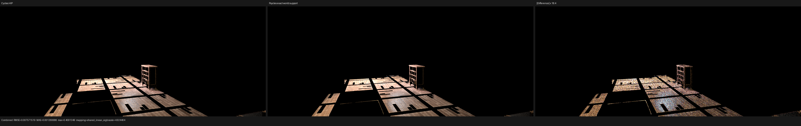
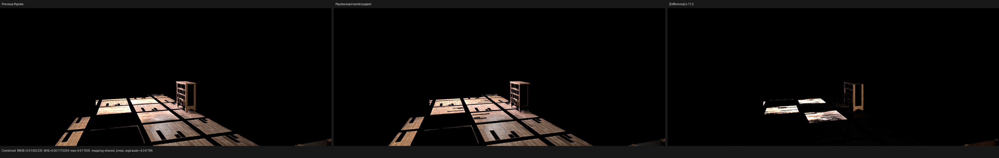
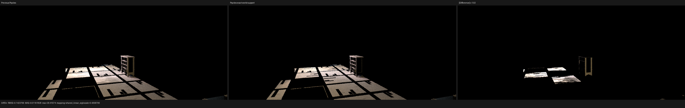

# Barbershop exact finite world support

> **Superseded scene-level conclusion (2026-08-14).** This checkpoint paired
> a Blender 5.3 Alpha evaluated export with a different Cycles reference
> build. Blender 5.2 LTS evaluates the same official `.blend` to 1,105 runtime
> instances instead of 2,565 and does not contain the claimed black-gap
> oracle. The finite-relation analysis below is retained as history, but its
> use to synthesize candidates outside the acceleration backend was invalid
> and has been removed. See
> [the Blender 5.2 revalidation](../../2026-08-14/barbershop-blender-5.2-revalidation/README.md).

## Result

The remaining large Barbershop floor/cupboard error was not a UV, handedness,
or material-export mismatch. Two Cycles instances use different raw affine
matrix encodings, but those matrices map the complete 7,926-element final
position array to bitwise-identical float vertices. Psycles previously used
the raw matrix bits as part of its coincident-support key, split the instances,
and consequently failed to test the sibling surface when the acceleration
backend coalesced a closed-endpoint candidate.

Instance equivalence now follows the exact finite world-space image used to
build the accelerator. No spatial tolerance or ray epsilon is involved. At
`1152x480`, 128 fixed samples, Combined RMSE against Cycles CPU falls from
`0.0154328` to `0.00718931` (`-53.42%`); against Cycles HIP it falls from
`0.0157116` to `0.00757152` (`-51.81%`). The Combined mean-luminance ratio
against CPU changes from `1.21553` to `1.00724`.

The reference renderer is Blender/Cycles commit
`29ccd5e2e824128c86fc6174c9c502c02212434a`. Psycles uses LuisaCompute
`next@73bfe5e9e0fe`. The original Blender shader graphs and closures are
exported; no Cycles image, closure, or lighting result is baked into Psycles.

## CPU/HIP consensus, not hit-identity equality

The decisive film coordinate is `(452, 123)`, absolute sample `0` of 128.
Cycles CPU and HIP do not choose the same primary identity, and this correction
does not require them to do so:

| field | Cycles CPU | Cycles HIP | Psycles after |
| --- | ---: | ---: | ---: |
| primary object | `74` | `3` | `74` |
| primary primitive | `997594` | `47078` | `997594` |
| sampled light object | `156` | `156` | `156` |
| unshadowed NEE RGB | `(0.103000, 0.0394479, 0.0174079)` | `(0.103000, 0.0397820, 0.0177208)` | `(0.103000, 0.0394483, 0.0174080)` |
| retained NEE RGB | `(0, 0, 0)` | `(0, 0, 0)` | `(0, 0, 0)` |

Before the fix, Psycles reported a shadow miss and retained the unshadowed NEE
value. After the fix its exact source-class completion tests object `3`,
primitive `47078`, accepts it at signed distance `-0.0`, and suppresses the
same contribution. The invariant being matched is therefore the shared
occlusion/transport result. Which coincident sibling a particular Cycles BVH
returns first remains deliberately unconstrained.

## Formal correction

Let a final local triangle support class contain exactly those geometries whose
complete float position arrays and triangle-index arrays are bitwise equal.
For an authored transform `T` and the final positions `v[i]`, define its finite
world image as

```text
W(T, v) = (cycles_float_affine(T, v[0]), ..., cycles_float_affine(T, v[n-1]))
```

where `cycles_float_affine` is the same contracted host-FMA operation used for
Cycles-compatible static geometry. Two instances may share a source-support
completion class exactly when their local support classes agree and every
component of `W` is bitwise equal. Equality of the symbolic real-valued
matrices is neither necessary nor sufficient for this finite float relation.

The implementation uses four deterministic transformed vertices only to
choose a hash bucket. Exact equality implies equal witnesses, so equivalent
instances cannot be split by this routing step. A bucket match is then
validated by transforming and bit-comparing every final vertex. Witness/hash
collisions therefore cannot create a false equivalence. Identical matrix bits
remain a constant-time fast path. The device still evaluates the original ray
interval, visibility masks, exact source/light exclusions, stable hit order,
and the Cycles Pluecker triangle predicate for every completed candidate.

This is an equivalence-relation repair derived from the finite accelerator
support; it is not a scene-name special case or an approximate overlap test.

## Full-image comparison

The validated `isolated-export-cycles-corner-tris` bundle contains 126
geometries, 152 instances, 564 materials, and 15 lights. Both Cycles references
and Psycles use `1152x480` and 128 fixed samples.

| pass | previous vs CPU | fixed vs CPU | change | fixed vs HIP | fixed/CPU mean |
| --- | ---: | ---: | ---: | ---: | ---: |
| Combined | 0.0154328 | 0.00718931 | -53.42% | 0.00757152 | 1.00724 |
| Diffuse Color | 0.000515137 | 0.000515001 | -0.03% | 0.00277074 | 0.999571 |
| Glossy Color | 0.0000949786 | 0.0000946803 | -0.31% | 0.000516518 | 1.00112 |
| Normal | 0.00160005 | 0.00159992 | -0.01% | 0.00263848 | 1.00011 |
| Diffuse Direct | 0.188438 | 0.142136 | -24.57% | 0.142418 | 1.00837 |
| Diffuse Indirect | 0.00625114 | 0.00611980 | -2.10% | 0.00591848 | 1.07477 |
| Glossy Direct | 0.154185 | 0.141215 | -8.41% | 0.163304 | 1.03696 |
| Glossy Indirect | 0.00881561 | 0.00877165 | -0.50% | 0.00748646 | 1.13964 |















The full-resolution triptychs and enlarged floor/cupboard crops were inspected
manually. The large false illumination over the floor panels and cupboard is
removed, the black gaps now follow the Cycles image closely, and the cupboard
no longer reads as a uniformly diffuse block in Combined. Diffuse Color and
Normal retain their previous topology, UV placement, and orientation, which
is consistent with a transport/occlusion correction rather than a texture or
coordinate rewrite. Residual error is visually dominated by noisy direct-light
differences and smaller indirect/glossy energy differences; those remain the
next consensus targets.

Machine-readable reports are retained for
[Psycles HIP versus Cycles CPU](reports/psycles-hip-vs-cycles-cpu.json),
[Psycles HIP versus Cycles HIP](reports/psycles-hip-vs-cycles-hip.json), and
[the preceding Psycles image versus this fix](reports/before-vs-after.json).

## Regression and timing

The host regression contains the actual Barbershop object `3`/`74` transforms
and local triangle vertices. It proves that distinct matrix bit patterns with
the same finite world support join one circular class, while a one-ULP
translation that changes the world support remains a singleton. The existing
device regression separately exercises exact source-class shadow and
continuation completion with real Barbershop identities, plus an offset-origin
negative case. Together they lock the classification and traversal stages.

The host tests and device traversal tests pass on fallback, HIP, and Vulkan.
The integrated HIP path trace confirms object `3`/primitive `47078` is the
accepted sibling candidate and the sample output is exactly zero.
The complete 32-worker validation run passes all 195 tests in `9.08 s`,
including the source-size guard.

For the validated warm-cache run on the local RX 9070 XT:

| phase | time |
| --- | ---: |
| shader cache lookup/load | 1.53212 s |
| 1152x480, 128-spp rendering | 2.43342 s |

These phases are reported separately and are not presented as a canonical
Cycles/Psycles speedup measurement.
