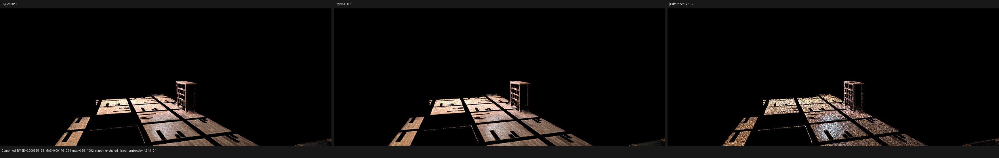
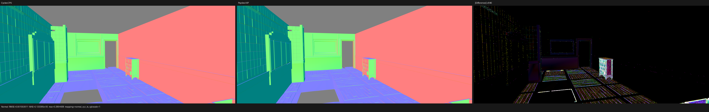
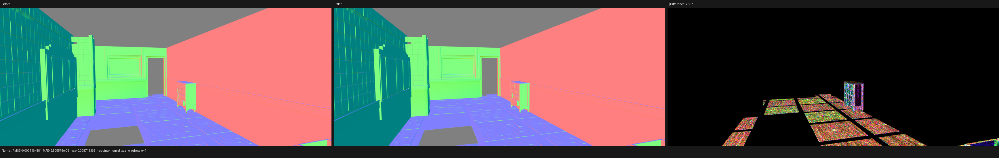

# Camera near-clip differential validation

## Result

Psycles now advances the compact camera positional differential when the ray
origin is moved to the near clipping plane. This fixes the first material
evaluation divergence on the Barbershop wood floor without changing the
exported closure graph, texture values, UVs, or object random value.

For a compact ray differential, translating the origin by ray parameter
distance `s` has the invariant

```text
dP' = dP + s * dD
```

Cycles applies this update after camera near clipping. Psycles previously
advanced the origin but retained the pre-clip `dP`, so every primary-hit
differential was too small by `near_distance * dD`. Automatic bump, texture
filtering, and any coordinate derivative derived from the surface differential
were affected.

## Barbershop path oracle

The oracle is the original Barbershop material graph at full-film pixel
`(429, 165)`, absolute Tabulated Sobol sample `31/128`, rendered at
`1152x480`. The hit is Cycles object `32`, primitive `504350`, on material
`wood_floor.001`. Cycles CPU and HIP were both measured because their
floating-point results are not bit-identical.

The exact bump inputs were inspected in a temporary diagnostic build and all
diagnostic logging was removed afterwards:

| value | Cycles CPU | Psycles before | Psycles after |
|---|---:|---:|---:|
| compact-basis `dP.x.x` | `0.010190364` | `0.008918242` | `0.010188363` |
| center height | `0.001681640` | `0.001681610` | `0.001681610` |
| x-offset height | `0.001620743` | `0.001659765` | `0.001621096` |
| y-offset height | `0.001604895` | `0.001615817` | `0.001604853` |

The center-height agreement showed that the original material graph and
center texture coordinates were already intact. Advancing `dP` corrected the
offset evaluations and therefore the bump normal.

The production HIP path trace, after removing instrumentation, gave:

| renderer | first closure normal |
|---|---|
| Cycles CPU | `(0.0673643, 0.00777345, 0.997698)` |
| Cycles HIP | `(0.0684412, 0.00705645, 0.997630)` |
| Psycles HIP before | `(0.0491131, 0.0245453, 0.998492)` |
| Psycles HIP after | `(0.0672348, 0.00792198, 0.997706)` |

The Psycles-to-Cycles-CPU angular error fell from `1.421 degrees` to
`0.0113 degrees`. The remaining error is smaller than the measured
`0.0742-degree` Cycles CPU-to-HIP difference. Closure weights moved into the
same range as well: Psycles after produced
`(0.1646135, 0.1294921, 0.1145180)`, versus Cycles CPU
`(0.1646097, 0.1294887, 0.1145146)`.

Artifacts from the production validation are outside the repository at:

```text
/var/tmp/barbershop-next-residual/psycles-near-clip-fixed-hip/
```

The cold production HIP shader JIT took `162.744 s`; LLVM code generation was
`66.394 s`, and the generated pre-link code was `3.26 MB`. The single-sample
GPU render itself took `0.116 s`. A temporary `device_log` build was excluded
from performance conclusions because logging expanded the generated code to
`19.7 MB`.

## Regression coverage

`psycles_luisa_camera_sampling_tests` now evaluates nonzero initial `dP`,
nonzero `dD`, and three near-clip distances. It checks the clipping interval
and `dP' = dP + s*dD` together on every enabled Luisa backend.

```text
psycles.luisa_camera_sampling_fallback  Passed
psycles.luisa_camera_sampling_hip       Passed
psycles.luisa_camera_sampling_vk        Passed
```

The production renderer and regression executable were built with
`cmake --build ... --parallel 32`.

## Full-image validation

The fix was also validated at `1152x480`, `128 spp` on the isolated original
Barbershop material scene. The Psycles HIP render took `2.443 s` after the
shader cache had been populated. Against the current Cycles CPU reference:

| pass | RMSE after | RMSE before | luminance ratio after |
|---|---:|---:|---:|
| Combined | `0.00696520` | `0.00697111` | `1.00147` |
| Diffuse Direct | `0.132413` | `0.132676` | `0.99701` |
| Diffuse Indirect | `0.00488818` | `0.006151` | `1.07196` |
| Glossy Indirect | `0.00690894` | `0.008782` | `1.14581` |
| Normal | `0.00159261` | `0.00159992` | n/a |

The Combined comparison below is ordered Cycles CPU, Psycles HIP, amplified
absolute difference:



The Normal comparison uses the same ordering:



The before/after Normal triptych is ordered Psycles before, Psycles after,
amplified absolute difference. It confirms that the change is localized to
surfaces whose shader derivatives depend on the camera differential, notably
the automatic-bump floor and cupboard materials:



Visual inspection agrees with the targeted path oracle: the wood-floor bump
orientation and strength move toward Cycles. The full-image comparison still
shows structured Normal residuals on the cupboard and the left brick wall, as
well as a broad noisy direct-light residual. Those are explicitly retained as
separate open alignment issues; the near-clip fix does not claim to explain
them.
