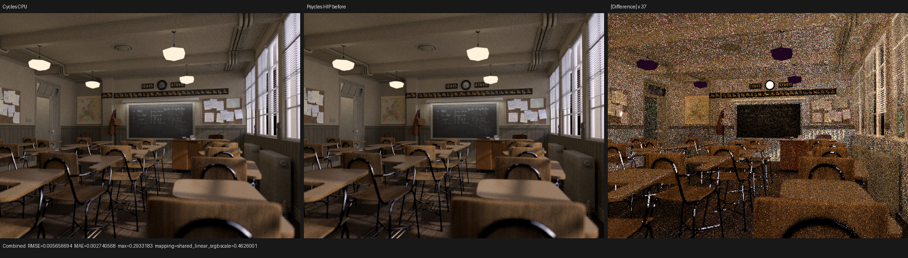
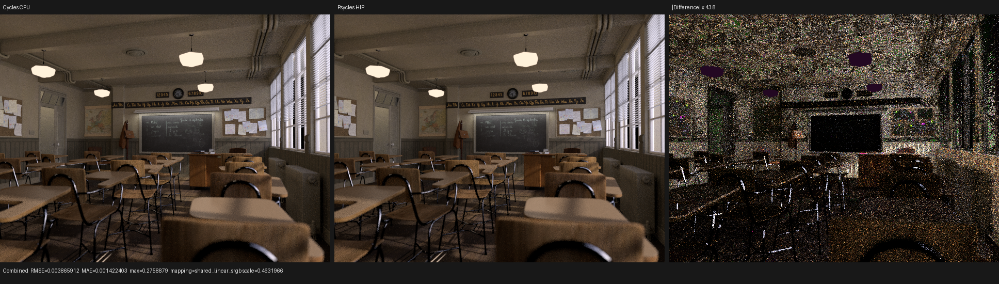
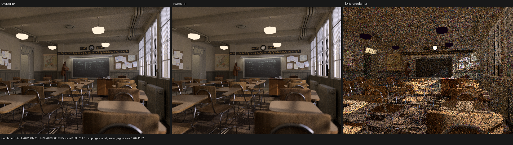

# Classroom HIP performance validation

## Result

Classroom at 640 x 480 and 256 spp now renders on Psycles HIP in a three-run
median of **17.935 s**, down from the corrected uninstrumented baseline of
**57.832 s**. This is a 3.23x speedup and a 69.0% runtime reduction with no
change to any of the 15 linear output passes.

A later exact-source lookup follow-up retained the same image and reduced a
single 256-spp run to **17.140 s**. Its repeatable 32-spp median is **2.199 s**;
the design and rejection controls are recorded below rather than folded into
the original three-run result.

The root cause was algorithmic. Forward-hit MIS mapped every triangle surface
intersection back to the emissive-triangle table with a linear scan over all
emitters. That made ordinary non-emissive surface shading O(E), where E is the
number of emissive triangles, at every path bounce.

The first correction was a formal lexicographic `lower_bound` over
`(instance_index, primitive_index)`, reducing the reverse lookup to O(log E).
The production implementation now removes reverse lookup altogether. Primitive
material resolution carries the exact effective material's authored emission
sampling policy forward with the committed hit, and forward-hit MIS consumes
that value directly. The component interface accepts no scene, emitter table,
instance identity, or primitive identity, making O(E) or O(log E) reverse
mapping structurally impossible. Authored emission sampling, side selection,
geometric PDF, MIS weight, and random-number consumption are unchanged.

Potential endpoint emission and sampled-light membership are deliberately
separate predicates. `EmissionSampling::NONE` remains visibly emissive but has
no competing light PDF, while camera-only instances are excluded from the
sampled-light population. The five-state sampling policy is explicitly packed
into bits 4-6 of the existing device material flag word. Compile-time size,
alignment, offset, enum-capacity, and mask-disjointness checks keep
`MaterialBindingGpu` at its original 24-byte stride.

## Path-parity follow-up: RR and light bounce limits

This follow-up was checked directly against official Cycles commit
`29ccd5e2e824128c86fc6174c9c502c02212434a`. The per-sample oracle is the same
source with diagnostic-only trace commit
`82186b01ad2e79435e67a02de93b178bfbe0f6c4`; it does not replace Cycles with a
CPU reference implementation.

For the currently implemented non-path-guided transport, Psycles' Russian
roulette contract matches `path_state_continuation_probability()` and its call
sites. Cycles path guiding remains an unsupported feature; its additional
`unguided_throughput` factor is therefore not claimed as implemented.

- opaque paths remain unconditional while `bounce <= min_bounce`, transparent
  paths while `transparent_bounce <= transparent_min_bounce`;
- the continuation probability is
  `min(sqrt(max(abs(throughput.rgb))), 1)`, sampled from Cycles' per-bounce
  terminate Sobol dimension with termination on `sample >= probability`;
- surviving surface throughput is divided exactly once; when a ray enters a
  volume the same decision is deferred so surface/volume emission and MIS are
  retained, and division occurs only at the event that actually scatters;
- a max-bounce-2/min-bounce-2 A/B disabled roulette without removing the
  Classroom bias, excluding RR as its cause.

The separate heterogeneous-volume low-throughput roulette also follows Cycles:
the inclusive 0.05 threshold, reservoir-random reuse and saturation, coupled
equiangular branch, distance-direct dependency, and both throughput
renormalizations are represented by one typed Luisa component.

The remaining coherent error had two independent light-selection causes. Sun
directions first used a uniform-cone map instead of Cycles' concentric-disk
cone map; the shared surface/volume sampler now follows Cycles. After that fix,
the clock face was still systematically bright. A progressive pixel trace at
film coordinate `(346, 328)` isolated samples 14, 63, 94, 125, 131, and 249.
For sample 94, Cycles and Psycles matched both glass intersections, random
dimensions, closures, and throughput through bounce 2, but Psycles selected
instanced lamp `Point.001` while Cycles rejected it. The lamp's authored
`max_bounces` is 1.

Cycles' formal predicate is strictly `bounce > light.max_bounces`, applied
after analytic lamp or world selection for surface and volume NEE. It does not
hide a lamp reached by forward tracing. Psycles now exports, imports, uploads,
and applies that same inclusive contract for every lamp and the world. The
predicate is shared by all four surface/volume lamp/world paths, so the fix is
not scene-specific. Replaying sample 94 now produces exact zero in both
renderers.

The full comparison below is the deliberately controlled 640x480, 256-spp,
overall max-bounce-2, diffuse-bounce-2, glossy-bounce-0 Classroom configuration.
It uses seed 1, Tabulated Sobol, no adaptive sampling, and no denoising. It
should not be read as the default full-depth Classroom benchmark.

| Pass vs latest Cycles CPU | RMSE before | RMSE after | luminance ratio before | luminance ratio after |
| --- | ---: | ---: | ---: | ---: |
| Combined | 0.005657 | 0.003866 | 1.009280 | 0.999324 |
| Diffuse Indirect | 0.028269 | 0.026413 | 1.046637 | 0.999427 |
| Glossy Indirect | 0.012915 | 0.011199 | 1.047470 | 0.996707 |
| Transmission Indirect | 0.002683 | 0.000063 | 1.145316 | 0.999186 |

Latest Cycles CPU and HIP themselves differ by Combined RMSE 0.001378,
Diffuse Indirect RMSE 0.028977, and Glossy Indirect RMSE 0.014193 at this sample
count. Their Combined luminance ratio is 0.999982. Psycles against latest
Cycles HIP has Combined RMSE 0.003913 and luminance ratio 0.999342. This makes
the remaining high-frequency per-pixel indirect error consistent with
backend/sample variance; the former 4.7-14.5% pass-mean bias was structural and
is gone.

Visual inspection confirms that the stable bright clock-face residual in the
before image disappears after the fix. Geometry, silhouettes, UV regions,
textures, materials, and illumination structure align; the amplified after
panel contains granular noise and sparse highlights rather than a coherent
scene region.

Machine-readable comparisons are available for
[before versus Cycles CPU](reports/max2-diffuse-only-before-light-max-bounces-vs-cycles-cpu.json),
[after versus Cycles CPU](reports/max2-diffuse-only-light-max-bounces-vs-cycles-cpu.json),
[after versus Cycles HIP](reports/max2-diffuse-only-light-max-bounces-vs-cycles-hip.json),
and [Cycles CPU versus HIP](reports/max2-diffuse-only-cycles-cpu-vs-hip.json).
The Psycles HIP render took 15.953 s, versus 13.092 s for latest Cycles CPU and
4.496 s for latest Cycles HIP. Cold Psycles shader JIT took 69.024 s and is
reported separately from render time.

Regression coverage locks the exporter and importer fields, the strict
inclusive boundary `(0,0)`, `(1,1)`, `(2,1)`, `(1024,1024)`, and evaluates the
shared Luisa predicate on fallback, HIP, and Vulkan. Existing surface and
volume backend suites exercise the call sites, and the full traced sample and
image comparisons validate the integrated scene path.

## Runtime comparison

All timings use the same RX 9070 XT machine, fixed 640 x 480 extent, 256 spp,
Tabulated Sobol sampling, seed 1, disabled adaptive sampling and denoising, and
a warm shader cache. The Cycles reference is Blender 5.3.0 Alpha.

| Renderer/device | Time | Relative to Cycles HIP |
| --- | ---: | ---: |
| Cycles HIP, RX 9070 XT | 4.431 s | 1.00x |
| Cycles CPU, Ryzen 9 9950X3D | 13.487 s | 3.04x |
| Psycles HIP, before | 57.832 s | 13.05x |
| Psycles HIP, ordered lookup | 17.209 s | 3.88x |
| Psycles HIP, ordered lookup plus capability gate | 17.202 s | 3.88x |
| Psycles HIP, direct O(1) PDF plus packed policy | 17.935 s | 4.05x |

The final row is the median of 17.9324, 17.9346, and 18.0173 s. It is 4.3%
slower than the earlier single-run O(log E) measurement, which was collected in
a separate benchmark session. This result does not support a performance claim
for the final O(1) cleanup; its benefit is the stronger complexity and
interface contract. The small timing delta remains part of the subsequent
HIPRT and register-pressure investigation.

At 32 spp, the direct before/final comparison is 7.266 s versus 2.295 s, or
3.17x. The same scaling at 256 spp rules out fixed dispatch or scene-upload
overhead as the explanation.

## Exact-source completion lookup follow-up

Exact Cycles self exclusion uses `(object, primitive)`, but completing closed
`t == 0` support on backends which omit an endpoint candidate needs the source
TLAS instance. The former implementation recovered that instance by binary
searching all scene instances on every eligible ray. Carrying the TLAS
`(instance, local primitive)` pair forward appeared to make this O(1), but it
added two 32-bit values to the megakernel path state and every shadow callable.
On HIP that widened ABI increased the warm 32-spp render from 2.295 to 4.416 s,
private storage from 5376 to 5904 bytes per thread, the raw AMDGPU object from
3,261,588 to 3,831,432 bytes, and the linked code object to 5,435,992 bytes.
That implementation was rejected and is not present in the source.

The accepted representation keeps the existing two-word Cycles source
identity. During scene compilation it indexes only instances for which
`coincident_count > 1` or `primitive_completion_count > 0`:

- bounded, sufficiently compact object identities use a direct-address table,
  giving one O(1) device lookup with at most 4 MiB of table storage;
- pathological sparse identities use sorted special-instance entries and
  O(log S) lookup, where `S` is the number of completion sources rather than
  all `N` scene instances;
- scenes with no completion source emit neither lookup nor buffer access into
  the JIT AST.

Classroom has 838 instances but only two completion-source instances, and its
object numbering selects the direct encoding. All object identities are still
validated for uniqueness. Regression coverage independently exercises an
empty lookup, dense direct encoding, extreme sparse encoding, duplicate object
rejection, and the real endpoint/tie traversal fixture on fallback, HIP, and
Vulkan.

The 640x480 measurements are:

| Accepted lookup result | Value |
| --- | ---: |
| 32 spp render, cold process | 2.2167 s |
| 32 spp render, warm process 1 | 2.1961 s |
| 32 spp render, warm process 2 | 2.1990 s |
| 32 spp median | 2.1990 s |
| 256 spp render, warm process | 17.1403 s |
| Cold JIT | 70.1781 s |
| HIP LLVM code generation | 21.9542 s |
| Raw AMDGPU object | 3,260,732 bytes |
| Linked code object | 4,711,056 bytes |
| Shader-cache entry | 4,712,838 bytes |

The 32-spp median is 4.2% below the previous 2.295-s result. The one 256-spp
run is 4.4% below the earlier 17.935-s three-run median, but is deliberately
reported as a single run rather than promoted to a new stable median.

All 15 new 32-spp linear PFM passes are byte-for-byte identical to the previous
direct-PDF render, and `oiiotool --diff` passes for the multilayer EXR. The new
256-spp comparison against Cycles HIP reproduces the previous Combined relative
RMSE `0.037245` and mean-luminance ratio `1.012414`. Visual inspection found no
new coherent geometry, UV, texture, material, silhouette, or lighting
difference; the amplified panel remains stochastic/highlight variance.

The corresponding machine-readable result is
[completion-source lookup versus Cycles HIP](reports/completion-source-lookup-vs-cycles-hip.json).

## HIPRT direct-traversal rejection controls

Three deliberately non-equivalent HIPRT closest-hit variants bounded the
remaining ray-query cost. They were diagnostic branches only and were removed:

| 640x480, 32 spp diagnostic | Render | Result versus exact callback traversal |
| --- | ---: | --- |
| Raw direct closest hit | 1.4876 s | relative RMSE 0.5886; luminance ratio 0.513; structural geometry failure |
| Direct seed followed by exact resolver | 2.5850 s | relative RMSE 0.5005; structural geometry failure |
| Direct seed with exact lower-endpoint expansion | 2.6729 s | still structurally wrong and slower than callback traversal |

The speed of raw direct traversal is real, but its candidate semantics cannot
replace Cycles' closed interval, Pluecker predicate, exact exclusion,
completion relation, procedural handling, and deterministic equal-distance
ordering. The next safe optimization must therefore be scene-specialized
acceleration partitioning or a JIT-selected exact traversal strategy, not a
global switch from callback ray query to direct closest hit.

## How the bottleneck was isolated

The following deliberately non-equivalent diagnostic kernels were used only to
bound costs; none is part of the production change. These are pre-fix 32-spp
measurements, so each still contains the linear emitter lookup unless stated
otherwise.

| Diagnostic | Time | Observation |
| --- | ---: | --- |
| Production baseline | 7.266 s | Reference |
| Skip tie re-traversal | 6.886 s | Exact Cycles tie resolution is about 5.2% here |
| Assume unoccluded shadows | 6.721 s | All shadow work is at most about 7.5% |
| Cheap Lambert NEE evaluation plus unoccluded shadows | 6.342 s | NEE BSDF evaluation is not the dominant gap |
| Disable surface NEE | 6.320 s | Direct-light sampling is not the dominant gap |
| Disable analytic forward-light intersection | 7.222 s | Analytic forward hits are negligible |
| Ordered emitter lookup, intermediate result | 2.210 s | Removes the dominant O(E) work |
| Direct forward PDF, final result | 2.295 s | Removes reverse lookup from the interface |

A forward-path-tracing specialization retaining all ten analytic lights took
0.083 s at 1 spp, the same envelope as the earlier light-free diagnostic. That
excluded scene simplification as the explanation and narrowed the search to
code emitted only for next-event estimation. Inspection then found the linear
`from_intersection` emitter scan.

Dispatch batching was also not the primary issue: batches of 1, 4, 8, 16, and
32 samples measured 7.786, 7.437, 7.322, 7.256, and 7.266 s before the fix.

## Shader compilation and register pressure

The optimization changes runtime complexity rather than hiding work through a
different compiler policy. The ordered-lookup/gated HIP code object used 256
VGPRs, 108 SGPRs, 5376 bytes of private storage per thread, dynamic stack, 1250
VGPR spills, and 151 SGPR spills. Its `.text` section was 4,588,928 bytes. The
pre-fix values were 256 VGPRs, 108 SGPRs, 5376 private bytes, 1252 VGPR spills,
148 SGPR spills, and 4,588,416 bytes of `.text`.

Cold shader JIT for the direct-PDF kernel took 69.471 s, while a warm cache load
took 0.436 s. The raw AMDGPU object is 3,261,588 bytes and its cache entry is
4,714,280 bytes. JIT latency is therefore a separate remaining engineering
problem, not part of the 17.935 s steady-state render time.

A global HIP register cap was rejected. A 96-register cap improved the old
Classroom kernel from 57.832 to 30.243 s with byte-identical output, but made a
controlled Lone Monk 64-spp render regress from 4.979 to 9.076 s. Register
policy must therefore be derived from kernel/scene characteristics rather than
set as a backend-wide default.

## Image and numerical validation

All 15 final direct-PDF 256-spp PFM passes are byte-for-byte identical to the
ordered-lookup render: Combined, Normal, Albedo, Diffuse Direct/Indirect, Glossy
Color/Direct/Indirect, Transmission Color/Direct/Indirect, Emission,
Environment, and Volume Direct/Indirect. `oiiotool --diff` reports `PASS` for
Combined, and the same exact comparison was performed for every pass.

Against Cycles HIP, Combined relative RMSE remains 0.037245 and mean luminance
ratio remains 1.012414. Visual inspection of both the final 256-spp image and
the full-resolution triptych found matching geometry, silhouettes, textures,
material regions, and lighting structure. The amplified difference is
stochastic/highlight noise rather than a coherent transform, UV, material, or
lighting mismatch.

The machine-readable comparison is
[Psycles HIP vs Cycles HIP](reports/psycles-hip-vs-cycles-hip.json).

## Regression coverage

The direct forward-PDF regression captures no scene or emitter buffer and
covers front, back, automatic, front-and-back, disabled sampling, density
scaling, flipped sides, and degenerate triangles. Primitive-material regression
coverage exercises base and override materials, endpoint emission versus light
sampling, camera-only visibility, the packed policy bits, and decoded values.
Both tests pass on fallback, HIP, and Vulkan. Existing forward area-light tests
also pass on all three backends, and the full suite passes **209/209**.

The original three-run steady-state gap is 4.05x versus Cycles HIP and 1.33x
versus Cycles CPU; the later single 17.140-s checkpoint is respectively 3.87x
and 1.27x. Since shadow traversal, analytic forward lights, dispatch batching,
and the emitter table no longer explain it, the next profiling pass should
measure material/closure evaluation, per-bounce traversal, and the effect of
the still-extreme spill footprint on the new baseline rather than carrying
forward percentages from the removed O(E) bottleneck.
