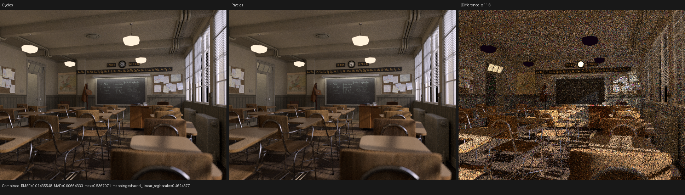
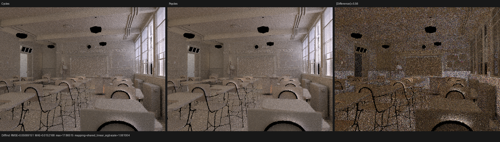
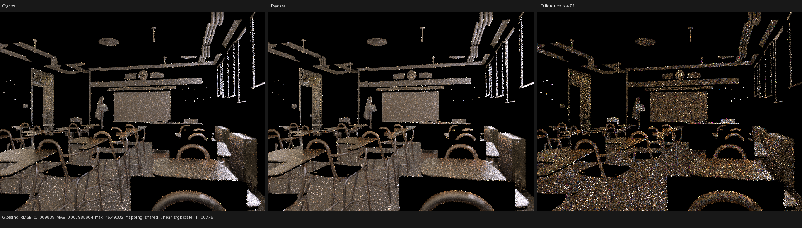
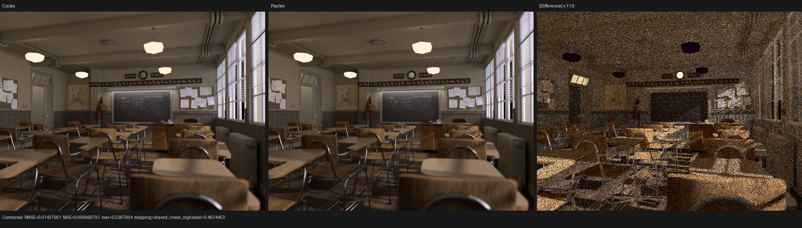
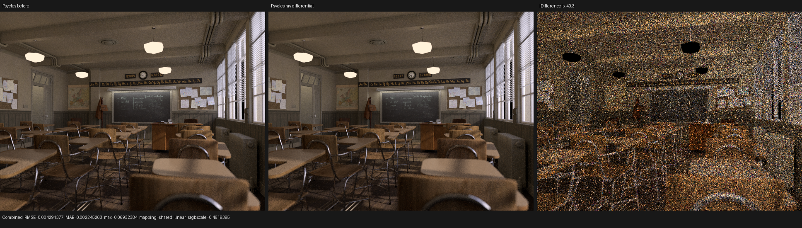
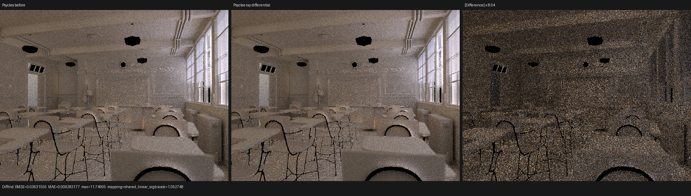
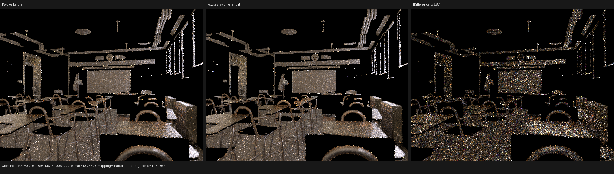

# Classroom surface ray-differential validation

## Result

Psycles now applies the current Cycles compact ray-differential transition to
every non-transparent surface bounce. The missing transition made texture and
automatic-bump footprints at later path vertices much too small. It was the
cause of the large second-bounce wood-floor normal disagreement found while
investigating the remaining Classroom lighting error.

The implementation also applies the same widening measure to surface NEE
shadow rays. This matters for texture-dependent transparent blockers and is
required for forward BSDF sampling and NEE to converge to the same filtered
integrand. Current Cycles volume shader setup explicitly leaves both compact
differentials at zero, so Psycles volume NEE continues to pass `(0, 0)` rather
than extending the surface rule beyond its source-defined domain.

The correction is derived from the closure mixture rather than from the
selected closure or a material-specific case. No graph is pre-evaluated by
Blender/Cycles, and no scene, texture, or node result is baked into Psycles.

## Formal transition

For outgoing direction `w`, let closure `i` have sample weight `s_i`,
conditional density `p_i(w)`, and Cycles specular roughness measure `q_i`.
Cycles defines

```text
q_i = 0                         for singular closures
q_i = alpha_x * alpha_y         for microfacet closures
q_i = 1                         for every other BSDF

Q(w) = sum_i s_i p_i(w) q_i / sum_i s_i p_i(w)
```

For an isotropic microfacet closure authored with node roughness `r`, Cycles
uses `alpha = r^2`, hence `q = r^4`. After a regular surface bounce at compact
positional radius `dP_hit`, the invariant is

```text
dP_next = dP_hit
dD_next = dD_prev                         if Q <= 0
dD_next = max(dD_prev, sqrt(Q))            otherwise
```

Transparent continuation preserves both `dP` and `dD`, because it advances
the minimum distance on the same geometric ray. Surface NEE uses
`(dP_hit, widen(dD_prev, Q(w_light)))`. The same PDF-weighted reduction is
shared by the legacy graph evaluator and the refactored closure-component
evaluator, including mixtures containing singular closures.

## Per-path oracle

The production trace uses Classroom full-film coordinate `(320, 240)`,
absolute Tabulated Sobol sample `6/256`, at `640x480`. Event one hits Cycles
object `192`, primitive `396440`, shader `74`, material `woodFloor` on object
`sol`. The graph feeds `base_woodFloor.jpg` through a Color Ramp into a Bump
node with strength `0.15`, distance `0.1`, and automatic filter width.

| renderer | event-one diffuse closure normal |
| --- | --- |
| Cycles CPU | `(0.000749977, 0.000499455, 0.999999583)` |
| Cycles HIP | `(0.000816481, 0.000454737, 0.999999523)` |
| Psycles HIP before | `(-0.103531301, -0.078848958, 0.991495907)` |
| Psycles HIP after | `(0.000771547, 0.000477799, 0.999999642)` |

The corrected Psycles value lies inside the measured Cycles CPU/HIP numerical
envelope. The formal trace comparison's failure count falls from `111` to
`99`; it is not claimed as a complete trace pass because the comparator also
tracks known exact-RNG, sentinel, and later-transport differences.

Decoded traces are retained for [Cycles CPU](reports/path-cycles-cpu.json),
[Cycles HIP](reports/path-cycles-hip.json),
[Psycles before](reports/path-psycles-before.json), and
[Psycles after](reports/path-psycles-after.json). The complete field report is
[here](reports/path-cycles-cpu-vs-psycles-hip.json).

Coincident primitive identity is not an oracle when Cycles CPU and HIP choose
different valid references. Such cases are accepted when their observable
transport is equivalent. This diagnostic does not depend on primitive-choice
differences: the material identity and targeted surface agree across the three
renderers.

## Regression coverage

`psycles_luisa_ray_differential_tests` locks diffuse widening, rough
microfacet widening, monotonic non-shrinking, surface-shadow initialization,
and transparent preservation on fallback, HIP, and Vulkan. It also folds a
diffuse, rough-microfacet, and singular contribution with deliberately
different PDFs and proves the normalized `Q = 0.224`, including the singular
PDF in the denominator without adding roughness to the numerator. The closure
tests add two independent family checks:

- a pure diffuse closure produces `Q = 1`;
- standalone Beckmann and GGX closures with roughness `r` produce `Q = r^4`.

The complete project was built with 32 workers. All `204/204` tests passed on
fallback, HIP, and Vulkan in `183.25 s`, including surface closure collection,
area-light forward transport, transparent transmission, and volume paths.

## Full-image comparison

The original Classroom graph was rendered at `640x480`, `256 spp`, with
Tabulated Sobol, seed `1`, adaptive sampling disabled, and denoising disabled.
The references are current Cycles CPU and HIP renders of the same `.blend`.
The table reports relative RMSE; the mean column is Psycles/Cycles CPU linear
luminance.

| pass | before vs CPU | after vs CPU | after vs HIP | after/CPU mean |
| --- | ---: | ---: | ---: | ---: |
| Combined | `0.0383165` | `0.0372017` | `0.0372538` | `1.01239` |
| Diffuse Direct | `0.405449` | `0.405449` | `0.405442` | `0.998264` |
| Diffuse Indirect | `0.279053` | `0.250674` | `0.251999` | `1.05523` |
| Glossy Direct | `0.0763238` | `0.0763238` | `0.0776916` | `0.999715` |
| Glossy Indirect | `0.460579` | `0.425381` | `0.439146` | `1.07442` |
| Normal | `0.00504360` | `0.00504360` | `0.00504450` | n/a |
| Diffuse Color | `0.00387926` | `0.00387926` | `0.00387951` | `0.999235` |
| Glossy Color | `0.000388655` | `0.000388655` | `0.0004006` | `0.999990` |

Cycles CPU versus Cycles HIP itself has relative RMSE `0.004237` for
Combined, `0.148812` for Diffuse Indirect, and `0.0855314` for Glossy
Indirect at this sample count. Those values establish the stochastic
reference spread but do not explain all remaining Psycles error.

Machine-readable reports are retained for
[Psycles HIP versus Cycles CPU](reports/psycles-hip-vs-cycles-cpu.json),
[Psycles HIP versus Cycles HIP](reports/psycles-hip-vs-cycles-hip.json), and
[Psycles before versus after](reports/before-vs-after.json).

## Visual inspection

Each comparison is reference, actual, and amplified absolute difference under
a shared linear display transform.















The full-resolution images were opened and inspected manually. Geometry,
silhouettes, UV placement, floor/brick/cabinet textures, and first-hit material
colors remain aligned. The change is visible on multi-bounce floor, desk,
chair, wall, and ceiling transport, without moving the primary Normal or color
passes. The remaining Combined residual follows window projections, contact
shadows, and indirect-light distribution; it is not a broad transform,
handedness, or texture-coordinate scramble.

## Timing and revisions

The validation machine has an RX 9070 XT and Ryzen 9 9950X3D. Psycles HIP
reported `2.035 s` scene compilation, `68.099 s` for the cold shader JIT, and
`59.043 s` for the 640x480 256-spp render. The corresponding Cycles harness
reported `4.431 s` on HIP and `13.487 s` on CPU. On these measurements the
Psycles render is approximately `13.3x` slower than Cycles HIP and `4.38x`
slower than Cycles CPU; this functional correction does not claim a speedup.

The checkpoint starts from Psycles `bec6b3dbe121fc44a225533a0aa166a34cd9b9fb`,
LuisaCompute `next@73bfe5e9e0fefec543bd140c66d77c3404577d10`, and Cycles
`29ccd5e2e824128c86fc6174c9c502c02212434a` plus diagnostic-only trace
instrumentation.
