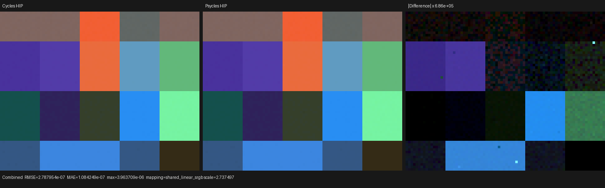
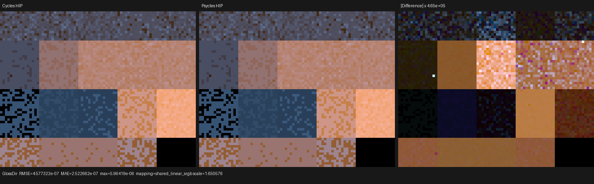
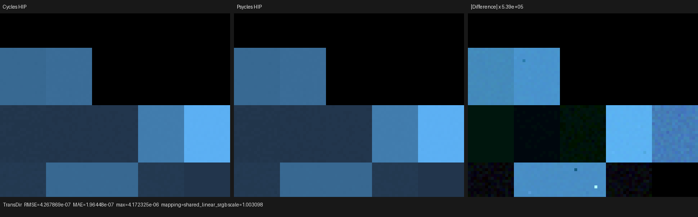
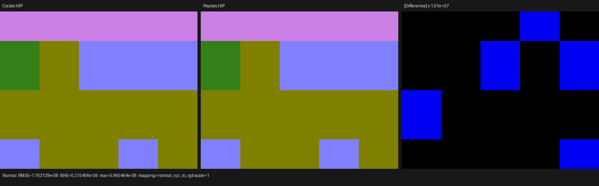
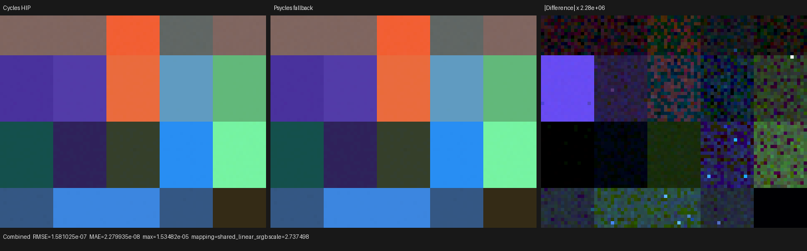
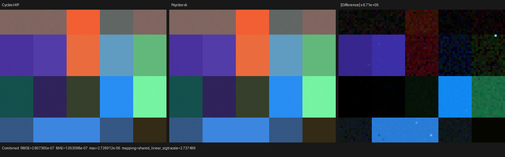

# HIP closure-family dispatch and profiler validation

## Outcome

`principled_thin_wall_surface` exposed a HIP execution failure in the
production path kernel. An 80x64, one-sample dispatch remained active for more
than five minutes even though the same image takes milliseconds on the other
Luisa paths. The device was not mis-selected: both the Luisa log and ROCm
reported the AMD Radeon RX 9070 XT (`gfx1201`, PCI `03:00.0`), and the process
held that device at 100% busy. Its roughly 120--131 W board power reflected a
stalled, low-throughput kernel rather than a fallback or CPU run.

The repair makes the mutually exclusive physical closure families explicit in
the generated Luisa program. The same full-frame, one-sample HIP dispatch now
finishes in 1.945 ms, and `rocprofv3` measures `kernel_main` itself at
414.523 us. The 16-spp render takes 6.716 ms and remains numerically aligned
with the Cycles HIP oracle.

This change does not introduce manual wavefront queues or path-state machines.
The renderer remains the existing fused Luisa path program. If later profiling
justifies wavefront scheduling, the implementation boundary is Luisa GPU
coroutines.

## Isolation procedure

The original full-frame run used the official ROCm 7.2.4 profiler:

```text
rocprofv3 --runtime-trace --scratch-memory-trace --stats --summary \
  --output-format csv json -- \
  psycles_render_blender_scene export output.ppm hip 80 64 1
```

The trace established the following facts.

1. Every HIPRT geometry/scene build and copy kernel completed in microseconds.
2. `kernel_main` correlation 710 was still active when the run was interrupted
   after five minutes; an active kernel is not emitted into the completed
   kernel table.
3. A control pixel without a linked closure normal completed in about 0.25 ms
   under profiling.
4. Pixels `(8,40)` and `(8,56)`, `(24,56)`, `(40,56)`, `(56,56)`, `(72,56)`
   all reproduced the failure. Their common semantic property is a raw linked
   Principled Normal, across Glass and Rough Translucent closure families.
5. `max_bounces=0` still reproduced it, excluding continuation rays and
   self-intersection handling.
6. Removing analytic lights or selecting forward-only lighting made the same
   pixel complete in about 1.2--1.6 ms, so NEE was necessary.
7. Keeping the lights while excluding diffuse, glossy, and transmission
   visibility still reproduced it. The shadow branch was therefore not
   necessary; sampled-light closure evaluation itself was.
8. Running closure trace and runtime-flag evaluation without NEE completed,
   excluding material setup and the pre-NEE visitor as independent causes.

The raw completed-kernel and scratch records are retained in
[`profiler`](profiler/). The `before` kernel table intentionally lacks
`kernel_main`, because it never completed. The `after` trace contains the
full-frame 5,120-thread dispatch.

## Formal cause and repair

A `SurfaceClosureRecord` has one member of the following disjoint sum type:

```text
Transparent
| Diffuse / Translucent / RoughTranslucent / Sheen / BSSRDF
| MicrofacetReflection
| Glass / Refraction
| ThinGlassTransmission
```

The previous evaluator expressed the sum entirely with device `select`
operations. `select` is eager in the Luisa IR, so every record executed
Oren-Nayar, sheen, reflection microfacet, refractive Jacobian, and thin-glass
math before discarding all but one family. That formulation is algebraically
valid only if every inactive expression is total, and it unnecessarily makes
unrelated family temporaries live together. In the production HIP callable,
the linked-normal NEE path crossed a compiler/execution cliff and failed to
make progress.

The evaluator now performs device-side structured dispatch over the disjoint
physical-kind partition. Each branch defines only its own value, directional
PDF, event, and pass contribution. The outer ordered fold is unchanged:

```text
F = sum_i F_i
P = sum_i s_i p_i / sum_i s_i
```

Light visibility policy still projects `F_i` without removing otherwise
eligible `s_i p_i` terms, selected transmission still skips only Cycles'
event-level post-sample bump correction, and the allocation order remains the
Cycles order. There is no material-name, probe-cell, or normal-value special
case.

Static resource metadata alone did not explain the failure:

| HIP code object | Private bytes | SGPR | SGPR spills | VGPR | VGPR spills |
| --- | ---: | ---: | ---: | ---: | ---: |
| eager evaluator | 5,152 | 108 | 127 | 256 | 846 |
| family dispatch | 5,164 | 108 | 127 | 256 | 1,031 |

The fixed object still reaches the architectural VGPR limit and even reports
more static spills, yet its full dispatch takes 0.415 ms. This is why the
result is recorded as an eager inactive-family execution failure rather than
the weaker claim that register spilling alone caused the non-termination.
Cold compilation also remains essentially unchanged: the fixed probe took
10.311 s in HIP LLVM code generation and 23.038 s in final bitcode linking.
That compiler cost remains a separate optimization target.

## Runtime comparison

All entries below use the same 80x64 raw-closure probe on the same RX 9070 XT.
They exclude scene export. The Cycles row is Blender 5.3 Alpha's recorded HIP
render interval; the Psycles rows are renderer-reported sample intervals.

| Run | Samples | Render interval | Result |
| --- | ---: | ---: | --- |
| Cycles HIP | 16 | 58.901 ms | oracle |
| Psycles HIP before | 1 | >300,000 ms | interrupted, active kernel |
| Psycles HIP after | 1 | 1.945 ms | complete |
| Psycles HIP after | 16 | 6.716 ms | complete, 8.77x probe speedup |

The 8.77x number is useful only for this tiny material matrix; it is not a
claim about Lone Monk, Classroom, Barbershop, or another complete scene.

The same post-fix 16-spp image also completes on fallback and Vulkan:

| Psycles backend | Cold JIT | Render | Combined ratio | Combined relative RMSE |
| --- | ---: | ---: | ---: | ---: |
| fallback | 15.916 s | 18.435 ms | 1.00000010 | 1.3421e-6 |
| HIP | 34.746 s | 6.716 ms | 1.00000094 | 2.3667e-6 |
| Vulkan | 67.153 s | 28.903 ms | 0.99999916 | 2.3831e-6 |

The Vulkan log identifies 24.18 s between DXC startup and completion of the
`937136 -> 887273`-word SPIR-V optimization, followed by roughly 42.6 s in the
remaining translation/pipeline interval. Thus Vulkan's cold delay is not host
C++ compilation and not render execution; native shader optimization plus
downstream pipeline creation dominate this probe.

## Cycles differential

The 16-spp run uses the same seed-zero Tabulated Sobol sequence, Box filter,
two delta suns, original closure graphs, and unmodified Cycles HIP golden.
Selected pass metrics are:

| Pass | Mean-luminance ratio | Relative RMSE | Maximum absolute error |
| --- | ---: | ---: | ---: |
| Combined | 1.00000094 | 2.3667e-6 | 3.9637e-6 |
| Diffuse Direct | 0.99999983 | 4.2821e-7 | 7.7784e-6 |
| Glossy Direct | 1.00000225 | 2.9822e-6 | 5.9642e-6 |
| Transmission Direct | 1.00000153 | 2.3432e-6 | 4.1723e-6 |
| Diffuse Color | 1.00000000 | 0 | 0 |
| Glossy Color | 1.00000000 | 2.3831e-7 | 5.9605e-8 |
| Transmission Color | 1.00000000 | 1.3655e-7 | 2.9802e-7 |
| Normal | 1.00000000 | 3.0538e-8 | 5.9605e-8 |

The complete machine-readable results are retained for
[`fallback`](reports/fallback-vs-cycles-hip-16spp.json),
[`HIP`](reports/hip-vs-cycles-hip-16spp.json), and
[`Vulkan`](reports/vk-vs-cycles-hip-16spp.json).
The probe runner now has strict energy and relative-RMSE gates for this scene,
including a negative regression carrying the former selected-transmission
bump-shadowing result.

## Visual inspection

All four retained triptychs were opened at original resolution. The Cycles HIP
panel is left, Psycles HIP is center, and amplified absolute difference is
right. Reference and actual have the same cell boundaries, reflection and
transmission lobe placement, linked-normal orientation, and color response.
No coherent shifted lobe, missing cell, normal rotation, or energy block is
visible. The Combined difference requires approximately `6.86e5` amplification
and consists of floating-point tails rather than a structured image error.









The fallback and Vulkan Combined panels were inspected independently and show
the same cell registration and lobe placement. Their difference panels also
contain only amplified floating-point tails.





## Regression coverage

`test_luisa_surface_nee_normal` compiles and executes the production path
kernel with a raw linked Principled Normal and analytic NEE. Its 180-second
CTest timeout makes the former non-termination a test failure instead of a
hung suite. The focused matrix passed on fallback, HIP, and Vulkan; the first
cache-cold HIP and Vulkan runs took 15.85 s and 13.79 s respectively, including
JIT.

`test_luisa_surface_closure_collection` independently checks the complete
closure-family algebra and ordered mixture on fallback and HIP in this run.
The image probe supplies the Cycles-only quantitative oracle; the production
fixture supplies the liveness boundary that the smaller callable test could
not reproduce.
