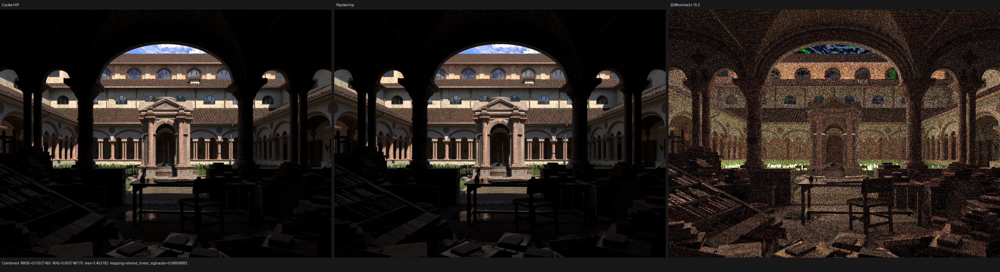
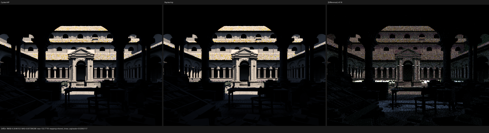
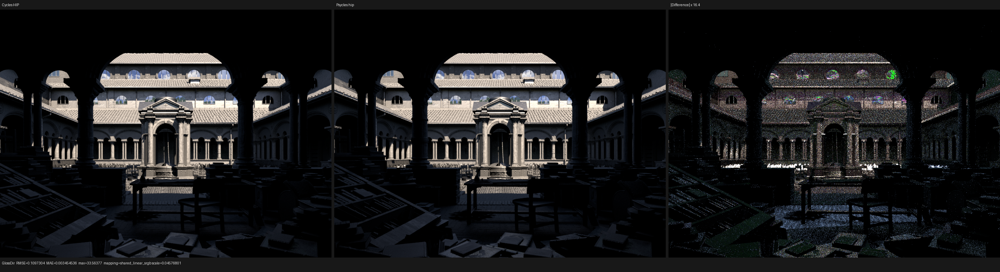

# Lone Monk background-Sun sampling validation

## Outcome

Psycles `main@9ac8bab` now maps a guided Nishita-Sun sample to the same
world-space direction as current Cycles. The old implementation had the right
uniform solid-angle density, but paired each two-dimensional Sobol sample with
a different point on the solar disc. That statistical equivalence was not
enough for path-by-path alignment: Nishita radiance changes rapidly across the
disc.

At film coordinate `(491, 221)`, sample zero, the first NEE Sun-direction
error falls from `0.776416` degrees to approximately `0.0000034` degrees. The
remaining difference is one float32 ULP in `x`; `y` and `z` are identical.
The sampled sky-radiance maximum relative error falls from `23.21%` to
`0.0283%`.

The repair is a shared sampling relation, not a Lone Monk or Nishita special
case. Background guidance now uses the existing Cycles-compatible concentric
disk, cone-radius remapping, and orthonormal-frame primitives also used by
finite analytic lights. Sampling and forward PDF evaluation share the same
small-angle cone measure and stable membership predicate.

## Oracle and scene identity

The only rendering oracle is Blender/Cycles 5.3 Alpha at
`82186b01ad2e79435e67a02de93b178bfbe0f6c4`. LuisaCompute is
`next@3e63df0c6619641b91265d940136d7041dfc262e`.

The official source scene is
`lone-monk_cycles_and_exposure-node_demo.blend`, SHA-256
`4250d4205d8d01cefd98c15e81021d6dead540b2923797378bf7b32e96e8b8f7`.
The immutable raw-closure export has `scene.json` SHA-256
`4950168bab77e263f143dac8017c2f74158524b10eb1a6fbdffea60efc35afb9`
and `geometry.bin` SHA-256
`28197f9a46e1120f69362fec72695ee0555e254a7cc14a8342fc73a43e4e1bd7`.
No material, environment, or closure result is baked by Blender/Cycles.

## Formal sampling relation

The path trace first ruled out RNG and emitter-selection differences. Both
renderers consume exactly

```text
light selection = 0.5536014437675476
light u         = 0.6973861455917358
light v         = 0.4494679570198059
emitter         = environment 6
selection PDF   = 0.5
```

The world uses map/Sun method weights `1:4`, so the Sun branch has probability
`0.8` and remaps the first coordinate by `u / 0.8`. The old Psycles sampler
then interpreted the pair directly as polar cap coordinates and constructed
an arbitrary cross-product frame. This preserved the marginal distribution
and PDF but not the deterministic Sobol-to-direction relation.

Current Cycles instead establishes the following relation for cone axis `N`,
sample `xi`, and `h = 1 - cos(radius)`:

1. map `xi` from the unit square to a unit disk with the concentric,
   measure-preserving map;
2. let `r2` be the squared disk radius and set `cos(theta) = 1 - r2 * h`;
3. scale the disk coordinates by `sqrt(h * (2 - h * r2))`;
4. orient them with Cycles' canonical algebraic orthonormal basis around `N`;
5. do not renormalize the final direction; and
6. evaluate the conditional PDF as `1 / (2 pi h)` only when the stable angle
   `2 atan2(length(N-D), length(N+D))` is strictly smaller than the radius.

For angles no larger than `0.02`, Cycles defines `h` with the second-order
relation `0.5 * radius * radius`; larger angles use `1 - cos(radius)`. Psycles
previously used an independently stable half-angle identity. Both are sound
numerically, but their small difference changed the PDF and sample radius.
Sampling and evaluation now use the same Cycles relation.

The stable angle implementation was also moved into shared spherical geometry
and reused by Nishita disc evaluation, eliminating two independently evolving
copies of the same contract.

## Exact path result

The fixed real-scene event compares as follows:

| Quantity | Cycles HIP | Psycles before | Psycles after |
| --- | ---: | ---: | ---: |
| Direction `x` | 0.3057665825 | 0.2931776345 | 0.3057665229 |
| Direction `y` | -0.5236938000 | -0.5232808590 | -0.5236938000 |
| Direction `z` | 0.7951425314 | 0.8001400232 | 0.7951425314 |
| Direction angular error | - | 0.776416 degrees | 0.0000034 degrees |
| Total light PDF | 1671.975586 | 1671.985352 | 1671.975464 |
| PDF absolute error | - | 0.009766 | 0.000122 |
| Sky-radiance maximum relative error | - | 23.21% | 0.0283% |
| Unshadowed NEE maximum relative error | - | 22.65% | 0.1683% |

The retained machine-readable comparison is
[exact-path-491-221-s0.json](reports/exact-path-491-221-s0.json). It still
reports unrelated continuous numerical mismatches and the already-known
infinity/trace-identity differences; this checkpoint claims the background
proposal relation, not whole-path bit identity.

## 960x720, 512-spp image result

Both renderers use fixed 512 spp, seed zero, Tabulated Sobol, no adaptive
sampling, and no denoising on the Radeon RX 9070 XT. The table compares the
previous muted-node checkpoint with the new background-Sun checkpoint against
fresh Cycles HIP output.

| Pass / metric | Before | After | Change |
| --- | ---: | ---: | ---: |
| Combined relative RMSE | 0.01599525 | 0.01220332 | 1.31x lower |
| Combined RMSE | 0.02526372 | 0.01927455 | 1.31x lower |
| Combined mean absolute error | 0.00649633 | 0.00374817 | 1.73x lower |
| Diffuse Direct relative RMSE | 0.05336544 | 0.02920859 | 1.83x lower |
| Diffuse Direct mean absolute error | 0.03639598 | 0.00739630 | 4.92x lower |
| Diffuse Indirect relative RMSE | 0.20375346 | 0.17972240 | 1.13x lower |
| Glossy Direct relative RMSE | 0.03081075 | 0.02608037 | 1.18x lower |
| Glossy Direct mean absolute error | 0.01172009 | 0.00345454 | 3.39x lower |
| Glossy Indirect relative RMSE | 0.13966421 | 0.12351214 | 1.13x lower |
| Diffuse Color relative RMSE | 0.00105617 | 0.00105617 | unchanged |

All compared passes contain zero invalid pixels. The unchanged Diffuse Color
result is an important negative control: the repair changes light-proposal
placement, not material or texture evaluation. The full linear-pass report is
[hip-512-vs-cycles-hip.json](reports/hip-512-vs-cycles-hip.json), and the
complete benchmark manifest is
[hip-512-benchmark.json](reports/hip-512-benchmark.json).

## Visual inspection

All panels were inspected at their original `2896x790` resolution. The
Combined images are structurally aligned: architecture, book piles, grass,
trees, roof tiles, sky, and shadow boundaries occupy the same locations, with
no new coherent brightness or texture residual. Compared with the previous
checkpoint, the strong direct-light outlines are substantially reduced. The
remaining amplified difference is predominantly fine-grained Monte Carlo
residual plus already-known closure/normal numerical differences.



The direct diffuse pass shows the expected largest improvement. Its
difference panel uses an `8.16x` amplification because the 99.5th-percentile
error became much smaller; despite the larger display amplification, the
reference and actual panels visually align across the sunlit facade, roof,
columns, foreground furniture, and vegetation.



Glossy Direct is likewise structurally aligned. The remaining strongest
residuals follow high-energy roof/window highlights and thin geometry rather
than forming a displaced solar-light pattern.



## Performance and verification

Render-only times are `17.6461 s` for Cycles HIP and `82.3357 s` for Psycles
HIP, so Psycles is currently `4.666x` slower on the same RX 9070 XT. The prior
Psycles time was `82.3635 s`; the `0.03%` difference is noise, so this
correctness repair has no measurable render-throughput cost. The changed
shader incurred a one-time cold JIT of `101.689 s`; subsequent runs use the
cache.

Verification completed with:

```text
cmake --build build --parallel 32
ctest --test-dir build --output-on-failure --parallel 32
```

All `215/215` tests passed. The real Cycles path oracle is embedded into
`test_luisa_background_sampling.cpp` and passes on fallback, HIP, and Vulkan;
it locks mixture remapping, concentric disk placement, canonical basis,
small-angle measure, direction, and conditional PDF.

