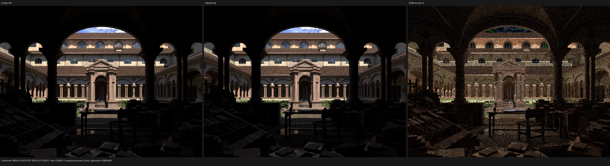
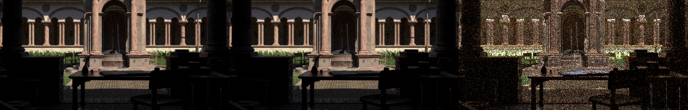
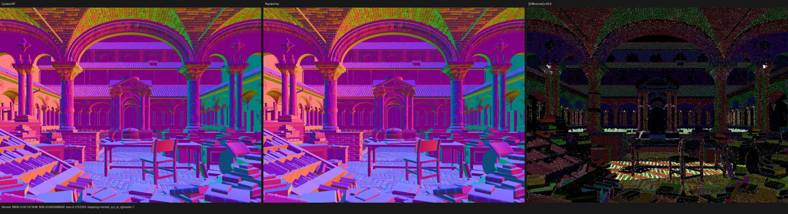
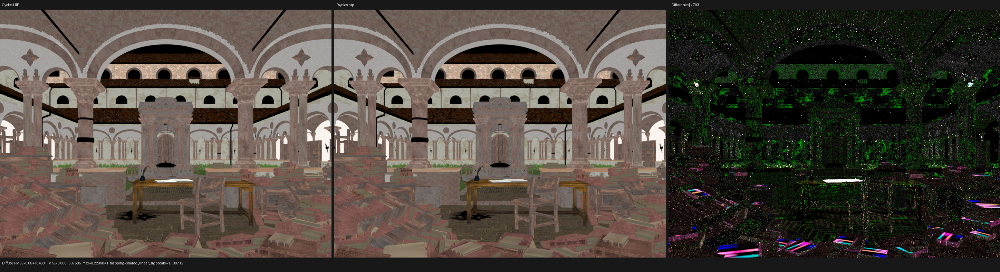

# Lone Monk current-head five-way validation

## Outcome

The unmodified official Lone Monk scene now completes at 960x720, 128 spp on
Cycles CPU/HIP and Psycles fallback/HIP/Vulkan from one fresh export. The
current Psycles images are structurally aligned with Cycles: the courtyard
grass coverage, fine silhouettes, geometry, texture placement, data passes,
and direct-light structure agree by visual inspection. This replaces the old
640x480 checkpoint in which the grass still looked visibly different.

This is not a claim of finite-sample 1:1 parity. Psycles HIP versus Cycles HIP
has 2.619% Combined relative RMSE, while Cycles CPU versus Cycles HIP already
has 1.158% at the same 128 spp. The remaining Psycles residual is concentrated
in uncorrelated indirect transport; the mean radiance and data passes are much
closer. A higher-spp convergence run remains required before the indirect
passes can be promoted as final quality parity.

The image gate is therefore structurally successful, but the performance gate
is red. Render-only Psycles HIP is 4.09x slower than Cycles HIP, fallback is
9.86x slower than Cycles CPU, and Vulkan is 103.54x slower than Cycles HIP.
Vulkan additionally needs 19.56 minutes for a cache-cold path-shader JIT.

## Asset, oracle, and export contract

The source is the unmodified official
`lone-monk_cycles_and_exposure-node_demo.blend`, SHA-256
`4250d4205d8d01cefd98c15e81021d6dead540b2923797378bf7b32e96e8b8f7`.
Blender 5.3 Alpha `82186b01ad2e` and its Cycles CPU/HIP kernels are the only
rendering oracle.

The fresh current-head export contains:

- 348 mesh geometries and no curve geometries;
- 87,534 evaluated instances;
- 35 source materials and 37 effective compiled material variants; and
- 47 original images.

Blender exports the original node graphs, links, socket values, image data,
attributes, and evaluated scene geometry. Psycles traces those typed graphs
into Luisa DSL. No material, closure, lighting, or texture result is baked by
Blender or Cycles.

The source file enables adaptive sampling and denoising for its normal UI
render. The benchmark deliberately overrides Cycles to a fixed 128 samples
and disables adaptive sampling and denoising; Psycles writes the corresponding
un-denoised linear passes. Both use the scene seed and Tabulated Sobol sample
identity. The maximum Psycles submission is four samples per dispatch.

The scene authors `use_light_tree=false`. The renderer's light-tree path is
therefore host-specialized out of this render, so neither the measured image
nor the render-time regression can be attributed to selected light-tree
traversal.

## Five-way performance

All primary timings are renderer-reported render intervals. They exclude
scene export, scene compilation, and shader JIT.

| Renderer/backend | Render time | Versus Cycles HIP | Versus Cycles CPU |
| --- | ---: | ---: | ---: |
| Cycles CPU, Ryzen 9 9950X3D | 17.382 s | 3.45x slower | 1.00x |
| Cycles HIP, RX 9070 XT | 5.033 s | 1.00x | 3.45x faster |
| Psycles fallback, Ryzen 9 9950X3D | 171.306 s | 34.04x slower | 9.86x slower |
| Psycles HIP, RX 9070 XT | 20.606 s | 4.09x slower | 1.19x slower |
| Psycles Vulkan, RX 9070 XT | 521.130 s | 103.54x slower | 29.98x slower |

Process and compile boundaries are retained separately:

| Psycles backend | Scene compile | Cache-cold shader JIT | Process wall |
| --- | ---: | ---: | ---: |
| fallback | 2.078 s | 207.306 s | 381.327 s |
| HIP | 4.811 s | 100.147 s | 126.198 s |
| Vulkan | 1.976 s | 1,173.670 s | 1,697.853 s |

The fallback path shader contains 257,385 LLVM instructions. It selects
Luisa's bounded O0 IR/O1 machine-code policy above the 250,000-instruction
limit, but code generation is still single-threaded and took 207.3 seconds;
the later Embree render used 32 threads.

HIP LLVM-to-AMDGPU code generation took 27.859 seconds and produced 4.49 MB of
device code. ROCm bitcode linking took another 66.082 seconds and produced a
6.69 MB code object. The 100.1-second cold JIT, rather than the 32-thread host
build, explains most HIP process startup.

Vulkan generated 3,336,939 SPIR-V words; the compute optimizer reduced this to
2,967,277 words, or an 11.88 MB cached module with 36 bindings. DXC and SPIR-V
generation occupied roughly four minutes. Mandatory RADV NIR/ACO lowering,
liveness, and register allocation consumed the rest of the 19.56-minute JIT
and peaked at approximately 38.1 GiB RSS even though optional driver
optimization is already disabled for the monolithic path shader. The formal
fix is to reduce and modularize the generated shader while retaining the raw
closure graph, not to disable nodes, pre-bake materials, or reduce precision.

## Numerical comparison

Every row uses Cycles HIP as the reference at 960x720, 128 spp. The first row
is the same-scene Cycles CPU/HIP device baseline.

| Actual renderer | Combined relative RMSE | Combined luminance ratio | Normal relative RMSE | Diffuse Color relative RMSE | Glossy Color relative RMSE |
| --- | ---: | ---: | ---: | ---: | ---: |
| Cycles CPU | 0.011581 | 0.999934 | 0.001516 | 0.000862 | 0.000384 |
| Psycles fallback | 0.024783 | 1.000388 | 0.002406 | 0.021662 | 0.001004 |
| Psycles HIP | 0.026193 | 1.001109 | 0.002678 | 0.021666 | 0.001091 |
| Psycles Vulkan | 0.025819 | 1.000972 | 0.002750 | 0.021665 | 0.001125 |

No output contains invalid pixels. Emission relative RMSE is below 0.001 for
all three Psycles backends. The scene has no volume domain, so Cycles and
Psycles Volume Direct and Volume Indirect are identically zero; Lone Monk is
not evidence for volume-rendering parity.

Direct transport is substantially closer than indirect transport:

| Psycles backend | Diffuse Direct | Glossy Direct | Diffuse Indirect | Glossy Indirect |
| --- | ---: | ---: | ---: | ---: |
| fallback | 0.050163 | 0.031822 | 0.271081 | 0.251876 |
| HIP | 0.052820 | 0.037226 | 0.247579 | 0.252299 |
| Vulkan | 0.053402 | 0.035165 | 0.240722 | 0.252094 |

At this sample count, the Cycles CPU/HIP baseline is already 0.162782 for
Diffuse Indirect and 0.187083 for Glossy Indirect. The close mean-radiance
ratios, noisy spatial residual, and backend-to-backend agreement make
finite-sample path decorrelation the leading explanation, but they do not
prove it is the only one. The next quality experiment must measure convergence
against higher-spp Cycles, not dismiss the residual as floating-point noise.

Psycles fallback versus Psycles HIP has 0.009576 Combined relative RMSE and a
0.999280 luminance ratio. Vulkan versus HIP has 0.008896 Combined relative
RMSE and a 0.999863 luminance ratio. This rules out a large backend-specific
material or geometry error in the current images.

The exact manifest and full pass reports are retained under
[reports](reports/).

## Visual inspection

The Combined, Normal, and Diffuse Color triptychs were opened at original
resolution. The reference and Psycles panels have matching orientation,
camera crop, arch and roof transforms, texture placement, object silhouettes,
and courtyard vegetation coverage. In particular, individual grass clumps
occupy the same image regions and no backend fills or removes the old fine
grass gaps. The 4x Combined difference is high-frequency and sample-like,
rather than a coherent displaced or missing grass layer.

The Normal panels are visually indistinguishable at normal display scale;
their residual needs about 96x amplification. Diffuse Color needs about 703x
amplification, and its main panels retain the same stone, roof, wood, book,
and grass colors. The remaining Combined difference is strongest in indirect
and high-energy direct samples, consistent with the pass metrics above.

The grass inspection below crops the corresponding Cycles HIP, Psycles HIP,
and 4x difference panels without resampling:

## Current verdict and next gates

- **Functional rendering:** all five matrix entries complete from the same
  source scene and fresh raw-graph export.
- **Structural image alignment:** passes at this checkpoint, including the
  previously disputed grass. No transform, UV, missing-geometry, or
  diffuse-material substitution is visible.
- **Finite-sample transport parity:** not final. Higher-spp indirect
  convergence and path-trace scheduling comparison remain required.
- **Performance:** fails decisively on all three Psycles backends, especially
  Vulkan. The next performance work must separately address exact traversal
  cost and the monolithic generated shader.
- **Other complex scenes:** Monster has its own current-head five-way
  checkpoint. Classroom, Barbershop, and Blender 4.1 Splash still need fresh
  current-head five-way reruns before their historical results can be
  promoted.
