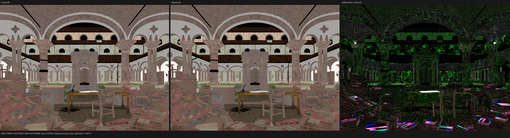
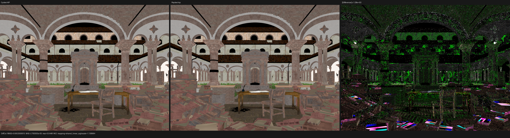
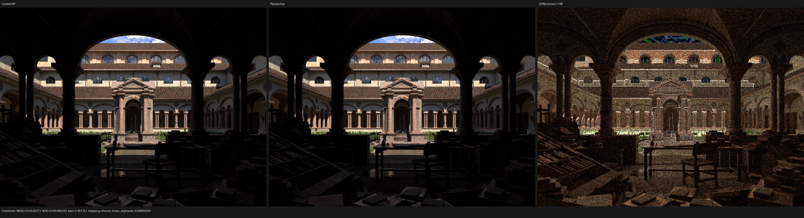
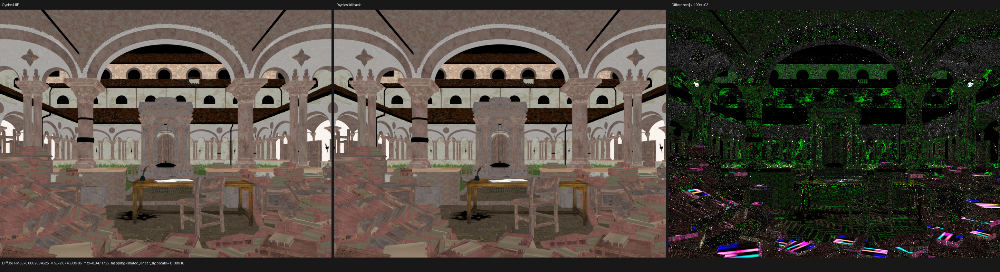

# Lone Monk muted-node bypass validation

## Outcome

The stable Diffuse Color residual on Lone Monk was a real shader-graph defect,
not a UV, transform, intersection, random-number, or finite-sample artifact.
Blender marks `paper - page / Mix.001` as muted and exposes the runtime
internal link `A_Color -> Result_Color`. The old Psycles scene contract omitted
both facts, so Psycles evaluated a 50% Mix whose second branch Cycles never
evaluated.

Psycles `main@d5c7730` now exports Blender's mute state and internal links and
normalizes every muted node with the same graph relation used by current
Cycles. This is a graph-wide rule; there is no Mix-node or Lone-Monk special
case. Blender/Cycles still exports no pre-baked shader result: the original
nodes, sockets, links, images, and closure roots are traced into Luisa DSL.

At 960x720 and 512 fixed spp, the repair reduces Diffuse Color RMSE from
`0.0041055018` to `0.0002000815`, a 20.52x reduction. The coherent white
book-page residual visible in the old triptych is gone. The whole Combined
relative RMSE moves from `0.01604152` to `0.01599525`; this one material covers
only a small part of the frame, so the expected Combined change is modest.

## Oracle, asset, and export

The sole rendering oracle is Blender/Cycles 5.3 Alpha
`82186b01ad2e79435e67a02de93b178bfbe0f6c4`. The unmodified official source is
`lone-monk_cycles_and_exposure-node_demo.blend`, SHA-256
`4250d4205d8d01cefd98c15e81021d6dead540b2923797378bf7b32e96e8b8f7`.
LuisaCompute is `next@3e63df0c6619641b91265d940136d7041dfc262e`.

The fresh `psycles.blender-scene.v2` export contains 348 meshes, no curve
geometries, 87,534 evaluated instances, 35 source materials, and 47 original
images. Its `scene.json` SHA-256 is
`4950168bab77e263f143dac8017c2f74158524b10eb1a6fbdffea60efc35afb9`; its
`geometry.bin` SHA-256 is
`28197f9a46e1120f69362fec72695ee0555e254a7cc14a8342fc73a43e4e1bd7`.

The export contains one muted source node:

```text
material:       paper - page
node:           Mix.001
type:           MIX
internal link:  A_Color -> Result_Color
```

## Formal graph semantics

Current Cycles `add_nodes_inlined()` establishes the reference relation:

1. a muted node's concrete implementation is absent from the shader graph;
2. each runtime internal link is represented by a proxy whose input and output
   both have the destination output socket's type;
3. ordinary links that are invalid, explicitly muted, or touch unavailable
   sockets are absent;
4. a proxy with no incoming external link has the zero value of its output
   type; and
5. a muted output with no internal proxy is absent from the output map, so a
   downstream input retains its own default.

The Psycles normalizer now applies those rules before node-specific lowering.
Only the internal-link source reachable from the requested output is lowered;
the concrete muted node and every dead input branch remain outside the typed
topology and the generated Luisa AST. Normal implicit conversion is performed
at the same-type proxy boundary. This preserves the raw closure graph while
making dead-code elimination a consequence of graph reachability rather than
an ad hoc shader patch.

The exporter also removes invalid, muted, and unavailable-socket links before
serialization, matching the same Cycles graph-construction boundary.

## Exact path proof

The diagnostic pixel is film coordinate `(491, 221)`, sample zero. Both
renderers hit instance 25 (`bookOPEN.001`), global triangle 78,590, and shader
index 24 (`paper - page`). Reconstructing the interpolated UV from the exported
triangle and barycentrics gives the same point: Cycles reports approximately
`(0.30355475, 0.67255406)` and Psycles
`(0.30355443, 0.67255627)`. The first-event surface-normal error is below
`2.2e-5`. These checks reject the transform, handedness, triangle-order, and UV
hypotheses before changing shader code.

The first diffuse closure weight proves the shader-topology repair directly:

| Channel | Cycles HIP | Psycles before | Absolute error before | Psycles after | Absolute error after |
| --- | ---: | ---: | ---: | ---: | ---: |
| R | 0.787287235 | 0.625551701 | 0.161735535 | 0.788204730 | 0.000917494 |
| G | 0.788939297 | 0.617413998 | 0.171525300 | 0.789846063 | 0.000906765 |
| B | 0.758422852 | 0.577856123 | 0.180566728 | 0.759527504 | 0.001104653 |

The old 50% Mix output can be reconstructed numerically from the exported
live and dead branches, including the following Hue/Saturation node, and
matches the old Psycles closure. After bypassing `Mix.001`, the remaining
roughly 0.1% closure-weight residual is continuous numerical disagreement;
the full path trace is not claimed exact. The machine-readable comparison is
retained as [exact-path-491-221-s0.json](reports/exact-path-491-221-s0.json).

## 512-spp image comparison

The before and after columns compare Psycles HIP with Cycles HIP at 960x720,
512 fixed spp, seed zero, no adaptive sampling, and no denoising.

| Pass / metric | Before | After | Change |
| --- | ---: | ---: | ---: |
| Combined relative RMSE | 0.01604152 | 0.01599525 | 1.003x lower |
| Combined mean absolute error | 0.00653700 | 0.00649633 | 1.006x lower |
| Diffuse Color relative RMSE | 0.02167180 | 0.00105617 | 20.52x lower |
| Diffuse Color RMSE | 0.00410550 | 0.00020008 | 20.52x lower |
| Diffuse Color mean absolute error | 0.00015085 | 0.00002783 | 5.42x lower |
| Diffuse Color maximum absolute error | 0.22703600 | 0.04491402 | 5.05x lower |
| Diffuse Color luminance ratio | 0.99915833 | 0.99997146 | closer to one |

The complete after-fix pass report is
[hip-512-vs-cycles-hip.json](reports/hip-512-vs-cycles-hip.json). No compared
pass contains an invalid pixel.

The old Diffuse Color triptych has a coherent white residual on the open book
at the center table. It remains visible even though the absolute-difference
panel is scaled by more than 1,000x:



After the repair, that residual is absent. The Cycles and Psycles book pages,
architecture, vegetation, wood, and scattered books agree at original display
scale. The remaining amplified difference is fine texture-edge variation; the
panel needs 1,284.9x amplification:



The Combined panels were also opened at original resolution. Camera framing,
silhouettes, page colors, stone, roof tiles, vegetation coverage, and dark
foreground structure agree. The difference is predominantly high-frequency
transport noise rather than a coherent material region:



## Performance boundary

The 512-spp render-only times are 17.6881 seconds for Cycles HIP and 82.3635
seconds for Psycles HIP, so Psycles remains 4.656x slower on the RX 9070 XT.
The old graph rendered in 82.5099 seconds; the difference is noise, not a
performance regression from graph bypassing. The cache-cold changed shader
needed 101.033 seconds of HIP JIT and 4.602 seconds of scene compilation;
those stages are excluded from the render-only ratio.

The canonical 960x720x128 five-way matrix also completes from the same fresh
export:

| Renderer/backend | Render time | Versus Cycles HIP | Versus Cycles CPU |
| --- | ---: | ---: | ---: |
| Cycles CPU, Ryzen 9 9950X3D | 17.1669 s | 3.416x slower | 1.00x |
| Cycles HIP, RX 9070 XT | 5.0259 s | 1.00x | 3.416x faster |
| Psycles fallback, Ryzen 9 9950X3D | 172.660 s | 34.354x slower | 10.058x slower |
| Psycles HIP, RX 9070 XT | 20.589 s | 4.097x slower | 1.199x slower |
| Psycles Vulkan, RX 9070 XT | 520.749 s | 103.613x slower | 30.335x slower |

The changed HIP shader was already warm from the 512-spp gate. The other
compile-stage boundaries are:

| Psycles backend | Scene compile | Shader JIT | Process wall |
| --- | ---: | ---: | ---: |
| fallback | 1.915 s | 208.554 s, cold | 383.807 s |
| HIP | 4.619 s | 0.509 s, warm | 26.325 s |
| Vulkan | 1.938 s | 1,185.200 s, cold | 1,709.112 s |

The fallback path kernel has 257,360 LLVM instructions, 25 fewer than the old
graph. Vulkan's optimized module has 2,966,837 SPIR-V words, 440 fewer than
the old graph. The bypass therefore does not explain the existing compile or
render performance gaps.

On this cold Vulkan run, Luisa/XIR/DXC/SPIR-V generation completed after
approximately 243 seconds. RADV NIR/ACO pipeline compilation occupied about
the remaining 942 seconds of the 1,185-second JIT and peaked near 36 GiB RSS.
The long Vulkan compile is primarily a driver-lowering problem for the
monolithic shader, not a C++ build or SPIR-V generation delay.

## Five-way numerical and visual gate

Every row below uses Cycles HIP as the 960x720x128 reference. The Cycles CPU
row is the same-scene device baseline.

| Actual renderer | Combined relative RMSE | Combined luminance ratio | Normal relative RMSE | Diffuse Color relative RMSE |
| --- | ---: | ---: | ---: | ---: |
| Cycles CPU | 0.011582 | 0.999935 | 0.001516 | 0.000862 |
| Psycles fallback | 0.024750 | 1.000504 | 0.002406 | 0.001106 |
| Psycles HIP | 0.026161 | 1.001226 | 0.002678 | 0.001160 |
| Psycles Vulkan | 0.025787 | 1.001089 | 0.002750 | 0.001148 |

Before the repair, fallback, HIP, and Vulkan Diffuse Color relative RMSEs
were respectively `0.021662`, `0.021666`, and `0.021665`. They are now
18.7--19.6x lower, and all output passes contain zero invalid pixels. Combined
and transport-pass metrics remain inside the previous finite-sample range;
the repair removes one deterministic material residual without disguising the
still-open indirect-transport convergence problem.

The 128-spp fallback and Vulkan Diffuse Color triptychs were opened at original
resolution in addition to the 512-spp HIP images above. Both show the same
book-page repair and no backend-specific topology, UV, or color substitution.
Their difference panels require roughly 1,100x and 880x amplification:




The complete durable records are
[five-way-128.json](reports/five-way-128.json),
[cycles-cpu-vs-hip-128.json](reports/cycles-cpu-vs-hip-128.json),
[fallback-vs-cycles-hip-128.json](reports/fallback-vs-cycles-hip-128.json),
[hip-vs-cycles-hip-128.json](reports/hip-vs-cycles-hip-128.json), and
[vk-vs-cycles-hip-128.json](reports/vk-vs-cycles-hip-128.json).

## Regression gates

- `psycles.blender_export_muted_nodes` creates a real muted Blender Mix node
  and verifies that the exporter preserves its runtime internal link.
- `psycles.blender_muted_node` imports a raw graph with a live bypass branch
  and a deliberately unsupported dead branch. It proves that no Mix node or
  Mix instruction is emitted and that the dead branch is neither lowered nor
  diagnosed.
- `cmake --build build --parallel 32` completes with fallback, HIP, Vulkan,
  and OpenImageIO enabled.
- `ctest --test-dir build --output-on-failure --parallel 32` passes 215/215,
  including all registered fallback/HIP/Vulkan tests.
- Cycles CPU/HIP and Psycles fallback/HIP/Vulkan all complete the
  960x720x128 full-scene matrix from one export; HIP additionally completes
  the 960x720x512 quality gate.
