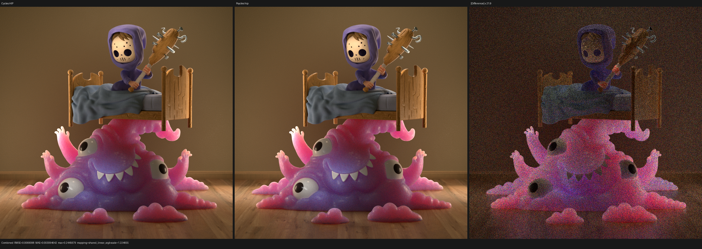
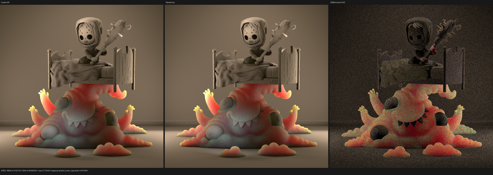
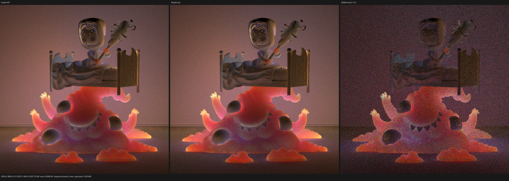
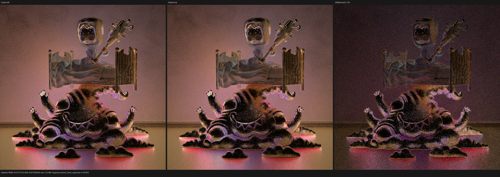
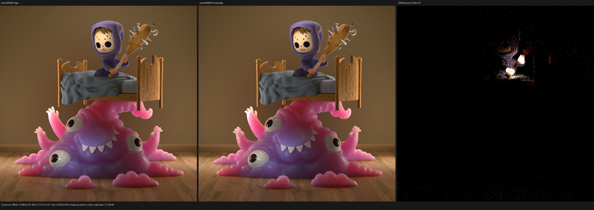

# Monster BSSRDF exit-normal validation

## Outcome

Psycles `main@fb69b15` constructs the synthetic diffuse closure at a BSSRDF
exit with the same closure-weighted normal as current Cycles. The old path
reused the ordinary exit `ShaderData::N`. That was geometrically valid, but it
was not the normal Cycles obtains by re-evaluating a bump-capable material and
reducing its retained BSSRDF closures. Follow-up `main@dc98dd0` preserves that
relation while specializing the exit-only shader dispatch to the exact set of
scene surface tags that can produce a BSSRDF. Current `main@8b688ec` tightens
that superset to Cycles' exact `SD_HAS_BSSRDF_BUMP` predicate: an unbumped
BSSRDF exit now skips graph evaluation and keeps `ShaderData::N`, while a
bump-capable exit still evaluates the original Luisa closure graph.

The repair is a material-independent closure reduction, not a Monster-shaped
patch. At film coordinate `(534, 374)`, sample zero of a 128-sample sequence,
the first semantic BSSRDF-exit event now agrees with Cycles HIP through the
closure normal, cosine-hemisphere sample, and following surface identity.
At 960x960 and 512 fixed samples, Combined relative RMSE falls from
`0.08272117` to `0.04890461` and the Combined mean-luminance ratio moves from
`1.00726634` to `1.00355265`.

At 960x960x512 the tighter predicate preserves the same Cycles differential:
Combined relative RMSE is `0.04890434` and the mean-luminance ratio is
`1.00355274`. Its primary measured benefit is cache-cold compilation: total
HIP shader JIT falls another 2.12% from `129.689 s` to `126.944 s`, or 5.38%
from the unfiltered exit callable. This is a substantial Monster transport
checkpoint, not a blanket claim that all remaining indirect Monte Carlo
differences are solved.

## Oracle and scene identity

The only rendering oracle is Blender/Cycles 5.3 Alpha at
`82186b01ad2e79435e67a02de93b178bfbe0f6c4`. LuisaCompute is
`next@3e63df0c6619641b91265d940136d7041dfc262e`.

The official source scene is
`monster_under_the_bed_sss_demo_by_metin_seven.blend`, SHA-256
`9463082f8d365ad8ae19c1ba86429deb3b532c5a2d0db0b9492c3c759f64d28d`.
The immutable raw-closure export has `scene.json` SHA-256
`d530583a73f8e0a310aa19d84e83e157ca95c93c5f56d1be789e291f6202ac12`
and `geometry.bin` SHA-256
`dcf25e4e63bb8e11ace4e639fbca0cf6eec6f862a8095b4e771a4b5e51274b15`.
No material, BSSRDF, normal, or closure result is baked by Blender/Cycles.

## Formal exit-closure relation

Current Cycles shades a bump-capable BSSRDF exit, retains the normal closure
allocation order and capacity, and reduces only BSSRDF closures. For retained
closure normal `N_i` and spectral weight `w_i`, the relation is

```text
S = sum(N_i * abs(average(w_i))) for retained BSSRDF closures i
N_exit = ShaderData::N             when S is exactly zero
N_exit = normalize(S)              otherwise
```

Cycles then discards the graph-produced closure array and creates exactly one
unit-weight Lambert closure with `N_exit`. The exact-zero predicate matters:
Psycles does not introduce an epsilon or a scene-dependent threshold.
Non-BSSRDF closures never contribute, but still participate in the shared
retained-closure allocation law.

Psycles represents this as `SurfaceBssrdfNormalVisitor`, which consumes the
original Luisa graph expressions while the material branch is recorded. The
result travels separately from `SurfacePoint::shading_normal` in
`SurfaceQuery::subsurface_normal`; the latter still owns intersection and ray
offset semantics. Sampling, direct-light evaluation, trace diagnostics, and
the synthetic closure normal all consume the same reduced normal.

The fallback/HIP/Vulkan regression builds two differently weighted BSSRDF
closures plus a strong non-BSSRDF closure, verifies the exact reduction and
zero-sum fallback, and checks the resulting unit Lambert evaluation, sample,
closure trace, and sample trace.

## Exact path result

Cycles records the exit in semantic event 2 because its separate subsurface
kernel leaves event 1 unused. Psycles performs the same local traversal in
its fused path loop and records the exit in event 1. Comparing those semantic
events gives:

| Quantity | Cycles HIP | Psycles before | Psycles after |
| --- | ---: | ---: | ---: |
| RNG offset | 48 | 48 | 48 |
| Direction random `u` | 0.6814339161 | 0.6814339161 | 0.6814339161 |
| Direction random `v` | 0.7971861959 | 0.7971861959 | 0.7971861959 |
| Exit normal `x` | 0.0699615106 | 0.0059145540 | 0.0699632838 |
| Exit normal `y` | -0.4471633434 | -0.5253249407 | -0.4471623302 |
| Exit normal `z` | 0.8917120695 | 0.8508811593 | 0.8917124271 |
| Outgoing `x` | 0.5856168866 | 0.53631353 | 0.5856180787 |
| Outgoing `y` | -0.1036300734 | -0.19453557 | -0.1036286056 |
| Outgoing `z` | 0.8039364815 | 0.82129395 | 0.8039357662 |
| Following object | 34 | different path | 34 |
| Following primitive | 952675 | different path | 952675 |

The post-fix differences are continuous HIP/HIPRT float differences. The
following hit distance is `0.69208217` in Cycles and `0.69208282` in Psycles;
there is no remaining path-topology divergence at this event.

The decoded machine evidence is retained as
[Cycles HIP](reports/exact-path-cycles-hip.json),
[Psycles before](reports/exact-path-psycles-before.json), and
[Psycles after](reports/exact-path-psycles-after.json). The generic trace
comparator intentionally does not hide the renderer-specific event-index
gap, so the table above aligns events by their explicit semantic state,
intersection, RNG offset, and closure operation.

## 960x960, 512-spp image result

Both renderers use seed zero, fixed Tabulated Sobol samples, no adaptive
sampling, and no denoising on the same Radeon RX 9070 XT. The before and after
runs use the same exported raw graph and geometry.

| Pass / metric | Before | After | Improvement |
| --- | ---: | ---: | ---: |
| Combined relative RMSE | 0.08272117 | 0.04890461 | 1.69x lower |
| Combined RMSE | 0.01168779 | 0.00690980 | 1.69x lower |
| Combined luminance ratio | 1.00726634 | 1.00355265 | closer to one |
| Diffuse Direct relative RMSE | 0.09158052 | 0.04844536 | 1.89x lower |
| Diffuse Indirect relative RMSE | 0.20816032 | 0.14674033 | 1.42x lower |
| Glossy Direct relative RMSE | 0.04789864 | 0.04789858 | unchanged control |
| Glossy Indirect relative RMSE | 0.35305310 | 0.26694744 | 1.32x lower |
| Diffuse Color relative RMSE | 0.00054742 | 0.00054742 | unchanged control |
| Normal relative RMSE | 0.00041160 | 0.00041160 | unchanged control |

All 921,600 pixels are valid in every compared pass. The unchanged material
color, normal, and direct-glossy controls support the diagnosis: this repair
changes the post-BSSRDF scattering frame, not exported textures, UVs,
geometry, or general surface shading.

The current report is
[hip-512-exact-tags-vs-cycles-hip.json](reports/hip-512-exact-tags-vs-cycles-hip.json)
and the complete command/timing manifest is
[hip-512-exact-tags-benchmark.json](reports/hip-512-exact-tags-benchmark.json).
The original unfiltered-callable report and manifest remain available as
[hip-512-vs-cycles-hip.json](reports/hip-512-vs-cycles-hip.json) and
[hip-512-benchmark.json](reports/hip-512-benchmark.json).

## Visual inspection

All four triptychs were inspected at their original `2896x1030` resolution.
The Combined Cycles and Psycles panels agree in silhouette, eye and tooth
placement, bed and blanket geometry, floor boards, material boundaries,
subsurface color distribution, and highlight placement. No coherent UV,
transform, texture, missing-geometry, or closure-family displacement remains.
The amplified difference is predominantly granular Monte Carlo residual,
strongest on the subsurface monster and high-energy indirect highlights.



Diffuse Direct is structurally aligned across the monster, child, bed, floor,
and background. Its remaining residual has sampling-noise texture rather than
a displaced lighting or normal pattern.



Diffuse Indirect shows the expected largest remaining low-frequency transport
noise on the BSSRDF object, but the reference and actual panels agree in
large-scale color and occlusion structure.



Glossy Indirect also remains noisy at 512 spp. Highlight families and object
boundaries coincide; the difference panel does not expose a second displaced
normal frame.



## Exact `SD_HAS_BSSRDF_BUMP` follow-up

Current `main@8b688ec` replaces the preceding `has_surface_bssrdf` dispatch
superset with the same host predicate Cycles uses to decide whether a BSSRDF
exit needs shader evaluation. For material `m`, let:

```text
H(m) = material can create a real BSSRDF under current parameter bindings
N(m) = that real BSSRDF's linked Normal is not sourced directly by Geometry
D(m) = a linked displacement output is used as bump under BUMP/BOTH policy
B(m) = H(m) and (N(m) or D(m))

T_bssrdf_bump = { tag(m) | B(m) }
```

`H` uses Cycles' direct Principled relations: Subsurface Weight is greater
than `1e-5`, Subsurface Scale is not exactly zero, and an unlinked direct
`Thin Wall=true` disables the thick BSSRDF. Linked socket values remain
conservative because their runtime values are Luisa expressions. `N` is a
topology property: an unlinked Normal is false, an immediate Geometry parent
is false, and any other linked parent is true. `D` consumes the normalized
surface-normal root only for BUMP/BOTH; true displacement alone does not set
the flag. The union is taken per real BSSRDF closure, so a zero-weight bumped
Principled closure cannot contaminate a separate unbumped BSSRDF.

The tag set is the conservative image of `B`: if multiple materials share a
structure-deduplicated tag, the tag remains whenever any member satisfies the
predicate. This proves every realized bump-capable exit is represented while
removing only unreachable host-generated AST branches. It does not bake a
closure, texture, normal, or material result.

The immutable Monster export contains 30 Principled nodes and no direct
`Thin Wall=true` value. Its only real BSSRDF candidates are `hands` and
`monster`. `hands` has an unlinked Normal and no displacement root, so Cycles
does not set `SD_HAS_BSSRDF_BUMP`; `monster` has a linked Normal and remains in
the exit callable. This scene audit was performed directly on the retained
raw-node JSON, not on a Blender/Cycles-precomputed shader result.

There is one explicit feature boundary. Psycles now imports and retains the
raw Principled Thin Wall socket so host scheduling matches Cycles, but the
Luisa closure evaluator does not yet implement the complete Cycles thin-glass
and thin-subsurface models. No Monster material exercises that path. This
checkpoint therefore claims exact exit-dispatch metadata, not full Thin Wall
rendering parity.

### Image and visual result

The 960x960x512 current run remains at Combined relative RMSE `0.04890434`,
absolute RMSE `0.00690976`, and mean-luminance ratio `1.00355274` against a
fresh Cycles HIP render. Diffuse Direct, Diffuse Indirect, Glossy Indirect,
Diffuse Color, and Normal relative RMSE are respectively `0.04844531`,
`0.14674029`, `0.26694788`, `0.00054742`, and `0.00041168`.

Against the preceding exact-BSSRDF-tag build, Combined relative RMSE is only
`0.00013707`, mean-luminance ratio is `1.00000009`, and its 99th-percentile
pixel RMSE is `4.30e-9`. The amplified difference is concentrated around the
child's BSSRDF skin, the material excluded by the new predicate; it does not
move a silhouette, UV, normal field, material boundary, or object. A repeated
Cycles HIP render itself differs by Combined RMSE `5.69e-6`, so differences
at this scale must not be presented as a meaningful global image-quality
gain. The formal Cycles branch relation is the acceptance criterion.

Both new triptychs were opened at their original `2896x1030` resolution. The
Cycles/current image agrees in character, bed, monster, floor, texture,
normal, highlight, and BSSRDF structure; its difference remains granular
Monte Carlo residual. The previous/current image is visually coincident at
ordinary scale. Its independently amplified panel exposes only sparse
child-skin and path-amplification samples.




The complete evidence is retained as
[512-spp benchmark](reports/hip-512-bssrdf-bump-tags-benchmark.json),
[current versus Cycles HIP](reports/hip-512-bssrdf-bump-tags-vs-cycles-hip.json),
[current versus preceding dispatch](reports/hip-512-bssrdf-bump-tags-vs-bssrdf-tags.json),
and [Cycles HIP repeat envelope](reports/cycles-hip-512-rerun.json). The
cache-cold 1-spp command manifest and previous/current report are
[here](reports/hip-1-bssrdf-bump-tags-benchmark.json) and
[here](reports/hip-1-bssrdf-bump-tags-vs-bssrdf-tags.json).

### Compilation and throughput

The cache identity was new at `8b688ec`; the log compiled and saved the main
`6,395,723 B` HIP cache entry rather than loading it. The small cached
`14,726 B` displacement helper is separate from the production path kernel.

| HIP production-kernel stage | Unfiltered exit | Exact BSSRDF tags | Exact BSSRDF bump tags |
| --- | ---: | ---: | ---: |
| LLVM codegen | 26.454 s | 24.652 s | 24.631 s |
| AMDGPU input | 4,475,544 B | 4,108,096 B | 4,099,348 B |
| HIP bitcode link | 100.737 s | 98.816 s | 96.676 s |
| Code object | 6,978,424 B | 6,406,480 B | 6,393,936 B |
| Total shader JIT | 134.160 s | 129.689 s | 126.944 s |

The exact bump predicate reduces total JIT another 2.12% from the preceding
set and 5.38% from the unfiltered callable. Link time still accounts for most
of the cold start. Exact values and reductions are retained in
[hip-bssrdf-bump-tag-jit.json](reports/hip-bssrdf-bump-tag-jit.json).

The current warm 512-spp run measures `137.286 s` for Psycles HIP and
`26.544 s` for Cycles HIP, or `5.172x` slower on the same RX 9070 XT. The
preceding single run was `134.636 s`; the current value is 1.97% slower, so
this change is not claimed as a render-throughput improvement. Its validated
performance effect is the cold JIT reduction.

## Preceding exact-BSSRDF-tag performance record

The follow-up run measures `26.6530 s` for Cycles HIP and `134.636 s` for
Psycles HIP, so this checkpoint is `5.051x` slower on the same GPU. The
unfiltered exit callable took `135.852 s`; exact tag specialization is 0.90%
faster and reduces the remaining cost over the pre-correctness `129.579 s`
run from about 4.8% to 3.9%. These are render-only times; cache-cold JIT and
scene compilation are reported separately.

The specialization is a set-image construction. For scene material `m`, let
`H(m)` be the same parameter-aware `has_surface_bssrdf` predicate used to
decide Cycles surface BSSRDF support, and let `tag(m)` be the material's
structure-deduplicated `SurfaceDispatch` tag. The exit-only dispatch domain is

```text
T_bssrdf = { tag(m) | H(m) }
```

Any realized BSSRDF exit was produced by a material satisfying `H`, so its
tag is necessarily in `T_bssrdf`; every tag outside the set is unreachable in
this callable. The classifier removes unreachable host-generated AST cases.
It does not bake a closure or replace any device expression: selected graphs,
authored parameters, textures, closure allocation, and the weighted-normal
reduction are still evaluated by Luisa on the device. If structurally shared
materials map to the same tag, set-image deduplication retains the tag whenever
any member satisfies `H`, which is the required conservative boundary.

A first attempt using the graph-level `may_have_subsurface` capability reduced
the Monster AMDGPU input by only 32 bytes because every Principled program was
conservatively eligible; total JIT remained `135.578 s`. The parameter-aware
tag domain gives the following cache-cold result:

| HIP production-kernel stage | Unfiltered exit callable | Exact BSSRDF tags | Change |
| --- | ---: | ---: | ---: |
| LLVM codegen | 26.454 s | 24.652 s | 6.81% lower |
| AMDGPU input | 4,475,544 B | 4,108,096 B | 8.21% lower |
| HIP bitcode link | 100.737 s | 98.816 s | 1.91% lower |
| Code object | 6,978,424 B | 6,406,480 B | 8.20% lower |
| Total shader JIT | 134.160 s | 129.689 s | 3.33% lower |

The link remains the dominant cold-start cost and does not scale linearly with
the removed code. This specialization improves the boundary but does not close
the broader monolithic-kernel compilation problem. Exact stage values and
reductions are retained in
[hip-exact-tag-jit.json](reports/hip-exact-tag-jit.json).

At both 960x960x1 and 960x960x512, all 15 retained linear AOVs are pixel-exact
between the old callable and exact tag dispatch: every pass has RMSE and
maximum absolute error equal to zero. The 512-spp evidence is
[hip-512-exact-tags-vs-unfiltered.json](reports/hip-512-exact-tags-vs-unfiltered.json);
the independent 1-spp comparison against the preceding capability-filtered
build is
[hip-1-exact-tags-vs-capability.json](reports/hip-1-exact-tags-vs-capability.json).
Different whole-file EXR hashes are container metadata, not pixel changes.

Verification completed with:

```text
cmake --build build --parallel 32
ctest --test-dir build --output-on-failure --parallel 32
```

All `218/218` tests pass on the rebased `8b688ec` tree. The focused exit-normal
test verifies both included and empty bump-tag domains on Luisa fallback, HIP,
and Vulkan. Host regressions cover unlinked and direct-Geometry normals,
linked Normal Map inputs, standalone and Principled BSSRDFs, linked-value
conservatism, Thin Wall parameter rebinding, BUMP/BOTH versus true
DISPLACEMENT, and a mixed graph where an inactive bumped closure must not
contaminate an active unbumped BSSRDF.
