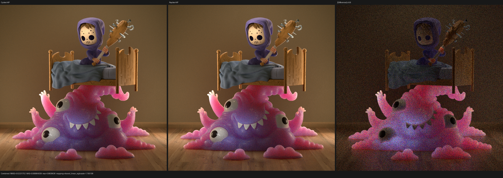
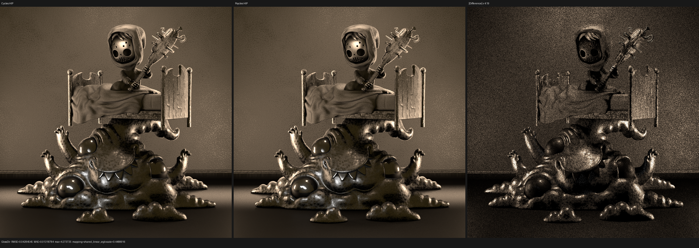
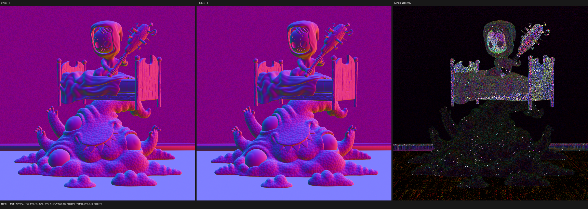

# Monster Under the Bed current-head validation

## Outcome

The official Monster Under the Bed scene now completes at 960x960, 128 spp
on Cycles CPU/HIP and Psycles fallback/HIP/Vulkan. This is the first current
checkpoint in which all five runs finish from the same unmodified `.blend`
file and the same freshly exported raw closure graph. It is not yet a claim of
finite-sample 1:1 image parity.

The first five-way run exposed two backend failures and one renderer-semantic
failure:

- fallback crashed when a valid Embree triangle hit had a slightly negative
  shared-edge barycentric and the backend inferred `Procedural` from that
  value;
- an unbounded 960x960x4 Vulkan dispatch exceeded the AMD compute watchdog;
  and
- Psycles made an unlinked Principled Coat Normal inherit the authored main
  Normal, while Cycles connects those two normal sockets independently.

The backend failures are fixed in Luisa `next` commit `3e63df0c6` and Psycles
commit `71e2020`. The Coat Normal fix and its regression are part of this
checkpoint. After that fix the data passes and the visible Coat structure are
closely aligned. Combined still has 15.61% relative RMSE at 128 spp, dominated
by uncorrelated direct/indirect transport noise and remaining path-scheduling
differences, so Monster remains an active convergence/alignment target.

## Asset and oracle

The source is the unmodified official file
`monster_under_the_bed_sss_demo_by_metin_seven.blend`, SHA-256
`9463082f8d365ad8ae19c1ba86429deb3b532c5a2d0db0b9492c3c759f64d28d`.
The exported bundle contains 34 geometries, 36 instances, 20 source
materials, and 31 compiled material variants. Blender 5.3 Alpha
`82186b01ad2e`, with its instrumented but observational Cycles CPU/HIP
kernels, is the only rendering oracle.

The monster material reaches Psycles as its original node topology:

- Principled `RANDOM_WALK_LEGACY`, Subsurface Weight 1, Scale 3;
- Object coordinates into a 3D F1 Euclidean Voronoi at Scale 20;
- that Voronoi drives Bump Height, base Roughness, and Coat Roughness; and
- Coat Weight 0.5 with its own unlinked Coat Normal socket.

No closure, texture, BSSRDF, or lighting result is pre-baked by Blender or
Cycles. This particular file authors `use_light_tree=false`; consequently the
new light-tree implementation is present in the renderer but is not selected
by this scene.

## Backend corrections

### Explicit fallback committed-hit kind

The original fallback failure reduced to a valid surface hit with
`u=-8.97981e-08` on a shared triangle edge. The fallback wrapper used the sign
of `u` as an implicit surface/procedural tag, so it decoded that surface as a
procedural primitive and read curve state from a scene containing no curves.

Luisa `next` commit `3e63df0c6` uses the existing aligned candidate ABI slot
to carry an explicit `HitType`. Traversal writes Surface or Procedural only
when the corresponding candidate is committed; result decoding never derives
type from payload data. The reduced negative-barycentric regression passes 43
assertions on fallback, HIP, and Vulkan. The full Monster fallback render then
completed normally.

### Exact watchdog-safe Vulkan partition

The initial Vulkan shader compiled and created a pipeline, but one full-frame
four-sample dispatch triggered an AMD compute-ring timeout and device loss.
Psycles now applies the existing row-band partition to both Metal and Vulkan,
with a limit of 131,072 pixel-samples per submission. The partition is an
ordered, gap-free cover of complete rows; full film coordinates, absolute
sample identities, and accumulation order are unchanged. The formal partition
regression covers the backend policy, interval endpoints, work bound, and
complete coverage. With the bound enabled, the same Vulkan render completes.

## Independent Coat Normal semantics

Cycles `ShaderGraph::default_inputs()` connects every unlinked
`LINK_NORMAL` socket independently to Geometry Normal. Therefore a Principled
node with a linked Bump Normal and an unlinked Coat Normal has two distinct
inputs: the base lobes use the bumped normal, while Coat uses the original
shading normal. A linked zero Coat Normal is a different topology and falls
back to `ShaderData::N` only during safe normalization.

Psycles already retained the `coat_normal_linked` topology bit, but the
unlinked branch incorrectly selected `closure.normal`. The shared
`PrincipledLayerComponent` now selects `SurfacePoint::shading_normal` for the
unlinked branch in both Coat and Sheen layering. There is no material-name or
scene-specific branch.

The device regression links the main Normal to `(0.6, 0, 0.8)`, leaves Coat
Normal unlinked, and requires the first Coat closure normal to remain
`(0, 0, 1)` while the next base closure uses `(0.6, 0, 0.8)`. It also checks
that surface-program lowering preserves `coat_normal_linked=false`. The test
passes on fallback, HIP, and Vulkan.

An integrated HIP trace at film pixel `(534, 374)`, absolute Tabulated Sobol
sample 0, provides the scene-level regression evidence. Camera RNG, pixel RNG,
intersection object/primitive, raw random dimensions, light object/type/PDF,
closure count/order, and selected BSSRDF all agree with Cycles. Before the
fix, the first GGX closure incorrectly used the bumped normal. After the fix:

| Closure | Cycles normal | Psycles normal after fix |
| --- | --- | --- |
| Coat GGX | `(-0.0937405, -0.5250652, 0.8458837)` | `(-0.0937308, -0.5250612, 0.8458873)` |
| Base GGX | `(-0.2140548, -0.6778328, 0.7033656)` | `(-0.2140432, -0.6778315, 0.7033705)` |
| Legacy BSSRDF | `(-0.2140548, -0.6778328, 0.7033656)` | `(-0.2140432, -0.6778315, 0.7033705)` |

The remaining values in this row are HIPRT/Cycles-HIP intersection precision
tails, not a second normal topology.

## Five-way completion and performance

All timings below are renderer-reported render time, excluding scene export.
The first matrix predates only the Coat Normal correction; it already includes
the fallback and Vulkan backend fixes.

| Renderer/backend | Render time | Relative to Cycles HIP |
| --- | ---: | ---: |
| Cycles CPU, Ryzen 9 9950X3D | 20.963 s | 2.91x slower |
| Cycles HIP, RX 9070 XT | 7.214 s | 1.00x |
| Psycles fallback, Ryzen 9 9950X3D | 59.200 s | 8.21x slower |
| Psycles HIP, RX 9070 XT | 32.549 s | 4.51x slower |
| Psycles Vulkan, RX 9070 XT | 170.609 s | 23.65x slower |

The corrected HIP render took 32.356 s, or 4.49x Cycles HIP and 1.54x Cycles
CPU. This semantic fix does not materially change throughput. Its cache-cold
HIP JIT took 125.821 s: LLVM code generation took 23.963 s and device-bitcode
linking took 95.995 s. That confirms linking the large fused kernel, rather
than the 32-thread host build, as the dominant cold HIP compile stage in this
run.

The machine-readable pre-fix five-way manifest and both HIP comparison
reports are retained under [reports](reports/).

## Numerical change

Both rows compare Psycles HIP with Cycles HIP at the same 960x960, 128 spp,
seed-zero Tabulated Sobol configuration, without adaptive sampling or
denoising.

| Pass | Relative RMSE before | Relative RMSE after | Reduction |
| --- | ---: | ---: | ---: |
| Combined | 0.167711 | 0.156101 | 6.92% |
| Diffuse Color | 0.006311 | 0.000621 | 90.16% |
| Glossy Color | 0.059235 | 0.001311 | 97.79% |
| Glossy Direct | 0.544163 | 0.120868 | 77.79% |
| Glossy Indirect | 0.825166 | 0.548042 | 33.58% |
| Normal | 0.027869 | 0.000747 | 97.32% |

Corrected Combined luminance is 1.00661x the Cycles value. Corrected Glossy
Direct is 0.999625x and Glossy Color is 0.999995x, which rules out the former
systematic Coat-energy/normal error. Diffuse Direct and Indirect remain at
0.16717 and 0.38904 relative RMSE respectively and are the next transport
alignment targets. Monster has no volume domain, so both volume passes are
zero in Cycles and Psycles.

## Visual inspection

All retained triptychs were opened at their original 2,880x720 resolution.
Before the fix, Psycles showed a visibly over-detailed Coat highlight pattern
on the monster and the amplified Normal difference followed the entire
Voronoi bump structure. After the fix, reference and actual Normal panels are
visually indistinguishable; their remaining difference is visible only at
835x amplification. Glossy Direct now has matching lobe placement and surface
frequency, with a noisy rather than shifted/coherent difference panel.
Combined retains visible finite-sample noise on the monster and indirect
regions, but no longer shows the former wrong Coat-normal structure.

Corrected images:

The corresponding [before-fix triptychs](triptychs/before/) are retained for
the regression audit.

## Current scene status and next gates

- **Monster Under the Bed:** complete renders work on all five matrix entries.
  The corrected HIP image is structurally close, but the 128-spp transport
  residual is not yet a final quality-parity result. A higher-spp convergence
  run and corrected fallback/Vulkan reruns remain required.
- **Lone Monk:** historical five-way renders exist, but they predate the
  current closure, light-selection, fallback, and Vulkan checkpoints. Fine
  grass remained visibly different. It must be rerun from current main before
  promotion.
- **Classroom and Barbershop:** historical full-scene results also predate this
  checkpoint. Their current-main five-way matrices, inspected triptychs, and
  performance numbers remain pending.
- **Blender 4.1 Splash:** material import/feature work exists, but no
  current-main five-way quality result is promoted yet.

The immediate renderer work is to use the per-path oracle to align the first
remaining transport scheduling divergence, then run Monster at higher spp and
refresh Lone Monk, Classroom, Barbershop, and Splash at 480p or larger across
Cycles CPU/HIP and Psycles fallback/HIP/Vulkan.
