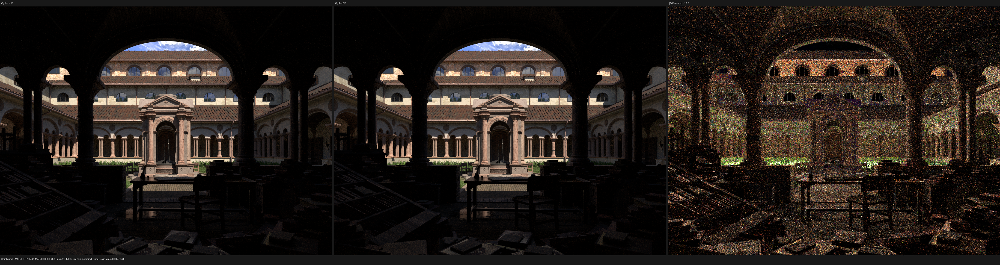
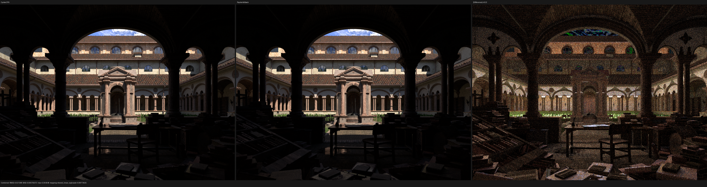
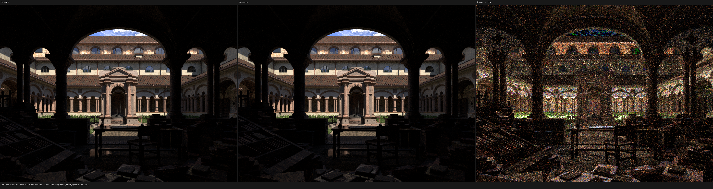
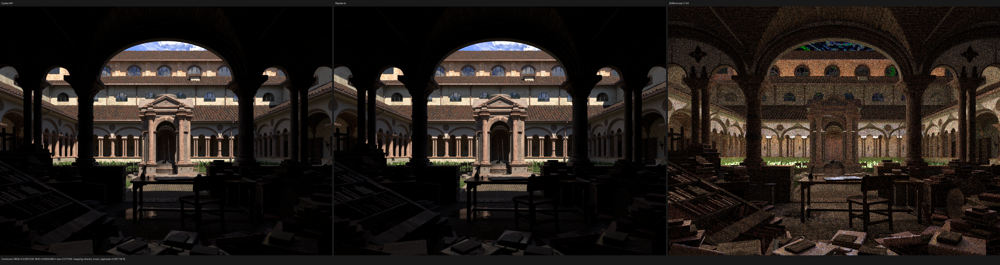

# Lone Monk five-way performance gate (1440x1080, 256 spp)

This checkpoint measures the current Psycles `main@2fcdbce` with
LuisaCompute `next@9e42c7c0d` against Blender/Cycles 5.3 Alpha
`82186b01ad2e`. The physical GPU is the same RX 9070 XT for Cycles HIP,
Psycles HIP, and Psycles Vulkan. Cycles CPU and Luisa fallback use the same
Ryzen 9 9950X3D host.

The source is `lone-monk_cycles_and_exposure-node_demo.blend`, frame 4. The
immutable raw-graph export contains 348 geometries, 87,534 instances, 37
material variants, and 24 graph topologies. No Cycles evaluation, baking, or
material substitution is used. Both renderers use 1440x1080, 256 fixed
samples, seed zero, denoising disabled, and adaptive sampling disabled.
Cycles records `TABULATED_SOBOL`; Psycles uses the corresponding imported
sampling contract. Psycles limits each synchronized dispatch to 8 samples.

## Render results

`Render` is the renderer-reported sampling interval used by the benchmark's
relative-performance calculation. `Process wall` includes initialization,
scene/acceleration construction, JIT, image conversion, and EXR output. The
Psycles scene and JIT columns are reported separately, so cold setup is not
silently charged to render throughput.

| Renderer | Device/backend | Scene build | Shader JIT | Render | Process wall | Relevant slowdown |
|---|---|---:|---:|---:|---:|---:|
| Cycles | CPU / Ryzen 9 9950X3D | included | included/AOT | `72.1837 s` | `72.6319 s` | reference CPU |
| Cycles | HIP / RX 9070 XT | included | included/AOT | `19.3186 s` | `19.7859 s` | reference GPU |
| Psycles | fallback / Embree, 32 threads | `1.6925 s` | `22.0529 s` | `142.7930 s` | `167.5741 s` | `1.9782x` vs Cycles CPU |
| Psycles | HIP / RX 9070 XT | `4.2136 s` | `0.1460 s` warm | `58.0613 s` | `63.4840 s` | `3.0055x` vs Cycles HIP |
| Psycles | Vulkan XIR-to-SPIR-V / RX 9070 XT | `1.6866 s` | `58.4686 s` cold | `226.6200 s` | `287.8886 s` | `11.7306x` vs Cycles HIP |

The direct answer at this checkpoint is therefore that Psycles has not
become faster than Cycles. HIP supplies 33.27% of Cycles HIP throughput.
Fallback supplies 50.55% of Cycles CPU throughput. Vulkan supplies 8.52% of
Cycles HIP throughput. Psycles HIP is nevertheless 1.2432x faster than
Cycles CPU on this machine.

The HIP result was repeated three times. Psycles measured `58.1820`,
`58.1886`, and `58.0613` seconds; the paired Cycles HIP measurements were
`19.4039`, `19.2706`, and `19.3186` seconds. The resulting slowdown range is
`2.9985x` to `3.0196x`, so the approximately threefold gap is stable rather
than a single-run fluctuation.

The complete commands, hashes, process timings, and ratios are preserved in
[benchmark.json](benchmark.json). The canonical invocation was:

```text
TMPDIR=/var/tmp/psycles-compiler-tmp python3 tools/run_scene_benchmark.py \
  --blender /home/mike/Projects/blender-install-psycles-trace/blender \
  --psycles-render build/bin/psycles_render_blender_scene \
  --blend /home/mike/Downloads/lone-monk_cycles_and_exposure-node_demo.blend \
  --output-dir /var/tmp/psycles-lone-monk-speed-current-2fcdbce-1440x1080-256-all \
  --bundle /var/tmp/psycles-lone-monk-transmission-dbdcb17/export \
  --reuse-export --cycles-gpu-device HIP \
  --cycles-gpu-device-name "Radeon RX 9070 XT" \
  --psycles-backends fallback,hip,vk \
  --width 1440 --height 1080 --samples 256 \
  --max-samples-per-dispatch 8 \
  --compiler-tmp /var/tmp/psycles-compiler-tmp
```

## Numerical and visual audit

All Combined passes contain only finite values. The comparison uses the
linear multilayer EXRs, without display-space metrics.

| Comparison | RMSE | Relative RMSE | Mean luminance ratio | p99 pixel RMSE |
|---|---:|---:|---:|---:|
| Cycles CPU vs Cycles HIP | `0.0151875` | `0.9486%` | `0.9999567` | `0.0484725` |
| Psycles fallback vs Cycles CPU | `0.0213980` | `1.3366%` | `1.0004635` | `0.0800741` |
| Psycles HIP vs Cycles HIP | `0.0274086` | `1.7119%` | `1.0011609` | `0.0854969` |
| Psycles Vulkan vs Cycles HIP | `0.0266704` | `1.6658%` | `1.0010566` | `0.0856825` |

The original-resolution Combined triptychs were inspected manually. All
three Psycles backends preserve the Cycles framing, geometry, grass,
materials, silhouettes, and large-scale illumination. No backend-specific
structured error is visible. The amplified differences are spatially
stochastic and are dominated by finite-sample path differences. This is not
a claim that every closure/pass is feature-complete; it establishes that the
current Lone Monk image has no remaining large structural mismatch.

### Cycles CPU vs Cycles HIP



### Psycles fallback vs Cycles CPU



### Psycles HIP vs Cycles HIP



### Psycles Vulkan vs Cycles HIP



The complete per-pass machine reports are:

- [Cycles CPU vs HIP](report-cycles-cpu-vs-hip.json)
- [Psycles fallback vs Cycles CPU](report-fallback-vs-cycles-cpu.json)
- [Psycles HIP vs Cycles HIP](report-hip-vs-cycles-hip.json)
- [Psycles Vulkan vs Cycles HIP](report-vk-vs-cycles-hip.json)

## Performance interpretation

HIP remains limited by the large path kernel: profiling at this commit still
reports 256 VGPR and 128 SGPR. The compact post-population closure ABI reduced
private scratch from 3,676 to 2,704 bytes per thread (26.4%) and improved a
960x540/64-spp warm run by about 4.2--4.6%, but it has not removed the
remaining register/scratch and divergent-control-flow cost.

Vulkan uses native XIR-to-SPIR-V, not DXC. Its optimized module still contains
400,579 words (about 1.53 MiB). During rendering the GPU was 99--100% busy but
showed low memory activity and only roughly 118--172 W package power. That
combination points to latency/occupancy/control-flow pressure rather than a
bandwidth limit. Vulkan's 58.47-second cold JIT and 11.73x render gap must be
profiled independently; removing compilation latency alone cannot fix render
throughput.

Fallback used Embree 4.4.1 with 32 threads and AVX-512. Its remaining 1.98x
CPU gap and 22.05-second JIT are separate targets. The next optimization gate
is therefore backend-specific profiling plus continued formal kernel-state,
closure-reachability, and graph-scheduling reduction, with this five-way
image and timing matrix retained as the regression boundary.
