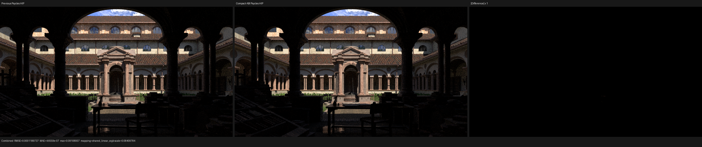

# Post-population surface-closure ABI

Date: 2026-08-10

## Outcome

The Lone Monk HIP path kernel no longer passes the complete material-population
`SurfacePoint` to every physical-closure evaluation and conditional-sampling
callable. Material graph population still receives the original point and all
of its UVs, attributes, derivatives, object state, and parameter storage. Once
that graph has produced raw Cycles closures, the consumer boundary projects
exactly the state that the physical closure algebra can observe:

```text
SurfaceClosurePoint = {
    geometric_normal,
    shading_normal,
    incoming,
    ray_visibility,
    use_bump_map_correction,
    back_facing
}
```

The projection is a distinct Luisa DSL type. Evaluation, selection, sampling,
glass, thin-glass, and post-population Principled components accept that type,
so a future dependency on UVs or other graph-population state cannot enter the
nested callable ABI implicitly. It must be added to the semantic projection
and its layout regression deliberately. No closure is baked, flattened into a
weak `float4` register protocol, or evaluated by Blender/Cycles on the host.

On the unchanged 37-material, 24-topology Lone Monk export, ROCm reports that
the full `kernel_main` scratch allocation falls from 3,676 to 2,704 bytes per
thread, a reduction of 972 bytes or 26.4%. VGPR and SGPR counts remain at their
architectural limits of 256 and 128; this result therefore isolates the
improvement to private callable state rather than claiming that register
pressure is solved. A warm 960x540, 64-fixed-spp HIP sample improves by
4.2--4.6% against the preceding checkpoint. The complete matched
Cycles/Psycles 1080p matrix remains a separate gate, so this is not yet a claim
that Psycles has overtaken Cycles.

## Formal boundary and layout

The boundary is placed after closure population because the dependency graph
has two distinct phases:

```text
full SurfacePoint -> graph values -> original Cycles closure records
                                      |
                                      v
                           SurfaceClosurePoint projection
                                      |
                                      v
                         select / eval / sample / scatter
```

Only the first phase may observe graph coordinates, attributes, derivatives,
and material parameter storage. The second phase is now parameterized by the
minimal record, including for the shared path-tracer callables. This is an
exact dependency cut, not a heuristic field-pruning pass.

Luisa `float3` has 16-byte ABI alignment. Three independent `float3` members
would consume 48 bytes before flags, so the callable transport uses an explicit
bijection over two `float4` values and a scalar tail:

| Offset | Field | Semantics |
| ---: | --- | --- |
| 0 | `geometric_normal_and_shading_x` | geometric XYZ, shading X |
| 16 | `shading_yz_and_incoming_xy` | shading YZ, incoming XY |
| 32 | `incoming_z` | incoming Z |
| 36 | `ray_visibility` | Cycles ray visibility mask |
| 40 | `flags` | named bump-correction and back-facing bits |
| 48 | end of record | compile-time size assertion |

The public DSL type retains named vector and boolean fields; only the private
callable transport is packed. Pack/unpack is the sole mapping site, and the
flag masks are named constants rather than magic indices.

## Profiler result

The current kernel was warmed once, then measured with the official ROCm 7.2
profiler on the RX 9070 XT:

```sh
rocprofv3 \
  --output-format rocpd \
  --pmc GRBM_GUI_ACTIVE \
  --kernel-include-regex '^kernel_main$' -- \
  build/bin/psycles_render_blender_scene \
    /var/tmp/psycles-lone-monk-transmission-dbdcb17/export \
    profile.ppm hip 960 540 1 1
```

The row below is the 518,400-thread main dispatch. Geometry construction is
outside this kernel and was not folded into its duration.

| Resource | Previous full kernel | Compact closure-point ABI | Change |
| --- | ---: | ---: | ---: |
| private scratch per thread | 3,676 B | 2,704 B | -972 B (-26.4%) |
| architectural VGPR | 256 | 256 | unchanged |
| SGPR | 128 | 128 | unchanged |
| profiled main dispatch | not retained as a matched timing | 89.925 ms | informational |

The stage-isolation profile preceding the implementation found 592 bytes for
geometry plus material preparation, 2,844 bytes when scatter was enabled with
NEE disabled, and 3,676 bytes for the full kernel. The old closure
`sample -> SurfaceSample -> scatter` boundary therefore introduced roughly
2,252 bytes, with NEE adding another 832 bytes. After the projection, the full
NEE kernel is 140 bytes below the old NEE-disabled kernel. That ordering is the
strong evidence that the removed state was the nested callable payload, not an
unrelated scene-build fluctuation.

## HIP throughput

Both groups use the same export, RX 9070 XT, 960x540 extent, 64 fixed samples,
and eight samples per dispatch. The preceding samples are the conservative
post-baseline group from the predicated-categorical checkpoint.

| Checkpoint | Render intervals (s) | Median |
| --- | --- | ---: |
| preceding predicated categorical | 5.54643, 5.53563, 5.57704 | 5.54643 s |
| compact closure-point ABI | 5.28907, 5.29359, 5.27864 | 5.28907 s |

The median interval is 4.64% lower (`1.0487x`). Against all six preceding
candidate samples, whose median was 5.521785 seconds, it is 4.21% lower. These
groups were measured on the same day but were not interleaved across two
simultaneously retained binaries, so the conservative conclusion is a measured
4.2--4.6% checkpoint improvement rather than a more precise hardware claim.

## Regression and visual inspection

`test_luisa_surface_closure_point.cpp` locks all of the following on fallback,
HIP, and native XIR-to-SPIR-V Vulkan:

- the 48-byte record size and every semantic field offset;
- projection from a full runtime `SurfacePoint` with unrelated sentinel UV,
  position, and parameter-block state;
- packed flags and all vector/scalar values after a real callable round trip;
- exactly one reused callable definition in the generated kernel.

The existing physical closure collection regression also passes on all three
backends after being moved to the strong post-population type.

At 960x540 and 64 spp, twelve of fifteen linear passes are byte-identical to
the preceding HIP checkpoint. Only Combined, Diffuse Indirect, and Glossy
Indirect contain sparse stochastic differences. Combined RMSE is
`1.18974e-4`, relative RMSE is `6.49595e-5`, the luminance ratio is
`1.00000018`, and p99 pixel RMSE is zero. I inspected the Combined and Diffuse
Indirect triptychs at original resolution: the camera, silhouettes, grass,
brick, marble, wood, lighting, and shadow structure coincide. The difference
panels are black apart from isolated indirect-sample specks and contain no
structured feature.

The complete per-pass metrics are in
[`previous-vs-compact-report.json`](previous-vs-compact-report.json).


