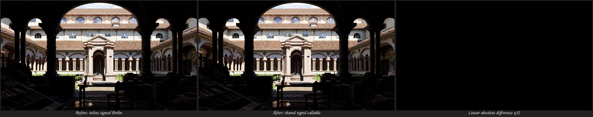
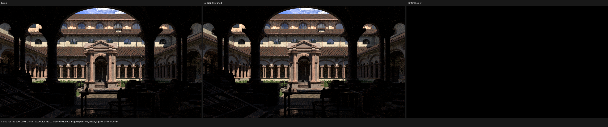
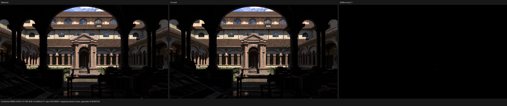

# Surface-operation reachability and shared shader primitives

Date: 2026-08-10

## Outcome

This checkpoint removes fifteen independent sources of scene-dependent path-kernel
growth without changing Blender graph values or Cycles closure semantics:

1. emission code is recorded only for surface tags whose scene-unioned closure
   plan may emit; and
2. repeated Principled dielectric physical setup is represented by two shared,
   strongly typed Luisa callables instead of being cloned into every material
   topology and every surface operation; and
3. the smaller but more frequent Principled diffuse allocation/setup is
   represented by one additional typed callable; and
4. Principled metallic Fresnel, GGX energy, allocation, and layer attenuation
   are represented by two energy-policy-specialized typed callables; and
5. Cycles image interpolation is represented by the reachable members of a
   finite set of typed interpolation/extension callables instead of being
   expanded once per Image Texture node and surface operation; and
6. RGB/HSV/HSL conversion is represented by the reachable members of a finite
   typed transform family instead of being expanded once per color node and
   surface operation; and
7. Mapping vector transforms are represented by the reachable members of the
   finite POINT/TEXTURE/VECTOR/NORMAL family instead of being expanded once per
   Mapping node and surface operation; and
8. Color Ramp and RGB Curves lookup bodies are represented by the reachable
   members of a six-endpoint typed table-evaluation family; and
9. Normal Map evaluation is represented by the reachable members of the finite
   tangent-displaced/tangent-original/object/world family; and
10. the post-height geometric stage of Bump nodes is represented by the
    reachable world/object endpoint instead of being cloned at every Bump site;
    and
11. Noise Texture specializations and color channels share one typed signed
    Perlin definition per reachable coordinate dimension instead of expanding
    the complete hash/gradient lattice at every internal noise site; and
12. the direct-light stage vector contains only emitter classes proven present
    in the scene distribution instead of recording all three implementations
    behind device-side kind tests; and
13. analytic-lamp closest-event intersection and forward shading are recorded
    only when the uploaded scene contains at least one analytic lamp, instead
    of relying on a zero-trip device loop to erase its already-recorded body;
    and
14. triangle and curve traversal, primitive resolution, material lookup, and
    differential geometry are recorded only for primitive populations present
    in the immutable uploaded scene. Device hit-kind dispatch remains only for
    genuinely mixed triangle/curve acceleration structures; and
15. exact triangle source completion is recorded only when the immutable scene
    contains a dense or sparse completion-source lookup, while primary,
    tie-retraversal, source-completion, and shadow paths share one strongly
    typed exact resolver callable.

On the unchanged Lone Monk export, the complete cold Vulkan path module falls
from 203,652 to 81,516 pre-restructure XIR instructions (60.0%). The main
kernel falls 59.2%, raw SPIR-V falls 62.8%, optimized SPIR-V falls 56.5%, and
native AST-to-SPIR-V time falls 69.1%. The primitive specialization by itself
removes 10.1% of the preceding main kernel and improves a same-period
interleaved 960x540, 64 spp HIP A/B by 2.94% (`1.0303x`). The subsequent exact
resolver boundary removes another 6.58% of the main kernel and 5.17% of
optimized SPIR-V without changing measured HIP throughput. The 1x1
compiler-isolation PPM and all fifteen PFM passes remain byte-identical, while
the high-resolution HIP difference remains inside unchanged-binary
nondeterminism and has no structured image change. Cold Vulkan driver samples
are reported separately because pipeline creation remains dominant and noisy.

## Formal reachability rule

For a scene surface tag `t` and operation `o`, code generation now obeys

```text
record(t, emission) iff capabilities(t).may_emit
```

For a Principled closure, `may_emit` may be disproved only by a finite direct
socket value: alpha `<= 0`, an exactly zero emission color, or an exactly zero
emission strength. Linked and non-finite values remain unknown and therefore
retain emission. The proof is computed per material instance and unioned over
all instances sharing one deduplicated topology before code is recorded. This
prevents one material's direct value from specializing code used by another.

`SurfaceDispatch::emission` dispatches over the proven emissive tag set with a
zero default. Capability calculation, the operation dispatcher, and the
emission evaluator consume the same scene-unioned feature mask, so metadata and
generated code cannot disagree.

Regressions cover direct-zero emission, linked-zero conservatism, topology
union, capability refinement, and a recording surface that proves a
non-emissive branch is absent from the generated AST.

## Typed populate/setup boundary

Lone Monk contains 35 source materials, 37 compiled material instances, and 24
deduplicated shader-graph topologies. Those topologies contain 19 reachable
Principled dielectric occurrences. Previously, the physical Fresnel, GGX
energy, table lookup, allocation, sample-weight, albedo, and lower-layer
attenuation algebra was expanded once per occurrence in each surface operation.

The new boundary follows Luisa's multistage model:

```text
authored graph sockets + shading-point state
                 |
                 v
        typed dielectric populate
                 |
                 v
       typed physical setup callable
                 |
                 v
       original Cycles closure record
```

The host-side `ShaderServices` abstraction optionally supplies a
`SurfaceClosureSetupProvider`. Production path-tracer services supply shared
callables; standalone `GraphSurface` users retain the canonical inline path.
The ABI names every semantic field and returns a typed result. No `float4`
parameter protocol, closure array, material-name switch, host evaluation,
Blender/Cycles pre-bake, or weakened closure is involved.

GGX energy preservation is immutable topology metadata, so it produces exactly
two callables: ordinary GGX and preserve-energy GGX. All authored numeric values
remain Luisa expressions. The physical helpers also received narrow overloads:
adjusted IOR depends only on IOR and Specular IOR Level, while GGX energy depends
only on roughness, the host preservation flag, incident cosine, and `Fss`. This
avoids constructing a mostly-unused `TracedClosure`, whose default DSL fields
would themselves record dead AST.

The populate/setup split was selected by measurement, not convention. Moving
the derived glossy normal and incident cosine back to each material call site
made the module larger because those computations became live in every
topology:

| Boundary | Total XIR | Main kernel | `surface_evaluate_light` |
| --- | ---: | ---: | ---: |
| raw semantic state; derive inside shared callable | 169,378 | 120,200 | 33,251 |
| derived normal/cosine at every call site | 173,492 | 123,050 | 34,699 |

The rejected boundary was 2.4% larger overall and 4.3% larger in light
evaluation. The retained architecture lets standalone graph evaluation reuse
values already populated for sibling Principled lobes, while the path tracer
fuses populate and setup inside the cross-topology callable.

## Shared diffuse setup follow-up

The next family was selected by total scene cost rather than by the size of one
closure body. The focused single-topology marginal costs are approximately 544
XIR instructions for diffuse after dielectric and 1,221 for metallic after
dielectric. Lone Monk, however, contains 18 reachable diffuse occurrences and
only 3 metallic occurrences. Diffuse therefore has the larger repeated cost.

`PrincipledDiffuseComponent` now exposes one canonical transfer function. Its
input is the original typed `{lower_weight, color, subsurface_weight}` socket
state. The shared callable performs the color clamp, lower-layer product,
subsurface attenuation, Cycles allocation cutoff, and sample-weight setup. It
returns only the three fields that are not already present in the authored
closure record. No closure array, material value, or weakly typed register
block crosses this boundary.

The regression includes the fixed callable definition and ABI packing in its
module count. This deliberately records the negative boundary as well as the
amortized one:

| Focused fixture | Inline XIR | Shared XIR | Result |
| --- | ---: | ---: | --- |
| one dielectric+diffuse topology | 5,355 | 6,050 | shared is not amortized |
| four independent topology branches | 16,834 | 14,547 | shared is 13.6% smaller |

Thus the optimization is justified by cross-topology reuse, not by hiding the
callable body from the counter. On the full scene the new callable contains 24
instructions and produces the following post-optimization change relative to
the dielectric-only checkpoint:

| Metric | Shared dielectric | Shared dielectric + diffuse | Change |
| --- | ---: | ---: | ---: |
| XIR definitions | 23 | 24 | +1 shared definition |
| total XIR instructions | 169,378 | 168,706 | -672 (-0.40%) |
| main-kernel XIR instructions | 120,200 | 119,736 | -464 (-0.39%) |
| `surface_evaluate_light` XIR instructions | 33,251 | 33,019 | -232 (-0.70%) |
| raw SPIR-V words | 1,111,962 | 1,107,189 | -4,773 (-0.43%) |
| optimized SPIR-V words | 1,010,627 | 1,005,854 | -4,773 (-0.47%) |
| ordinary XIR inline | 274.17 ms | 280.65 ms | +2.4% |
| SPIR-V XIR legalization | 6,296.58 ms | 6,339.37 ms | +0.7% |
| native AST-to-SPIR-V | 16,077.31 ms | 15,952.92 ms | -0.8% |
| driver compute-pipeline creation | 77,884.27 ms | 77,476.73 ms | -0.5% |
| complete shader JIT | 94,077.8 ms | 93,552.1 ms | -0.6% |

The two small frontend-pass regressions are reported rather than rounded away;
the downstream module, SPIR-V, driver time, and end-to-end JIT all improve.
The one-pixel PPM and Combined PFM retain the exact fingerprints below.

## Shared metallic setup follow-up

`PrincipledMetallicComponent` applies the same typed populate/setup boundary to
the metallic lobe. Its input remains the authored base color, metallic,
roughness, tint, normal, incoming direction, and shading-point state. The
shared callable performs the canonical normal correction, clamps, Fresnel F82,
GGX energy lookup, allocation, sample weighting, albedo estimate, and lower
layer attenuation. It returns named physical fields; it does not serialize a
generic closure or evaluate graph values on the host.

The common normal/cosine/roughness/tint populate relation used by metallic and
dielectric is now one host-side C++ function that records the same Luisa AST.
The inline path passes its already-populated state to avoid recomputing sibling
Principled inputs, while the production callable starts from raw semantic
inputs so the work is shared across material topologies.

As with diffuse, the complete-module negative boundary is explicit:

| Focused fixture | Inline XIR | Shared XIR | Result |
| --- | ---: | ---: | --- |
| one metallic+dielectric topology | 6,071 | 7,408 | shared is not amortized |
| four independent topology branches | 19,698 | 16,328 | shared is 17.1% smaller |

On Lone Monk only the ordinary-energy metallic specialization is reachable; it
contains 208 instructions and replaces repeated setup in both the main path
kernel and light evaluation:

| Metric | Shared dielectric + diffuse | + shared metallic | Change |
| --- | ---: | ---: | ---: |
| XIR definitions | 24 | 25 | +1 reachable definition |
| total XIR instructions | 168,706 | 167,408 | -1,298 (-0.77%) |
| main-kernel XIR instructions | 119,736 | 118,754 | -982 (-0.82%) |
| `surface_evaluate_light` XIR instructions | 33,019 | 32,495 | -524 (-1.59%) |
| raw SPIR-V words | 1,107,189 | 1,096,841 | -10,348 (-0.93%) |
| optimized SPIR-V words | 1,005,854 | 996,375 | -9,479 (-0.94%) |
| ordinary XIR inline | 280.65 ms | 284.00 ms | +1.2% |
| SPIR-V XIR legalization | 6,339.37 ms | 6,502.61 ms | +2.6% |
| native AST-to-SPIR-V | 15,952.92 ms | 16,180.90 ms | +1.4% |
| driver compute-pipeline creation | 77,476.73 ms | 76,792.49 ms | -0.9% |
| complete shader JIT | 93,552.1 ms | 93,093.7 ms | -0.5% |

The frontend timing changes are within one cold-run noise sample and are not
claimed as wins. The structural counts, downstream SPIR-V size, driver time,
and end-to-end JIT all improve, while exact output fingerprints remain stable.

## Shared Cycles texture sampling follow-up

Lone Monk has 45 reachable Image Texture nodes. Before this checkpoint every
node expanded the complete software `TextureInterpolator` body into every
surface operation that evaluated its graph: coordinate splitting, four
extension policies, nearest/linear/cubic interpolation, and as many as sixteen
image reads. This was graph-node-level duplication, so topology deduplication
alone could not bound it.

Interpolation and extension are immutable shader-graph metadata. The new
formal bound is therefore

```text
texture_sampler_definitions(module)
    <= |reachable canonical (interpolation family, extension mode) pairs|
    <= 3 * 4
```

The three canonical families are nearest, linear, and cubic (including Smart);
the four extension modes are repeat, clip, extend, and mirror. Texture handles
and UVs remain typed Luisa expressions. A host-stage provider selects the typed
callable while recording the shader, so no device mode switch, generic
`float4` register protocol, graph VM, host texture evaluation, or pre-baking is
introduced. Consumers outside the production path tracer retain the same
canonical inline implementation.

The focused fixture repeats one linear/repeat sample eight times and counts the
complete module, including its reachable callable definition:

| Focused fixture | Inline XIR | Shared XIR | Change |
| --- | ---: | ---: | ---: |
| eight independent sample sites | 5,945 | 790 | -86.7% |

Another shape guard records all four source interpolation tags and all four
extension tags. It requires exactly twelve definitions, while two independently
constructed bundles that use the same specialization must collapse to one
definition by complete callable AST hash. Device regressions compare the old
direct and shared paths at seven interior and boundary coordinates for all
sixteen source-tag pairs.

Only linear/repeat and linear/clip are reachable in Lone Monk, so the production
module gains two small definitions and eliminates the repeated bodies:

| Metric | + shared metallic | + shared texture sampling | Change |
| --- | ---: | ---: | ---: |
| XIR definitions | 25 | 27 | +2 reachable definitions |
| total XIR instructions | 167,408 | 136,521 | -30,887 (-18.5%) |
| main-kernel XIR instructions | 118,754 | 98,253 | -20,501 (-17.3%) |
| `surface_evaluate_light` XIR instructions | 32,495 | 22,270 | -10,225 (-31.5%) |
| raw SPIR-V words | 1,096,841 | 933,506 | -163,335 (-14.9%) |
| optimized SPIR-V words | 996,375 | 850,086 | -146,289 (-14.7%) |
| ordinary XIR inline | 284.00 ms | 243.92 ms | -14.1% |
| SPIR-V XIR legalization | 6,502.61 ms | 5,107.07 ms | -21.5% |
| native AST-to-SPIR-V | 16,180.90 ms | 12,559.43 ms | -22.4% |
| driver compute-pipeline creation | 76,792.49 ms | 77,701.16 ms | +1.2% |
| complete shader JIT | 93,093.7 ms | 90,365.8 ms | -2.9% |

The single driver timing regression is retained as measured and is within the
noise of one cold pipeline build; it is not presented as an improvement. The
structural reductions and exact output hashes are deterministic.

## Shared color-transform follow-up

Lone Monk contains 32 reachable Hue/Saturation nodes, in addition to any HSV
blend and Separate/Combine Color operations selected by static graph metadata.
Previously every use expanded the full RGB-to-HSV and HSV-to-RGB algebra into
each surface operation that traversed the topology.

Color conversion is a closed family of four pure typed functions:

```text
{RGB -> HSV, HSV -> RGB, RGB -> HSL, HSL -> RGB}
```

`ShaderServices` now exposes an optional host-stage
`SurfaceColorTransformProvider`. Standalone GraphSurface clients evaluate the
canonical inline functions. Production buffer services expose typed callables
recorded from those same functions. The graph still evaluates its original
typed values in topological order; no generic value register, device opcode,
host color evaluation, or material pre-bake is introduced.

The formal module bound is

```text
color_transform_definitions(module)
    <= |reachable transform endpoints|
    <= 4
```

Constructing the provider does not attach all four definitions. The regression
requires a kernel using only RGB-to-HSV to contain exactly one definition, all
four endpoints to contain exactly four, and two independently constructed
providers using RGB-to-HSV to collapse to one definition by complete callable
AST hash. The focused Hue/Saturation-shaped roundtrip gives:

| Focused fixture | Inline XIR | Shared XIR | Change |
| --- | ---: | ---: | ---: |
| eight RGB-to-HSV-to-RGB sites | 3,169 | 524 | -83.5% |

Only RGB-to-HSV and HSV-to-RGB are reachable in Lone Monk. Their definitions
contain 38 and 43 instructions; the HSL endpoints are absent. Relative to the
shared-texture checkpoint:

| Metric | + shared texture sampling | + shared color transforms | Change |
| --- | ---: | ---: | ---: |
| XIR definitions | 27 | 29 | +2 reachable definitions |
| total XIR instructions | 136,521 | 130,971 | -5,550 (-4.07%) |
| main-kernel XIR instructions | 98,253 | 94,959 | -3,294 (-3.35%) |
| `surface_emission` XIR instructions | 507 | 437 | -70 (-13.8%) |
| `surface_evaluate_light` XIR instructions | 22,270 | 20,003 | -2,267 (-10.2%) |
| raw SPIR-V words | 933,506 | 897,508 | -35,998 (-3.86%) |
| optimized SPIR-V words | 850,086 | 816,866 | -33,220 (-3.91%) |
| ordinary XIR inline | 243.92 ms | 221.83 ms | -9.06% |
| SPIR-V XIR legalization | 5,107.07 ms | 4,962.88 ms | -2.82% |
| native AST-to-SPIR-V | 12,559.43 ms | 12,134.65 ms | -3.38% |
| driver compute-pipeline creation | 77,701.16 ms | 79,303.15 ms | +2.06% |
| complete shader JIT | 90,365.8 ms | 91,539.7 ms | +1.30% |

The structural counts and frontend reductions are deterministic. The single
driver timing sample regressed enough to make end-to-end JIT slower despite the
smaller optimized SPIR-V; it is reported as measured and is not claimed as a
runtime win. Driver pipeline creation remains the dominant, noisy tail.

## Shared vector-mapping follow-up

The source Lone Monk scene contains 38 Mapping nodes. After material-instance
normalization and topology deduplication, 22 Mapping occurrences remain
reachable in recorded surface operations. All 22 use Blender's POINT mode.
Previously, each occurrence expanded the Euler sine/cosine rotation and affine
transform into every operation that traversed its graph.

Mapping mode is immutable graph metadata and belongs to the closed family

```text
{POINT, TEXTURE, VECTOR, NORMAL}
```

`ShaderServices` now exposes an optional host-stage
`SurfaceVectorMappingProvider`. Production services select one strongly typed,
lazy callable while recording the graph. POINT and TEXTURE carry the semantically
required `{input, location, rotation, scale}` values; VECTOR and NORMAL use the
narrower `{input, rotation, scale}` ABI. Standalone GraphSurface clients retain
the same canonical inline definitions. Static axis remapping remains a small
host-recorded component selection and does not become a device mode switch.

The formal module bound is therefore independent of Mapping-node count:

```text
mapping_definitions(module)
    <= |reachable Mapping modes|
    <= 4
```

The regression requires a POINT-only kernel to contain exactly one definition,
all modes to contain exactly four, and independently constructed POINT providers
to deduplicate by complete callable AST hash. It compares the direct and shared
paths for every mode on fallback, HIP, and native Vulkan, including zero and
negative scale components. The focused shape result is:

| Focused fixture | Inline XIR | Shared XIR | Change |
| --- | ---: | ---: | ---: |
| eight POINT Mapping sites | 1,473 | 361 | -75.5% |

Only the 35-instruction POINT definition is reachable in Lone Monk. Relative
to the shared-color checkpoint:

| Metric | + shared color transforms | + shared vector mapping | Change |
| --- | ---: | ---: | ---: |
| XIR definitions | 29 | 30 | +1 reachable definition |
| total XIR instructions | 130,971 | 127,838 | -3,133 (-2.39%) |
| main-kernel XIR instructions | 94,959 | 92,649 | -2,310 (-2.43%) |
| `surface_emission` XIR instructions | 437 | 437 | unchanged |
| `surface_evaluate_light` XIR instructions | 20,003 | 19,145 | -858 (-4.29%) |
| raw SPIR-V words | 897,508 | 875,893 | -21,615 (-2.41%) |
| optimized SPIR-V words | 816,866 | 795,251 | -21,615 (-2.65%) |
| ordinary XIR inline | 221.83 ms | 229.64 ms | +3.52% |
| SPIR-V XIR legalization | 4,962.88 ms | 5,260.00 ms | +5.99% |
| native AST-to-SPIR-V | 12,134.65 ms | 12,481.60 ms | +2.86% |
| driver compute-pipeline creation | 79,303.15 ms | 79,793.11 ms | +0.62% |
| complete shader JIT | 91,539.7 ms | 92,379.1 ms | +0.92% |

The XIR and SPIR-V reductions are deterministic. This single cold timing sample
was slower at every noisy timing boundary despite the smaller module, so no
compile-time improvement is claimed for this checkpoint. The result is retained
for its bounded structural shape and exact semantic parity; repeated controlled
driver measurements remain separate from this compile-isolation check.

## Shared shader-table evaluation follow-up

The source Lone Monk scene contains 18 Color Ramp nodes and 27 RGB Curves
nodes. After material-instance normalization and topology deduplication, 16
Color Ramp operations and 14 RGB Curve operations remain reachable in the 24
recorded surface topologies. Their 257-entry payloads were already runtime
tables, so authored table length did not unroll into shader structure. The
remaining duplication was the lookup, interpolation, and curve-extrapolation
body emitted independently at every graph site and in every surface operation
that traversed that topology.

Table representation and interpolation policy are immutable graph metadata.
They form the finite typed endpoint family

```text
Color Ramp = {sampled, control} x {linear, constant}
RGB Curves = {sampled, control}
```

The canonical implementations now consume a host-polymorphic table reader.
That virtual dispatch happens only while Luisa records the AST: production
buffer services select a typed callable reader, while standalone GraphSurface
clients retain the exact service-backed inline implementation. There is no
device virtual dispatch, weak `float4` register file, generic device opcode,
host material evaluation, or Cycles/Blender pre-bake. The scalar table payload
and descriptor remain runtime scene data.

Production `ShaderServices` expose a lazy `SurfaceShaderTableProvider`. It
creates a strongly typed callable only when the corresponding immutable
endpoint is reached, giving the formal bound

```text
shader_table_definitions(module)
    <= |reachable Color Ramp endpoints|
       + |reachable RGB Curve endpoints|
    <= 4 + 2
```

The regression requires a sampled-linear-only kernel to contain exactly one
definition, all six endpoints to contain exactly six, and independently
constructed providers to deduplicate by complete callable AST hash. It compares
the canonical direct and shared paths over sampled/control tables, both ramp
interpolation modes, curve extrapolation on/off, factors outside `[0, 1]`, and
curve inputs below/inside/above the authored range on fallback, HIP, and native
Vulkan. The focused graph-site result is:

| Focused fixture | Inline XIR | Shared XIR | Change |
| --- | ---: | ---: | ---: |
| eight sampled-linear Color Ramp sites | 2,120 | 447 | -78.9% |

Lone Monk reaches only sampled-linear Color Ramp, sampled-constant Color Ramp,
and sampled RGB Curve. Their definitions contain 72, 48, and 189 instructions;
the three legacy control-table endpoints are absent. Relative to the shared
vector-mapping checkpoint:

| Metric | + shared vector mapping | + shared shader tables | Change |
| --- | ---: | ---: | ---: |
| XIR definitions | 30 | 33 | +3 reachable definitions |
| total XIR instructions | 127,838 | 116,240 | -11,598 (-9.07%) |
| main-kernel XIR instructions | 92,649 | 84,794 | -7,855 (-8.48%) |
| `surface_emission` XIR instructions | 437 | 437 | unchanged |
| `surface_evaluate_light` XIR instructions | 19,145 | 15,093 | -4,052 (-21.2%) |
| raw SPIR-V words | 875,893 | 787,479 | -88,414 (-10.1%) |
| optimized SPIR-V words | 795,251 | 716,487 | -78,764 (-9.90%) |
| ordinary XIR inline | 229.64 ms | 208.81 ms | -9.07% |
| SPIR-V XIR legalization | 5,260.00 ms | 4,385.93 ms | -16.6% |
| native AST-to-SPIR-V | 12,481.60 ms | 10,510.54 ms | -15.8% |
| driver compute-pipeline creation | 79,793.11 ms | 78,298.66 ms | -1.87% |
| complete shader JIT | 92,379.1 ms | 88,904.5 ms | -3.76% |

Unlike the preceding single-sample checkpoints, every measured compilation
boundary improved in this cold run. The deterministic structural reduction and
exact output parity are the primary result; the one driver timing sample is
still reported as measured rather than treated as a stable throughput claim.

## Shared Normal Map follow-up

The 24 deduplicated Lone Monk topologies contain 13 Normal Map operations. All
13 have the same immutable configuration: tangent space, displaced base,
OpenGL convention, and the default unnamed tangent. The previous implementation
expanded tangent-frame construction, object-to-world normal transformation,
strength handling, availability checks, and back-face handling at every graph
site and in every surface operation that traversed it.

The Normal Map static configuration is now decomposed before the shared
boundary. DirectX green-channel inversion, Blender object/world axis conversion,
and optional named-tangent attribute resolution remain host/JIT-selected graph
steps. The substantial evaluation body belongs to the finite typed endpoint
family

```text
{tangent-displaced, tangent-original, object, world}
```

This is intentionally not one generic Normal Map callable with a device mode.
Each endpoint has a narrow typed ABI; for example, world space does not carry
the object normal matrix or tangent availability state. Tangent-original alone
receives the undisplaced normal and smooth-triangle flag. A host-stage
`SurfaceNormalMapProvider` lazily records only endpoints reached by immutable
graph metadata, so

```text
normal_map_definitions(module)
    <= |reachable Normal Map endpoints|
    <= 4
```

Standalone GraphSurface services retain the same canonical inline functions.
Production services call those functions through the typed provider. No
device-side virtual call, mode switch, generic value register, or material
pre-bake is introduced.

The regression requires tangent-displaced-only recording to contain exactly
one definition, all four endpoints to contain exactly four, and independently
constructed providers to deduplicate by complete callable AST hash. Direct and
shared evaluation is compared on fallback, HIP, and native Vulkan over negative
and above-one strengths, smooth/flat triangles, current/undisplaced normals,
missing/degenerate tangents, missing geometry, curves, back faces, and a
non-uniform object normal transform. The focused result is:

| Focused fixture | Inline XIR | Shared XIR | Change |
| --- | ---: | ---: | ---: |
| eight tangent-displaced Normal Map sites | 4,233 | 2,042 | -51.8% |

The fixture deliberately retains its repeated synthetic point-input
construction in both columns; only the endpoint body is shared. Lone Monk
reaches one 75-instruction tangent-displaced definition. Relative to the shared
shader-table checkpoint:

| Metric | + shared shader tables | + shared Normal Map | Change |
| --- | ---: | ---: | ---: |
| XIR definitions | 33 | 34 | +1 reachable definition |
| total XIR instructions | 116,240 | 113,947 | -2,293 (-1.97%) |
| main-kernel XIR instructions | 84,794 | 83,580 | -1,214 (-1.43%) |
| `surface_emission` XIR instructions | 437 | 437 | unchanged |
| `surface_evaluate_light` XIR instructions | 15,093 | 13,939 | -1,154 (-7.65%) |
| raw SPIR-V words | 787,479 | 768,373 | -19,106 (-2.43%) |
| optimized SPIR-V words | 716,487 | 699,390 | -17,097 (-2.39%) |
| ordinary XIR inline | 208.81 ms | 188.26 ms | -9.84% |
| SPIR-V XIR legalization | 4,385.93 ms | 4,147.07 ms | -5.45% |
| native AST-to-SPIR-V | 10,510.54 ms | 10,032.04 ms | -4.55% |
| driver compute-pipeline creation | 78,298.66 ms | 78,550.37 ms | +0.32% |
| complete shader JIT | 88,904.5 ms | 88,679.4 ms | -0.25% |

The deterministic XIR/SPIR-V reductions and every frontend timing improved.
The single driver sample was slightly slower and dominates the nearly flat
end-to-end result, so no stable compile-time speedup is inferred from one run.

## Shared Bump geometry follow-up

The 24 deduplicated Lone Monk topologies contain five Bump operations. A Bump
node is not one freely shareable expression: its height dependency must be
evaluated against the original shading point and two differential points. The
topology scheduler therefore still performs the three graph-specific height
evaluations. Only the pure geometric stage after those values are available is
shared:

```text
topology-specific height(center), height(dx), height(dy)
                         |
                         v
       typed post-height geometric perturbation
                         |
                         v
                    world normal
```

Static inversion and optional normal-input selection are resolved by the graph
before this boundary. The immutable coordinate-space choice selects one of two
strongly typed endpoints:

```text
{world, object}
```

The object endpoint additionally owns the exact inverse normal transform and
the transform back to world space, including non-uniform and degenerate
transforms. The world endpoint does not carry those unused matrix fields in its
callable ABI. Both record the same canonical determinant sign, surface
gradient, validity fallback, safe normalization, and strength blend as the
standalone inline path. Thus the formal module bound is

```text
bump_geometry_definitions(module)
    <= |reachable Bump coordinate spaces|
    <= 2
```

The regression requires world-only recording to contain exactly one
definition, both endpoints to contain exactly two, and independently
constructed world providers to deduplicate by complete callable AST hash. It
compares direct and shared evaluation on fallback, HIP, and native Vulkan over
positive and negative determinants, zero derivatives, zero normals, height
gradients, distance sign changes, strengths above one, and degenerate and
non-uniform object transforms. The focused result deliberately leaves the
height values as distinct site inputs:

| Focused fixture | Inline XIR | Shared XIR | Change |
| --- | ---: | ---: | ---: |
| eight post-height world Bump sites | 3,153 | 1,842 | -41.6% |

All five Lone Monk nodes use the default world-space endpoint. They reach one
49-instruction definition; the object definition is absent. Relative to the
shared Normal Map checkpoint:

| Metric | + shared Normal Map | + shared Bump geometry | Change |
| --- | ---: | ---: | ---: |
| XIR definitions | 34 | 35 | +1 reachable definition |
| total XIR instructions | 113,947 | 113,336 | -611 (-0.54%) |
| main-kernel XIR instructions | 83,580 | 83,149 | -431 (-0.52%) |
| `surface_emission` XIR instructions | 437 | 437 | unchanged |
| `surface_evaluate_light` XIR instructions | 13,939 | 13,710 | -229 (-1.64%) |
| raw SPIR-V words | 768,373 | 764,016 | -4,357 (-0.57%) |
| optimized SPIR-V words | 699,390 | 695,109 | -4,281 (-0.61%) |
| ordinary XIR inline | 188.26 ms | 192.33 ms | +2.16% |
| SPIR-V XIR legalization | 4,147.07 ms | 4,264.56 ms | +2.83% |
| native AST-to-SPIR-V | 10,032.04 ms | 10,311.39 ms | +2.78% |
| driver compute-pipeline creation | 78,550.37 ms | 78,355.73 ms | -0.25% |
| complete shader JIT | 88,679.4 ms | 88,760.5 ms | +0.09% |

The structural reductions and exact output parity are deterministic. Frontend
timings in this single cold sample moved opposite to the smaller IR while the
driver moved slightly down; the nearly flat end-to-end result is therefore not
claimed as a compile-time speedup.

## Shared signed-Perlin follow-up

Lone Monk reaches nine compiled Noise Texture operations: six factor outputs
and three color outputs. Their immutable configurations reduce to exactly three
outer specializations: normalized 3D FBM factor, normalized 3D FBM color, and
non-normalized 2D FBM factor. Those outer texture callables already bounded
code by configuration, and their octave recurrences were already true device
runtime loops. The remaining expansion was one level lower: every outer
specialization, fractional-octave tail, and color channel independently
recorded the complete coordinate correction, Perlin hash, gradient lattice,
and interpolation body.

Signed Perlin has a finite typed domain family:

```text
{1D, 2D, 3D, 4D}
```

Each endpoint now owns the exact existing Cycles-ordered implementation. The
outer FBM/multifractal specialization still selects its recurrence and
normalization at host recording time, and `detail` still controls a device
loop. There is no device dimension opcode, generic vector payload, fixed-depth
unroll, host noise evaluation, or texture pre-bake. The formal definition bound
is

```text
signed_perlin_definitions(module)
    <= |reachable coordinate dimensions|
    <= 4
```

The regression records only 3D and requires exactly one definition, then
records all dimensions and requires exactly four. It compares the canonical
inline and callable paths on fallback, HIP, and native Vulkan across ordinary,
negative, and precision-correction-range coordinates. Its Lone Monk-shaped
fixture additionally requires exactly five runtime loops: one for 3D factor,
three for the factor and two color channels of 3D color, and one for 2D factor.
This explicitly guards against the depth unroll that this change is intended
to avoid.

| Focused fixture | Before | Shared signed Perlin | Change |
| --- | ---: | ---: | ---: |
| eight independent 3D signed-Perlin sites | 25,537 XIR | 3,281 XIR | -87.2% |
| complete Lone Monk Noise family | 59,726 XIR | 13,832 XIR | -76.8% |

The three outer definitions shrink from 3,080, 5,548, and 1,302 instructions
to 470, 850, and 262. Lone Monk adds only the 524-instruction 3D and
262-instruction 2D shared cores; 1D and 4D are absent. The aggregate Noise
family therefore falls from 9,930 to 2,368 instructions. Relative to the
shared Bump checkpoint:

| Metric | + shared Bump geometry | + shared signed Perlin | Change |
| --- | ---: | ---: | ---: |
| XIR definitions | 35 | 37 | +2 reachable definitions |
| total XIR instructions | 113,336 | 105,774 | -7,562 (-6.67%) |
| main-kernel XIR instructions | 83,149 | 83,149 | unchanged |
| `surface_emission` XIR instructions | 437 | 437 | unchanged |
| `surface_evaluate_light` XIR instructions | 13,710 | 13,710 | unchanged |
| raw SPIR-V words | 764,016 | 711,851 | -52,165 (-6.83%) |
| optimized SPIR-V words | 695,109 | 648,450 | -46,659 (-6.71%) |
| ordinary XIR inline | 192.33 ms | 192.84 ms | +0.27% |
| SPIR-V XIR legalization | 4,264.56 ms | 3,944.06 ms | -7.52% |
| native AST-to-SPIR-V | 10,311.39 ms | 9,423.90 ms | -8.61% |
| driver compute-pipeline creation | 78,355.73 ms | 77,273.56 ms | -1.38% |
| complete shader JIT | 88,760.5 ms | 86,789.6 ms | -2.22% |

The 1x1 Vulkan output is byte-identical in PPM, every PFM pass, and normalized
EXR. The HIP function boundary can change floating contraction: in a 960x540,
64 spp A/B, 7 of 518,400 linear pixels differ (0.00135%), with RMS
`3.87e-5`, maximum linear error `0.03919`, and PSNR `121.4 dB`. In display
space only three pixels move by one 8-bit code. Twelve of fifteen PFM passes
remain byte-identical; Combined, Diffuse Indirect, and Glossy Indirect contain
the same seven changed pixels. Visual inspection of the 32-times linear
difference finds isolated points and no structured material, geometry,
lighting, or sampling change:



Three interleaved 960x540, 64 spp HIP measurements are
`{6.09861, 6.07105, 6.07309}` seconds before and
`{6.10941, 6.06766, 6.07861}` seconds after. Their means are 6.08092 and
6.08523 seconds, a +0.07% difference within run-to-run noise. This boundary is
therefore retained for its measured compilation reduction without claiming a
render-throughput win or loss.

## Host-specialized direct-light component plan

The remaining main-kernel audit found a scene-capability leak rather than a
bounce unroll. Both the sample loop and the path-step loop are device runtime
loops. The direct-light component vector, however, was populated with
environment, emissive-mesh, and analytic-light implementations for every scene.
Each implementation retained its complete AST behind a runtime
`selected_light.kind` test even when that emitter kind could not exist in the
scene's flat distribution or light tree.

The generated component set is now the following conservative host-stage
relation:

```text
direct_components(scene) =
    NEE_enabled
        ? ({environment | environment_in_distribution}
           union {emissive_mesh | emissive_triangle_count > 0}
           union {analytic | analytic_light_count > 0})
        : empty
```

A zero population is an exact absence proof. A positive aggregate count does
not attempt to infer individual zero weights, so the plan cannot prune a
reachable proposal. This changes only which original Luisa DSL components are
recorded; it does not bake an emitter, material, closure, or light sample.

Lone Monk has no analytic lights. Removing that unreachable component also
removes the two-instruction `surface_constant_emission` callable for which it
was the only consumer. Relative to the signed-Perlin checkpoint:

| Metric | + shared signed Perlin | + direct-light capability plan | Change |
| --- | ---: | ---: | ---: |
| XIR definitions | 37 | 36 | -1 unreachable definition |
| total XIR instructions | 105,774 | 94,904 | -10,870 (-10.28%) |
| main-kernel XIR instructions | 83,149 | 72,281 | -10,868 (-13.07%) |
| `surface_emission` XIR instructions | 437 | 437 | unchanged |
| `surface_evaluate_light` XIR instructions | 13,710 | 13,710 | unchanged |
| raw SPIR-V words | 711,851 | 636,775 | -75,076 (-10.55%) |
| optimized SPIR-V words | 648,450 | 577,927 | -70,523 (-10.88%) |
| structured XIR optimization | 1,068.36 ms | 1,044.18 ms | -2.26% |
| ordinary XIR inline | 192.84 ms | 190.84 ms | -1.04% |
| SPIR-V XIR legalization | 3,944.06 ms | 3,600.70 ms | -8.71% |
| native AST-to-SPIR-V | 9,423.90 ms | 8,562.10 ms | -9.14% |
| driver compute-pipeline creation | 77,273.56 ms | 53,446.77 ms | -30.83% |
| complete shader JIT | 86,789.6 ms | 62,099.1 ms | -28.45% |

The cold run is under
`/var/tmp/psycles-direct-light-capability-20260810/` and used native Vulkan
XIR-to-SPIR-V with the shader cache disabled. DXC was not loaded. Its 1x1 PPM
and every linear PFM pass are byte-identical to the signed-Perlin checkpoint.

Three 960x540, 64 spp HIP measurements after capability pruning are
`{6.03908, 6.05017, 6.01124}` seconds, with a 6.03350-second mean. The preceding
signed-Perlin measurements have a 6.08523-second mean, so observed throughput
improves by 0.85% (`1.0086x`); this small difference is reported rather than
treated as a stable throughput claim. HIP repetitions are not bitwise
deterministic at a small number of indirect pixels: two unchanged-binary runs
already differ at 5 pixels here, and two signed-Perlin runs differ at 14.
Across the component-boundary A/B, 28 of 518,400 pixels exceed `1e-6`, RMS is
`1.1285e-4`, relative RMS is `6.1615e-5`, and the channel/luminance means agree
to displayed precision. Twelve of fifteen PFM passes are byte-identical;
the differences are isolated in Combined, Diffuse Indirect, Glossy Indirect,
and one Glossy Direct pixel. Visual inspection finds no structured geometry,
material, texture, lighting, or sampling change:



## Host-specialized analytic-light endpoint plan

The direct-light audit exposed the same staging error in the closest-event
path. Analytic lamps are transparent Cycles path endpoints, so they remain
independent of NEE. Nevertheless, a scene with no analytic lamps cannot reach
either their software area/point/spot intersection or their forward-emission
shading. The previous device loop used `scene->light_count` as its upper bound,
but Luisa records the loop body before that runtime bound is evaluated. A zero
trip count therefore preserved the complete intersection AST and its forward
shader even though the generated device could never execute either one.

The central host-stage scene plan now obeys

```text
analytic_endpoint_stages(scene) =
    analytic_light_count > 0
        ? {closest_intersection, forward_shading}
        : empty
```

This is an exact reachability proof over the uploaded population. A positive
count remains conservative: visibility, MIS flags, light type, and individual
weights are still resolved by the unchanged device implementation. The plan
does not turn lamp parameters into constants and does not alter the
environment or emissive-mesh paths.

Lone Monk has zero analytic lamps. Relative to the direct-light component
checkpoint, endpoint pruning also makes the now-unreferenced
`surface_emission` callable disappear:

| Metric | Direct-light component plan | + analytic endpoint plan | Change |
| --- | ---: | ---: | ---: |
| XIR definitions | 36 | 35 | -1 unreachable definition |
| total XIR instructions | 94,904 | 92,229 | -2,675 (-2.82%) |
| main-kernel XIR instructions | 72,281 | 70,043 | -2,238 (-3.10%) |
| `surface_evaluate_light` XIR instructions | 13,710 | 13,710 | unchanged |
| raw SPIR-V words | 636,775 | 619,582 | -17,193 (-2.70%) |
| optimized SPIR-V words | 577,927 | 568,660 | -9,267 (-1.60%) |
| structured XIR optimization | 1,044.18 ms | 1,018.04 ms | -2.50% |
| ordinary XIR inline | 190.84 ms | 197.99 ms | +3.75% |
| SPIR-V XIR legalization | 3,600.70 ms | 3,433.42 ms | -4.65% |
| native AST-to-SPIR-V | 8,562.10 ms | 8,183.65 ms | -4.42% |
| driver compute-pipeline creation | 53,446.77 ms | 51,845.50 ms | -3.00% |
| complete shader JIT | 62,099.1 ms | 60,120.4 ms | -3.19% |

The ordinary-inline timing is retained as measured and not hidden by the
smaller downstream numbers. The cold native-Vulkan run, complete pass trace,
and outputs are under
`/var/tmp/psycles-analytic-endpoint-capability-20260810/`. Native
XIR-to-SPIR-V was required and the log contains no DXC load. The 1x1 PPM, all
fifteen PFM passes, and EXR pixels are exactly equal to the direct-light
checkpoint.

The initial cross-period HIP comparison appeared 3.6% slower, so a controlled
same-period A/B was run with two separately compiled executables and cached
code objects in the order retained/pruned/pruned/retained/retained/pruned. At
960x540 and 64 spp the retained endpoint body took
`{6.28885, 6.24463, 6.24139}` seconds (mean `6.25829`), while the pruned body
took `{6.24286, 6.26092, 6.24673}` seconds (mean `6.25017`). The observed
0.13% improvement (`1.0013x`) is treated as throughput-neutral rather than a
render-speed claim.

Retained-versus-pruned Combined differs at 17 of 518,400 pixels above `1e-6`
(0.00328%), with RMSE `4.0153e-5`, relative RMSE `2.1924e-5`, and maximum
linear error `0.03919`. Nine of fifteen PFM passes are byte-identical; the
additional bit-level changes in Glossy Color and Normal remain below `1e-6`.
Unchanged-binary HIP repeats already span Combined RMSE from `1.0489e-5` to
`1.1285e-4`, so the A/B lies inside the measured nondeterministic envelope.
The full-resolution triptych was inspected: silhouettes, grass, materials,
textures, and lighting are visually identical, while the difference panel is
black apart from isolated subpixel points and has no structured feature:


## Host-specialized scene primitive plan

The next source-attributed audit found the same staging error around primitive
kinds. Lone Monk uploads 348 triangle geometries and 87,534 instances, but no
curve geometry. The former kernel nevertheless recorded curve primitive and
material resolution, ribbon intersection, procedural ray-query callbacks, and
curve surface geometry behind device-side hit-kind tests. Conversely, a
curve-only scene would retain the complete triangle resolver. The runtime
predicate could prevent execution but could not prevent AST construction.

Geometry populations are immutable while a render kernel is recorded, so the
central host/JIT scene plan now implements the exact finite relation

```text
primitive_stages(scene) =
    {triangle | triangle_geometry_count > 0}
    union {curve | curve_geometry_count > 0}

dynamic_hit_kind_dispatch(scene) iff
    triangle in primitive_stages(scene)
    and curve in primitive_stages(scene)
```

The same plan is consumed by primary and shadow traversal, closest-event
material resolution, primitive surface geometry, triangle differentials,
shadow-terminator geometry, ray-origin construction, and the exact
source-completion path. Triangle and procedural ray-query callbacks are
registered only when their corresponding population exists. An empty scene
records a typed miss/default result without a ray query. A positive population
does not specialize instance transforms, primitive indices, materials, alpha,
visibility, or hit values; it only selects which original Luisa DSL components
can be reached.

The focused traversal regression records all four members of the finite
population lattice and inspects the translated XIR ray-query operations. It
requires absent callback bodies to be genuinely absent, not merely guarded by
a constant or zero-trip loop:

| Primitive population | XIR instructions | triangle candidate read | procedural candidate read |
| --- | ---: | ---: | ---: |
| empty | 119 | absent | absent |
| triangles only | 5,975 | present | absent |
| curves only | 5,009 | absent | present |
| triangles and curves | 10,343 | present | present |

Thus triangle-only traversal is 42.2% smaller than mixed traversal in the
focused fixture. On the full triangle-only Lone Monk scene, relative to the
analytic-endpoint checkpoint:

| Metric | Analytic endpoint plan | + primitive capability plan | Change |
| --- | ---: | ---: | ---: |
| XIR definitions | 35 | 35 | unchanged |
| total XIR instructions | 92,229 | 85,160 | -7,069 (-7.67%) |
| main-kernel XIR instructions | 70,043 | 62,974 | -7,069 (-10.09%) |
| `surface_evaluate_light` XIR instructions | 13,710 | 13,710 | unchanged |
| raw SPIR-V words | 619,582 | 559,906 | -59,676 (-9.63%) |
| optimized SPIR-V words | 568,660 | 511,858 | -56,802 (-9.99%) |
| structured XIR optimization | 1,018.04 ms | 1,011.51 ms | -0.64% |
| ordinary XIR inline | 197.99 ms | 188.94 ms | -4.57% |
| SPIR-V XIR legalization | 3,433.42 ms | 3,185.73 ms | -7.21% |
| native AST-to-SPIR-V | 8,183.65 ms | 7,567.40 ms | -7.53% |
| driver compute-pipeline creation | 51,845.50 ms | 55,623.00 ms | +7.29% |
| complete shader JIT | 60,120.4 ms | 63,276.7 ms | +5.25% |

The structural and frontend reductions are deterministic. The one cold RADV
driver sample moved in the opposite direction and dominates end-to-end JIT, so
neither that row nor the resulting JIT row is claimed as a timing improvement.
The detailed native-Vulkan trace and outputs are under
`/var/tmp/psycles-primitive-capability-xir-20260810/` and
`/var/tmp/psycles-primitive-capability-20260810/`. Native XIR-to-SPIR-V was
required and no DXC module was loaded. The 1x1 PPM and all fifteen PFM passes
are byte-identical to the analytic-endpoint checkpoint; the EXR pixels are also
exactly equal.

A controlled same-period HIP A/B used separate executables and the fixed order
retained/pruned/pruned/retained/retained/pruned. At 960x540 and 64 spp the
retained mixed-primitive body took `{6.13302, 6.09590, 6.11007}` seconds (mean
`6.112997`), while the triangle-specialized body took
`{5.92284, 5.94545, 5.93101}` seconds (mean `5.933100`). This is a measured
2.94% render-stage reduction, or `1.0303x` speedup.

Twelve of fifteen linear PFM passes are byte-identical. Combined, Diffuse
Indirect, and Glossy Indirect contain the same sparse HIP nondeterminism seen
before this refactor. Combined differs at 31 of 518,400 pixels above `1e-6`
(0.00598%), with RMSE `1.1312e-4`, relative RMSE `6.1763e-5`, and maximum
linear error `0.09108`. An unchanged retained-binary repetition already has
RMSE `1.1285e-4` and the same maximum error, so the A/B is inside the measured
same-binary envelope. I inspected the full-resolution triptych: geometry,
silhouettes, grass, materials, textures, and illumination are visually
identical, and the difference panel contains only isolated pixels with no
structured feature:



## Shared exact triangle completion resolver

The primitive plan exposed a second, independent source of duplication inside
the remaining triangle stage. The exact Cycles triangle resolver was recorded
inside the first ray-query callback, the equal-distance tie retraversal, and
the explicit source-completion path. Primary and shadow traversal then built
separate copies of that structure. This was duplication of one semantic
operation, not scene or material complexity.

Scene upload already constructs the immutable dense/sparse completion-source
lookup exactly when at least one triangle instance needs coincident or partial
overlap support. Code generation now consumes that proof through the finite
traversal plan:

```text
completion(scene) iff
    triangles(scene) and
    (dense_completion_sources(scene) != 0 or
     sparse_completion_sources(scene) != 0)

canonical(plan).triangle_completion =
    plan.triangle_completion and plan.primitives.triangles
```

The second equation is an invariant of the plan domain: triangle completion is
a refinement of triangle traversal and can never be enabled independently.
The public factory and component boundary canonicalize the plan, so manually
constructed plugin/test plans cannot record an unreachable completion body.

Both the singleton and completion variants use the same typed query/result
contract and the same exact Cycles Pluecker intersection, visibility mask,
source/light identity exclusion, stable closest-hit order, object mapping, and
barycentrics. The completion variant alone retains dense lookup, sparse binary
search, coincident-instance walking, and source tie traversal. One callable is
recorded per reachable variant and reused by every primary/shadow call site;
there is no `float4` protocol, approximate hardware replacement, pre-bake, or
changed self-intersection rule. Independently constructed, semantically equal
resolver callables are required by regression to hash-deduplicate to one
custom definition.

The focused traversal lattice now measures:

| Traversal population | XIR instructions | resolver definitions |
| --- | ---: | ---: |
| empty | 119 | 0 |
| triangles, singleton resolver | 2,412 | 1 |
| triangles, completion resolver | 3,170 | 1 |
| curves | 5,009 | 0 |
| mixed, singleton resolver | 6,780 | 1 |
| mixed, completion resolver | 7,538 | 1 |

The former triangle fixture recorded 5,975 instructions. A singleton triangle
scene is now 59.6% smaller than that retained completion body, while a scene
that genuinely needs completion remains exact and is 46.9% smaller through
callable sharing. The manually constructed curve-plus-completion plan records
exactly the same 5,009 instructions and zero callables as the canonical curve
plan.

Lone Monk genuinely has completion sources, so only structural sharing—not
singleton pruning—applies to the full scene. Relative to an immediately
adjacent build of the primitive-capability checkpoint:

| Metric | Retained resolver bodies | Shared exact resolver | Change |
| --- | ---: | ---: | ---: |
| XIR definitions | 35 | 36 | +1 shared definition |
| total pre-restructure XIR instructions | 85,160 | 81,516 | -3,644 (-4.28%) |
| main-kernel pre-restructure XIR instructions | 62,974 | 58,830 | -4,144 (-6.58%) |
| resolver XIR instructions | 0 | 500 | +1 bounded definition |
| `surface_evaluate_light` XIR instructions | 13,710 | 13,710 | unchanged |
| raw SPIR-V words | 559,906 | 532,983 | -26,923 (-4.81%) |
| optimized SPIR-V words | 511,858 | 485,379 | -26,479 (-5.17%) |
| structured XIR optimization | 1,011.51 ms | 991.49 ms | -1.98% |
| ordinary XIR inline | 188.94 ms | 184.78 ms | -2.20% |
| SPIR-V XIR legalization | 3,213.17 ms | 3,018.41 ms | -6.06% |
| native AST-to-SPIR-V | 7,663.77 ms | 7,262.50 ms | -5.24% |
| driver compute-pipeline creation | 56,426.83 ms | 54,906.37 ms | -2.69% sample |
| complete shader JIT | 64,179.8 ms | 62,256.3 ms | -3.00% sample |

Definition-level XIR accounting and normalized dumps independently show that
the reduction is confined to the main body plus the new resolver definition:
normalized total instructions fall from 60,756 to 58,335 and normalized main
instructions from 42,845 to 40,069. Native XIR-to-SPIR-V was required and no
DXC module was loaded. The 1x1 PPM and all fifteen PFM pass files are
byte-identical to the primitive checkpoint.

A controlled same-period HIP A/B used separate retained/shared executables and
the fixed order retained/shared/shared/retained/retained/shared. At 960x540 and
64 spp, retained runs took `{6.09355, 6.08352, 6.07911}` seconds (mean
`6.085393`) and shared runs took `{6.08373, 6.08008, 6.09101}` seconds (mean
`6.084940`). The 0.007% difference (`1.00007x`) is throughput-neutral.

Nine of fifteen high-resolution PFM passes are byte-identical. Combined has
luminance ratio `0.99999991`, RMSE `1.1955e-4`, relative RMSE `6.5275e-5`,
mean absolute error `4.8765e-7`, and p99 pixel RMSE zero. The nonzero values are
confined to sparse indirect-light events and remain inside the measured HIP
same-binary nondeterminism envelope. I inspected the full-resolution triptych:
geometry, silhouettes, grass, materials, textures, lighting, and noise
distribution have no visible structural change; the linear difference panel
is black except for isolated subpixel events:


## Lone Monk cold Vulkan measurements

Each row is one shader-cache-disabled process compiling and executing the full
scene path kernel at 1x1 and 1 spp. The tiny launch isolates shader construction;
it is not a rendering-throughput benchmark. Vulkan selected the RX 9070 XT via
RADV and used native XIR-to-SPIR-V throughout; DXC was not loaded.

The historical signed-Perlin checkpoint used:

```sh
PSYCLES_DISABLE_SHADER_CACHE=1 \
LUISA_LOG_LEVEL=verbose \
LUISA_VULKAN_PROFILE_COMPILATION=1 \
LUISA_VULKAN_REQUIRE_NATIVE_XIR_SPIRV=1 \
LUISA_XIR_TRACE_PASSES=1 \
build/bin/psycles_render_blender_scene \
  /var/tmp/psycles-lone-monk-transmission-dbdcb17/export \
  /var/tmp/psycles-kernel-shape-noise-core-20260810/vk.ppm \
  vk 1 1 1 1
```

The complete trace and linear passes are under
`/var/tmp/psycles-kernel-shape-noise-core-20260810/` on the measurement host.

| Metric | Initial baseline | Emission pruning | Shared dielectric | + diffuse | + metallic | + texture sampling | + color transforms | + vector mapping | + shader tables | + Normal Map | + Bump | + signed Perlin | Initial to signed Perlin |
| --- | ---: | ---: | ---: | ---: | ---: | ---: | ---: | ---: | ---: | ---: | ---: | ---: | ---: |
| XIR definitions | 20 | 21 | 23 | 24 | 25 | 27 | 29 | 30 | 33 | 34 | 35 | 37 | +17 definitions |
| total XIR instructions | 203,652 | 179,622 | 169,378 | 168,706 | 167,408 | 136,521 | 130,971 | 127,838 | 116,240 | 113,947 | 113,336 | 105,774 | -48.1% |
| main-kernel XIR instructions | 144,135 | 127,331 | 120,200 | 119,736 | 118,754 | 98,253 | 94,959 | 92,649 | 84,794 | 83,580 | 83,149 | 83,149 | -42.3% |
| `surface_emission` XIR instructions | 8,302 | 1,074 | 1,074 | 1,074 | 1,074 | 507 | 437 | 437 | 437 | 437 | 437 | 437 | -94.7% |
| `surface_evaluate_light` XIR instructions | 36,930 | 36,930 | 33,251 | 33,019 | 32,495 | 22,270 | 20,003 | 19,145 | 15,093 | 13,939 | 13,710 | 13,710 | -62.9% |
| raw SPIR-V words | 1,431,985 | 1,192,798 | 1,111,962 | 1,107,189 | 1,096,841 | 933,506 | 897,508 | 875,893 | 787,479 | 768,373 | 764,016 | 711,851 | -50.3% |
| optimized SPIR-V words | 1,116,158 | 1,087,675 | 1,010,627 | 1,005,854 | 996,375 | 850,086 | 816,866 | 795,251 | 716,487 | 699,390 | 695,109 | 648,450 | -41.9% |
| ordinary XIR inline | 348.30 ms | 301.09 ms | 274.17 ms | 280.65 ms | 284.00 ms | 243.92 ms | 221.83 ms | 229.64 ms | 208.81 ms | 188.26 ms | 192.33 ms | 192.84 ms | -44.6% |
| SPIR-V XIR legalization | 10,045 ms | 6,607 ms | 6,296.58 ms | 6,339.37 ms | 6,502.61 ms | 5,107.07 ms | 4,962.88 ms | 5,260.00 ms | 4,385.93 ms | 4,147.07 ms | 4,264.56 ms | 3,944.06 ms | -60.7% |
| native AST-to-SPIR-V | 23,492 ms | 17,184 ms | 16,077.31 ms | 15,952.92 ms | 16,180.90 ms | 12,559.43 ms | 12,134.65 ms | 12,481.60 ms | 10,510.54 ms | 10,032.04 ms | 10,311.39 ms | 9,423.90 ms | -59.9% |
| driver compute-pipeline creation | 86,333 ms | 77,958 ms | 77,884.27 ms | 77,476.73 ms | 76,792.49 ms | 77,701.16 ms | 79,303.15 ms | 79,793.11 ms | 78,298.66 ms | 78,550.37 ms | 78,355.73 ms | 77,273.56 ms | -10.5% |
| complete shader JIT | 109,979 ms | 95,269 ms | 94,077.8 ms | 93,552.1 ms | 93,093.7 ms | 90,365.8 ms | 91,539.7 ms | 92,379.1 ms | 88,904.5 ms | 88,679.4 ms | 88,760.5 ms | 86,789.6 ms | -21.1% |

The current reachable setup definitions contain 247 instructions for ordinary
dielectric GGX, 319 for preserve-energy dielectric GGX, 24 for diffuse, and 208
for ordinary metallic GGX. The reachable linear/clip and linear/repeat texture
samplers contain 195 and 211 instructions. Their small fixed cost replaces
repeated physical setup in the 19 reachable dielectric, 18 reachable diffuse,
and 3 reachable metallic topology occurrences, plus texture sampling at 45
reachable Image Texture nodes. The reachable RGB-to-HSV and HSV-to-RGB
definitions contain 38 and 43 instructions, and the reachable POINT Mapping
definition contains 35. The reachable sampled-linear ramp, sampled-constant
ramp, and sampled RGB Curve definitions contain 72, 48, and 189 instructions.
The only reachable Normal Map definition is the 75-instruction
tangent-displaced endpoint. The only reachable Bump definition is the
49-instruction world endpoint. The reachable signed-Perlin definitions contain
524 instructions for 3D and 262 for 2D. Across the analytic-endpoint and
primitive-capability cold samples, driver pipeline creation is 86--88% of JIT
wall time and remains the dominant Vulkan tail. Further IR work should still
reduce its input, but XIR passes are no longer the majority of the measured
wall time. The one-sample driver variance is why structural counts and
frontend phases are reported independently above.

The exact output fingerprints for all retained checkpoints are:

```text
PPM:      3ff6c5463ace13c0f26a735ac1af2bb96ab8a9ba1cb4398359cf2466f63a4d1b
Combined: 4f93bceff43a46a086454e9a50745a497b39cd27e8a694f617a5c934fe3ed3eb
EXR (capDate normalized):
          96376d347080adaa07fbcfd585eaa64a94986541ca917c3f9e6260dd1bad3009
```

Raw EXR files intentionally carry their capture time in `capDate`, so their
container hashes differ between runs. Rewriting only that metadata attribute to
the same fixed value makes the retained shader-table, Normal Map, Bump,
signed-Perlin, emitter-capability, and primitive-capability compiler-isolation
EXRs byte-identical.

The cold table itself remains a 1x1 compile-isolation measurement. The 960x540
triptych above is a before/after refactor check, not a Cycles/Psycles scene
parity gate; full-resolution Cycles/Psycles triptychs remain a separate
scene-quality requirement.

## Regression matrix

`psycles_luisa_principled_setup_callable_tests` records both the canonical
direct implementation and the shared-callable implementation. Six device
cases cover ordinary allocation, below-cutoff weight, unit IOR, adjusted IOR
below one, disabled reflective caustics, bump-normal correction, diffuse color
clamping, full subsurface attenuation, metallic Fresnel/tint, and metallic
layer attenuation. Both GGX energy modes for dielectric and metallic, plus
diffuse, compare every returned field. The AST guard requires exactly five
custom callable definitions: one diffuse and two energy-policy specializations
for each specular family.

| Check | fallback | HIP | Vulkan native XIR/SPIR-V |
| --- | ---: | ---: | ---: |
| closure direct/shared typed-ABI numeric parity | pass | pass | pass |
| five-definition closure-callable shape guard | pass | pass | pass |
| texture direct/shared numeric parity | pass | pass | pass |
| texture finite-bound/hash-dedup shape guards | pass | pass | pass |
| color-transform direct/shared numeric parity | pass | pass | pass |
| color-transform used-only/bound/hash-dedup guards | pass | pass | pass |
| vector-mapping direct/shared numeric parity | pass | pass | pass |
| vector-mapping used-only/bound/hash-dedup guards | pass | pass | pass |
| shader-table direct/shared numeric parity | pass | pass | pass |
| shader-table used-only/bound/hash-dedup guards | pass | pass | pass |
| Normal Map direct/shared numeric parity | pass | pass | pass |
| Normal Map used-only/bound/hash-dedup guards | pass | pass | pass |
| Bump direct/shared numeric parity | pass | pass | pass |
| Bump used-only/bound/hash-dedup guards | pass | pass | pass |
| signed-Perlin direct/shared numeric parity | pass | pass | pass |
| signed-Perlin used-only/bound/runtime-loop guards | pass | pass | pass |
| direct-light component capability plan | pass | pass | pass |
| analytic endpoint zero/nonzero scene plan | pass | pass | pass |
| primitive population and triangle-completion subset plan | pass | pass | pass |
| traversal callback absence and XIR shape bound | pass | pass | pass |
| exact resolver numeric parity/callback shape/hash dedup | pass | pass | pass |
| environment/mesh/analytic/no-light full path fixtures | pass | pass | pass |
| surface metadata/reachability regressions | pass | shared host test | shared host test |

A complete `cmake --build build -j$(nproc)` passed after the resolver boundary
was finalized. Fifteen dedicated device runs cover scene traversal, the central
scene-stage plan, light-tree sampling, curve paths, and forward area-light
paths on fallback, HIP, and native-XIR Vulkan. The population fixture covers
empty, singleton triangles, completion triangles, curves, and both mixed
variants. It also proves that an invalid curve-plus-completion plan
canonicalizes to the exact curve-only XIR shape and that independently
constructed equal resolver callables deduplicate. The existing full-path
fixture continues to pass environment, emissive mesh, analytic area light,
no-light, and non-evaluable-BSDF scenes on all three backends.

The focused closure-plan fixture records 25,015 conservative instructions and
5,345 scene-specialized instructions, a 78.6% reduction. The final Lone Monk
run and all focused regressions used the same production implementation.

## Remaining hotspot

The next structural target is the remaining 58,830-instruction main kernel.
Primitive-kind leakage is removed, and exact source completion is now both
host-pruned when unreachable and shared when required. In the normalized full
dump, the main body contains 40,069 instructions,
`surface_evaluate_light` 10,178, closure evaluation 1,619, and conditional
closure sampling 1,502. These are the next measured boundaries; no new split
should be chosen merely from C++ file size.

The shader graph already executes reachable values in topological order once
per surface operation, and the scene's 35 source materials are represented by
24 deduplicated graph topologies containing 1,438 unique values. The remaining
graph problem is therefore repeated semantic replay across operations and
topologies—not a missing topological walk. The shared Bump endpoint bounds its
post-height geometry, but each topology still schedules the height dependency
at three differential points. `surface_prepare` and `surface_sample` are also
large before optimization but substantially inline and simplify, so the next
audit must distinguish retained post-optimization code from temporary AST
volume. A future graph/value-numbering or compact evaluator boundary must
preserve typed socket semantics, request only reachable closures, and pass the
same complete-module negative-boundary and Cycles-output gates.

Separately, Vulkan driver pipeline creation still dominates the cold path.
Driver-level profiling must correlate optimized SPIR-V control flow, register
pressure, and pipeline time; blindly adding XIR passes would not address its
measured share.
