# Lone Monk coroutine scheduler equivalence

This checkpoint validates that Psycles' one host-side path program has the
same rendering semantics when lowered as a direct megakernel, a compacting
wavefront coroutine, or a persistent-worker coroutine. It is a scheduler
equivalence check, not a new Cycles differential. All three runs use the same
37-material Lone Monk export, Luisa fallback, 640x480, fixed sample 0, and one
sample per pixel. The follow-up backend and coroutine checks are current through
LuisaCompute `next@b2860dea5`.

The renderer CLI now accepts `-` for the optional sample-chunk JSON argument,
so selecting argument 17's scheduler does not force the render into pixel-probe
mode. The common command shape was:

```text
psycles_render_blender_scene <bundle> <output.ppm> fallback \
    640 480 1 1 - 320 240 0 0 1 - 1 0 \
    <megakernel|wavefront|persistent>
```

## Numerical result

The three PPM files are byte-identical. The three linear Combined, Normal, and
Albedo PFM files are also byte-identical:

| Output | SHA-256 shared by all schedulers |
| --- | --- |
| display PPM | `1e1ddc5f7e8bfe6f8976d411f553e0d9166fa224a9e8df94809e123b6f168e4a` |
| Combined PFM | `50da62d8c86e0092b33f54f684ea26f9aa621c0ee2f34deb64e4c70f8f2f4767` |
| Normal PFM | `3c407f436a9233f404c4a56e72b54bbfb788c89bf46f8ea137642c2d95b5a173` |
| Albedo PFM | `8b573e40bfd95438d756d2594ae7297c7cf792dc6bb02d26242163e3e96f4352` |

The multilayer EXR container hashes differ because OpenEXR records a distinct
`capDate` for each process. `idiff -a -fail 0 -failpercent 0` reports `PASS`
for megakernel versus wavefront and megakernel versus persistent, across all
EXR channels.

## Timing observation

These are single-process wall observations, not a final benchmark. Scene import
is included separately from session creation/JIT, and render time covers exactly
one 640x480 sample.

| Fallback scheduler | Import (s) | Session/JIT (s) | Render (s) | Wall (s) | Peak RSS (KiB) |
| --- | ---: | ---: | ---: | ---: | ---: |
| megakernel | 1.602 | 0.091 | 0.160 | 2.20 | 2,409,088 |
| wavefront | 1.592 | 48.178 | 0.435 | 50.55 | 2,804,260 |
| persistent | 1.581 | 14.585 | 0.221 | 16.73 | 2,434,912 |

The wavefront frame capacity is 307,200 at this resolution; the persistent
configuration remains 32,768 workers, block size 128, fetch size 16, shared
SoA, and global-memory extension. The 48.178-second wavefront session time is
not accepted as an inherent image-size cost: the same scene at 16x16 used 256
frames and created its session in 14.506 seconds. The capacity-dependent
generation/cache/compilation path was subsequently removed from Luisa's
wavefront shader identity and is retained above as the pre-fix baseline.

## Runtime-capacity and backend follow-up

Luisa `next@9b3b9ba87` changed the wavefront frame storage to a runtime-capacity
SoA layout. Field offsets now obey one linear ABI formula and the pool capacity
is a dispatch argument rather than shader-AST state. A cold 16x16 wavefront run
with capacity 256 was followed immediately by a 640x480 run with capacity
307,200. The second run reused the same capacity-independent shader cache:

| Backend / scheduler | Resolution | Session/JIT (s) | Render (s) | Wall (s) |
| --- | ---: | ---: | ---: | ---: |
| fallback / wavefront, cold | 16x16 | 48.672 | 0.021 | 50.55 |
| fallback / wavefront, cache reuse | 640x480 | 14.781 | 0.446 | 17.18 |
| fallback / megakernel | 640x480 | 0.089 | 0.156 | 2.19 |
| HIP / wavefront, cold | 640x480 | 42.847 | 0.187 | 48.12 |

The 640x480 fallback wavefront and megakernel outputs remain byte-identical for
the display PPM and all three PFM passes listed above; exact-channel OpenEXR
comparison also passes. HIP completed the same real-scene wavefront schedule
after Luisa `next@d1e0ad6a8` fixed workgroup-memory ordering at HIP block
barriers.

Strict Vulkan (`LUISA_VULKAN_USE_XIR=1` and
`LUISA_VULKAN_REQUIRE_NATIVE_XIR_SPIRV=1`) originally failed while
restructuring the large surface continuation: a three-phase cycle grew the CFG
from 44 to 423 blocks and exhausted the 64-round safety budget. The root was a
generated selector whose distinct empty proxies both ended in the same
`Break(M)` effect. Luisa `next@cc3a23f44` now compares the exact terminal
effect `(Branch|Break|Continue, target)` after quotienting empty forwarding
chains. The continuation reaches a fixed point after two rounds at 67 blocks
and 7,198 instructions, and native SPIR-V is emitted without loading DXC.

The subsequent RADV pipeline compilation exposed two independent problems.
First, sub-word coroutine-frame stores had lost their base-buffer alignment and
were conservatively emitted as masked compare/exchange loops. Luisa
`next@a56b9f8ca` now composes XIR integer-offset alignment with the captured
ByteBuffer binding offset. Proven four-byte fields use direct word stores;
genuinely one- and two-byte fields retain the masked update. This reduced the
then-largest physical shader from roughly 921 KiB of disassembly with hundreds
of atomic compare/exchanges to 266,488 bytes with five required compare/exchanges.
It did not fix the remaining loop-carried SSA topology: the process still ran
for more than two minutes and reached approximately 111.3 GiB resident memory.

## Vulkan sample-cycle cutpoint

ABI inspection identified that shader as the wavefront generate callable, not
the surface continuation. Its only non-atomic loop was the outer
`sample_offset < samples` loop. The former first suspension was inside
`PathKernelPipeline::emit`, so the generate callable kept the complete path
frame live across a physical sample loop. The sample loop is itself a canonical
scheduler cycle; the coroutine path now suspends at its header, before
`begin_path_sample`. Entry initializes the pixel invocation, each activation
processes one sample, and the loop back-edge targets the sample continuation.
The host-side `is_coro` branch means the direct megakernel receives no suspend
statement or coroutine control flow.

This cut adds one reachable continuation but does not enlarge the frame:

| Property | Before | After |
| --- | ---: | ---: |
| reachable subroutines | 3 | 4 |
| frame fields | 297 | 297 |
| frame bytes | 1,424 | 1,424 |

A strict native Vulkan compile used both
`LUISA_VULKAN_USE_XIR=1` and
`LUISA_VULKAN_REQUIRE_NATIVE_XIR_SPIRV=1`; DXC was not loaded. The physical
path shaders after the cut were:

| Continuation / utility | Normalized XIR (bytes) | SPIR-V disassembly (bytes) | SPIR-V words |
| --- | ---: | ---: | ---: |
| generate | 77,973 | 94,195 | about 8,625 |
| `path_sample` | 171,669 | 183,434 | about 16,566 |
| `path_bounce` | 358,501 | 436,102 | about 39,354 |
| `surface_shading` | 6,063,587 | 5,643,344 | 491,348 |
| wavefront compact | 150,428 | 345,456 | 30,675 |

The source-dump diagnostic crossed the formerly unbounded RADV stage and then
was stopped after 88.74 seconds while compiling later utility shaders; it was
not an out-of-memory completion. Peak resident memory was 6,687,164 KiB. A
subsequent 16x16, one-sample Lone Monk render completed successfully:

| Stage | Result |
| --- | ---: |
| scene import (348 geometries, 87,534 instances, 37 materials) | 1.922 s |
| session / shader JIT | 31.828 s |
| render | 0.0637 s |
| process wall time | 34.47 s |
| peak resident memory | 1,387,636 KiB |

This is a compile-and-execute smoke test, not a quality comparison: 16x16 at
one sample is too coarse for a Cycles differential. It establishes that strict
XIR-to-SPIR-V wavefront rendering now terminates with bounded memory. The new
dominant problem is also explicit: `surface_shading` begins as 134,071,623
bytes of raw XIR and still emits a 491,348-word module. Material population and
closure evaluate/sample expansion must be decomposed or shared before Vulkan
JIT time is acceptable.

## Optimized-away suspend tokens

Coroutine lowering treats front-end suspend tokens as candidate identities,
not a dense callable index set. If `T_front` is the front-end token set and
`T_live` is the subset remaining after algebraic simplification, CFG
simplification, and dead-code elimination, graph construction and callable
materialization operate only on `T_live`. Therefore:

- a token in `T_front - T_live` has no graph node and no lowered callable;
- surviving tokens retain their original values and may be sparse;
- schedulers map sparse external tokens to dense internal queues explicitly;
- if `T_live` is empty, the coroutine still has exactly the token-zero entry
  callable.

Coroutine ownership is independent of both sets. AST-to-XIR now returns the
exact XIR function associated with the root AST builder, and the lowering
pipeline carries that provenance across optimization. It no longer searches
the translated module for a callable that happens to contain a suspend. This
also defines the stronger degenerate case `T_front = empty`: the root remains
a valid entry-only coroutine even though no suspend marker has ever existed.

The regression places an auto-numbered suspend in constant-dead control flow
before the live sample-loop-header and nested bounce-loop suspends. It verifies
that dead token 1 has no node/callable, live tokens 2 and 3 are not renumbered,
both loop back-edges resume correctly, and four samples produce the exact
accumulation under state-machine, wavefront, and persistent scheduling. The
same matrix also executes the zero-front-end-token case. It reports 61 passing
assertions in 12 tests on fallback, HIP, and strict native Vulkan
XIR-to-SPIR-V.

## Coroutine CFG pass domain

The first strict-Vulkan profile showed a second, independent source of compile
cost before physical shader compilation. AST-to-XIR places the source
coroutine `C`, its ordinary shader-graph dependencies `H`, and later generated
continuations `K` in one module. The old coroutine pipeline applied
destructure, scalar cleanup, reg2mem, and restructure to the whole module. That
made the coroutine front end process `H` even though no helper participates in
the state machine.

The lowering domain is now explicit:

- pre-distill CFG passes operate on `{C}`;
- split/materialization derives `K` from the optimized live scopes of `C`;
- post-materialization CFG passes operate on `{K}`;
- ordinary dependencies `H` retain their structured XIR definitions.

This is also the required relation for an optimized-away suspend. Let
`T_front` be the candidate tokens assigned while recording `C`, and let
`T_live` be the tokens whose suspend instructions remain reachable after CFG
optimization. Lowering obeys

`T_live subset-or-equal T_front`, and
`K = {entry} union {continuation(t) | t in T_live}`.

A token in `T_front - T_live` therefore has neither a graph node nor a lowered
callable. Surviving tokens keep their original values and may be sparse; each
scheduler maps that external token identity onto its own dense queue/storage
index. The degenerate `T_live = empty` case still materializes exactly the
token-zero entry callable. No lookup into `H`, fabricated dead continuation,
or dense token renumbering is involved.

`LUISA_CORO_VERIFY_PASS_DOMAIN=1` enables a structural oracle that snapshots
the body block and ordered block/instruction identities of every function in
`H`, then checks them after each coroutine phase. The regression contains a
structured switch/loop helper and proves that the new path preserves it. A
diagnostic rebuild with the former whole-module normalization fails exactly at
`continuation normalization`, so the test distinguishes the old and new pass
domains rather than merely checking rendered values.

On the unchanged 37-material Lone Monk wavefront compile, the source-coroutine
interval and its formerly module-wide pre-distill pass changed as follows:

| Host compile boundary | Before | After | Change |
| --- | ---: | ---: | ---: |
| pre-distill pass pipeline | 171.85 ms | 5.37 ms | -96.9% |
| source coroutine to four lowered continuations | about 14.60 s | about 7.26 s | about 2.0x |

The remaining roughly seven seconds are no longer hidden inside material
helper CFG normalization. They are in coroutine split/materialization,
continuation normalization, final verification, and XIR-to-AST handoff, which
can now be profiled independently on a much smaller domain.

A cache-disabled strict native Vulkan run completed at 1x1/1 spp. Its physical
path shaders contained 8,625, 16,566, 39,051, and 488,499 SPIR-V words for
generate, `path_sample`, `path_bounce`, and `surface_shading`. Shader JIT was
73.839 s, but 51.547 s of that was a genuinely cold RADV pipeline creation for
`surface_shading`; it is not coroutine-front-end time. Peak RSS was 6,668,204
KiB during that driver compile. The wavefront and separately compiled
megakernel PPM plus Combined/Normal/Albedo PFM files are byte-identical; their
shared hashes are:

| Output | SHA-256 |
| --- | --- |
| display PPM | `3ff6c5463ace13c0f26a735ac1af2bb96ab8a9ba1cb4398359cf2466f63a4d1b` |
| Combined PFM | `4f93bceff43a46a086454e9a50745a497b39cd27e8a694f617a5c934fe3ed3eb` |
| Normal PFM | `acf82e26ab479853be41ff9b3cc348b740cbb77f37671db0d1864efa09052bd0` |
| Albedo PFM | `8e79df2a612628d23badc4d3dd3dcb8ca2e0d8428bcc10ee77edfe44a5cf562f` |

The complete profile is
`/var/tmp/psycles-coro-pass-domain-wavefront-xLxG929W/trace.log` on the
measurement host.

## Value-numbered coroutine dataflow

Luisa `next@35c1ac2fc` removes the two remaining accidental quadratic
analyses at the distill/split boundary. `perf` attributed essentially all of
the former distill time to repeated `unordered_set<Value *>` construction and
instruction transfer while revisiting predecessor states. Each scope now
numbers its values and blocks once, summarizes each block once, and solves the
induced sparse CFG with dense bit-vector worklists. For block `B`, the transfer
functions are

`K_out = K_in union K_B`,
`T_out = T_in union T_B`, and
`E_out = E_in union (E_B - K_in)`.

`K` is a must-definition fact and meets with intersection; `T` and `E` are
may facts and meet with union. The must solution is deliberately initialized
to top for every non-entry block and to the empty boundary at the entry. This
computes the greatest fixed point. An initially faster bottom-initialized
prototype selected the wrong fixed point on loop back-edges, expanded the
Lone Monk frame from 297 fields / 1,424 bytes to 554 fields / 2,528 bytes, and
was rejected. `LUISA_CORO_VERIFY_DENSE_DATAFLOW=1` reruns the old pointer-set
solver as an oracle and compares every scope fact and exit fact. The corrected
solver passes that oracle on the complete Lone Monk coroutine and has a
dedicated loop regression that distinguishes top from bottom initialization.

Split no longer reruns the complete distill fixed point merely to validate its
input. A sealed analysis certificate binds the source definition, ordered
blocks and instructions, instruction kinds/types/names/operands and coroutine
payloads, plus every semantic scope, edge, liveness, and frame result. Split
checks the certificate in linear time and atomically rejects either caller
mutation or a source edit after distillation. A regression changes a store
operand without changing any block or instruction identity and proves that
the stale certificate is rejected. The full canonical recomputation remains
available under `LUISA_XIR_VERIFY_INTERMEDIATE=1`; the same flag enables the
extra intermediate XIR verifier. Normal compilation verifies only the whole
coroutine pass interval at its beginning and end.

The unchanged strict native-XIR Vulkan 1x1/1 spp Lone Monk measurement is:

| Coroutine phase | Before | After | Speedup |
| --- | ---: | ---: | ---: |
| CFG distillation | 2,528.185 ms | 331.869 ms | 7.6x |
| coroutine splitting | 2,543.782 ms | 13.631 ms | 186.6x |
| complete coroutine lowering | 7,250.052 ms | 2,495.317 ms | 2.9x |

The result remains four callables with 297 frame fields / 1,424 bytes. Display,
Combined, Normal, and Albedo hashes are exactly the four hashes recorded above;
there is no shader-state or image change. The production run is under
`/var/tmp/psycles-coro-dense-top-production`, and the pointer-oracle run is
under `/var/tmp/psycles-coro-dense-top-oracle` on the measurement host.

All 53 focused XIR/coroutine CTest executables pass after the provenance API
change. The all-scheduler suite additionally passes 61 assertions in 12 tests
on fallback, HIP, and strict native-XIR Vulkan, including optimized-away
frontend tokens, sparse live tokens, the entry-only empty-live-set case, and a
root coroutine with no front-end suspend at all. This checkpoint uses Luisa
`next@b8c13d424`.

## Incremental XIR-to-AST continuation reconstruction

The next profile isolated the remaining XIR-to-AST continuation handoff. Each
continuation previously constructed an independent translation context, so
ordinary immutable XIR callables shared by several continuation roots were
verified and rebuilt repeatedly. Luisa `next@b3cb6f746` translates the roots
as one same-module batch. Per-root expression, CFG, active-block, and loop
state remains isolated; only completed ordinary callable builders are cached
by their exact `FunctionDefinition *` identity. A regression constructs two
distinct continuation roots with one shared helper and proves that the roots
remain distinct while both ASTs point to the same helper builder.

The larger cost was inside each structured root. At every `if`, loop, and
switch arm, XIR-to-AST copied the complete value-to-expression map before
descending into the arm. If `M_s` is the map at checkpoint `s`, this performs

`W_snapshot = sum_s |M_s|`.

Bindings are monotone on one structured CFG path: translation inserts a value
at most once and never rebinds it. Luisa `next@26d938ab1` therefore records
successful insertions in order. A checkpoint stores only the log length, and
restoration erases the branch-local suffix in reverse order. For the bindings
`Delta M_s` first created inside arm `s`, the work is now

`W_rollback = sum_s |Delta M_s|`.

Nested checkpoints compose because each suffix is removed before its parent
suffix. Callable translation moves both the map and its log into an isolated
frame and restores them together. The unit regression compares functions with
4 and 256 dominating bindings: both have two checkpoints and exactly the same
nonzero rollback work, so retained prefix size cannot silently re-enter the
algorithmic cost.

This batching happens only after coroutine graph construction. Its root list
is exactly the entry plus the materialized `T_live` continuations; a suspend
in `T_front - T_live` still has no graph node, no definition in the batch, and
no lowered callable. The optimized-away-suspend corner case is therefore not
reintroduced by the shared translation cache.

The unchanged 37-material Lone Monk strict-Vulkan canary produced the
following host measurements. The incremental column is the median of three
runs (`533.948`, `549.517`, and `537.558` ms for XIR-to-AST; `1,828.470`,
`1,902.245`, and `1,881.809` ms total):

| Coroutine boundary | Provenance baseline | Shared context | Incremental median | Baseline / incremental |
| --- | ---: | ---: | ---: | ---: |
| XIR-to-AST continuation translation | 1,221.279 ms | 1,163.069 ms | 537.558 ms | 2.27x |
| complete coroutine lowering | 2,528.732 ms | 2,469.524 ms | 1,881.809 ms | 1.34x |

The measured translation contains 59 distinct function translations, 1,146
cache hits, 341,775 successful value bindings, 1,061 structured checkpoints,
201,904 branch-local rollback erasures, and a peak map size of 40,152. The
same four continuations and 297-field / 1,424-byte frame are produced.

`LUISA_XIR2AST_VERIFY_VALUE_MAP_CHECKPOINTS=1`, added in
Luisa `next@e9f2db822`, is an explicit diagnostic oracle. It also retains the
former full snapshot at every checkpoint and compares every retained key and
expression pointer after incremental rollback. The complete Lone Monk
translation passed all 1,061 comparisons. As expected for a diagnostic mode,
XIR-to-AST took 1,455.556 ms because it deliberately runs both mechanisms.
The strict native-XIR Vulkan output retained the display, Combined, Normal,
and corrected 64-digit Albedo hashes above; DXC was not loaded.

The production path was also checked at 640x480 and one fixed sample on HIP.
Megakernel and repeated wavefront output are byte-identical for display,
Combined, Normal, Albedo, and all EXR channels. Their primary hashes are:

| Output | SHA-256 |
| --- | --- |
| display PPM | `16be3dbb588bdd6af6ff1ff008c42c6cd96da7cfb51415bda00072cb63d3df73` |
| Combined PFM | `f7c449e5da434ba8100fda06f4ae75fc4e1f79704de24780dfbb5486c85dc474` |
| Normal PFM | `0d8fa6771670ca441738a31c5b9c5af01d503e88f0ce1a5a1f81743f82103432` |
| Albedo PFM | `57e456f4242da17aff42f7160ca66497d5796d7de2de378f9ed56d44716f4ec0` |

One earlier wavefront process differed at exactly one of 307,200 pixels in
`DiffInd` (Combined RMSE `0.0007361`, relative RMSE `0.0002968`); the next two
processes were byte-identical to megakernel. The full-map oracle and exact
repeats distinguish this isolated HIP execution nondeterminism from a
structured XIR-to-AST mapping change. It is recorded rather than hidden, but
there is no repeated or spatially structured rendering difference. The
[exact-repeat report](xir2ast-checkpoints/report.json) and
[one-pixel observation](xir2ast-checkpoints/transient-report.json) retain the
per-pass metrics.

The exact-repeat triptych was opened at its original 1936x550 resolution.
Building silhouette, roof and windows, grass, material regions, and individual
one-sample fireflies coincide. The difference panel is black, agreeing with
RMSE, mean absolute error, and maximum error all equal to zero.

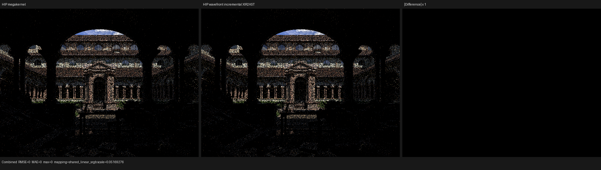

The production profiles are under
`/var/tmp/psycles-coro-xir2ast-rollback-R3UePOQQ`,
`/var/tmp/psycles-coro-xir2ast-rollback-2-CFPXc1wX`, and
`/var/tmp/psycles-coro-xir2ast-rollback-3-3grjImWu`; the full-map oracle is
under `/var/tmp/psycles-coro-xir2ast-oracle-m0tEmzcV`. The exact 640x480 HIP
pair is under `/var/tmp/psycles-coro-xir2ast-hip-640-mega-z1kQeEDG` and
`/var/tmp/psycles-coro-xir2ast-hip-640-repeat-i2FBXwRq`.

## Dense verifier pointer indices

The next host profile showed that verifier time was no longer dominated by
the sparse immediate-dominator algorithm. Psycles deliberately builds Luisa
with the system STL, so each entry in the verifier's short-lived
`std::unordered_map` and `std::unordered_set` pointer relations required a
separate node allocation. The relations include exact use-list ownership,
instruction location, block ownership, sanitized CFG adjacency, reachable
blocks, merge ownership, and the block-to-dominator index.

These relations have a narrower formal contract than a general node map:

- their keys are immutable object pointers and the tables live for exactly one
  verification boundary;
- no iterator, reference, or element address survives an insertion;
- lookup correctness is exact pointer equality, including after a hash
  collision;
- iteration order is not observable in either acceptance or diagnostics.

Luisa `next@655b4def1` therefore uses one verifier-private, contiguous
open-addressed table for these relations regardless of whether the surrounding
build uses system STL or EASTL. Raw pointer bits are passed through the table's
wyhash finalizer, but hashes only choose candidate buckets: equality remains
the correctness predicate, so this optimization makes no collision-probability
assumption. The verifier's accepted language, entry/exit placement, and error
messages are unchanged. A compile-time regression requires random-access
iteration over the contiguous value store; the public high-fanout test still
proves linear use-list scanning and deliberately moves a `Use` into the wrong
owner's intrusive list to prove exact rejection.

The same strict native-XIR Vulkan Lone Monk canary was sampled with
`perf record` before and after the container change. Both observations include
identical profiler overhead and the complete 37-material coroutine:

| Coroutine boundary | Before | Dense indices | Speedup |
| --- | ---: | ---: | ---: |
| input verification | 302.369 ms | 127.713 ms | 2.37x |
| output verification | 331.983 ms | 132.681 ms | 2.50x |
| XIR-to-AST continuation translation | 579.770 ms | 318.126 ms | 1.82x |
| complete coroutine lowering | 1,933.064 ms | 1,143.385 ms | 1.69x |

XIR-to-AST also improves because continuation translation verifies cached
ordinary callables through the same verifier implementation. Three production
runs, without sampling overhead, completed lowering in `1,337.740`,
`1,170.828`, and `1,137.696` ms; the median is `1,170.828` ms. CFG distillation
remained approximately 318--334 ms, so the result is not a hidden removal of a
pass or verifier boundary.

The strict Vulkan display, Combined, Normal, and Albedo files are byte-identical
to the pre-change files and retain the four hashes above. The all-scheduler
suite passes 61 assertions in 12 tests independently on fallback, HIP, and
strict native-XIR Vulkan, including the dead-front-end-token and empty-live-set
cases. The standalone Luisa XIR/coroutine selection passes 56/56 tests, and the
Psycles system-STL suite passes 265/265 tests. The broader standalone Luisa
suite passes 116/117 tests; the independently repeatable exception is the
pre-existing EASTL `fixed_vector` move-allocation test, which does not execute
XIR or the verifier.

The pre-change profile is under
`/var/tmp/psycles-coro-perf-post-nVTA4U`; the matched dense-index profile is
under `/var/tmp/psycles-coro-verifier-dense-perf-DwZ0iC`, the three production
runs are under `/var/tmp/psycles-coro-verifier-dense-aiiY2k`, and the exact
strict-Vulkan output is under
`/var/tmp/psycles-coro-verifier-dense-strict-0uAoS1`.

## Explicit intrusive use-list ownership

The next profile showed that exact use-list membership remained the largest
sampled verifier cost. Even the contiguous table above was representing a
relation that the intrusive list already owns structurally. Luisa
`next@74cde8c2a` makes that relation explicit instead of reconstructing it at
each verification boundary.

For every `Use` node `u`, define its logical owner as `u.value()` and its
physical owner as the `UseList` that currently links it. The validity condition
is now the exact invariant

`physical_owner(u) = logical_owner(u).use_list()`.

`UseList::push_front` assigns the physical owner in the same non-throwing
transition that links the node, and `Use::remove_self` clears it in the same
transition that unlinks the node. Membership is therefore

`u != null and u.list_owner == list and u.is_linked()`,

which is an O(1) identity predicate with no traversal, hash, collision
assumption, or verifier-local cache. Logical and physical ownership remain
independent so the verifier still detects both a detached non-null operand and
a `Use` deliberately linked into the wrong value's list. The high-fanout
regression performs both corruptions, restores the node through the public
lifecycle, and asserts zero membership-traversal steps.

The representation adds one pointer (eight bytes on this host) to each live
`Use`. In exchange, every verifier invocation removes its temporary per-use
owner-map entries and buckets; this is a deliberate persistent-versus-transient
layout tradeoff, not an unmeasured peak-RSS claim.

On the unchanged 37-material strict native-XIR Vulkan canary, three production
runs produced the following medians relative to the dense-index checkpoint:

| Coroutine boundary | Dense indices | Explicit owner | Speedup |
| --- | ---: | ---: | ---: |
| input verification | 129.875 ms | 81.803 ms | 1.59x |
| output verification | 131.460 ms | 82.478 ms | 1.59x |
| XIR-to-AST continuation translation | 340.697 ms | 192.445 ms | 1.77x |
| complete coroutine lowering | 1,170.828 ms | 910.924 ms | 1.29x |

The three complete lowering observations were `910.924`, `916.479`, and
`834.472` ms. Relative to the pre-incremental-map median of `1,881.809` ms,
the combined verifier and XIR-to-AST work is now about 2.07x faster. The strict
Vulkan render completed without loading DXC and retained the exact display,
Combined, Normal, and Albedo hashes recorded above.

The standalone XIR/coroutine selection passes 56/56 tests. The all-scheduler
suite passes 61 assertions in 12 tests on fallback, HIP, and strict native-XIR
Vulkan; this includes an optimized-away front-end suspend with no lowered
callable, sparse surviving tokens, `T_live = empty`, and a source coroutine
with no suspend at all. Psycles passes 265/265 tests. The broader standalone
Luisa suite again passes 116/117; its sole failure is the independently
repeatable, pre-existing EASTL `fixed_vector` move-allocation test, which does
not execute XIR or the verifier.

The three production runs are under
`/var/tmp/psycles-coro-use-owner-kWg5Wa`; the exact strict-Vulkan output is
under `/var/tmp/psycles-coro-use-owner-strict-zDkJMn`.

## One value-number domain for all coroutine liveness

The post-owner profile moved the dominant distillation cost to repeated
materialization of the same `Value *` relations. Block summaries first built
node-based pointer sets, each scope converted those sets into a private bit
domain, and inter-scope liveness converted the results back into fresh pointer
sets on every fixed-point iteration. Output ordering then hashed and sorted the
same values again.

Luisa `next@ae0a91e9c` assigns one exact value number to every possible frame
value in the optimized source coroutine. The domain covers the complete raw
function block list, not ordinary entry-root CFG traversal: a `coro.resume`
root is deliberately disconnected from the entry in raw CFG and may contain
values that only the logical coroutine graph can reach. Pointer hashes only
locate a number; exact pointer equality remains the lookup predicate.

Every block summary, scope fixed point, transition relation, and backward
liveness equation now uses that same bit coordinate system. For a block `B`,
the existing formal transfer is unchanged:

`K_out = K_in union K_B`,

`T_out = T_in union T_B`, and

`E_out = E_in union (E_B - K_in)`.

`K` remains a forward must fact initialized to top outside the entry boundary;
`T` and `E` remain forward may facts. Across distilled scopes, live-at-entry is
the least fixed point

`L_s = E_s union union_(edge s->t) (L_t - K_edge)`.

The implementation uses a reverse-dependency worklist for this equation and
materializes public pointer/name vectors exactly once after convergence. If
`V` is the value domain and `W = ceil(|V| / 64)`, fixed-point set operations
are contiguous `O(W)` word operations. There is no per-value node allocation
inside the production solvers.

Distilled scopes are intentionally not assumed to partition blocks. A bypass
path and a resumed path may share a downstream merge, so membership is the
relation `(scope, local block index)`. The established first-root owner remains
the canonical target only where a cross-scope edge requires one. A dedicated
regression constructs this overlap and also places an SSA value exclusively in
the disconnected resume root.

This analysis consumes scopes after reachable suspend discovery. It cannot
resurrect a token in `T_front - T_live`: an optimized-away suspend still has no
scope node and no lowered callable. Sparse surviving tokens and the
`T_live = empty` entry-only coroutine retain the same graph contract.

On the 37-material Lone Monk source coroutine, the measured domain has 35,830
values (560 64-bit words), four scopes, 237 `(scope, block)` memberships, and
eight transitions. The two intra-scope fixed points performed 1,516 block
evaluations; backward inter-scope liveness converged in ten scope evaluations.

Three strict native-XIR Vulkan production runs compare as follows. Both columns
are medians without sampling overhead:

| Coroutine boundary | Explicit-owner checkpoint | Shared value domain | Speedup |
| --- | ---: | ---: | ---: |
| input verification | 81.803 ms | 78.212 ms | 1.05x |
| CFG distillation | 327.070 ms | 18.015 ms | 18.16x |
| output verification | 82.478 ms | 82.383 ms | 1.00x |
| XIR-to-AST continuation translation | 192.445 ms | 170.537 ms | 1.13x |
| complete coroutine lowering | 910.924 ms | 524.369 ms | 1.74x |

The complete lowering observations were `533.990`, `524.264`, and `524.369`
ms. Relative to the earlier `1,881.809` ms median, the accumulated formal
optimizations are now 3.59x faster. The result remains four callables with 297
frame fields / 1,424 bytes. Strict Vulkan did not load DXC, and display,
Combined, Normal, and Albedo retained the four exact hashes above.

`LUISA_CORO_VERIFY_DENSE_DATAFLOW=1` still runs the former pointer solver as an
oracle. It now compares every per-scope external/touched/exit set and every
inter-scope live-in/live-out/edge-store set. The complete Lone Monk oracle run
passed, as did 170 assertions in 25 focused distillation tests in both normal
and oracle modes. The broader validation remains 56/56 focused XIR/coroutine
tests, 61 assertions in 12 all-scheduler tests on fallback, HIP, and strict
native-XIR Vulkan, and 265/265 Psycles tests. Standalone Luisa remains 116/117
only because of the independently repeatable EASTL `fixed_vector` test.

The 640x480 HIP wavefront render was repeated three times. The first reproduced
the already documented one-pixel `DiffInd` execution nondeterminism at
`(367, 306)` (Combined RMS `0.000736118`); Normal and Albedo were exact. The
next two processes matched the megakernel display and all linear passes
byte-for-byte, and exact-channel `idiff` reported `PASS` across all 46 EXR
channels. Their shared primary hashes are the four HIP hashes recorded in the
incremental XIR-to-AST section above.

The exact repeat triptych was opened at its original 1920x516 resolution.
Building silhouette, roof, windows, statues, foreground steps, grass, and the
individual one-sample fireflies coincide. The absolute-difference panel is
black, consistent with the byte-identical files.

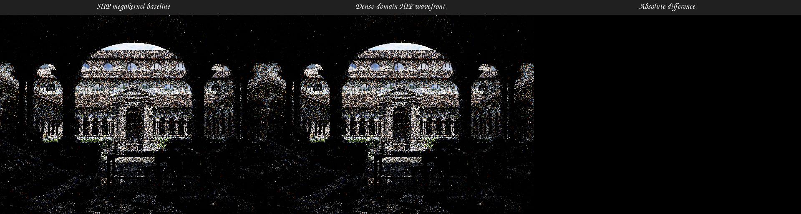

The three strict production runs are under
`/var/tmp/psycles-coro-global-value-domain-NrJavG`; the complete pointer-oracle
run is under `/var/tmp/psycles-coro-global-value-domain-oracle-L8ii2a`, the
instrumented metric run is under
`/var/tmp/psycles-coro-global-value-domain-metrics-iBxLRX`, the HIP repeats are
under `/var/tmp/psycles-coro-global-value-domain-hip-640-5nw5nM`, and the next
hotspot profile is under
`/var/tmp/psycles-coro-global-value-domain-perf-P9m0HU`.

## One verified boundary for a continuation batch

The shared-domain profile showed that XIR-to-AST translated 59 roots/helpers
but also invoked the function verifier repeatedly after the coroutine pipeline
had already verified the complete output module. Luisa `next@3fdf821c0` makes
the verification responsibility explicit. The safe standalone API retains
independent per-function verification. A continuation batch may instead ask
for one synchronous whole-module verification before translating any root.

Formally, let `M` be the immutable output module, `R` the materialized
continuation roots, and `D(R)` their recursively reached ordinary callable
dependencies. Batch translation first proves the full XIR-to-AST precondition
`P(M)`, including no phi nodes and canonical break/continue targets. It then
creates an internal, non-escaping capability `V_M`. Verification may be elided
for a translated function `f` exactly when

`f in R union D(R)` and `parent_module(f) = M`.

Every root is checked for non-null callable type and exact module identity
before `V_M` is created, and every dynamically discovered helper repeats the
module-identity check before using it. A caller cannot supply a bare
"already verified" flag or capability. Thus the batch changes the proof from
`P(f_1), ..., P(f_n)` to the stronger single fact `P(M)`; it does not create a
validation-free route. The coroutine pipeline now has one verifier at its
input boundary and this one verifier at its output boundary, with no verifier
inside translation unless an explicit diagnostic mode requests additional
checks.

This boundary also preserves the optimized-away-suspend corner case. The
batch root set is still

`R = {entry} union {continuation(t) | t in T_live}`,

not a reconstruction from `T_front`. Consequently a token in
`T_front - T_live` contributes neither a root definition nor a lowered
callable, sparse surviving token values are unchanged, and
`T_live = empty` still supplies the token-zero entry root. Whole-module
verification validates what was materialized; it never invents a missing
front-end token/callable pairing.

The production path asserts exactly one module verification and zero
per-function verifications and reports both counts. On the unchanged
37-material strict native-XIR Vulkan canary, all three runs reported
`module_verifications=1`, `function_verifications=0`, 59 translated functions,
and 1,146 callable-cache hits:

| Coroutine boundary | Shared value domain | Batch verification | Speedup |
| --- | ---: | ---: | ---: |
| output verification | 82.383 ms | 81.727 ms | 1.01x |
| XIR-to-AST continuation translation | 170.537 ms | 86.763 ms | 1.97x |
| output verify + translation | 252.920 ms | 168.490 ms | 1.50x |
| complete coroutine lowering | 524.369 ms | 441.566 ms | 1.19x |

The three complete observations were `441.566`, `441.159`, and `443.067` ms.
Relative to the original `1,881.809` ms median, the accumulated formal
lowering optimizations are now 4.26x faster. Output remained four callables,
297 frame fields, and 1,424 bytes. Strict Vulkan loaded no DXC and retained the
exact display, Combined, Normal, and Albedo hashes recorded above.

Regressions separately assert the one-module/zero-function batch contract and
the default zero-module/one-function standalone contract. The focused
XIR-to-AST and generic coroutine pipeline tests pass; the all-scheduler suite
passes 61 assertions in 12 tests on fallback, HIP, and strict native-XIR
Vulkan, including dead/sparse/empty live-token cases. Psycles passes 265/265.
The broader standalone Luisa suite remains 116/117 solely because of the
pre-existing EASTL `fixed_vector` allocation test.

The strict output and full log are under
`/var/tmp/psycles-coro-batch-verify-t57YxF`; the three timing runs are under
`/var/tmp/psycles-coro-batch-verify-median-PZQSaI`.

## One enclosing verification transaction

The continuation-batch change removed repeated verification inside XIR-to-AST,
but a subsequent profile found the same generic verifier at the boundary of
each composed CFG pass. Standalone pass calls need those boundaries; the
coroutine pipeline, however, already owns a complete module input boundary and
a complete module output boundary. Rechecking the whole use-def/CFG domain at
every internal function pass was redundant.

Luisa `next@d589aef8a` expresses that composition with a non-forgeable
`XIRPassVerificationTransaction`, rather than a public skip boolean. Let `M` be
the exact module and let `P(M)` mean that the generic XIR verifier accepts the
entire module. The transaction protocol is:

1. `begin_xir_pass_verification_transaction(M)` first proves `P(M)` and only
   then returns the witness `V_M`.
2. A composed pass on `f` may elide only its generic boundary verifier, and
   only while `parent_module(f) = M` and `V_M` remains open. Every
   transform-specific precondition remains active.
3. The final continuation batch calls `verify_output` exactly once with the
   stronger XIR-to-AST requirements, then translates the immutable verified
   output. A transaction that is abandoned, reused after closure, or applied
   to a different module is rejected.

The same rule applies to the module overload of `restructure_cfg`; composing
it requires disposable in-place mutation. Transactional shadow/replay mode
continues to own its standalone verification because its commit proof depends
on the candidate-output verifier. `LUISA_XIR_VERIFY_INTERMEDIATE=1` deliberately
passes no witness to internal passes, restoring their standalone boundaries as
an explicit diagnostic oracle.

This protocol does not equate front-end suspend candidates with lowered
callables. Optimization still runs before CFG distillation, so the materialized
root domain remains

`R = {entry} union {continuation(t) | t in T_live}`.

In particular, a suspend in optimized-away control flow is in
`T_front - T_live` and has no graph node or callable. Surviving token values may
be sparse, and `T_live = empty` still produces only the token-zero entry. The
verification transaction proves the integrity of this optimized result; it
does not fabricate a continuation for a dead front-end token.

On the unchanged 37-material, 1x1/1 spp strict native-XIR Vulkan canary, three
production runs reported two enclosing boundaries, zero nested pass boundaries,
one whole-module XIR-to-AST verification, and zero per-function XIR-to-AST
verifications. No DXC module was loaded:

| Coroutine lowering | Batch-only boundary | Enclosing transaction | Speedup |
| --- | ---: | ---: | ---: |
| complete median | 441.566 ms | 387.938 ms | 1.14x |
| source destructuring median | 4.5 ms before composition | 0.034 ms | about 132x |
| CFG distillation median | 18.0 ms before composition | 8.913 ms | about 2.0x |
| continuation destructuring median | 15.2 ms before composition | 4.032 ms | about 3.8x |
| irreducible lowering median | 11.0 ms before composition | 0.054 ms | about 204x |
| continuation restructuring median | 39.2 ms before composition | 17.070 ms | about 2.3x |

The complete observations were `382.370`, `387.938`, and `401.263` ms. The
remaining output verifier and XIR-to-AST translation medians were `82.639` and
`87.149` ms respectively. Relative to the original `1,881.809` ms median, the
accumulated formal lowering optimizations are now about 4.85x faster. With the
diagnostic environment flag enabled, the same scene reported 18 nested pass
boundaries and `575.368` ms total, confirming that the production reduction is
specifically the removal of redundant generic verification.

All three production outputs retained the exact display, Combined, Normal, and
Albedo hashes recorded above. The all-scheduler regression reports 65 passing
assertions in 12 tests on fallback, HIP, and strict native-XIR Vulkan. It covers
the sparse-live-token, all-dead-token, and no-front-end-token cases on every
scheduler. Psycles passes 265/265; the standalone Luisa suite passes 116/117,
with only the pre-existing EASTL `fixed_vector` allocation test failing. The
strict production outputs are under
`/var/tmp/psycles-coro-transaction-strict-W7Uboo`, and the explicit diagnostic
output is under `/var/tmp/psycles-coro-transaction-diagnostic-nvX0Ib`.

## Dense transient translator state

The next phase-separated profile showed two independent node-map costs at the
translation boundaries. XIR-to-AST inserted 341,775 short-lived value bindings
and rolled back 201,904 branch-local bindings. AST-to-XIR represented every
function-local `Variable -> Value *` relation with a node-based hash table even
though `Variable::operator==` is exactly UID equality.

Luisa `next@e40215df0` changes only the XIR-to-AST binding container. No
iterator or element address survives insertion or rollback, so node stability
is unobservable. The replacement uses the verifier's contiguous dense pointer
map: pointer hashes select a candidate bucket and exact pointer equality still
decides identity. Callable recursion continues to move a complete binding
frame aside, and structured branches still restore exactly the insertion-log
suffix. The existing full-map checkpoint oracle and the shared-constant
caller/callee round trip therefore exercise the same scope semantics.

Luisa `next@f4ae17f8a` removes the remaining AST-to-XIR variable hash entirely.
For a builder `B`, `FunctionBuilder` assigns variable UIDs monotonically and
`Variable(a) = Variable(b)` exactly when `uid(a) = uid(b)`. Translation already
owns one `Current` frame per function, so the exact binding relation is the
partial vector

`binding_B[uid(v)] = translated value of v`.

Null slots are intentional builtin-variable holes; builtins take their
separate special-register path. Recursive caller and callee frames may reuse
the same UID without aliasing. A new regression creates six builtin holes in a
kernel, local values after those holes, and a callable whose independent UID
domain overlaps the kernel. It verifies all six exact special registers, the
call edge, and the resulting module.

Neither optimization changes the coroutine root domain. Translation still
receives

`R = {entry} union {continuation(t) | t in T_live}`.

A suspend removed with dead control flow remains in
`T_front - T_live`: it has no graph node and no lowered callable for either
translator to discover. Sparse surviving token values and the entry-only
`T_live = empty` case therefore retain their established scheduler mapping.

On the unchanged 37-material, 1x1/1 spp strict native-XIR Vulkan canary, three
cache-disabled production runs after both changes measured:

| Coroutine phase | Verified transaction | Dense translator state | Speedup |
| --- | ---: | ---: | ---: |
| AST-to-XIR translation | 78.364 ms sampled | 42.865 ms median | 1.83x |
| input verification | 79.433 ms | 74.045 ms | 1.07x |
| CFG distillation | 8.913 ms | 9.083 ms | 0.98x |
| output verification | 82.639 ms | 80.232 ms | 1.03x |
| XIR-to-AST continuation translation | 87.149 ms | 55.006 ms | 1.58x |
| complete coroutine lowering | 387.938 ms | 309.873 ms | 1.25x |

The complete observations were `310.187`, `309.263`, and `309.873` ms. The
AST-to-XIR observations were `42.865`, `42.880`, and `42.768` ms; XIR-to-AST
was `55.546`, `54.863`, and `55.006` ms. Relative to the original
`1,881.809` ms checkpoint, formal lowering work is now about 6.07x faster. A
post-container `perf` capture reduced `_expr` from 18.52% to 3.03% of the
XIR-to-AST window and removed the value-map hash-table symbol from that window;
the remaining cost is primarily AST node construction and
`FunctionBuilder::local`, so a second value-number layer was not added.

All runs retained 59 translated functions, 1,146 callable-cache hits, four
continuations, 297 frame fields, and a 1,424-byte frame. The three display,
Combined, Normal, and Albedo files are byte-identical to each other and retain
the four hashes above. DXC was absent. The AST/XIR translator regression passes
116 assertions in 26 tests, and the all-scheduler suite passes 65 assertions in
12 tests independently on fallback, HIP, and strict native-XIR Vulkan.

The isolated dense value-map output is under
`/var/tmp/psycles-coro-value-map-gxjnFS`, its profile is under
`/var/tmp/psycles-coro-value-map-perf-uAQ33J`, and the three final production
runs are under `/var/tmp/psycles-coro-variable-bindings-9qpiRm`.

## One immutable instruction-fact table per verifier function

After the translator containers were made dense, the two required whole-module
verifier boundaries dominated coroutine lowering. Sampling showed repeated
virtual instruction classification in both the structural-discovery pass and
the detailed semantic pass. Luisa `next@cb43134bb` now classifies every owned
instruction exactly once and records the immutable tuple

`F(i) = (parent block, order in block, derived tag, operand-shape validity)`.

CFG discovery, dominance checks, PHI edge validation, and instruction-specific
semantic checks consume `F`; they no longer repeat virtual tag dispatch or
rebuild separate block and order maps. Opcode validity is still checked before
operand-shape or opcode-specific semantic access, so malformed IR cannot drive
an unsafe downcast. The complete input and output verifier boundaries are
unchanged. A verifier statistic and high-fanout regression assert

`instruction_tag_queries = number of owned instructions`.

This optimization also leaves coroutine root selection unchanged. If
`T_front` is the front-end suspend-token set and `T_live` is the reachable set
after optimization, the translated root set remains

`R = {entry} union {continuation(t) | t in T_live}`.

Thus a suspend in optimized-away control flow has no graph node, root
definition, or lowered callable. The surviving token values remain sparse and
the schedulers map them to dense queue indices only after callable/token pairs
have been materialized. The all-dead case still yields only the token-zero
entry callable.

Three cache-disabled strict native-XIR Vulkan runs of the unchanged 37-material
1x1/1 spp Lone Monk canary measured:

| Coroutine phase | Dense translator state | Instruction facts | Speedup |
| --- | ---: | ---: | ---: |
| AST-to-XIR translation | 42.865 ms | 41.367 ms | 1.04x |
| input verification | 74.045 ms | 54.438 ms | 1.36x |
| CFG distillation | 9.083 ms | 9.235 ms | 0.98x |
| output verification | 80.232 ms | 59.010 ms | 1.36x |
| XIR-to-AST continuation translation | 55.006 ms | 55.135 ms | 1.00x |
| complete coroutine lowering | 309.873 ms | 268.156 ms | 1.16x |

The complete observations were `268.156`, `265.118`, and `270.677` ms. Relative
to the original `1,881.809` ms checkpoint, complete coroutine lowering is now
about 7.02x faster. All runs retained 59 translated functions, 1,146 callable
cache hits, four continuations, 297 frame fields, and a 1,424-byte frame; DXC
was absent. Display, Combined, Normal, and Albedo retained their exact hashes.

The focused translator/coroutine selection passes 7/7 tests. The scheduler
matrix passes 65 assertions in 12 tests independently on fallback, HIP, and
strict native-XIR Vulkan, including the dead/sparse/empty suspend-token cases.
Psycles passes 265/265. Standalone Luisa passes 116/117, with only the existing
EASTL `fixed_vector` move/allocation test failing. The three production runs
are under `/var/tmp/psycles-coro-verifier-facts-K2XVac`; scheduler logs are
under `/var/tmp/luisa-coro-verifier-facts-matrix-9Hb8ro`.

## Immutable type tags at the verifier boundary

The post-instruction-facts profile showed that the remaining verifier cost was
not another graph algorithm: repeated `Type::tag()` and tag-only predicates
were crossing the `libluisa-ast` shared-library boundary. Luisa types are
globally interned, and their primary discriminator obeys the stronger lifetime
invariant

`published(type) => tag(type) was initialized and never changes`.

Luisa `02fabefb7` therefore stores the discriminator in the public `Type` base
representation and inlines every predicate that depends only on that
discriminator. The registry initializes the field before inserting a type into
the intern table; unpublished, partially decoded types are never observable.
Compile-time assertions pin the contiguous scalar, arithmetic, floating-point,
and resource tag ranges used by the predicates. They also require

`sizeof(Type) = sizeof(Type::Tag)` and
`alignof(Type) = alignof(Type::Tag)`.

The private implementation places its 32-bit `size` beside the 32-bit base tag
before the 64-bit hash. This fills the first aligned word instead of introducing
padding merely because the previously empty base became non-empty. A regression
constructs all 26 registered type tags and verifies the exact tag, the
scalar/arithmetic/basic/resource partitions, and a one-hot exact-predicate
match. Missing a registry assignment would expose the default tag and fail this
test.

Three cache-disabled strict native-XIR Vulkan runs of the same 37-material
1x1/1 spp Lone Monk canary measured:

| Coroutine phase | Instruction facts | Inline type tags | Speedup |
| --- | ---: | ---: | ---: |
| AST-to-XIR translation | 41.367 ms | 41.897 ms | 0.99x |
| input verification | 54.438 ms | 40.366 ms | 1.35x |
| CFG distillation | 9.235 ms | 9.125 ms | 1.01x |
| output verification | 59.010 ms | 44.056 ms | 1.34x |
| XIR-to-AST continuation translation | 55.135 ms | 55.976 ms | 0.98x |
| complete coroutine lowering | 268.156 ms | 240.378 ms | 1.12x |

The complete observations were `276.896`, `240.378`, and `235.663` ms. Relative
to the original `1,881.809` ms checkpoint, complete coroutine lowering is now
about 7.83x faster. All runs retained 59 translated functions, 1,146 callable
cache hits, four continuations, 297 frame fields, a 1,424-byte frame, and the
535,992-to-488,499-word surface SPIR-V result. DXC was absent. Display,
Combined, Normal, and Albedo remained bit-identical to the preceding checkpoint.

The fallback, HIP, and strict native-XIR Vulkan scheduler matrices each pass 65
assertions in 12 tests, including optimized-away, sparse, all-dead, and empty
suspend-token domains. Psycles passes 265/265. Standalone Luisa passes 116/117,
with only the pre-existing EASTL `fixed_vector` move/allocation test failing.
The final production runs are under
`/var/tmp/psycles-coro-inline-type-tag-final-tAOtDL`; scheduler logs are under
`/var/tmp/luisa-coro-inline-type-tag-matrix-gNiyeQ`.

## Kernel-rooted SPIR-V pointer legalization

The largest surface continuation exposed a semantic-domain bug after
coroutine splitting. Inlining a reference wrapper could make one callable
unreachable from every kernel while an orphaned block still physically owned
a function operand referring to it. Whole-module resource-origin analysis then
treated that dead edge as an unresolved incoming edge. The proof of a unique
read-only resource origin failed, so pointer legalization specialized and
inlined 117 resource-helper calls that were not required by executable code.

Luisa `next@f2c5689d5` now defines pointer legalization over the exact
kernel-rooted SPIR-V structural call graph. If `R` is the least set containing
all kernel definitions and closed under function operands in each definition's
codegen structural closure, then argument usage, read-only resource origins,
and pointer-call planning operate only on `R`. Function operands in physically
owned but structurally unreachable blocks cannot contribute data-flow edges.
After each successful inline mutation batch, unreachable callable definitions
are physically removed so later fixed-point iterations, whole-module passes,
and SPIR-V emission observe the same domain.

This composes with the suspend-token invariant rather than weakening it. For
front-end suspend tokens `T_front` and optimized live tokens `T_live`, the
coroutine roots are still

`{entry} union {continuation(t) | t in T_live}`.

A suspend in `T_front - T_live` therefore creates neither a graph node nor a
lowered callable, and cannot re-enter `R` through an orphan physical use.
Surviving sparse token values and the entry-only `T_live = empty` case remain
unchanged.

The cache-disabled strict native-XIR Vulkan Lone Monk wavefront canary measured
the material-heavy fourth continuation as follows:

| Surface continuation metric | Before | Kernel-rooted domain | Change |
| --- | ---: | ---: | ---: |
| planned pointer calls | 124 | 7 | -94.4% |
| pointer-argument legalization | 2,680.78 ms | 1,390.40 ms | 1.93x faster |
| complete XIR legalization | 4,423.50 ms | 2,891.63 ms | 1.53x faster |
| inline-summary instruction scans | 1,407,757 | 379,413 | -73.1% |
| optimized SPIR-V size | 488,499 words | 403,486 words | -17.4% |
| AST-to-SPIR-V | 8,598.243 ms | 6,670.555 ms | 1.29x faster |

The new regression constructs a live kernel-to-wrapper-to-resource-helper
chain plus an orphan block whose callable reaches the same helper through an
unresolved resource formal. It requires exactly the two live reference
wrappers to be specialized, requires the orphan callable to be pruned, keeps
the uniquely rooted helper outlined, and validates the emitted SPIR-V. The
focused suite passes 207 assertions in 22 tests. All 72 SPIR-V/XIR/coroutine
tests pass. The full standalone Luisa suite passes 116/117; only the existing
EASTL `fixed_vector` allocation/move test fails.

The production output remained byte-identical across the change:

| Output | SHA-256 |
| --- | --- |
| display PPM | `3ff6c5463ace13c0f26a735ac1af2bb96ab8a9ba1cb4398359cf2466f63a4d1b` |
| Combined PFM | `4f93bceff43a46a086454e9a50745a497b39cd27e8a694f617a5c934fe3ed3eb` |
| Normal PFM | `acf82e26ab479853be41ff9b3cc348b740cbb77f37671db0d1864efa09052bd0` |
| Albedo PFM | `8e79df2a612628d23badc4d3dd3dcb8ca2e0d8428bcc10ee77edfe44a5cf562f` |

The final trace and outputs are under
`/var/tmp/psycles-pointer-domain-fused-5ahU8s`; the before trace is
`/var/tmp/psycles-vk-shape-W5Wg9h/wavefront.log`.

## Sparse semantic call-site index

The kernel-rooted domain fix removed dead calls from the analysis, but the
pointer legalizer still rediscovered the same live calls independently for
read-only resource origins, specialization planning, and recursion detection.
Luisa `next@a3ed7741c` now records call sites while argument usage is already
walking each exact structural closure. The resulting index is filtered by the
same semantic function domain and is consumed as one immutable analysis
snapshot. A snapshot is discarded after every IR mutation, so it cannot retain
stale `CallInst` pointers across an inline iteration.

The completeness requirement is explicit: the indexed origin solver is sound
only for the complete call-site set produced with its matching usage map. Its
standalone module overload remains conservative and builds that complete set
itself. Regressions cover a 128-call resource chain and the live-chain-plus-
orphan case. The latter contains only the three executable calls in its index,
proves exactly three resource origins, and cannot assign an origin to the
orphan formal.

On the same cache-disabled strict native-XIR Vulkan Lone Monk canary:

| Metric | Kernel-rooted scan | Sparse index | Change |
| --- | ---: | ---: | ---: |
| pointer-argument legalization | 1,390.40 ms | 673.65 ms | 2.06x faster |
| complete XIR legalization | 2,891.63 ms | 2,149.555 ms | 1.35x faster |
| AST-to-SPIR-V | 6,670.555 ms | 5,865.034 ms | 1.14x faster |
| total JIT | 7.45041 s | 6.62611 s | 1.12x faster |
| optimized SPIR-V | 403,486 words | 403,486 words | unchanged |

The call index contained 4,755 cumulative sites across four fixed-point
snapshots and still planned only seven pointer calls. The four output hashes
listed above remained identical. The focused pointer suite passes 343
assertions in 22 tests, all 72 related SPIR-V/XIR/coroutine tests pass, and
Psycles passes 265/265.

## EASTL fixed-vector move ownership

The formerly tolerated standalone failure was a real ownership defect rather
than a flaky test. In the Luisa EASTL fork, the overflow move constructor asked
whether the newly initialized destination had already overflowed, making its
heap-transfer branch unreachable. The overflow-to-overflow assignment then
overwrote the destination pointer triplet without transferring or releasing
its old allocation. Reconstructing the still-live source object with placement
new also bypassed its object lifetime.

EASTL `0bdb517c8` and Luisa `next@fadc1c6f1` establish the invariant that each
`fixed_vector` either points at its own inline buffer or uniquely owns a
complete `(begin, end, capacity)` heap triplet allocated by a compatible
overflow allocator. Compatible heap storage is transferred or swapped as a
whole. Incompatible storage takes the element-wise path: the destination first
releases its old storage, moved-from source elements are destroyed, and the
source releases its allocation and returns to its own inline buffer. No live
object is overwritten with placement new. The fixed-container
`max_size() == nodeCount` contract is restored as well.

Three tagged-allocator regressions pin allocator propagation, reject an
incompatible explicit-constructor steal, and reject an incompatible
non-propagating move-assignment steal. The allocator/lifetime suite passes
2,995 assertions in 47 tests under both the normal build and ASan+UBSan with
leak detection. The complete standalone Luisa suite now passes 117/117; the
previous 116/117 exception is resolved.

## Multi-sample renderer equivalence after the cut

The actual Lone Monk renderer was also run through the new loop-header cut with
four samples in one dispatch. At 16x16 on fallback, megakernel and wavefront
produced byte-identical display and linear passes:

| Output | SHA-256 shared by megakernel and wavefront |
| --- | --- |
| display PPM | `a0dcfa771396c998feab88b5c6ee5fb5a2248b93ec1bcb5c0cf9d01e48dbf7aa` |
| Combined PFM | `3f59ab4c3ca5fcc957ef228acccc208059b4f34b52fd588e3768042052bc6477` |
| Normal PFM | `f14a2c3fd58474d662060ea30380f8f4c76028e7cb84fc1de26da58e81423d72` |
| Albedo PFM | `17b1a2ba9c5d81e9ae483ef734f39bb0a0f041dd216e4dbbebd56f96b703d0a0` |

Exact-channel `idiff` also reports `PASS` for the multilayer EXR. The display
output was opened after nearest-neighbour enlargement: the coarse Lone Monk
framing, bright sky/window region, warm wall, dark foreground, and green grass
are present, with no scheduler-dependent difference (the source images are
byte-identical). The megakernel rendered in 0.0127 seconds after 0.0818 seconds
of JIT; wavefront rendered in 0.0399 seconds after 48.173 seconds of JIT. This
confirms sample-state equivalence while also showing that continuation
generation, especially the material-heavy surface continuation, remains the
dominant engineering problem.

## Visual inspection

The triptych was opened at its original 1968x525 resolution. Camera framing,
silhouettes, grass, windows, bright roof surfaces, and the sparse one-sample
fireflies coincide in all three panels; no scheduler-dependent structural or
shading difference is visible. This agrees with the byte-exact PPM/PFM result.

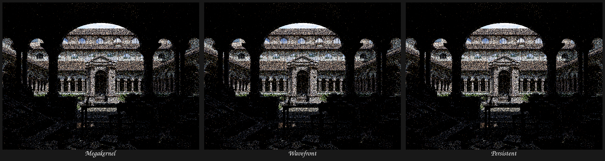

The source `.blend` enables Cycles adaptive sampling and denoising, while these
Psycles rows intentionally use fixed one-sample, un-denoised output. Therefore
this image must not be used as a Cycles quality gate; the established high-spp
five-way validation remains the Cycles-alignment evidence.

## Access-path frame analysis and snapshot projection

The next frame-reduction step was derived from the earlier Rust coroutine
implementation in `/home/mike/Projects/LuisaCompute-coroutine`, specifically
its `AccessTree`, recursive frame-leaf construction, and `defer_load` transform.
The transferable invariant is not “scalarize every aggregate.” It is:

- liveness identities are `(storage root, statically known access path)`;
- distinct identities may be separated only when their byte ranges are
  disjoint;
- a projected load must remain at the original aggregate-load position, so an
  intervening store cannot change the observed snapshot;
- dynamic indices, overlapping observations, atomics, and reference escape
  collapse conservatively to the whole storage root.

A controlled fixed-point SROA experiment demonstrated why source-wide
scalarization is the wrong implementation. It reduced the raw frame from 1,424
to 1,328 bytes, but increased the dense value domain from 35,830 to 41,482
atoms and increased complete lowering from about 247 to 297 ms. That experiment
was reverted. The production implementation instead keeps source aggregates
intact and refines only the coroutine dataflow domain and frame ABI.

Luisa `next@817325f71` now gives each ordinary SSA value one atom and constructs
disjoint atoms for static local-memory observations. Merely computing a GEP
uses its index operands; it does not read the pointee. Stores are mapped to
overlapping observation atoms, and split/materialization spill and reload the
exact static path. The certificate schema covers the access paths and all
index-based scope/edge relations, while legacy root lists remain diagnostic
views rather than the authoritative state.

The new snapshot-projection pass rewrites
`extract(load(local), static-path)` into a projected `load(gep(...))` at the
original load position. It visits every function-owned block, not only blocks
reachable from the entry: a raw `CoroSuspend` deliberately disconnects resume
roots from the ordinary CFG. Identical unannotated projections of one snapshot
are value-numbered; metadata ownership, dynamic access, and escaped storage are
conservative barriers. The production pipeline applies one pass before
one-level SROA and one bounded cleanup pass afterwards; it never runs recursive
or fixed-point SROA.

On the unchanged 37-material Lone Monk source coroutine:

| Metric | Root-only baseline | Access paths + defer-load | Change |
| --- | ---: | ---: | ---: |
| dense atoms | 35,826 | 32,953 | -8.0% |
| dense 64-bit words | 560 | 515 | -8.0% |
| rejected replay values | 26,476 | 23,838 | -10.0% |
| XIR-to-AST value bindings | 341,665 | 339,485 | -0.64% |
| complete coroutine lowering | 249--258 ms | 245.074 ms | within run noise, slightly lower |

The first projection pass handled 546 aggregate loads and 612 extracts. The
post-SROA pass handled another 106 loads and 367 extracts, after which DCE
removed 1,243 instructions. The production sparse-dataflow oracle independently
recomputed every scope and transition relation on the full scene and matched
the dense solver.

### Complete-definition relation for partial stores

Formal review rejected one initially attractive 1,312-byte frame result. The
first access mapper treated any overlapping store as a must-definition. That is
unsound for an enclosing atom `A` and descendant store path `P`: writing
`pair.x` does not define the bytes of `pair.y`.

The corrected relation is directional:

- `P` is a prefix of `A`: the store covers the atom and may kill its incoming
  value;
- `A` is a strict prefix of `P`: the store is partial, touches the atom, and
  preserves an incoming dependence for the unwritten bytes;
- neither path prefixes the other: the ranges are disjoint.

This relation is represented explicitly by `MemoryAccess::covers_atom` and is
used by both split atoms and whole-root fallback. Two regressions cover a
descendant store inside a statically split enclosing atom and a dynamic-index
store inside an unsplit aggregate. Both require the aggregate to be reloaded,
updated, and stored across the next suspension. Thus the final scene frame is
291 logical/physical values, 298 fields including the seven reserved fields,
and 1,424 bytes. The nine values restored by the sound rule are one 24-byte
structure and eight 12-byte arrays; their earlier omission was invalid
optimization, not useful compression.

The final fallback 1x1/1 spp canary passes the dense-versus-sparse oracle and
retains the established exact hashes:

| Output | SHA-256 |
| --- | --- |
| display PPM | `3ff6c5463ace13c0f26a735ac1af2bb96ab8a9ba1cb4398359cf2466f63a4d1b` |
| Combined PFM | `4f93bceff43a46a086454e9a50745a497b39cd27e8a694f617a5c934fe3ed3eb` |
| Normal PFM | `acf82e26ab479853be41ff9b3cc348b740cbb77f37671db0d1864efa09052bd0` |
| Albedo PFM | `8e79df2a612628d23badc4d3dd3dcb8ca2e0d8428bcc10ee77edfe44a5cf562f` |

The timed non-oracle run is under
`/var/tmp/psycles-coro-access-timing-WgowGQ`; the independently checked oracle
run and exact outputs are under `/var/tmp/psycles-coro-access-final-Np7m7v`.
The full standalone Luisa suite passes 118/118 tests and Psycles passes 265/265.
While rebasing, two unrelated upstream regressions were also fixed and pushed:
`next@05e204978` restores the already validated EASTL `fixed_vector` ownership
gitlink, and `next@8765a3dbd` extends the stable SPIR-V target-feature ABI test
for the new untyped-pointer bit.

## Bounded coroutine-frame ABI decomposition

The Rust implementation also recursively represented aggregate frame state as
primitive access-tree leaves. A direct translation is not suitable here: the
earlier fixed-point scalarization experiment showed that reducing frame bytes
can still lose overall by expanding the source value domain and generated IR.
Luisa `next@0f8bb03e6` therefore separates the two concerns. Dataflow atoms and
their live ranges remain unchanged, while a bounded ABI planner may partition
one aggregate atom only at the final frame-layout boundary.

For an atom `A`, the planner recursively compares two representations: the
whole type, with cost `sizeof(A)`, and the concatenation of planned children,
with cost equal to the sum of their represented sizes. It selects children
only for a strict size reduction and a total of at most 32 fields. A packed
child whose decomposition has equal payload remains one field; thus, for
example, `struct { float2; float; }` becomes two fields rather than three
scalars, while `float2` remains whole. Local-memory atoms alone are eligible;
ordinary SSA values retain their existing ABI.

Every scope and transition relation expands an atom to its complete contiguous
field range. No child can acquire a live range different from its parent atom.
The split validator additionally requires paths of one storage root to be a
non-overlapping partition: lexicographically sorted paths may contain neither
duplicates nor adjacent prefix/descendant pairs. The adjacent check is
necessary and sufficient after sorting, so validation remains `O(n log n)`.

On the unchanged Lone Monk source coroutine:

| Metric | Access-path baseline | Bounded ABI plan | Change |
| --- | ---: | ---: | ---: |
| dataflow atoms | 32,953 | 32,953 | unchanged |
| logical/physical frame values | 291 | 313 | +22 |
| decomposed atoms | 0 | 5 | +5 |
| nominal aggregate padding removed | 0 B | 20 B | -20 B |
| complete frame, including seven reserved fields | 1,424 B | 1,408 B | -16 B |
| XIR-to-AST value bindings | 339,485 | 339,577 | +0.027% |
| complete coroutine lowering | 245.074 ms | 243.973 ms | within run noise |

The five selected atoms expand to 27 packed fields. This small increase does
not alter the 515-word dense solver domain and is several orders of magnitude
below the rejected source-wide scalarization growth. The independently enabled
dense-dataflow oracle matched all production sparse relations. New regressions
cover minimal packed decomposition, retention of a no-padding aggregate,
retention when the field budget would be exceeded, and split/materialization
of the resulting ABI. The complete standalone Luisa suite passes 118/118 and
Psycles passes 265/265.

The fallback 1x1/1 spp Lone Monk canary remains byte-identical:

| Output | SHA-256 |
| --- | --- |
| display PPM | `3ff6c5463ace13c0f26a735ac1af2bb96ab8a9ba1cb4398359cf2466f63a4d1b` |
| Combined PFM | `4f93bceff43a46a086454e9a50745a497b39cd27e8a694f617a5c934fe3ed3eb` |
| Normal PFM | `acf82e26ab479853be41ff9b3cc348b740cbb77f37671db0d1864efa09052bd0` |
| Albedo PFM | `8e79df2a612628d23badc4d3dd3dcb8ca2e0d8428bcc10ee77edfe44a5cf562f` |

The cache-disabled measurement, frame dump, exact outputs, and oracle run are
under `/var/tmp/psycles-coro-abi-DajbAa`.

## Coroutine-semantic immutable-local rematerialization

The next reduction step follows the Rust implementation's separation between
`replayable_values`, `demote_locals`, and continuation materialization. The
important observation on Lone Monk was that every surviving frame value was a
local allocation, so increasing the ordinary-SSA replay budget could not reduce
the frame. Some of those allocations nevertheless held immutable snapshots of
pure expressions. Keeping them in memory hid their reconstructibility from the
existing replay analysis.

Luisa `next@4508a8399` promotes exactly that class of local state. The proof is
performed over a coroutine-semantic CFG, not the ordinary disconnected CFG:

- each valid suspend token contributes an edge from its unique
  `CoroSuspend` terminator to the block containing its unique `CoroResume`;
- blocks receive dense reverse-postorder IDs, predecessor sets remain sparse,
  and Cooper-Harvey-Kennedy immediate dominators are solved to a fixed point;
- one local is accepted only if it has exactly one whole-object store, no
  partial writes or pointer escape, and every load is dominated by that store;
- the stored value must be a bounded-cost replayable DAG rooted in constants,
  stable arguments, or scheduler-preserved dispatch identity;
- a GEP load is converted to `extract(stored_value, indices...)` only if that
  complete projected expression fits the result type's replay budget; and
- analysis validates every load projection before changing IR, so accepting or
  rejecting one allocation is atomic.

The shared coroutine transfer index continues to preserve every possible
resume for diagnostic reachability on malformed input, while must analyses
require nonzero, nonterminal, unique, complete token pairs. Duplicate tokens,
unmatched tokens, entry-block resumes, multiple resumes in one block, and
unterminated owned blocks are conservative no-ops.

On the unchanged 37-material Lone Monk coroutine, the pass found 145 immutable
allocations and replaced 157 loads. Their aggregate nominal storage was 1,117
bytes. Only two initializer operations had to be replayed; all other promoted
initializers were zero-cost replay roots. The following DCE removed 292
instructions and one now-unreachable structural shell.

| Metric | Bounded-ABI baseline | Immutable-local promotion | Change |
| --- | ---: | ---: | ---: |
| dense dataflow atoms | 32,953 | 32,239 | -714 (-2.17%) |
| dense 64-bit words | 515 | 504 | -11 |
| scope block memberships | 237 | 232 | -5 |
| fixed-point block evaluations | 1,516 | 1,454 | -62 |
| transition edges | 8 | 7 | -1 constant-dead edge |
| rejected replay values | 23,838 | 23,493 | -345 |
| logical/physical payload slots | 313 | 311 | -2 |
| complete frame fields including reserved fields | 320 | 318 | -2 |
| complete frame bytes | 1,408 | 1,408 | unchanged by final alignment |
| XIR-to-AST value bindings | 339,577 | 338,751 | -826 |
| pre-distill optimization | 6.139 ms | 9.229 ms | +3.090 ms |
| complete coroutine lowering | 243.973 ms | 246.470 ms | within run noise |

The extra pre-distill time is the new proof and rewrite itself (2.33 ms) plus
its cleanup DCE (0.79 ms). It buys a smaller downstream domain and two fewer
frame transactions; it is not presented as a host-compile speedup at this
scene size. A cache-disabled fallback JIT was 21.423 seconds versus the prior
21.824-second observation, also within run noise.

`LUISA_CORO_VERIFY_DENSE_DATAFLOW=1` independently recomputed every scope and
transition relation on the transformed full scene and matched the production
dense solver; the oracle CFG-distill interval was 2,384.444 ms. The paired
fallback megakernel and wavefront render was byte-identical in every recorded
linear pass:

| Output | SHA-256 shared by megakernel and wavefront |
| --- | --- |
| display PPM | `3ff6c5463ace13c0f26a735ac1af2bb96ab8a9ba1cb4398359cf2466f63a4d1b` |
| Combined PFM | `4f93bceff43a46a086454e9a50745a497b39cd27e8a694f617a5c934fe3ed3eb` |
| Normal PFM | `3d236e5cf63e426e46e269135e0e8600954eb62fdf11ef7b8cb8545751321241` |
| Albedo PFM | `8e79df2a612628d23badc4d3dd3dcb8ca2e0d8428bcc10ee77edfe44a5cf562f` |

This paired run used the current integration worktree and is a scheduler
equivalence canary, not a replacement Cycles golden. The display, Combined,
and Albedo hashes also remain identical to the preceding checkpoints. The
complete logs and outputs are under
`/var/tmp/psycles-coro-rematerialize-KDSmGIDF`.

Eleven dedicated regressions cover cross-suspend dominance, a conditional
non-dominating store, same-block instruction order, mutable and impure state,
aggregate projection, projected replay profitability, loop convergence,
unmatched and duplicate tokens, and unterminated input. Standalone Luisa passes
119/119 tests and Psycles passes 265/265.

## Coroutine-semantic phased local rematerialization

The Rust coroutine prototype in `/home/mike/Projects/LuisaCompute-coroutine`
was reviewed again before generalizing the immutable-local pass. Its useful
separation is between `demote_locals`, aggregate `defer_load`, replayability,
and frame materialization. C++ already implements the latter two ideas through
access-path snapshot projection and bounded pure-expression replay. The Rust
`DemoteLocals` scope-tree placement itself is not transplanted: its source
documents a loop counterexample in which moving a local into a nested loop or
conditional resets loop-carried state. A production transform needs an SCC- and
execution-frequency proof before changing allocation placement.

Luisa `next@281ce2848` instead generalizes local rematerialization without
moving storage. For each unescaped local with only unannotated whole-object
stores, it solves the exact reaching value over the coroutine-semantic CFG,
including every proven suspend-token-to-resume-token edge. The finite lattice
is

```text
PENDING < UNDEFINED, UNIQUE(value), CONFLICT
meet(UNIQUE(a), UNIQUE(b)) = UNIQUE(a) iff a == b, otherwise CONFLICT
```

Entry contributes `UNDEFINED`; sparse predecessor and successor lists drive a
forward worklist to a fixed point. Loop back-edges therefore participate in the
same meet as entry paths. A load is replaced only when its program point has one
exact `UNIQUE(value)`, that value is a bounded replayable DAG, and the complete
aggregate projection fits the replay budget. All load projections and their
combined cost are validated before mutation, so promotion is atomic. Partial
stores, escaping pointers, annotations, undefined paths, and distinct branch or
loop values are conservative barriers.

This accepts two important non-ad-hoc cases: sequential phases may store a new
pure value after an earlier load, and distinct branches may store the same SSA
value before joining. It rejects branches with different values and an entry
definition conflicting with a loop-backedge definition. The original
single-store dominance proof remains an O(1)-per-candidate fast path. A first
implementation ran the general fixed point for all candidates and increased
Lone Monk pre-distill time to 56.586 ms despite finding no multi-store
candidate; that performance regression was rejected rather than committed.

The final cache-disabled fallback 1x1/1 spp Lone Monk run measured:

| Metric | Immutable-local checkpoint | Phased solver | Change |
| --- | ---: | ---: | ---: |
| source allocations | 4,985 | 4,985 | unchanged |
| promoted single-store allocations | 145 | 145 | unchanged |
| dataflow-solved multi-store allocations | 0 | 0 | no eligible scene state |
| replaced loads | 157 | 157 | unchanged |
| pre-distill optimization | 9.229 ms | 9.568 ms | +0.339 ms, run noise |
| complete coroutine lowering | 246.470 ms | 249.587 ms | within run noise |
| dense dataflow atoms | 32,239 | 32,239 | unchanged |
| XIR-to-AST value bindings | 338,751 | 338,751 | unchanged |
| complete frame | 318 fields / 1,408 B | 318 fields / 1,408 B | unchanged |
| fallback shader JIT | 21.423 s | 21.593 s | within run noise |
| peak resident memory | 2,298,228 KiB | 2,295,040 KiB | within run noise |

The zero multi-store count is an informative negative result: Lone Monk's
remaining frame consists of mutable or non-replayable path state, so broader
reaching-store replay cannot shrink it. The next reduction must shorten those
live ranges through formally safe code motion/recomputation or change their
representation; increasing replay budgets would not address the observed
state.

Five new regressions cover sequential phases, a same-value branch join, a
distinct-value conflict, an entry/backedge loop conflict, and a partial-store
barrier. Together with the prior cases, the focused executable passes 87
assertions in 15 tests. The latest standalone Luisa suite passes 119/119 and
Psycles passes 265/265 after a full parallel rebuild. Upstream async-copy code
also exposed Linux's global `ulong` alias; `next@440aec427` qualifies every new
site as `luisa::ulong`, with the complete suite serving as the portability
regression.

The final four Lone Monk artifacts remain byte-identical to the immutable-local
checkpoint:

| Output | SHA-256 |
| --- | --- |
| display PPM | `3ff6c5463ace13c0f26a735ac1af2bb96ab8a9ba1cb4398359cf2466f63a4d1b` |
| Combined PFM | `4f93bceff43a46a086454e9a50745a497b39cd27e8a694f617a5c934fe3ed3eb` |
| Normal PFM | `3d236e5cf63e426e46e269135e0e8600954eb62fdf11ef7b8cb8545751321241` |
| Albedo PFM | `8e79df2a612628d23badc4d3dd3dcb8ca2e0d8428bcc10ee77edfe44a5cf562f` |

The final frame dump, timing log, and exact outputs are under
`/var/tmp/psycles-coro-phased-final-WUSaua`; the rejected all-candidate solver
measurement is under `/var/tmp/psycles-coro-phased-X4vnyqeO`.

## Exact non-replayable state versioning

The next frame-reduction experiment returned to the Rust prototype in
`/home/mike/Projects/LuisaCompute-coroutine`. Its useful reductions are
aggregate-load deferral, replayable-value analysis, and moving local storage
closer to its use scope. The last operation cannot be copied literally: the
Rust source itself records a loop-carried counterexample, and storage motion
also changes how many times an initializer executes. Luisa `next@b63629f0d`
therefore implements value versioning rather than allocation sinking.

For a non-replayable local, the transformation is legal only when all of the
following relations are proved over the augmented coroutine CFG:

- the pointer neither escapes nor receives a partial or annotated access;
- every load has one exact reaching store value;
- at least one accepted store-to-load relation crosses a valid
  `suspend(token) -> resume(token)` edge;
- a store reexecuted after a loop backedge starts a new dynamic version and is
  not mistaken for state that survived the preceding suspension; and
- a projected aggregate remains in addressable storage, allowing the existing
  access-path analysis to spill only the observed leaf.

The reaching lattice now carries the product state
`UNIQUE(value, crossed_suspend)`. Meeting the same SSA value ORs the crossed
bit, meeting distinct values yields `CONFLICT`, and every store resets the bit.
The single-static-store fast path answers the same question with a two-state
graph search that excludes re-entry into the store block: on re-entry the store
executes before its dominated load and resets the version. The multi-store
fixed point indexes only the candidate's stores and loads per block, sorted by
their instruction positions; it no longer rescans the complete IR on every
block evaluation.

Rewrites are also transactional across locals. A reaching value may itself be
a load that another accepted local will eliminate. Direct equations form a
dependency graph and are rewritten in topological order; a cycle rejects the
complete batch before IR mutation. This fixes a real dangling-value failure
found by the broad experiment, rather than relying on candidate discovery
order.

Finally, aggregate-load deferral now precedes local-state promotion in the
pre-distill pipeline. This is a semantic granularity constraint: promoting a
non-replayable `float3` before exposing its `x` and `y` projections would force
the entire vector into the frame. The existing aggregate-vector frame
regression caught that ordering error. With projection first, it retains two
four-byte fields rather than one sixteen-byte vector field.

### Rejected broad experiment and AST DAG fix

A deliberately broad prototype promoted 4,460 non-replayable locals and
removed 7,097 loads. It reduced the source solver domain from 32,239 to 7,805
atoms, but exposed two independent correctness and scalability problems:

1. candidate-by-candidate substitution could detach a producer load while a
   later replacement still pointed to it; the topological transaction above
   fixes this formally; and
2. the AST ownership/callable scans recursively visited expression
   occurrences. Shared DAG nodes therefore expanded as trees, and `perf`
   attributed 99.9% of the stalled compile to
   `FunctionBuilder::_duplicate_if_necessary`.

Luisa `next@9758cf468` gives those value-set analyses a visited-expression
worklist, making them `O(V + E)` without changing the public occurrence-based
traversal contract. Its backend-free regression constructs a 40-node shared
DAG whose occurrence-expanded tree has `2^40` leaves. After that independent
fix, the broad local-removal experiment reached the actual duplication stage
but consumed 109.7 GiB in 68 seconds: eliminating nearly every local also
removed the builder's intentional materialization barriers and created an
enormous expression DAG. That strategy was terminated and rejected. The final
pass versions only state whose lifetime actually crosses a suspension.

### Lone Monk result

The cache-disabled fallback 1x1/1 spp wavefront canary used the unchanged
37-material Lone Monk export:

| Metric | Phased replayable baseline | Exact state versioning | Change |
| --- | ---: | ---: | ---: |
| source allocations | 4,985 | 4,985 | unchanged |
| promoted allocations | 145 replayable | 145 replayable + 12 non-replayable | +12 exact versions |
| replaced loads | 157 | 226 | -69 memory loads |
| sparse multi-store candidates | 0 | 275 | 115,013 block evaluations |
| dataflow atoms | 32,239 | 32,122 | -117 (-0.36%) |
| logical payload values | 311 | 305 | -6 |
| complete frame | 318 fields / 1,408 B | 312 fields / 1,392 B | -6 fields / -16 B |
| XIR-to-AST value bindings | 338,751 | 338,534 | -217 |
| pre-distill optimization | 9.568 ms | 12.515 ms | +2.947 ms proof cost |
| complete coroutine lowering | 249.587 ms | 250.102 ms | within run noise |
| fallback shader JIT | 21.593 s | 21.462 s | within run noise |
| peak resident memory | 2,295,040 KiB | 2,295,144 KiB | unchanged in practice |

The maximum transition live set is the surface edge and falls from 311 to 305
values; its store set falls from 57 to 53. Physical coloring still equals the
logical maximum because that edge contains every surviving slot, so further
coloring changes cannot reduce the current frame. The next useful work is
selective recomputation/code motion for values that are merely passed through
that edge, plus representation changes such as bounded Boolean packing.

The cache-disabled fallback megakernel and wavefront artifacts are
byte-identical:

| Output | SHA-256 shared by both schedulers |
| --- | --- |
| display PPM | `3ff6c5463ace13c0f26a735ac1af2bb96ab8a9ba1cb4398359cf2466f63a4d1b` |
| Combined PFM | `4f93bceff43a46a086454e9a50745a497b39cd27e8a694f617a5c934fe3ed3eb` |
| Normal PFM | `acf82e26ab479853be41ff9b3cc348b740cbb77f37671db0d1864efa09052bd0` |
| Albedo PFM | `8e79df2a612628d23badc4d3dd3dcb8ca2e0d8428bcc10ee77edfe44a5cf562f` |

New regressions cover a forwarded clock value without replay, scope-local
impure state, a loop-reexecuted store, two non-replayable phases, projected
aggregate retention, and an inter-local copy chain. Together with the earlier
cases, the focused pass executable reports 132 assertions in 20 tests. A full
parallel build passes all 120 standalone Luisa tests and all 265 Psycles tests.
The measured outputs and frame dump are under
`/var/tmp/psycles-coro-nonreplayable-final-sG0xTk`.

## Guarded lifetime contraction and coroutine scalar cleanup

LuisaCompute `next@bd24d9d08` contains this compiler checkpoint.

The next frame reduction does not introduce a new IR declaration or move a
source-language variable by syntactic scope. It operates on the existing XIR
allocation, use/def, aggregate-mask, and augmented coroutine-CFG relations.
This matters for loops: moving a lifetime start across a block boundary may
change how many times it executes, so ordinary dominance is necessary but not
sufficient.

For each proposed cross-block lifetime start, the compiler first solves a
greatest-fixed-point Must-initialization problem. Exact static subaggregate
coverage uses the same access-tree atoms as frame liveness, while dynamic GEP
versions are killed whenever their defining instruction re-executes. If that
path-insensitive proof rejects a conditionally initialized local, a bounded
guarded solver tracks a disjunction of value-numbered Boolean predicate cubes.
Predicate hash matches are confirmed structurally, dynamic instruction leaves
kill dependent predicates on re-execution, and every bound widens only by
forgetting predicates and intersecting Must facts. Resource reads, special
registers, partial/escaping pointers, and unproved correlation remain
conservative barriers.

A second independent rule delays an alloca together with its unique first
definition. It requires exactly one full-root store, only projections/loads as
the remaining uses, domination of all observations, and availability of the
store's SSA operand at the destination. With no other write version, moving
that pair cannot change the value observed by a load. This is the optimization
that removes most of the newly dead pre-surface state; it is not a test-shaped
list of material or renderer cases.

On the unchanged 37-material Lone Monk coroutine:

| Metric | Prior formal contraction | Guarded Must + first definition | Change |
| --- | ---: | ---: | ---: |
| complete frame | 232 fields / 896 B | 221 fields / 864 B | -11 fields / -32 B |
| logical frame values | 225 | 214 | -11 |
| contracted allocation lifetimes | previous pass | 8,149 | production result |
| delayed unique first definitions | 0 | 7,071 | newly proved |
| rejected prior-lifetime observations | n/a | 74 | retained conservatively |

The remaining maximum transition is still the surface-side hourglass neck: all
214 surviving logical values are simultaneously live there, so physical slot
coloring has no additional reuse opportunity at that edge. Further reduction
must shorten the state crossing that transition or write film contributions
earlier; changing only the coloring heuristic cannot reduce this frame.

### SCCP/GVN placement audit

SCCP and GVN were audited against coroutine semantics before being restored to
the production pipeline. Ordinary CFG traversal ends at `CoroSuspend`, so both
passes now use uniquely token-matched `suspend -> resume` edges. SCCP starts
only the entry component; a dead suspend arm therefore also makes its matching
continuation non-executable. GVN may merge equivalent work within a resume
scope, but rejects any leader replacement whose path may cross a suspend,
because that replacement would turn recomputation into frame liveness.

The retained placement is:

```text
algebraic simplify -> constant fold -> SCCP -> simplify CFG
...
aggregate projection -> rematerialization -> SROA -> DCE -> GVN -> DCE
-> allocation lifetime contraction -> coroutine distillation
```

The placement was A/B tested on the complete generated path program:

| GVN placement | Replacements | Cross-suspend rejects | Final dense atoms | Rematerialization work |
| --- | ---: | ---: | ---: | ---: |
| before rematerialization | 615 | 116 | 31,476 | 99,210 block evaluations |
| after SROA/DCE (retained) | 266 | 407 | 31,261 | 99,210 block evaluations |

Early GVN did not reduce the rematerialization solver and left 215 additional
atoms/replayable values for distillation. The retained late pass took 4.14 ms;
SCCP took 1.64 ms and found no additional production constant in this scene.
Neither pass changed the 864-byte frame, but late GVN reduces generated work
without lengthening a coroutine live range.

### Commands and results

The cache-disabled frame measurement used the common renderer command at the
top of this document with `fallback`, `1 1 1 1`, and `wavefront`, plus:

```text
PSYCLES_DISABLE_SHADER_CACHE=1 \
LUISA_CORO_PROFILE_COMPILATION=1 \
LUISA_CORO_DUMP_FRAME_LAYOUT=1 \
psycles_render_blender_scene <bundle> <output.ppm> fallback ... wavefront
```

The exact compiler gates were:

```text
cmake --build build-luisa-tests --parallel "$(nproc)"
ctest --test-dir build-luisa-tests -L unit_xir --output-on-failure -j "$(nproc)"
ctest --test-dir build-luisa-tests -L unit --output-on-failure -j "$(nproc)"
cmake --build build --target psycles_render_blender_scene --parallel "$(nproc)"
```

All 53 XIR/coroutine tests and all 121 configured Luisa unit tests pass. The
focused allocation test reports 16 tests / 117 assertions; continuation SCCP
reports 10 / 41; the general XIR pass executable reports 366 / 2,257. The
aggregate frame regression explicitly proves both sides of rematerialization:
an observed stable constant does not occupy a frame field, while two
independently dynamic observed components occupy exactly two four-byte fields.

The final 1x1 wavefront render is byte-identical to the pre-SCCP/GVN guarded
baseline for the display PPM and all 15 linear PFM passes (Combined, Normal,
Albedo, all direct/indirect/color light passes, Emission, Environment, and
volume passes). The baseline is under
`/var/tmp/psycles-coro-guarded-RtTOPQ`; the final scalar-pass run is under
`/var/tmp/psycles-coro-sccp-gvn-x003j8`.

A separate 64x64 megakernel/wavefront pairing produced a byte-identical display
PPM. Linear PFM comparison found only floating atomic-order noise; Combined's
maximum relative difference was `4.55e-4`, with the other passes smaller and no
structured image difference. Nearest-neighbour visual inspection of the PPM
pair was therefore exactly identical rather than merely similar. The current
64x64 output set is under `/var/tmp/psycles-coro-first-def-64-o0q5hN`.

## Contribution-point film reduction

The per-`(pixel, sample)` specialization no longer keeps a complete local film
record alive until path termination. This is a renderer-level lifetime change,
not a frame-layout heuristic. The serial megakernel is unchanged: it owns one
pixel, reduces each sample locally in program order, and writes the film once.
The per-sample megakernel and both coroutine schedulers instead atomically add
each already-clamped contribution when that contribution is produced.

The model follows Cycles' GPU film contract in
`intern/cycles/kernel/film/light_passes.h`: light clamping is performed per
contribution specifically so that GPU paths can write directly to the render
buffer without per-thread storage. For a pixel, let `C(p, s, k)` be the finite,
clamped contribution from event `k` of sample `s`. The old atomic path first
formed the left fold over `k` and then atomically added one value per sample;
the new path atomically adds every `C(p, s, k)`. Over real arithmetic these are
the same finite sum. IEEE-754 execution may choose a different addition order,
so atomic schedulers retain the existing bounded-tolerance image contract.
The serial single-batch and host-chunked paths retain a separate bit-exact
diagnostic contract.

This transformation is restricted to additive state: Combined RGB and alpha,
Normal, Albedo, all 12 light passes, and volume-guiding scatter/transmit.
Normal and Albedo still have at most one non-zero contribution per path by the
single-pass state machine. Volume optical depth is path-terminal state in
Cycles (`intern/cycles/kernel/integrator/state_flow.h`), so its one scalar stays
live and is written exactly once at path termination. Sample count is likewise
incremented once. `PathFilmAccumulation` remains a host construction property;
there is no device-side scheduler or film-mode branch in either generated AST.

On the unchanged 37-material Lone Monk production coroutine:

| Metric | Guarded-lifetime compiler | Direct atomic film | Change |
| --- | ---: | ---: | ---: |
| complete frame | 221 fields / 864 B | 175 fields / 672 B | -46 fields / -192 B (-22.2%) |
| logical frame values | 214 | 168 | -46 (-21.5%) |
| maximum transition live set | 214 | 168 | -46 |
| maximum transition | surface-side neck | surface-side neck | unchanged location |

The current transition sets are 147 values from entry to `path_bounce`, 168
from `path_bounce` to `surface_shading`, and 147 on the back edge. All 168
logical values are simultaneously live on the maximum edge, so slot coloring
still has no hidden reuse opportunity there. Further reduction must shorten
the physical path/volume state crossing that neck, rematerialize selected
values, or move the suspension boundary; changing packing alone cannot remove
the remaining live values.

The cache-disabled measurement used:

```text
PSYCLES_DISABLE_SHADER_CACHE=1 \
LUISA_CORO_PROFILE_COMPILATION=1 \
LUISA_CORO_DUMP_FRAME_LAYOUT=1 \
build/bin/psycles_render_blender_scene \
  /var/tmp/psycles-lone-monk-transmission-dbdcb17/export \
  <output.ppm> fallback 1 1 1 1 - 0 0 0 0 1 - 1 0 wavefront
```

The new film regression compares every Combined, Normal, Albedo, light,
volume-guiding, and sample-count value. Serial single-batch versus serial host
chunking is bit-exact; atomic per-sample, chunked, wavefront, and persistent
paths use a numerical film tolerance while their global sample index and full
RNG/path trace remain bit-exact. The focused fallback test, scheduler/partition
tests, and the same full film test on the RX 9070 XT HIP backend pass. The HIP
fixture reports 176 fields / 672 B for both wavefront and persistent; its extra
field is fixture-specific metadata and does not change the byte layout.

The real Lone Monk display PPM, all 15 linear PFM files, and the 46-channel EXR
are byte/exact-channel identical to the preceding compiler checkpoint under
`/var/tmp/psycles-coro-sccp-gvn-x003j8`. The current artifacts are retained
under `/var/tmp/psycles-coro-direct-film-24VuuO`.

## Reference-effect lifetime contraction

LuisaCompute `next@a6145e556` removes the remaining false frame lifetimes at
ordinary reference calls and outlined ray-query callback pipelines. The
optimization is an interprocedural dataflow summary rather than a list of
renderer callables. For each reference formal, the existing field-sensitive
pointer analysis computes two facts:

- `LIVE(entry)` is the May set whose incoming value can be observed before a
  definite overwrite;
- the intersection of `KILL(return)` over all reachable normal returns is the
  Must set definitely written before return.

At an ordinary call, all May reads are modeled before all Must definitions.
This ordering is deliberately independent of signature order and remains
sound when two reference formals alias the same object or overlapping
projections. Unsupported and nested reference effects stay opaque and
therefore conservative.

An outlined ray-query callback may execute zero or more times and either the
surface or procedural handler may run. A captured reference therefore joins
the handlers' May-read effects, but callback writes are never pipeline Must
definitions: the zero-candidate execution performs no callback write. This
distinction proves that write-only callback scratch begins a new lifetime at
the query while preserving accumulators and rejecting any post-query read
that would depend on a candidate having executed.

On the unchanged 37-material Lone Monk coroutine, the 74 allocation
lifetimes previously rejected by the opaque pipeline rule form two groups of
37 write-only callback captures. The formal effect model contracts all of
them:

| Metric | Opaque ray-query pipeline | Reference-effect model | Change |
| --- | ---: | ---: | ---: |
| contracted local allocations | 8,027 / 8,101 | 8,101 / 8,101 | +74 |
| logical frame values | 168 | 74 | -94 |
| complete frame | 175 fields / 672 B | 81 fields / 336 B | -336 B (-50.0%) |
| maximum transition live set | 168 | 74 | -94 |

The new maximum remains the `path_bounce -> surface_shading` transition. Its
74 logical values occupy 308 bytes; the seven scheduler-reserved `uint`
fields and final structure alignment produce the complete 336-byte frame.
Because all 74 values are simultaneously live on that edge, physical slot
coloring alone cannot reduce it further.

The focused effect regressions cover a write-only ordinary call,
read-before-write, a conditional non-Must write, aliased reference formals,
a write-only ray-query capture, a callback read, and the zero-candidate
pipeline case. The focused allocation suite passes 23 tests / 161 assertions,
and all 53 `unit_xir` executables pass after a full parallel rebuild of the
standalone Luisa test tree. The existing pointer-usage suite passes 10 tests /
87 assertions; HIP coroutine-SoA and ray-query suites pass 8 / 86 and 6 / 196.

A fresh 64x64, one-sample HIP megakernel/wavefront pair is byte-identical for
the display PPM and every one of the 15 linear PFM passes. At 640x480 and 64
spp, two cached wavefront render-only observations are `3.35593 s` and
`3.35717 s`, versus `3.39891 s` with the 672-byte frame: a 1.27% improvement.
The matched per-sample megakernel remains `2.47695 s`, so wavefront is still
about 35.5% slower. The frame traffic was real but is not the dominant
remaining HIP cost; ray traversal and continuation kernel work must be
profiled separately from further frame-state reduction.

The compiler/frame log is `/var/tmp/psycles-frame-rq-summary.log`, the exact
64x64 pair is under `/var/tmp/psycles-frame336-{mega,wave}-64`, and the two
640x480 timing logs are `/var/tmp/psycles-frame336-wave-640-{a,b}.log` on the
measurement host.

## Diagnostic-metadata rematerialization and HIP boundary guard

LuisaCompute `next@8179c7d37` makes the rematerialization proof independent of
purely diagnostic XIR metadata. `NAME`, `LOCATION`, and `COMMENT` annotate the
presentation of an instruction but do not change the value it computes;
therefore they no longer disqualify a stable argument copy from exact replay.
Structural metadata remains a fail-closed barrier. In particular,
`REG2MEM_SPILL` still prevents the transformation because it records a
compiler contract rather than a diagnostic label. Dedicated regressions prove
both sides of this classification.

On the unchanged Lone Monk program, argument replay removes seven logical
values from the maximum transition. The complete SoA frame changes as follows:

| Metric | Reference-effect checkpoint | Diagnostic metadata admitted | Change |
| --- | ---: | ---: | ---: |
| logical frame values | 74 | 67 | -7 |
| physical frame fields | 81 | 74 | -7 |
| complete frame | 336 B | 304 B | -32 B (-9.5%) |
| reduction from the original film-staged frame | 50.0% | 54.8% | +4.8 percentage points |

An optimized-HIP canary exposed a separate interaction that the XIR unit tests
could not model: unrestricted LLVM inlining of a generated surface callable
made aggregate argument leaves long-lived inside the coroutine continuation
and produced incorrect output, while LLVM O0 and the same megakernel remained
correct. The current HIP pipeline preserves a real function boundary for a
generated callable above a structural instruction budget and bumps the shader
cache code-generation revision. This is a conservative correctness guard, not
a claim that a numerical threshold is the final compiler model; aggregate-leaf
materialization and large-callable scheduling remain active follow-up work.

The cache-disabled 64x64/1 spp HIP wavefront canary has Combined SHA-256
`9d37dc0ad91750654f166e2285eefe6652ea5f7cb906f592adf9cfa3385e3e07`.
The full standalone Luisa build, all 53 `unit_xir` executables, the focused HIP
pipeline tests, all 13 HIP scheduler tests, and the HIP SoA suite (8 tests / 86
assertions) pass. A 640x480/64 spp render-only observation was `3.38931 s`,
versus `3.35593-3.35717 s` for the 336-byte checkpoint. Thus the additional
frame reduction is currently performance-neutral within roughly 1%; it is not
yet evidence of a HIP speedup.

## Complete SSA aggregate frame ABI decomposition

LuisaCompute `next@b2860dea5` extends the padding-removal ABI from local
allocation atoms to complete non-lvalue SSA aggregates. Let `v : T` be live
across a suspension and let the planner produce static paths `P = {p_i}`. The
transformation is admitted only when the paths are pairwise disjoint, their
primitive-leaf masks cover all of `T`, their count is bounded, and
`sum(size(T|p_i)) < size(T)`. The source transition stores
`extract(v, p_i)`; the continuation starts from an undefined aggregate and
inserts every loaded leaf. Since every observable primitive leaf is inserted
exactly once, the reconstructed value is observationally equal to `v`; ABI
padding is not an XIR value and need not be transported.

The production Lone Monk frame had exactly one profitable SSA aggregate: a
16-byte `float3` carrying 12 bytes of value. Splitting it into three scalar
fields changes the real frame as follows:

| Metric | Prior checkpoint | SSA aggregate ABI | Change |
| --- | ---: | ---: | ---: |
| logical frame values | 67 | 69 | +2 |
| physical frame fields including scheduler state | 74 | 76 | +2 |
| nominal aggregate payload | 16 B | 12 B | -4 B |
| complete frame | 304 B | 296 B | -8 B (-2.6%) |

The larger complete saving follows from removing the aggregate's 16-byte
alignment requirement from the frame. The focused analysis test proves the
three-path partition, the split test observes exactly three `EXTRACT` and
three `INSERT` instructions, and the runtime regression executes a dynamic
buffer-read `float3` through state-machine, wavefront, and persistent
schedulers on fallback and HIP. Its complete test frame is 40 B rather than
the 48 B required by a whole `float3` payload. The full standalone build and
all 53 `unit_xir` executables pass.

The cache-disabled Lone Monk 64x64/1 spp HIP canary retains Combined SHA-256
`9d37dc0ad91750654f166e2285eefe6652ea5f7cb906f592adf9cfa3385e3e07`.
Three 640x480/64 spp HIP wavefront render-only observations are `3.37956 s`,
`3.37738 s`, and `3.35326 s` (median `3.37738 s`). This is about 0.35% faster
than the single 304-byte observation and effectively tied with the earlier
336-byte range; the frame reduction is established, but no statistically
significant runtime claim is made.

## Boolean bit lanes and fixed-prefix-aware frame layout

LuisaCompute `next` now models a Boolean frame value as a logical bit resource
rather than a one-byte physical field. The existing continuation/transition
interference graph is colored at bit granularity: interfering Boolean values
receive distinct `(word, bit)` identities, noninterfering lifetimes may reuse a
lane, and every group of 32 lanes occupies one physical `uint`. Split XIR
extracts a loaded lane with `word & mask != 0` and groups all stores to the same
word into one read-modify-write.

Whole-word storage requires a corresponding physical transfer relation. For
transition `e` and packed word `w`, let `D(e,w)` be the lanes defined by the
source continuation and `L(e,w)` the lanes live after the transition. If
`D(e,w)` is non-empty while `L(e,w) - D(e,w)` is also non-empty, the source
continuation must load the old word even when none of those dormant lanes is a
logical input to its computation. Materialization now derives exactly this
closure. A regression keeps one Boolean dormant across a continuation that
defines another lane; state-machine, compacting wavefront, and persistent
schedulers must all preserve both bits.

Packing the six production Booleans reduces the physical user fields from 69
to 64, but initially left the complete frame at 296 B. The remaining bytes
were an ABI-order issue: seven fixed scheduler `uint` fields end at byte 28,
while the first user field was an eight-byte-aligned `float2`. Alignment-first
ordering inserted four bytes before that field and four bytes at the structure
tail. Physical slot order is semantically irrelevant modulo a bijective remap,
so the distiller now scores slot permutations against the actual fixed-prefix
offset. Its candidate list scheduler minimizes immediate ABI padding and then
prefers higher alignment; the permutation is accepted only if the exact final
structure size is strictly smaller. On Lone Monk it places one scalar at byte
28 and the `float2` at byte 32, eliminating both padding regions without
decomposing the `float2` or adding a field.

| Metric | 296 B SSA-ABI checkpoint | Bit lanes + ABI order | Change |
| --- | ---: | ---: | ---: |
| logical frame values | 69 | 69 | unchanged |
| Boolean logical values | 6 | 6 | unchanged |
| physical user fields | 69 | 64 | -5 |
| physical fields including scheduler state | 76 | 71 | -5 |
| complete frame | 296 B | 288 B | -8 B (-2.7%) |

The cache-disabled 64x64/1 spp HIP canary retains Combined SHA-256
`9d37dc0ad91750654f166e2285eefe6652ea5f7cb906f592adf9cfa3385e3e07`
and display SHA-256
`b4f198ebedd7621e41bd51d66f495c9f1c734141e48ccad866671d983555a58e`.
The frame dump reports 69 logical values, 64 physical user slots, 71 complete
fields, and 288 B. Focused distill and split suites pass 46 tests / 366
assertions and 37 / 376; all-scheduler suites pass 15 / 76 on fallback, HIP,
and native XIR-to-SPIR-V Vulkan. HIP SoA passes 8 / 98, the standalone Luisa
tree builds completely, and all 53 `unit_xir` executables pass.

Before ABI reordering, the packed 296 B version measured `3.34982 s`,
`3.35374 s`, and `3.34963 s` at 640x480/64 spp (median `3.34982 s`). The final
288 B version measured `3.36529 s`, `3.34961 s`, and `3.34935 s` (median
`3.34961 s`). The approximately 0.8% median improvement from the preceding
unpacked 296 B checkpoint (`3.37738 s`) is consistent with reducing SoA field
traffic, but remains small enough to treat conservatively; the final eight-byte
layout reduction is performance-neutral within measurement noise.

The exact canary is under `/var/tmp/psycles-frame-abi-order-4K7zko`. Packed
296 B timing artifacts are under
`/var/tmp/psycles-frame-bitpack-timing-{1,2,3}-*`, and final 288 B timing
artifacts are under `/var/tmp/psycles-frame288-timing-{1,2,3}-*`.

## Surface-continuation first-definition sinking

The widest production transition remained `path_bounce -> surface_shading`.
Its three-component BSDF random tuple was defined in bounce setup even though
neither traversal nor volume transport reads it; its only consumers are the
surface trace recorder and surface scatter stage after the second suspension.
This is a first-definition placement issue rather than a frame-packing issue.

Formally, let `r = sample_3d(table, size, sample, hash, dimension(offset,
surface_bsdf))`. The expression is pure, every use of `r` is dominated by the
surface continuation, and there is no use on a path from the old definition to
that continuation. In addition, every path reaching the surface continuation
has the same `offset` as it had in bounce setup: the volume event which advances
the offset also sets `volume_scattered`, and the pipeline continues to the next
bounce before surface shading. It is therefore semantics-preserving to move
the definition to the nearest common dominator of the trace and scatter uses.
Paths which terminate on a background, light, volume event, or surface
roulette now also avoid computing an unused tuple.

On the unchanged 37-material Lone Monk program this removes exactly the three
float components from the maximum transition:

| Metric | Packed/layout checkpoint | Delayed BSDF definition | Change |
| --- | ---: | ---: | ---: |
| logical frame values | 69 | 66 | -3 |
| physical user slots | 64 | 61 | -3 |
| physical fields including scheduler state | 71 | 68 | -3 |
| complete frame | 288 B | 280 B | -8 B (-2.8%) |
| `path_bounce -> surface_shading` live set | 69 | 66 | -3 |

The full Combined, Normal, Albedo, all light passes, volume passes, sample
count, and deterministic path-trace regression passes on fallback and HIP.
A 64x64/1 spp HIP wavefront canary is byte-identical to the 288-byte
checkpoint for the display PPM and every one of the 15 linear PFM files.
Combined SHA-256 remains
`9d37dc0ad91750654f166e2285eefe6652ea5f7cb906f592adf9cfa3385e3e07`
and display SHA-256 remains
`b4f198ebedd7621e41bd51d66f495c9f1c734141e48ccad866671d983555a58e`.

Three cached 640x480/64 spp HIP wavefront render-only observations are
`3.34441 s`, `3.33875 s`, and `3.33282 s` (median `3.33875 s`). The preceding
288-byte median was `3.34961 s`, so the observed change is about 0.32%; this is
small enough to classify as performance-neutral rather than claim a speedup.
The frame dump, exact canary, and logs are under
`/var/tmp/psycles-frame-bsdf-late-pC2mk2`; timing artifacts are under
`/var/tmp/psycles-frame280-timing-{1,2,3}-*`.

## Surface emission-policy continuation placement

LuisaCompute `next@34c3c4bb9` extends the opt-in frame-layout dump with the
scope and transition memberships of every logical frame value. The diagnostic
reports `external`, `touched`, `live-in`, and `live-out` scope sets together
with `live` and `store` edge sets; it does not run unless
`LUISA_CORO_DUMP_FRAME_LAYOUT=1`. This turns otherwise anonymous split fields
into an auditable provenance relation and identified all 16 definitions made
by the `path_bounce` continuation which crossed into `surface_shading`.

The audit first found that the source-level `closest_surface_distance` was
identically `CommittedHit::committed_ray_t`: unified traversal initializes the
latter to `ray.t_max()` for a miss and writes the selected distance for every
surface, curve, or stored BSSRDF hit. Removing the duplicate source value
reduced the raw XIR by seven atoms and three scope blocks, but did not change
the frame. Existing GVN and lifetime contraction had already proved the
identity. This is recorded explicitly to avoid attributing a false frame win
to a source cleanup and confirms that the compiler optimization is effective
for this case.

The remaining `surface_emission_sampling` value did have a real cross-suspend
lifetime. Its two related facts have different use regions:

- `surface_may_emit` is required before volume roulette and must remain in the
  closest-event region;
- the exact sampling policy is first read only by surface forward-hit MIS,
  after the surface suspension.

Surface geometry already resolves the same immutable hit, instance, primitive,
and effective material after resumption, and that existing resolution already
produces `triangle_emission_sampling`. The policy is now taken from that result
instead of being carried from the earlier closest-event resolution. No buffer
read, material lookup, or policy computation is duplicated. Equivalence
follows because both resolutions are pure functions of the same immutable
scene buffers and committed-hit identity within one render dispatch.

| Metric | Delayed BSDF definition | Delayed emission policy | Change |
| --- | ---: | ---: | ---: |
| logical frame values | 66 | 65 | -1 |
| `path_bounce` touched values | 16 | 15 | -1 |
| physical user slots | 61 | 60 | -1 |
| physical fields including scheduler state | 68 | 67 | -1 |
| complete frame | 280 B | 272 B | -8 B (-2.9%) |

The XIR distillation suite passes 46 tests / 366 assertions. Primitive-policy
tests and the full Combined, Normal, Albedo, all-light-pass, volume-pass,
sample-count, and path-trace regression pass on fallback and HIP. The Lone
Monk 64x64/1 spp HIP canary is again byte-identical for the display PPM and all
15 linear PFM files, retaining Combined SHA-256
`9d37dc0ad91750654f166e2285eefe6652ea5f7cb906f592adf9cfa3385e3e07`
and display SHA-256
`b4f198ebedd7621e41bd51d66f495c9f1c734141e48ccad866671d983555a58e`.

Three cached 640x480/64 spp HIP wavefront observations are `3.35977 s`,
`3.34311 s`, and `3.35018 s` (median `3.35018 s`). This is within about 0.3%
of both the 280-byte and 288-byte medians, so runtime remains statistically
neutral. Frame dump, exact outputs, and test logs are under
`/var/tmp/psycles-frame-emission-policy-tzpkca`; timing artifacts are under
`/var/tmp/psycles-frame272-timing-{1,2,3}-*`.

## First-use placement of per-bounce random state

Four independent random/light values were still constructed in bounce setup:
termination, the three-dimensional light sample, the selected emitter, and
light-sample roulette. In a volume-enabled specialization the volume segment
can consume them before surface shading, so their original placement is
necessary. In a surface-only specialization no instruction before the
`surface_shading` continuation consumes them.

The pipeline now uses a host/JIT topology branch, not a device predicate. Let
`V` denote the presence of the volume component in `PathKernelConfig`. If `V`
is true, the random stage is emitted immediately after bounce setup as before.
If `V` is false, it is emitted after surface geometry resumes and immediately
before shading. Sobol evaluation is a pure function of the table, global
sample index, RNG hash, and canonical Cycles RNG offset. Surface geometry does
not mutate any of those inputs, and any volume event that mutates the offset
continues to the next bounce instead of reaching the surface continuation.
The moved definition therefore dominates every use with identical operands;
paths ending at a lamp or background simply avoid unused work.

On Lone Monk this removes eight logical frame values (one terminate scalar,
three light-sample scalars, three effective selected-emitter scalars, and one
roulette scalar):

| Metric | Delayed emission policy | First-use random state | Change |
| --- | ---: | ---: | ---: |
| logical frame values | 65 | 57 | -8 |
| physical user slots | 60 | 52 | -8 |
| physical fields including scheduler state | 67 | 59 | -8 |
| complete frame | 272 B | 240 B | -32 B (-11.8%) |
| `path_bounce -> surface_shading` stores | 15 | 7 | -8 |

An attempted alias between the local BSSRDF-exit predicate and its persistent
path field was rejected. It reduced the maximum logical set by one but kept
the frame at 240 B and increased the back-edge store set from 41 to 42 because
the delayed clear became a cross-transition definition. The theoretically
valid transformation is intentionally not retained without a frame or runtime
benefit. Its audit artifact is
`/var/tmp/psycles-frame-subsurface-alias-pl33Si`.

Combined, Normal, Albedo, all light/volume passes, stacked volume, BSSRDF exit,
and random-walk regressions pass on fallback and HIP. The 64x64 HIP canary is
byte-identical for all 15 PFM files and the display PPM. Three cached
640x480/64 spp observations are `3.35999 s`, `3.35287 s`, and `3.33496 s`
(median `3.35287 s`), effectively tied with the 272-byte median. Frame and
exact artifacts are under `/var/tmp/psycles-frame-random-late-cIdzAo`; timing
artifacts are under `/var/tmp/psycles-frame240-timing-{1,2,3}-*`.

## Canonical visibility and typed pending-surface state

`ray_visibility` was a duplicate cache of
`contract_visibility(cycles_path_visibility)`. Initially the two values are
equal by construction. Every path-state transition updated the canonical
Cycles visibility and immediately assigned the same projection to the cache;
there was no independent cache transition. Induction over path transitions
therefore proves equality at every use. Traversal visibility is now
re-materialized from the canonical state, removing one logical and one
physical frame value. The complete frame remained 240 B because of layout
alignment; the intermediate dump is
`/var/tmp/psycles-frame-derived-visibility-p49TbR`.

The pending BSSRDF hit exposed a second, stronger invariant. Both producers
are accepted triangle surface candidates. `pending_subsurface_exit` becomes
true only after such a producer succeeds, and the stored hit is read only
under that predicate. Thus every observable pending hit has
`HitType::Surface`; transporting a mutable hit-kind word is impossible to
distinguish from materializing the Surface constant. `PendingSubsurfaceHit`
stores only instance, primitive, barycentric coordinates, and committed
distance, and its sole materializer restores the tag. Focused fallback/HIP
regressions verify exact round-trip values and the materialized tag both within
one kernel segment and after all four payload values cross a real `$suspend`
through the coroutine frame.

This scalar semantic representation also removed an aggregate-analysis
barrier. In the specialized Lone Monk program the compiler proves that no
BSSRDF producer is reachable. The old whole-`CommittedHit` assignment kept all
five aggregate values live despite the false pending predicate; after the
typed split, SCCP and DCE remove the complete pending-hit state. The observed
change is therefore five values, not merely the constant tag:

| Metric | Derived visibility only | Typed pending surface | Change |
| --- | ---: | ---: | ---: |
| logical frame values | 56 | 51 | -5 |
| physical user slots | 51 | 46 | -5 |
| physical fields including scheduler state | 58 | 53 | -5 |
| complete frame | 240 B | 212 B | -28 B (-11.7%) |
| entry transition stores | 50 | 45 | -5 |
| surface transition stores | 7 | 7 | unchanged |
| back-edge stores | 40 | 40 | unchanged |

The Combined SHA-256 remains
`9d37dc0ad91750654f166e2285eefe6652ea5f7cb906f592adf9cfa3385e3e07`
and display SHA-256 remains
`b4f198ebedd7621e41bd51d66f495c9f1c734141e48ccad866671d983555a58e`;
all 15 PFM files and the PPM are byte-identical to the earlier checkpoint.
Random-walk, BSSRDF exit, complete film/pass, and volume regressions pass on
fallback and HIP. Three cached 640x480/64 spp HIP observations are
`3.34365 s`, `3.32280 s`, and `3.33071 s` (median `3.33071 s`), about 0.66%
below the 240-byte median but still small enough to treat conservatively.
Frame and exact artifacts are under
`/var/tmp/psycles-frame-compact-bssrdf-WKn6sf` and
`/var/tmp/psycles-frame212-exact-0md5DI`; timing artifacts are under
`/var/tmp/psycles-frame212-timing-{1,2,3}-*`.

## Canonical path flags and BSSRDF capability specialization

Four mutable booleans duplicated facts already carried by the canonical
Cycles path flags: `primary_recorded`, `previous_delta`,
`terminate_on_next_surface`, and `terminate_after_transparent`. Their removal
is justified by induction over path-state transitions. The initial state has
exactly `MIS_SKIP` and neither data-pass nor termination bit. Every former
write to the three other caches assigned the corresponding flag projection
immediately after updating the flag word, and there was no independent cache
transition. Surface and volume transitions already define the complete flag
state, so every use can read the projection directly.

The MIS predicate exposes a correctness issue in addition to redundant state.
For ordinary non-transparent surface and volume transitions, the old
`previous_delta` recurrence happened to agree with `MIS_SKIP`; transparent
transitions retained both values. A ray portal is the exception: Cycles makes
it transparent but explicitly sets `MIS_SKIP`. The old separate boolean kept
its preceding value and could therefore enable a forward-emitter competitor
after a portal. Forward surface, analytic-light, and environment MIS now all
read `MIS_SKIP` from the flag word. A focused fallback/HIP path-state
regression starts from a non-delta diffuse path, crosses a ray portal, and
checks that the transparent transition preserves bounce identity while
restoring `MIS_SKIP`.

This canonicalization removes four logical values and four stores from both
the entry and back-edge transitions, but the two remaining BSSRDF booleans
still occupied one packed 32-bit SoA field. The next reduction uses an existing
scene proof instead of another packing convention. `has_subsurface` is a host
capability computed over every reachable material program and its parameter
block. Explicit BSSRDF instructions are always retained, linked Principled
weights are treated conservatively, and only a statically bound zero/thin-wall
Principled configuration proves absence. Therefore, when the capability is
false, no surface sample can produce a subsurface event. The pending-exit
predicate is initially false and has no producer, so it remains false by
induction over every bounce. Bounce setup now omits the complete pending-hit
state machine in that host/JIT specialization; BSSRDF-capable kernels retain
the original exact-hit path unchanged.

On the unchanged Lone Monk specialization the two stages measure as follows:

| Metric | Typed pending hit | Canonical flags | Capability-specialized BSSRDF | Final change |
| --- | ---: | ---: | ---: | ---: |
| raw XIR atoms | 30,799 | 30,794 | 30,450 | -349 |
| logical frame values | 51 | 47 | 45 | -6 |
| physical user slots | 46 | 46 | 45 | -1 |
| fields including scheduler state | 53 | 53 | 52 | -1 |
| complete frame | 212 B | 212 B | 208 B | -4 B (-1.9%) |
| entry stores | 45 | 41 | 40 | -5 |
| surface stores | 7 | 7 | 5 | -2 |
| back-edge stores | 40 | 36 | 36 | -4 |

The surface-program capability suite, full Combined/Normal/Albedo/all-light
film suite, volume and stacked-volume paths, BSSRDF exit, and random walk pass;
the applicable suites were run on fallback and HIP. A cache-disabled 64x64/1
spp HIP canary is byte-identical to the 212-byte checkpoint for the display
PPM and all 15 linear PFM files. Combined SHA-256 remains
`9d37dc0ad91750654f166e2285eefe6652ea5f7cb906f592adf9cfa3385e3e07`
and display SHA-256 remains
`b4f198ebedd7621e41bd51d66f495c9f1c734141e48ccad866671d983555a58e`.

Three cached 640x480/64 spp HIP wavefront render-only observations are
`3.33136 s`, `3.31908 s`, and `3.31172 s` (median `3.31908 s`). This is about
0.35% below the 212-byte median and remains performance-neutral within normal
run-to-run noise. The intermediate canonical-flag dump is under
`/var/tmp/psycles-frame-canonical-flags-osQhjh`; the final frame, exact, and
timing artifacts are under `/var/tmp/psycles-frame-capability-bssrdf-1DMiCe`,
`/var/tmp/psycles-frame208-exact-P3bNZf`, and
`/var/tmp/psycles-frame208-timing-ROFbZY`.

## Rejected light-pass rematerialization and fresh Cycles boundary

The light-pass buffer is a dense pixel-major array, so its base address obeys
the exact affine identity

`light_pass_base = pixel * light_pass_buffer_count`.

`pixel` already crosses every continuation. An experiment removed the stored
base and re-materialized that expression at each use. This is semantics
preserving over the unsigned index domain: the original definition and every
replacement use have identical operands and identical modular arithmetic.
The cache-disabled 64x64/1 spp HIP canary remained byte-identical to the
208-byte checkpoint for all 15 PFM passes and the display PPM. It reduced the
Lone Monk frame from 52 to 51 complete fields and from 208 B to 204 B, but raw
XIR grew from 30,450 to 30,509 atoms because the address computation was now
present in multiple continuation blocks.

Three 640x480/64 spp observations of that 204-byte experiment were
`3.46772 s`, `3.37064 s`, and `3.37565 s` (median `3.37565 s`). After restoring
the committed 208-byte representation and rebuilding with all host threads,
three immediately adjacent observations were `3.37633 s`, `3.37245 s`, and
`3.37876 s` (median `3.37633 s`). The medians differ by only 0.02%, so the
four-byte reduction has no measurable render benefit. It also expands the IR
and repeats arithmetic on hot continuation paths. The experiment is therefore
rejected and the stored affine base is retained; frame byte count alone is not
used as the optimization objective. The exact, experimental timing, and
restored timing artifacts are under
`/var/tmp/psycles-frame204-exact-9EHNcR`,
`/var/tmp/psycles-frame204-timing-QEkRrP`, and
`/var/tmp/psycles-frame208-fresh-timing-BaIkET`.

A fresh matched Cycles boundary uses the same Lone Monk blend, frame 4,
`cam.001`, 640x480, 64 fixed samples, seed zero, no denoising, no adaptive
sampling, and the same RX 9070 XT. Blender/Cycles 5.3 Alpha
`61f93ccb1478` measured `1.951 s`, `1.898 s`, and `1.901 s` (median
`1.901 s`). The restored Psycles HIP wavefront median is therefore 1.776x
Cycles HIP, or 56.30% of its throughput.

Both required megakernel controls were measured. The serial megakernel, with
one invocation per pixel and an internal sample loop, measured `3.22463 s`,
`3.18750 s`, and `3.18837 s` (median `3.18837 s`): 1.677x Cycles HIP, or
59.62% of its throughput. The topology-matched per-(pixel, sample) megakernel,
with the sample coordinate in dispatch Z and no coroutine scheduler, measured
`2.43990 s`, `2.41657 s`, and `2.41158 s` (median `2.41657 s`): 1.271x
Cycles HIP, or 78.67% of its throughput. Per-sample dispatch is 24.21% faster
than the serial pixel-loop baseline, while wavefront is 39.72% slower than the
topology-matched megakernel. Thus the current unscheduled path program is
within 27.12% of Cycles on this gate, and coroutine scheduling/frame traffic
is the dominant additional gap. The Cycles, serial-megakernel, and
per-sample-megakernel logs are under
`/var/tmp/cycles-lone-monk-640x480-64-fresh-hiYQhX` and
`/var/tmp/psycles-frame208-megakernel-fresh-9ZW1QD`, and
`/var/tmp/psycles-frame208-per-sample-megakernel-fresh-floTDX`.

The 64-spp wavefront and topology-matched megakernel images are not
byte-identical because both perform unordered floating-point atomic film
accumulation. Their Combined relative RMSE is `7.25e-5` and luminance mean
ratio is `1.0`; Diffuse Indirect and Glossy Indirect relative RMSE are
`1.18e-3` and `1.09e-3`. Every pixel and channel is finite, and at least 99%
of pixels are exactly equal in these three passes. As a control, two wavefront
runs differ by `5.10e-5`, `8.30e-4`, and `8.27e-4` respectively, establishing
that the cross-scheduler differences are of the same order as the scheduler's
own atomic-order variation. Original-resolution visual inspection found no
structured difference: the amplified panels are black apart from isolated
firefly pixels. The complete numeric report is
[here](frame208-fresh-comparison/report-wavefront-vs-per-sample.json).

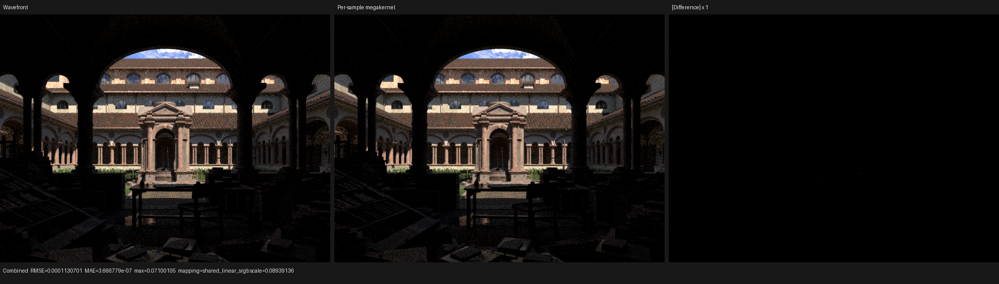

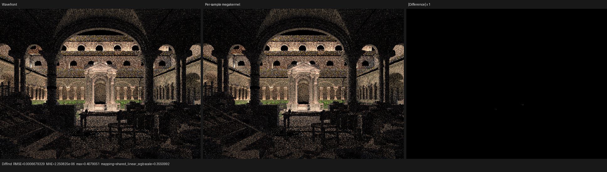

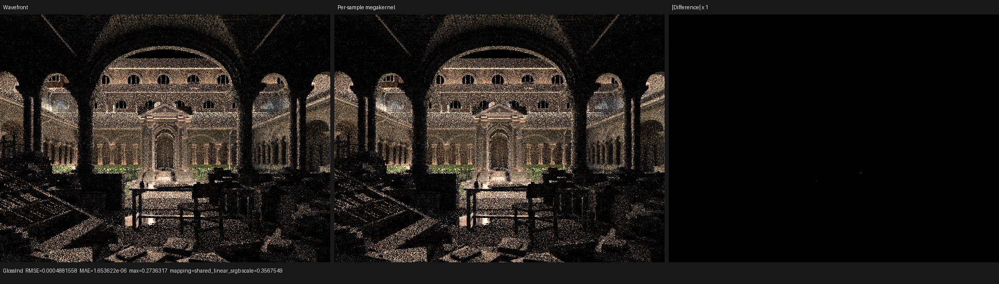

## Wavefront execution-block granularity

The profiler boundary above showed that queue-management kernels account for
only about 2% of wavefront GPU time. The two generated coroutine kernels are
the real boundary: `path_bounce` uses 184 VGPRs and 464 B of scratch per
thread, while `surface_shading` uses 256 VGPRs and 2472 B of scratch. Luisa's
wavefront scheduler previously hard-coded 256 threads for both kernels, even
though neither uses block-local communication. This coupled a shader resource
decision to the scheduler implementation without exposing it to the host/JIT
policy.

Luisa `next` commit `37f8f0eae` adds an
`execution_block_size` structural parameter for only the generate/resume
kernels. Queue scan, gather, compaction, and radix kernels retain their own
sizes because some use block collectives. Frame capacity remains a runtime
allocation parameter and therefore does not enter shader identity; execution
block size changes `set_block_size`, so it deliberately does. A regression
constructs independent 32- and 256-thread schedulers, proves their structure
hashes differ, and checks the 32-thread scheduler's exact mapping over 257
instances, including the partial tail. Existing positional aggregate
initializers retain their meaning because the new field is appended to the
configuration. Both Luisa fallback and HIP pass the 101-assert SoA suite.

Psycles validates the same DSL contract before AST construction: the value
must be a multiple of 32 in `[32, 1024]`. This makes 32 the formal legal lower
bound, not an unconstrained tuning constant. One warm-up followed by three
cached Lone Monk 640x480/64 spp HIP observations for each size gave:

| execution block | observations (s) | median (s) | relative to 32 |
| ---: | --- | ---: | ---: |
| 32 | 2.81954, 2.82108, 2.81290 | 2.81954 | 1.000x |
| 64 | 2.88417, 2.87614, 2.88633 | 2.88417 | 1.023x |
| 128 | 2.96590, 2.96636, 2.97032 | 2.96636 | 1.052x |
| 256 | 3.57247, 3.42166, 3.32243 | 3.42166 | 1.214x |

The 256-thread series drifted down after background load subsided, so the
stronger comparison is both its median and the adjacent pre-change median of
3.37633 s. The 32-thread configuration is respectively 17.60% and 16.49%
faster. A fresh `rocprofv3 --kernel-trace --scratch-memory-trace --stats`
pair preserves identical generated resource counts and dispatch counts:

| kernel | resources at 32 and 256 | 256 time | 32 time | change |
| --- | --- | ---: | ---: | ---: |
| `path_bounce` | 184 VGPR, 464 B scratch, 231 calls | 0.927 s | 0.809 s | -12.75% |
| `surface_shading` | 256 VGPR, 2472 B scratch, 231 calls | 2.141 s | 1.749 s | -18.32% |
| all `kernel_main` | same non-coroutine utility sizes | 3.139 s | 2.628 s | -16.25% |

Thus the improvement is not different shader code or fewer paths: it is finer
workgroup admission and tail scheduling for register/scratch-heavy
continuations. The attempted hardware occupancy counters report zero for both
derived occupancy metrics on this gfx1201/rocprof version, so they are not
used as evidence; GPUBusy reports 100% and the exact wave counts agree with
the rounded grids.

The new 32-thread default reduces wavefront's overhead over the topology-
matched per-sample megakernel from 39.72% to 16.68%. Against the same fresh
Cycles HIP median of 1.901 s, wavefront is now 1.483x the render time (48.32%
slower, 67.42% of Cycles throughput); the unscheduled per-sample kernel remains
1.271x (27.12% slower, 78.67% of Cycles throughput). This closes about 29
percentage points of the former wavefront/Cycles time gap without changing
path semantics.

Before rebasing onto the two concurrent Luisa `next` build-fix commits, the
64x64/1 spp Lone Monk output was byte-identical to the 208-byte checkpoint for
the display PPM and all 15 linear PFM passes. After that rebase and an all-core
rebuild, three repeated runs remain mutually byte-identical and the display
PPM retains SHA-256
`b4f198ebedd7621e41bd51d66f495c9f1c734141e48ccad866671d983555a58e`.
Eight non-empty linear passes differ from the earlier codegen at only 5--12 of
12,288 scalar values: the worst relative RMSE is `5.75e-6` (Diffuse
Indirect), and the Combined relative RMSE is `8.07e-7`. Seven passes remain
byte-identical. This deterministic, sub-ULP-scale boundary is recorded rather
than silently relabelled as the old exact hash; no structured or display-space
difference is present.
Psycles' scheduler contract and full film/pass tests pass on fallback and HIP;
Luisa's SoA and wavefront integration suites also pass on both. The pre-existing
`wavefront_hint_sort_handles_non_power_of_two_full_bucket` assertion fails on
fallback even after restoring Luisa `34c3c4bb9` byte-for-byte, so it is
recorded as an independent hint-frame-liveness issue rather than attributed to
this change.

Timing artifacts are under
`/var/tmp/psycles-wavefront-block-sweep-rJAQcB`; the post-rebase exact/numeric
canary is under `/var/tmp/psycles-wavefront-block-canary-rebased-20260812`;
profiler artifacts are under
`/var/tmp/psycles-wavefront-block-profile-20260812`; attempted counter data is
under `/var/tmp/psycles-wavefront-block-counters-20260812`; regression logs are
under `/var/tmp/luisa-wavefront-block-tests-20260812`.

## Persistent scheduler granularity and runtime policy

The same resource argument applies more strongly to the persistent scheduler.
Its main state-machine kernel contains all continuations and the scheduler,
and the original 128-thread configuration compiled to 256 VGPRs, 2168 B of
scratch per thread, and 29,184 B of reported LDS per block. A 32-thread block
retains exactly the same path program and 208 B coroutine frame while reducing
the reported LDS allocation to 7,212 B. Three matched observations changed
from `3.19461 s`, `3.19990 s`, and `3.19873 s` at 128 threads (median
`3.19873 s`) to `2.69318 s`, `2.69910 s`, and `2.69233 s` at 32 threads
(median `2.69318 s`), a 15.80% reduction in render time.

Worker count and task-acquisition size were then swept independently at the
32-thread block size. The worker curve has a sharp saturation boundary:

| persistent workers | render time (s) |
| ---: | ---: |
| 4,096 | 8.82724 |
| 8,192 | 4.75350 |
| 10,240 | 3.88382 |
| 12,288 | 3.34497 |
| 14,336 | 2.94617 |
| 16,384 | 2.69537 |
| 18,432 | 2.65467 |
| 24,576 | 2.65478 |
| 32,768 | 2.70026 |
| 65,536 | 2.70253 |

Repeated interleaved measurements showed 16,384 workers to be too close to
the knee to use as a backend-independent default; 32,768 remained stable and
does not expand shader structure. It is therefore retained. The acquisition
factor multiplies block size, so factors 1, 2, 4, 8, 16, 32, and 64 allocate
respectively 32 through 2,048 consecutive logical tasks per global atomic.
The first sweep measured `2.67673`, `2.67925`, `2.68976`, `2.70762`,
`2.70266`, `2.77181`, and `2.84583 s`. Repeated interleaved observations for
the leading factors confirmed factor one as the stable best choice; coarse
batches reduce atomic traffic but create a worse final load imbalance.

Luisa `next@5dbf60046` consequently makes fetch size a runtime kernel uniform
instead of capturing it in the shader AST. This follows from an exact
partition argument: for batch size `B = block_size * fetch_size`, atomic
acquisitions produce disjoint intervals `[kB, min((k+1)B, N))`; those
intervals cover `[0, N)` exactly, so `B` changes scheduling but not the
program. Worker count was already dispatch-only. A new regression constructs
independent 64-worker/fetch-one and 96-worker/fetch-17 schedulers, proves their
main-kernel structure hashes are equal, and uses an atomic per-task counter to
prove that each of 257 logical tasks executes exactly once. The same change
validates the persistent block contract before AST construction: a multiple
of 32 in `[32, 1024]`. The complete persistent optimization suite passes 81
assertions in 21 tests on both fallback and HIP.

With Psycles defaults of 32,768 workers, a 32-thread block, and fetch factor
one, the post-change observations are `2.66098 s`, `2.64650 s`, and
`2.64980 s` (median `2.64980 s`). This is 17.16% faster than the original
persistent configuration and 6.02% faster than the 32-thread global
wavefront. Against the fresh Cycles HIP median of `1.901 s`, it is 1.394x the
render time (39.39% slower, 71.74% of Cycles throughput). Against the matched
per-sample megakernel median of `2.41657 s`, the remaining persistent
scheduler overhead is 9.65%. Thus this tuning closes 42.30% of the original
persistent/Cycles time gap without changing rendering semantics.

The tuned profiler records one 2,630.602 ms persistent main-kernel dispatch at
32 threads with 256 VGPRs, 2168 B scratch, and 7,212 B LDS. This confirms that
the remaining boundary is inside the combined persistent state-machine
kernel, not host dispatch gaps. At 64x64/1 spp, persistent, 32-thread
wavefront, and topology-matched megakernel produce the same display SHA-256
`b4f198ebedd7621e41bd51d66f495c9f1c734141e48ccad866671d983555a58e`;
all 15 linear EXR passes compare with zero relative RMSE. The full film/pass
suite also passes on fallback and HIP. Timing and policy-sweep artifacts are
under `/var/tmp/psycles-persistent-{block-sweep,worker-sweep,fetch-sweep,tuned-repeat,runtime-fetch-final}-20260812`;
the exact canary and profiler data are under
`/var/tmp/psycles-persistent-runtime-fetch-canary-20260812` and
`/var/tmp/psycles-persistent-profile-tuned-20260812`.

At 640x480/64 spp, tuned persistent versus the topology-matched per-sample
megakernel has Combined relative RMSE `9.59e-5` and luminance mean ratio
`1.0000003`; Diffuse Indirect and Glossy Indirect relative RMSE are
`1.51e-3` and `8.50e-4`. These are the expected unordered floating-point
atomic accumulation differences, with no structured visual discrepancy in
the original-size or amplified-difference panels. The complete report is
[here](persistent-tuned-comparison/report-persistent-vs-per-sample.json).


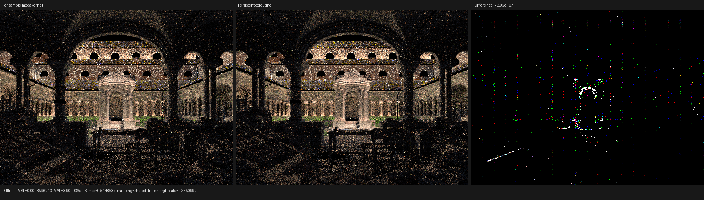

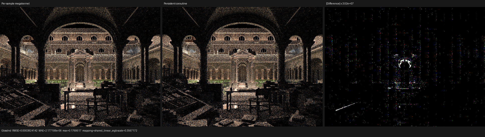

## Persistent GME relocation payload

The persistent scheduler's global-memory extension exchanges queued frames
between a block-local slot and an AoS overflow slot. Copying every physical
field is correct, but it ignores that a queued frame is a token-indexed sum
type. A first experiment copied only the immediate `input_fields(token)`.
It appeared to improve three cached 640x480/64 spp observations to
`2.61067 s`, `2.62370 s`, and `2.61866 s` (median `2.61866 s`), but the image
was invalid: against the committed persistent result, Combined relative RMSE
was `2.759%`, Diffuse Indirect was `42.75%`, and Glossy Indirect was `33.74%`.
The apparent 1.18% speedup is therefore rejected rather than reported as an
optimization.

The root cause is formal. Immediate callable input is not the state of a
queued continuation. A value may be resident before continuation `s`, neither
read nor redefined in `s`, and first consumed by a later continuation. For the
distilled scope graph, the required state is the least fixed point

`L(s) = External(s) union U_(s -> t) (L(t) - K(s -> t))`.

Luisa's coroutine distiller already solves exactly this backward may-liveness
problem over one dense value numbering, including cyclic schedules and
path-sensitive must-kills. The scheduler now consumes that analysis
certificate directly: `CoroGraph::Node::relocation_fields` is `L(s)` projected
through interference coloring onto physical frame slots. It is deliberately
not reconstructed from materialized `load_fields` and `store_fields`.
Several materialized control-flow exits may share the same `(from, to)` graph
edge; their stored-field union is correct for generated writes but is not a
must-definition relation for liveness.

For code generation, the token payloads are transposed into their intersection
and token-specific residuals. Common fields are emitted once; a token switch
handles only residual fields. The field-storage API also supports exact
subsequent transfers so the seven reserved header fields are not emitted again
in every residual branch. On this scene, the two continuation payloads share
47 of 52 frame fields and the larger token requires all 52. This explains both
why immediate inputs were unsound and why correct sparsification cannot produce
a large Lone Monk gain.

The corrected main HIP code object is `1,596,112 B`, versus `1,597,855 B` for
the committed full-frame exchange (`-0.11%`). Three hot-cache observations are
`2.66455 s`, `2.64584 s`, and `2.64533 s` (median `2.64584 s`), only 0.15%
below the committed `2.64980 s` median and therefore noise-scale. The current
same-device boundary remains:

| Lone Monk 640x480/64 spp, RX 9070 XT | median | versus Cycles HIP |
| --- | ---: | ---: |
| Cycles HIP 5.3 Alpha `61f93ccb1478` | `1.90100 s` | baseline |
| Psycles HIP per-sample megakernel | `2.41657 s` | 27.12% slower, 78.67% throughput |
| Psycles HIP persistent | `2.64584 s` | 39.18% slower, 71.85% throughput |

Persistent's remaining overhead over the topology-matched megakernel is
9.49%. The relocation change establishes a sound sparse-transfer substrate;
it does not materially close that gap on a graph whose live payloads are
nearly identical.

Regressions include an explicit partial AoS load, a two-suspend coroutine in
which a field is dormant through the intermediate continuation, and the real
GME spill/restore path. The coroutine graph suite passes 65 assertions in five
tests. The complete persistent suite passes 90 assertions in 23 tests on
fallback, HIP, and strict native Vulkan with
`LUISA_VULKAN_REQUIRE_NATIVE_XIR_SPIRV=1`; the Vulkan run emits native SPIR-V
and does not load DXC. Psycles' Combined, Normal, Albedo, and all light-pass
film accumulation suite passes on fallback and HIP.

At 640x480/64 spp, corrected versus committed persistent has relative RMSE
`7.25e-5`, `1.18e-3`, and `1.09e-3` for Combined, Diffuse Indirect, and Glossy
Indirect; Combined luminance mean ratio is `1.00000012`. Original-resolution
visual inspection finds no geometry, material, or lighting structure in the
difference. Even the amplified panels contain only sparse firefly/atomic-order
points, consistent with repeated unordered floating-point accumulation.
The numeric report is
[here](persistent-relocation-comparison/report-committed-vs-live.json).

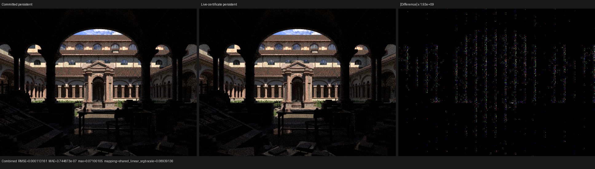

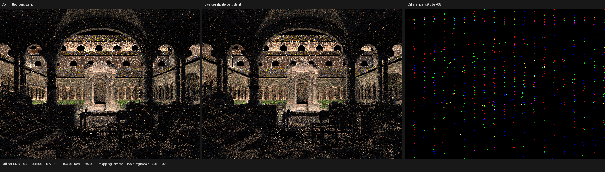

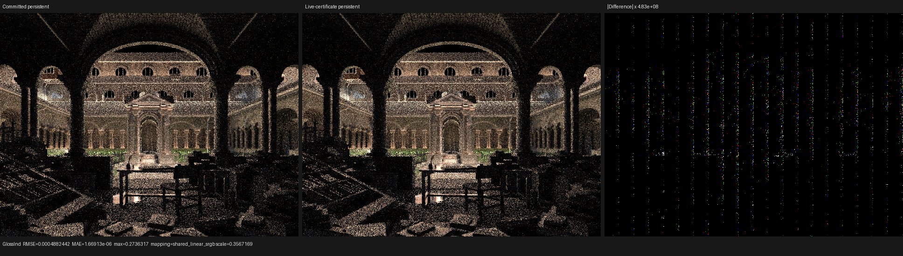

Raw timing, comparison, profiler, and regression artifacts are under
`/var/tmp/psycles-persistent-live-certificate-{timing,comparison,tests}-20260812`
and `/var/tmp/luisa-persistent-live-certificate-tests-20260812` on the
measurement host.

## Staged scheduling topology without a Cycles-kernel port

The next checkpoint adds a deliberately separate `wavefront-staged` scheduler
experiment. It does **not** add another path integrator and does not copy or
translate Cycles kernel functions. Psycles still records one authoritative
Luisa DSL program, `PathKernelPipeline`. At host AST-construction time a
`PathCoroutineCutPolicy` either records no suspension (`none`), the compact
two-transition schedule (`compact`), or additional semantic transitions
(`staged_wavefront`). All policies call the same geometry, volume, light,
surface, closure, sampling, and film components.

Formally, let `P` be the ordered effect trace of the DSL path program and let
`cut_C(P)` insert coroutine transitions at a host-selected cut set `C`. A
scheduler activation saves the live state at one cut and its continuation
restores that state before executing the next effect. Erasing those
save/restore transitions from `cut_C(P)` must therefore yield exactly `P`.
Neither the cut policy nor scheduler kind is a device value, so no dynamic
scheduler branch enters the shader and `C` does not alter the integrator's
sampling or material semantics.

The current staged cut set is:

| Transition | Location in the Psycles DSL program | State intentionally kept out of the frame |
| --- | --- | --- |
| `intersect_closest` | before the existing bounce setup / closest-event traversal stage | hit resolution and all following shading temporaries |
| `shade_volume` | conditionally, immediately before volume-segment evaluation when the medium stack is non-empty | tracking, phase, reservoir, and volume-closure scratch |
| `shade_light_forward` | after event resolution and immediately before the existing analytic-light forward stage | light shading temporaries |
| `shade_background` | after event resolution and immediately before the existing background stage | background evaluation temporaries |
| `shade_surface` | after a surface hit is selected and before surface geometry plus closure population | geometry attributes, shader graph values, closures, and BSDF scratch |

These names make the queue comparison legible against the locally checked-out
Cycles stage graph; they do not claim that Psycles now contains Cycles' stage
kernels. In particular, Psycles still evaluates NEE/shadow work and subsurface
transitions inside its own component graph, while current Cycles has separate
`SHADE_LIGHT_NEE`, `INTERSECT_SHADOW`, `SHADE_SHADOW`, subsurface, volume-stack,
and dedicated-light states. Matching those scheduling boundaries requires
exposing resumable boundaries in the existing Psycles components, not
rewriting their algorithms as Cycles kernels.

Cycles' GPU host loop selects the stage with the largest queued population,
injects new tile work when occupancy is low, and drains shadow stages when a
shading stage could exceed shadow-state capacity. The staged experiment maps
only the first two ideas so far: Luisa's wavefront scheduler uses
`largest_continuation_first` and permits `intersect_closest` refill. Shadow
capacity pressure and shader-key sorting remain explicit follow-up scheduler
policies rather than hidden integrator changes.

The staged graph currently has five reachable subroutines and a 264-byte
frame. The compact graph remains three subroutines and 216 bytes. Combined,
Normal, Albedo, every light pass, and the trace diagnostic were compared by
the film-accumulation regression across serial, per-sample megakernel,
chunked per-sample megakernel, compact wavefront, staged wavefront, and
persistent execution. The matrix passes on HIP and fallback. A Vulkan canary
with both `LUISA_VULKAN_USE_XIR=1` and
`LUISA_VULKAN_REQUIRE_NATIVE_XIR_SPIRV=1` also passes; it emits native SPIR-V
(the largest observed module in this run was 205,806 words) and does not load
DXC.

That strict Vulkan run exposed a general XIR fixed-point bug rather than a
renderer-stage bug. Selection-exit repair normalized a `Break` nested inside a
`Switch` to an ordinary branch to the enclosing loop merge. Loop-boundary
canonicalization then contracted through the empty loop-merge block, forgot
its structural identity, and inserted a new break proxy. The two passes added
two blocks on every round until the 64-round guard fired. Luisa
`next@dab44c884` now treats the declared loop merge as an absorbing boundary
of the forwarding quotient. A regression gives that merge an empty forwarding
successor and runs restructuring twice, proving both successful convergence
and stable block count. Seven focused XIR/SPIR-V/coroutine executables pass,
including 1,450 assertions in 78 restructuring tests and 180 assertions in
seven coroutine-pipeline tests.

This checkpoint is a scheduler/compiler equivalence canary, not a new
full-scene Cycles quality or performance result. The next measurement must
first expose the remaining Psycles component boundaries through the same DSL
pipeline, then compare stage populations, dispatch counts, frame traffic,
occupancy, scratch/VGPR pressure, and render-only time against Cycles without
changing either renderer's transport algorithm.
