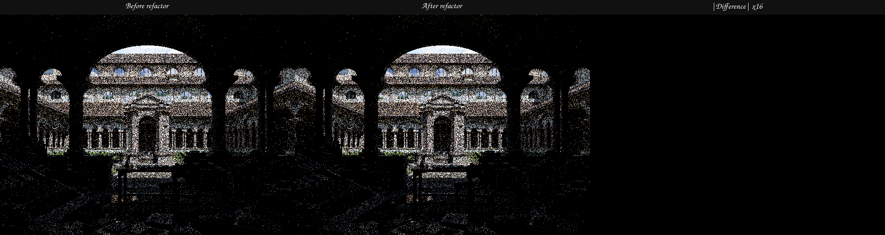

# Source-size boundary closure

## Scope

This structural checkpoint removes the final three violations of the
first-party 2,000-line source policy without an exemption:

- Cycles BSDF table payload assembly is owned by
  `path_tracer_bsdf_tables.{h,cpp}`;
- graph/material/scene contracts have an independent test executable;
- Normal Map Blender probes have an independent feature module.

The former concentration points are 1,995, 1,939, and 1,941 lines. Running
`python3 tools/check_source_size.py .` checks 548 files and 165,137 lines.

## Verification

The project was rebuilt with all available host threads. The complete CTest
matrix passed 265/265 tests, including fallback, HIP, Vulkan, Blender export,
OpenEXR, and the source-size contract.

A strict `LUISA_VULKAN_USE_XIR=1` and
`LUISA_VULKAN_REQUIRE_NATIVE_XIR_SPIRV=1` Lone Monk wavefront canary retained
the pre-split display, Combined, Normal, and Albedo hashes. A second replay on
the RX 9070 XT used HIP, wavefront scheduling, 640x480 pixels, and one fixed
sample. Its four primary files are byte-identical to the pre-split baseline:

| Output | SHA-256 |
| --- | --- |
| Display | `16be3dbb588bdd6af6ff1ff008c42c6cd96da7cfb51415bda00072cb63d3df73` |
| Combined | `f7c449e5da434ba8100fda06f4ae75fc4e1f79704de24780dfbb5486c85dc474` |
| Normal | `0d8fa6771670ca441738a31c5b9c5af01d503e88f0ce1a5a1f81743f82103432` |
| Albedo | `57e456f4242da17aff42f7160ca66497d5796d7de2de378f9ed56d44716f4ec0` |

## Visual inspection

The triptych was opened at its original 1920x512 resolution. The building and
window silhouettes, grass distribution, and material regions coincide. The
16x absolute-difference panel is black, as required by the byte comparison.
This one-sample image checks structural equivalence; it is not a new
Cycles-quality measurement.

