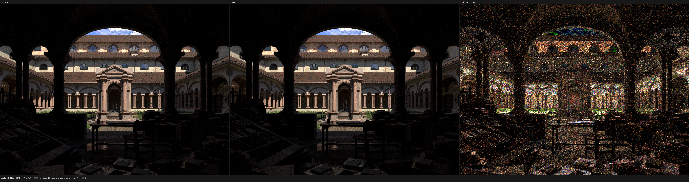
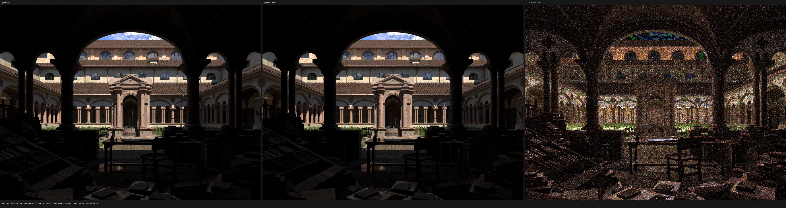

# Post-population physical closure ABI

## Outcome

The post-population closure boundary is now a formal dependency cut instead of
an informal convention. Evaluation, categorical selection, conditional
sampling, and subsurface transport receive `SurfaceClosurePhysicalRecord`.
That type cannot name the three preparation/AOV albedos or the adjusted
Principled `specular_ior_level`; those values remain in the full storage record
and are consumed before the cut.

The lossless nested-callable ABI consequently shrinks from four `float4x4`
arguments to three. This removes 16 scalar lanes (64 bytes) from every closure
evaluation and conditional-sample call without deleting a closure, baking a
material, specializing this scene, or changing the renderer's physical
semantics.

This checkpoint is primarily an architectural and code-size improvement. The
measurements below show that it does **not** reduce the remaining HIP spill or
materially change rendering throughput. The remaining performance problem must
therefore be pursued in the physical evaluator/control-flow body rather than by
claiming the callable argument reduction solved it.

## Formal boundary

Let `R` be the full populated closure record and let `P` be the tuple of values
observable by post-population physical operations. The projection

```text
pi : R -> P
```

removes exactly these setup-only values:

- `albedo`, `reflection_albedo`, and `transmission_albedo`, which are reduced
  into surface AOVs during preparation;
- `specular_ior_level`, which is consumed while resolving adjusted Principled
  IOR during closure setup.

All physical operation signatures take `P`, not `R`. The remaining full-record
consumers were audited and are limited to closure construction/storage,
collection visitors, the legacy full-record transport helper, and the AOV
reduction. This makes the non-observability property type-checked: a future
physical implementation cannot read a removed field without deliberately
changing `P` and its ABI.

`P` contains exactly 48 scalar lanes. `SurfaceClosurePhysicalBlocks` maps those
lanes bijectively onto three matrices. The only categorical packing is the
named three-bit flag word for `setup_valid`, `preserve_ggx_energy`, and
`beckmann`; kind, lobe, and BSSRDF method retain exact integer bit patterns.

`test_luisa_surface_closure_physical.cpp` locks the proof obligations:

- compile-time member concepts reject all four setup/AOV fields from `P`;
- the block count is statically fixed at three;
- eight runtime cases cover every boolean flag combination and distinct values
  for every retained lane;
- a real nested callable performs `pack -> unpack -> pack` on fallback, HIP,
  and Vulkan and must deduplicate to one callable definition.

## HIP resource profile

The RX 9070 XT kernel was warmed and then measured with ROCm 7.2.4:

```sh
rocprofv3 \
  --output-format rocpd \
  --pmc GRBM_GUI_ACTIVE \
  --kernel-include-regex '^kernel_main$' -- \
  build/bin/psycles_render_blender_scene \
    /var/tmp/psycles-lone-monk-transmission-dbdcb17/export \
    profile.ppm hip 960 540 1 1
```

The 518,400-thread main dispatch remains at 2,704 bytes of private scratch per
thread, 256 architectural VGPRs, and 128 SGPRs. Its measured duration was
90.008 ms, versus 89.925 ms at the preceding checkpoint, which is noise. The
resource allocation is unchanged, so the removed matrix was not the limiting
spill interval. Exact profiler data is in [profile.json](profile.json).

The cold HIP main code object was 1,598,288 bytes (1,599,941-byte cache entry).
The three warm 960x540/64-spp render intervals were 5.27549, 5.28167, and
5.29281 seconds. Their 5.28167-second median is only 0.14% below the preceding
5.28907 seconds and is treated as performance-neutral.

## Full backend matrix

All Psycles rows use the same raw-graph Lone Monk export, 1440x1080, 256 fixed
samples, and eight samples per dispatch. The unchanged Cycles measurements are
the same-scene references from the immediately preceding five-way checkpoint.

| Renderer | Device/backend | Scene (s) | JIT (s) | Render (s) | Wall (s) | Relative reference |
| --- | --- | ---: | ---: | ---: | ---: | ---: |
| Cycles | CPU | - | - | 72.184 | 72.632 | 1.000x |
| Psycles | fallback | 1.606 | 21.628 | 141.460 | 165.740 | 1.960x slower than Cycles CPU |
| Cycles | HIP | - | - | 19.319 | 19.786 | 1.000x |
| Psycles | HIP | 4.237 | 0.145 | 58.184 | 63.650 | 3.012x slower than Cycles HIP |
| Psycles | Vulkan | 1.680 | 62.981 | 226.529 | 292.320 | 11.726x slower than Cycles HIP |

Relative to the preceding Psycles checkpoint, pure render time changed by
-0.93% on fallback, +0.21% on HIP, and -0.04% on Vulkan. Only the fallback
movement approaches one percent, and none is presented as a reliable speedup.
The full machine-readable table is in [benchmark.json](benchmark.json).

Vulkan used the native SPIR-V route: the log contains the SPIR-V optimization
and compilation records and no DXC invocation. The optimized module fell from
400,579 to 397,350 words (0.81%), although its cold JIT varied from 58.47 to
62.98 seconds. Runtime remained flat at 226.529 seconds.

## Numerical and visual audit

| Comparison | Combined relative RMSE | Mean luminance ratio | Invalid pixels |
| --- | ---: | ---: | ---: |
| Psycles fallback vs Cycles CPU | 1.3366% | 1.000463 | 0 |
| Psycles HIP vs Cycles HIP | 1.7119% | 1.001161 | 0 |
| Psycles Vulkan vs Cycles HIP | 1.6658% | 1.001057 | 0 |

These values reproduce the preceding checkpoint. Across every exported pass,
the new fallback and Vulkan images are pixel-identical to the previous Psycles
images. HIP's non-deterministic GPU rerun has Combined relative RMSE
`1.54e-5`; the largest pass-level value is `3.50e-4`, with a mean-luminance
ratio of `1.0000016` and no invalid pixels.

The three original-resolution Combined triptychs were inspected manually. In
each, roof tiles, arches, columns, grass, foreground debris, texture boundaries,
and silhouettes occupy the same locations. The amplified difference panels
contain sample-like high-frequency energy and small brightness residuals, not
shifted edges, missing geometry, a changed closure family, or a structured
material mismatch.






The complete pass reports are retained beside this document as
`report-*-vs-cycles-*.json`; the three `report-*-vs-previous.json` files record
the semantic no-regression comparison.

## Build and regression matrix

- Full build: `cmake --build build --parallel 32` passed.
- Focused physical/material matrix: 33/33 tests passed sequentially across
  fallback, HIP, and native Vulkan.
- Full suite excluding the separately audited size policy: 262/262 passed with
  `ctest -j32`.
- The size audit reports only the three pre-existing exceptions:
  `src/luisa/path_tracer_scene.cpp` (2,065), `tests/test_main.cpp` (2,331), and
  `tools/cycles_shader_probe/closures.py` (2,156). This change adds no violation;
  its largest new file is the 282-line focused regression.

The next performance step should isolate live ranges and divergent closure
families inside evaluation/conditional sampling. The unchanged 2,704-byte
scratch allocation is evidence against spending another iteration merely
repacking the already-exact callable boundary.
