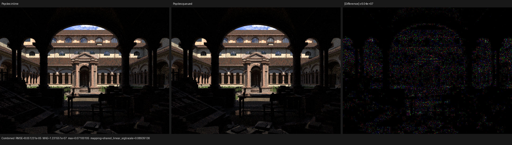
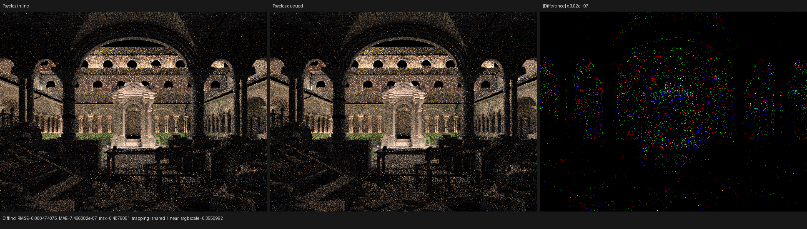
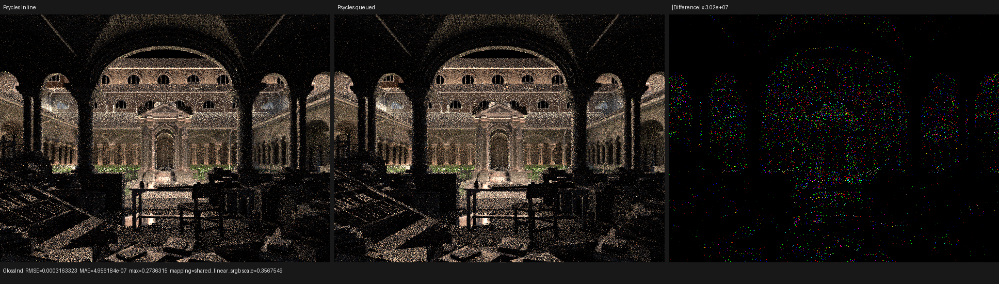

# Direct-light wavefront execution-graph validation

This checkpoint studies one Cycles-like wavefront boundary without porting,
copying, or translating a Cycles kernel. Psycles continues to have one
authoritative Luisa DSL path program, `PathKernelPipeline`. The host/JIT policy
either evaluates `DirectLightTaskEvaluator` inline in `shade_surface` or
publishes its sufficient state to a typed side queue and evaluates the exact
same object in a separate physical shader.

Cycles `72ae237c0c7a785f43edd0356ba46f0af0d3fbdf` (updated 2026-08-12) is
used only as the execution-graph oracle: the current GPU scheduler
selects the largest queue, gives shadow work priority when a shadow-producing
stage cannot be admitted, and terminates only when the main and shadow queues
are empty. The Psycles implementation maps those scheduling invariants onto
Luisa's generic coroutine scheduler; it does not create a second renderer.

## Formal boundary

Let a surface invocation produce at most one direct-light task. With side-queue
capacity `C`, current occupancy `q`, producer population `n`, and declared
bound `b = 1`, admission is permitted exactly when

```text
q <= C  and  uint64(n) * b <= uint64(C - q).
```

Thus the next occupancy satisfies `q' <= q + n*b <= C`. The queue capacity is
the coroutine frame capacity because the only producer is `shade_surface` and
each live continuation can publish at most one item before it leaves that
continuation.

The 144-byte task contains only sufficient statistics for visibility, clamp,
film classification, and pass splitting: the shadow ray and differentials,
source/light identities, unshadowed contribution, two lobe weights, pixel,
path flags/visibility, and the five relevant depth counters. Surface geometry,
shader-graph values, and closures do not cross the boundary. The consumer binds
only Combined, light-pass, volume-guiding buffers, and render parameters.

## Regression matrix

The full build used all available host threads:

```text
cmake --build build -j$(nproc)
```

The film regression compares inline and queued execution for Combined, Normal,
Albedo, every surface and volume light pass, sample count, and split sample
dispatches. The diagnostic exact trace stays inline so ordered trace semantics
remain exact. These runs passed:

```text
ctest --test-dir build --output-on-failure -j$(nproc) \
  -R 'psycles\.(luisa_path_scheduler|luisa_direct_lighting_plan_fallback|luisa_sample_dispatch_film_fallback)'
./build/bin/psycles_luisa_direct_lighting_plan_tests hip
./build/bin/psycles_luisa_sample_dispatch_film_tests hip
LUISA_VULKAN_REQUIRE_NATIVE_XIR_SPIRV=1 \
  ./build/bin/psycles_luisa_direct_lighting_plan_tests vk
LUISA_VULKAN_REQUIRE_NATIVE_XIR_SPIRV=1 \
  ./build/bin/psycles_luisa_sample_dispatch_film_tests vk
```

The strict Vulkan canary used native XIR-to-SPIR-V. The small regression
published 24 tasks with a peak queue occupancy of five and no overflow; its
3+5 sample-request split consumed 10, 8, and 6 tasks while preserving the same
global sample mapping and film outputs.

## Lone Monk HIP A/B

The immutable Lone Monk bundle contains 348 geometries, 87,534 instances, and
37 exported materials. Both variants used the same 640x480, 64-spp,
per-(pixel,sample) topology, staged surface sorting, 32-thread coroutine
continuations, and one 64-sample dispatch. The final argument is the only
change:

```text
LUISA_CORO_WAVEFRONT_STATS=1 \
  ./build/bin/psycles_render_blender_scene \
  /var/tmp/psycles-lone-monk-transmission-dbdcb17/export \
  <output.ppm> hip 640 480 64 64 - 0 0 0 0 64 - 1 0 \
  wavefront-staged 32 32768 32 1 1 <direct-light-queue:0|1>
```

| execution policy | render-only observations (s) | median | relative to inline |
| --- | --- | ---: | ---: |
| inline shared evaluator | 2.49051, 2.50502, 2.50568 | 2.50502 | baseline |
| queued shared evaluator | 2.60023, 2.57922, 2.58258 | 2.58258 | 3.10% slower |

The queued run executed about 20.38 million visibility tasks in 156 physical
dispatches; peak occupancy was 191,553 of 307,200. Its SoA payload allocation
was 38,092,800 bytes. The main coroutine frame stayed 216 bytes in both modes.

`rocprofv3 --kernel-trace --memory-copy-trace --stats` reproduced the boundary:
2.52529 seconds inline and 2.62873 seconds queued. Grouping HIP's generic
`kernel_main` name by kernel object and static resource tuple shows that
separation reduced the 256-VGPR main continuation from 1,493.865 ms to
913.213 ms, but the 184-VGPR/464-byte-scratch side evaluator cost 657.503 ms.
The net physical-shader time increased by about 76.9 ms. An explicit
32-thread side-consumer experiment was slower again (2.60252, 2.62905,
2.64654 seconds; median 2.62905), so the measured 256-thread default was
retained and the side queue is opt-in rather than the renderer default.

## Numerical and visual inspection

Inline-versus-queued run 1 measured relative RMSE `5.16e-5` for Combined,
`8.34e-4` for Diffuse Indirect, and `7.03e-4` for Glossy Indirect. This is not
a queue-specific algorithm difference: inline run 1 versus inline run 3 was
slightly larger at `5.17e-5`, `8.36e-4`, and `7.04e-4`. Direct passes were at
about `7e-9` relative RMSE, Emission/Environment/Transmission/Volume were exact,
and the residual is consistent with nondeterministic floating-point atomic
accumulation order.

The three images below were opened at original resolution. Geometry, material,
visibility, and illumination structure agree; the amplified difference is
sparse accumulation-order noise rather than a coherent rendering error.







The result is deliberately negative as a default-policy decision: a separate
visibility stage is now available for continued compiler and scheduler work,
but it is not enabled by default until it beats the shared inline evaluator on
a production scene. The next optimization target is the physical launch and
payload cost, not a manual rewrite of Cycles kernels.
