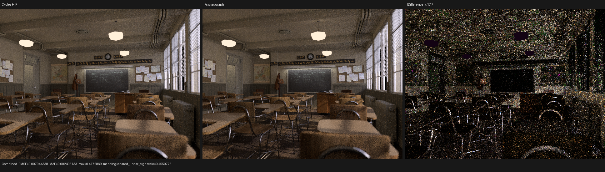
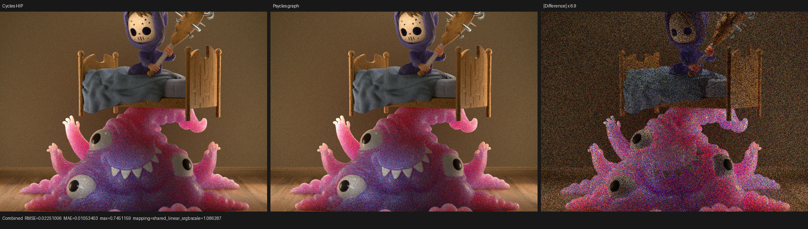
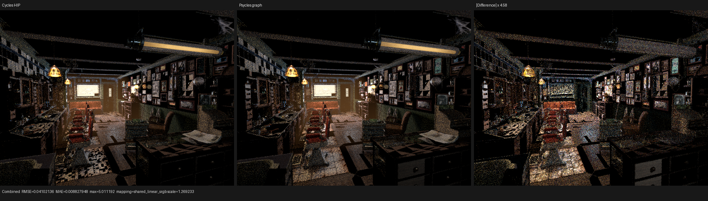
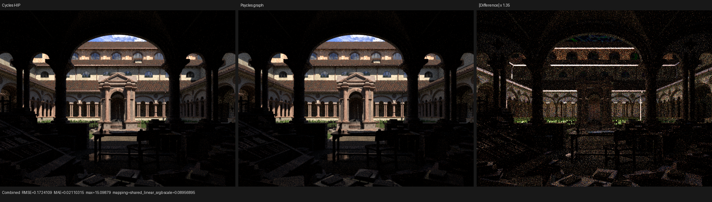

# Cycles-stage graph wavefront: multi-scene checkpoint

This checkpoint evaluates the graph-driven Luisa coroutine scheduler on four
production Blender scenes. It is a checkpoint, not a compatibility claim:
Classroom is close at the image-structure level, while Lone Monk, Monster
Under the Bed, and especially Barbershop still expose coherent estimator or
shading differences against Cycles.

The reference renderer is Blender Cycles from local revision
`72ae237c0c7a785f43edd0356ba46f0af0d3fbdf`. All Cycles goldens use the RX
9070 XT HIP device, fixed 64-spp sampling, `TABULATED_SOBOL`, and explicitly
disable adaptive sampling and denoising. Psycles uses the same immutable
export bundle, 640x480, 64 spp, one 64-sample per-(pixel,sample) dispatch,
HIP, 32-thread continuation blocks, selective graph scheduling, and no tail
megakernel. Times below are renderer-reported render intervals and exclude
Psycles scene compilation and shader JIT.

## Scene complexity

| scene | geometry | instances | exported materials | material nodes | largest graph | images |
| --- | ---: | ---: | ---: | ---: | ---: | ---: |
| Lone Monk | 348 | 87,541 | 35 | 715 | 38 | 47 |
| Classroom | 252 | 838 | 85 | 585 | 20 | 51 |
| Monster Under the Bed | 34 | 36 | 20 | 263 | 29 | 22 |
| Barbershop Interior | 1,649 plus 6 curve geometries | 2,565 | 547 | 5,986 | 82 | 190 |

The scene JSON contains 37, 97, 31, and 564 runtime materials respectively;
the difference from the exported-material counts is due to runtime binding
specialization. Barbershop is consequently both the shader-graph stress case
and the geometry/curve stress case. The measurements rule out a simple
"number of materials explains everything" model: Monster has a small graph
but a large SSS/lighting differential, while Classroom has more runtime
materials and remains substantially closer.

## Execution graph and frame contract

The graph path keeps one authoritative `PathKernelPipeline`; the host chooses
a coroutine cut policy while building its shader AST. The current
`cycles_wavefront` policy corresponds to the main Cycles path states
`INTERSECT_CLOSEST`, `SHADE_VOLUME`, `SHADE_LIGHT_FORWARD`,
`SHADE_BACKGROUND`, and `SHADE_SURFACE`. The graph ABI validator requires each
semantically reachable stage and rejects the old compact cut names.

This is not yet the complete Cycles state graph. Psycles still executes BSSRDF
transport inside the surface continuation instead of publishing an
`INTERSECT_SUBSURFACE` continuation. NEE visibility can use the separately
validated direct-light task queue, but it is not currently a graph-coroutine
shadow continuation. Those two differences are explicit next work; adding a
cut before subsurface transport without first reducing its sufficient state
would merely move a large surface live range into the coroutine frame.

Frame traffic is an exact dataflow contract, not a full-frame load/store. For
node `v`, materialization loads only `input_fields(v)`. For an edge `v -> w`,
it stores only that edge's `store_fields(v,w)`. These sets are computed from
the coroutine graph's liveness solution; relocation likewise reads only the
relocation-live payload. The observed frames and largest node inputs were:

| scene | continuations | frame | fields | largest continuation input |
| --- | ---: | ---: | ---: | ---: |
| Lone Monk | 3 | 216 B | 54 | 52 fields (`shade_surface`) |
| Classroom | 4 | 260 B | 65 | 54 fields (`shade_light_forward`) |
| Monster | 4 | 280 B | 70 | 59 fields (`shade_surface`) |
| Barbershop | 5 | 784 B | 165 | 139 fields (`shade_volume`) |

Barbershop's 784-byte frame remains a serious performance target. Its large
surface/volume sufficient state, rather than unused unconditional frame I/O,
is the next thing that must be reduced.

## Bounded selective scheduling

Largest-queue-first selection was not service-fair. In the original
Barbershop 64-spp run, `shade_light_forward` and `shade_background` were
continuously non-empty across 539 and 534 snapshots but were selected only 7
and 3 times. Classroom selected the analogous queues only 6 and 4 times.

Luisa commit `86f8be620` adds an exact host-side waiting age. Let `a_i(t)` be
the number of consecutive actions beginning with queue `i` non-empty in which
`i` was not selected. Empty or selected queues reset to zero. Greedy largest
queue selection remains in force while all `a_i < H`; otherwise the greatest
overdue age wins, with node index as deterministic tie-break. With `N`
non-entry queues, a continuously non-empty queue is served after at most
`H + N - 1` unselected actions. This changes only host ordering; `H`, queue
population, resolution, spp, and frame capacity do not enter shader AST or
cache identity.

An adversarial regression keeps one 1000-item self-loop and two 1-item
self-loops permanently non-empty and proves the bound. A second regression
pins the reset rule so newly produced work cannot inherit stale age. HIP and
fallback integration tests also pass. With `H=32`, the real-scene result is:

| scene | greedy render | bounded render | sweeps, before -> after | forced actions | maximum wait |
| --- | ---: | ---: | ---: | ---: | ---: |
| Lone Monk | 3.757 s | 3.781 s | 598 -> 598 | 0 | 13 |
| Classroom | 3.869 s | 3.880 s | 689 -> 637 | 35 | 33 |
| Monster | 4.603 s | 4.599 s | 839 -> 839 | 0 | 22 |
| Barbershop | 20.930 s | 20.433 s | 550 -> 546 | 28 | 33 |

The policy is therefore a progress guarantee, not a universal performance
win. It helps Barbershop by about 2.4%, is neutral on Monster, and trades fewer
Classroom sweeps for more sparse launches with no net gain. A future policy
must learn the cost and transition model under this fairness constraint rather
than replacing the constraint with an unconstrained Markov prediction.

## Scheduler overhead and Cycles performance

`megakernel-per-sample` uses the identical per-(pixel,sample) 3D dispatch and
the same path program, but contains no coroutine scheduling. It isolates the
scheduler/frame cost from the topology benefit:

| scene | Cycles HIP | Psycles megakernel-per-sample | Psycles graph | graph / mega | graph / Cycles |
| --- | ---: | ---: | ---: | ---: | ---: |
| Lone Monk | 1.922 s | 2.452 s | 3.781 s | 1.54x | 1.97x |
| Classroom | 1.375 s | 2.723 s | 3.880 s | 1.42x | 2.82x |
| Monster | 2.509 s | 3.598 s | 4.599 s | 1.28x | 1.83x |
| Barbershop | 14.990 s | 7.859 s | 20.433 s | 2.60x | 1.36x |

The Barbershop Cycles interval includes about eight seconds of texture and
scene preparation before rendering, so its apparent megakernel win is not an
apples-to-apples GPU-kernel speedup. The graph-versus-megakernel column is the
sound in-render comparison: its 2.60x ratio confirms that the 784-byte frame
and physical continuation launches dominate. For the other three scenes,
Psycles remains 1.28x--1.98x slower than Cycles even before graph scheduling,
so scheduler work alone cannot close the renderer gap.

The complex Barbershop cold compile also exposed an independent compiler
scaling defect. Pointer-usage analysis materialized a lattice element for
every basic block times every alloca/GEP view even though reference-effect
analysis queries only formal reference coordinates. Luisa commit `9c6857d0f`
keeps the full pointer graph for alias/access validation but projects transfer
states and events onto the queried view. A full-versus-projected CFG
regression proves equal answers. The previous run exceeded twelve minutes and
18.8 GiB in pointer analysis; after the fix that pass disappears from the hot
profile and Barbershop compiles to completion. LLVM code generation of the
roughly 7.2 MiB AMDGPU program is now the remaining cold-JIT hotspot.

## Numerical comparison with Cycles HIP

The table reports relative RMSE on linear multilayer EXRs and the Combined
mean-luminance ratio `Psycles / Cycles`:

| scene | Combined | luminance ratio | Normal | DiffCol | DiffDir | DiffInd | GlossDir | GlossInd |
| --- | ---: | ---: | ---: | ---: | ---: | ---: | ---: | ---: |
| Lone Monk | 0.11059 | 0.97839 | 0.01759 | 0.03569 | 0.02720 | 0.25606 | 0.20367 | 0.37295 |
| Classroom | 0.02045 | 0.99923 | 0.00539 | 0.00393 | 0.01831 | 0.16893 | 0.06450 | 0.16144 |
| Monster | 0.14096 | 1.00276 | 0.00112 | 0.00068 | 0.14658 | 0.35890 | 0.20203 | 0.51326 |
| Barbershop | 0.33067 | 1.03792 | 0.01946 | 0.08375 | 0.58047 | 1.02359 | 0.47915 | 1.03823 |

All available Volume Direct and Volume Indirect references are exactly zero
for these particular camera renders, so this matrix does not validate
non-zero volume scattering. Classroom and Barbershop do contain
`shade_volume` path-state work, but a dedicated non-zero heterogeneous volume
scene remains required.

Graph versus same-topology megakernel is much tighter: Combined relative RMSE
is `5.23e-5` on Lone Monk, `2.02e-8` on Classroom, `3.88e-8` on Monster, and
`5.01e-3` on Barbershop. Normal and DiffCol are exact or near float ULPs except
for Barbershop (`4.35e-6` and `1.12e-4`). The remaining sparse Combined
outliers are compatible with non-deterministic floating-point atomic
accumulation order. There is no coherent scheduler-induced rendering
difference in the inspected graph/megakernel triptychs.

## Visual inspection

All four Combined triptychs below were opened at their original resolution.
They show Cycles HIP, current Psycles graph wavefront, and an automatically
scaled absolute difference.

Classroom has matching geometry, textures, and broad illumination. Coherent
residuals remain around the lamps, window highlights, clock/door region, and
indirect floor/furniture light; this is more than pure sample noise, but no
large transform or UV failure is visible.



Monster has nearly identical Normal and DiffCol, excluding a broad geometry,
UV, or base-color mapping failure. The coherent skin, blanket, and direct/
indirect-light residual instead points to BSSRDF stage/sampling parity. This
supports adding a minimal sufficient-state `INTERSECT_SUBSURFACE` cut after
the algorithm is aligned, not blindly cutting the current surface live range.



Barbershop still has clear structured differences on the floor, left
cabinetry, wall/ceiling response, and high-energy reflections. These are not
created by graph scheduling: graph and megakernel agree apart from sparse
atomic-order outliers. Material-node/closure evaluation and light sampling
remain the primary correctness investigation.



Lone Monk aligns in camera and large-scale material structure. Residuals are
coherent at roof/arch highlights and in grass/indirect illumination, again
implicating lobe/light sampling rather than a global transform error.



## Reproduction and gates

The graph command shape used for each bundle was:

```text
LUISA_CORO_WAVEFRONT_STATS=1 \
  ./build/bin/psycles_render_blender_scene \
  <export> <output.ppm> hip 640 480 64 64 - 320 240 0 0 64 - 1 0 \
  wavefront-graph 32 32768 32 1 1 0 4 2 0 <workers> 1 0
```

Workers were 98,304 for Lone Monk/Classroom and 131,072 for
Monster/Barbershop. The no-coroutine baseline replaces `wavefront-graph` with
`megakernel-per-sample`; all sample mapping arguments remain unchanged.

The regression gates run with all available build threads:

```text
cmake --build build --parallel 32 --target psycles_render_blender_scene

/var/tmp/luisa-graph-wavefront-hip/bin/test_coro_graph_wavefront_policy
/var/tmp/luisa-graph-wavefront-hip/bin/test_coro_wavefront hip
/var/tmp/luisa-graph-wavefront-fallback/bin/test_coro_graph_wavefront_policy
/var/tmp/luisa-graph-wavefront-fallback/bin/test_coro_wavefront fallback
```

Results: policy tests passed 46 assertions in 5 tests; the HIP integration
suite passed 766 assertions in 25 tests; fallback passed 765 assertions in 25
tests. The Psycles sample-dispatch film suite had already passed on HIP and
fallback after the Cycles-stage cut change, covering Combined, Normal,
Albedo, every light pass, and split global sample ranges.

The durable conclusions are:

1. exact per-continuation frame I/O is working, but the remaining sufficient
   state is still too large on Barbershop;
2. the main path cuts now correspond to Cycles, but subsurface and shadow
   auxiliary stages are not fully represented yet;
3. bounded fairness fixes a real scheduler service pathology but is not the
   dominant performance lever;
4. graph scheduling adds 28%--160% over the same per-sample megakernel across
   these scenes; and
5. the large Cycles differential is algorithm/material/light-sampling work,
   not a graph scheduler correctness error.
