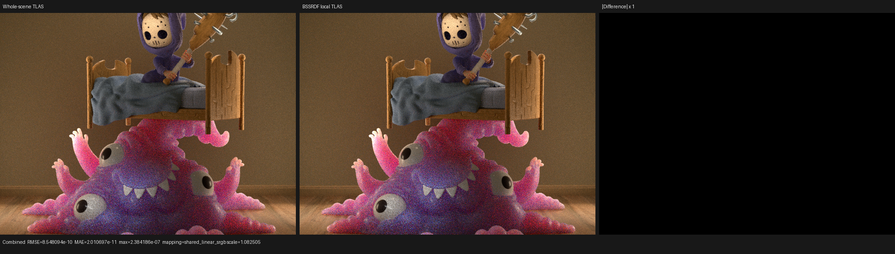
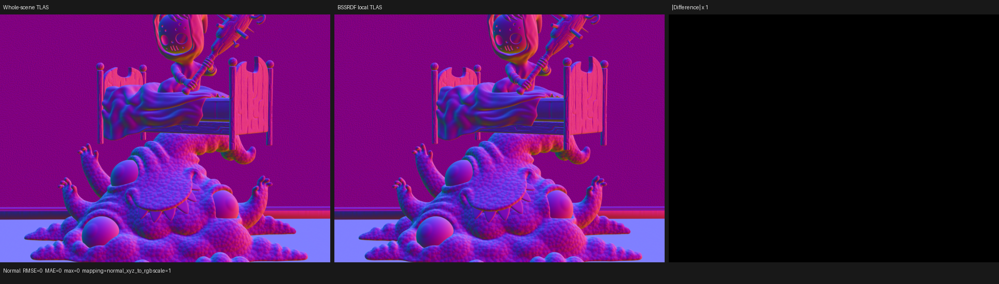
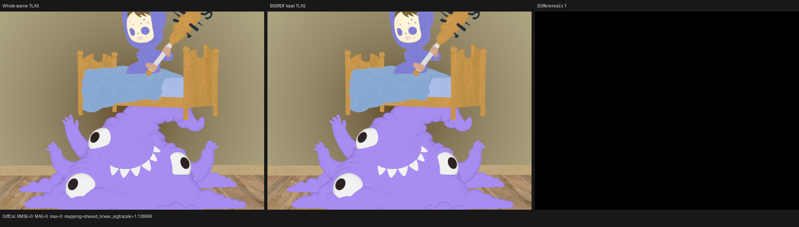

# HIP BSSRDF local-intersection domain validation

## Result

Psycles no longer asks each BSSRDF disk or random-walk ray query to traverse
the complete scene TLAS. Scene compilation now proves a conservative set of
complete triangle objects that can originate a BSSRDF closure and builds a
secondary TLAS over that set. Monster Under the Bed reduces the traversal
domain from 36 scene instances to 3 complete triangle instances.

At 640x480 and 64 spp on the RX 9070 XT, the five-run warm HIP render-only
median falls from 2.24823 s to 2.00778 s, or 10.69%. The profiler attributes
the change to the intended stage: the 102 subsurface-intersection launches
fall from 780.115 ms to 533.689 ms, or 31.59%. Surface shading and closest
intersection change by only +0.18% and +0.42%, respectively.

| Metric | Whole-scene TLAS | Local domain | Change |
| --- | ---: | ---: | ---: |
| BSSRDF triangle instances | 36 scene instances | 3 of 36 | -91.67% domain objects |
| Warm render-only median | 2.24823 s | 2.00778 s | -10.69% |
| Profiler render-only | 2.27231 s | 2.02991 s | -10.67% |
| surface shading, 313 calls | 788.231 ms | 789.614 ms | +0.18% |
| subsurface intersection, 102 calls | 780.115 ms | 533.689 ms | -31.59% |
| closest intersection, 364 calls | 280.418 ms | 281.602 ms | +0.42% |
| subsurface scratch/thread | 672 B | 672 B | unchanged |
| subsurface VGPR / SGPR | 256 / 128 | 256 / 128 | unchanged |

This is a backend-general first reduction, not yet the endpoint. Cycles HIP
loads the current object's `blas_ptr` and constructs a
`hiprtGeomTraversalAnyHitCustomStack` directly over that one geometry in
`kernel/device/hiprt/bvh.h`; its disk and random-walk callers pass the current
object through `scene_intersect_local`. Luisa's current public DSL traversal
is TLAS-based, so this checkpoint uses exact host/JIT information without a
HIP-only intrinsic. A later Luisa abstraction can expose an object-BLAS query
and reduce 3 objects to exactly 1 while keeping Vulkan and fallback explicit.

## Formal domain argument

Let `S` be all scene surface candidates, `o` the current Cycles object, and
`A_o = {h in S | object(h) = o}` the candidates accepted by the pre-existing
callback before its reservoir or closest-hit policy. Let `B` be the host-plan
set of complete triangle objects for which at least one reachable primitive
material can produce BSSRDF transport.

Material reachability uses the same per-primitive resolution as runtime:
instance overrides take precedence, geometry slots use Cycles' last-slot
clamp, empty geometry contributes no primitive, and curve instances are
excluded. If one primitive on an object can produce a BSSRDF closure, the plan
includes the complete object, not just that primitive or material slot.
Therefore every BSSRDF query starts on an object `o in B`, and

```text
A_o = {h in S | object(h) = o}
    = {h in B | object(h) = o}.
```

Replacing traversal domain `S` by `B` removes only candidates that the
existing object predicate must reject. Disk reservoir selection and
random-walk closest-hit/self filtering remain unchanged. The secondary TLAS
has compact instance ordinals; each instance user id stores the unique primary
TLAS/`InstanceGpu` ordinal, defining a bijection back to material, geometry,
transform, and Cycles object identity. Every hit is mapped before downstream
use.

If reachable BSSRDF exists only on a non-triangle primitive, the local domain
is empty and transport returns no spatial exit, matching Cycles HIP's early
return for a non-triangle local object. The plan is conservative with respect
to runtime graph conditions: a dynamically zero closure may retain an object,
but no object that can produce a closure is removed.

## Implementation shape

The host planner and uploader live in the typed
`SubsurfaceSceneComponent`; `path_tracer_scene.cpp` only composes it with the
existing scene pipeline and remains within the 2,000-line source limit. The
component uses a dense primary-index byte mask. This is scene-compilation
state, not per-ray/device state; it makes upload membership constant-time and
preserves the explicit primary index space.

Both TLAS resources are declared after their referenced mesh resources, so
reverse C++ member destruction releases the acceleration structures first.
Both are built before the scene-upload synchronization point. Visibility is
`0xff`, as Cycles local intersection ignores ordinary path visibility, while
programmable candidates remain enabled for the existing predicates.

## Reproduction

The scene has 34 geometries, 36 instances, 31 runtime materials, 263 exported
shader nodes, and 18 staged surface keys. Fast math is enabled by the last
command argument, and caches were warmed before recorded runs.

```bash
cmake --build build -j$(nproc)

for run in 1 2 3 4 5; do
  ./build/bin/psycles_render_blender_scene \
    /var/tmp/psycles-intersect-subsurface-20260813/exports-latest/monster \
    /var/tmp/monster-${run}.ppm \
    hip 640 480 64 64 - 0 0 0 0 64 - 1 0 \
    wavefront-staged 32 32768 32 1 1 0 4 2 4096 0 0 0 1
done

rocprofv3 --kernel-trace --scratch-memory-trace --stats -f csv \
  -d /var/tmp/psycles-bssrdf-local-profile -- \
  ./build/bin/psycles_render_blender_scene \
  /var/tmp/psycles-intersect-subsurface-20260813/exports-latest/monster \
  /var/tmp/psycles-bssrdf-local-profile/monster.ppm \
  hip 640 480 64 64 - 0 0 0 0 64 - 1 0 \
  wavefront-staged 32 32768 32 1 1 0 4 2 4096 0 0 0 1
```

The five times were 2.02842, 2.00737, 2.00575, 2.00865, and 2.00778 s.
Complete profiler summaries are retained as
[`monster-kernel-stats-before.csv`](reports/monster-kernel-stats-before.csv)
and
[`monster-kernel-stats-after.csv`](reports/monster-kernel-stats-after.csv).

## Regression coverage

The host material-domain regression covers instance override precedence,
last-slot clamp, an unused override slot, empty triangle geometry, curve
exclusion, and the dense primary-index mask. A device traversal regression
constructs a compact TLAS whose ordinals and insertion order differ from the
primary TLAS, then checks user-id mapping on fallback, HIP, and strict Vulkan.

Random-walk and subsurface-exit suites pass on fallback, HIP, and Vulkan. The
scene-capability regression proves that an unreachable BSSRDF creates no local
domain, while a reachable triangle BSSRDF creates exactly one local instance.
The Combined, Normal, Albedo, all direct/indirect light passes, global sample
index, chunking, and scheduler matrix passes on all three backends. Vulkan
runs used `LUISA_VULKAN_REQUIRE_NATIVE_XIR_SPIRV=1`; logs report native SPIR-V
compilation and do not invoke DXC.

## Numerical and visual inspection

The same absolute sample range was compared against the preceding profiled
output. Ten of fifteen EXR passes are bit-exact. The remaining five differ
only in floating-point atomic reduction order: Combined relative RMSE is
`5.31e-9`, maximum absolute error is `2.38e-7`, and its channel and luminance
means are identical. All passes have zero invalid pixels. Full metrics are in
[`monster-before-vs-after.json`](reports/monster-before-vs-after.json).

The following 640x480 triptychs were inspected at native resolution. Combined
is visually identical and its unit-scale difference panel is black; Normal
and Diffuse Color are bit-exact. There is no coherent edge, texture, UV,
normal, material, transform, lighting, or energy difference.







## Next bottleneck

Surface shading is again the largest single stage at 39.41%, followed by the
reduced subsurface stage at 26.64% and closest intersection at 14.05%. The
next ray-query step is a Luisa-level current-BLAS traversal contract or a
proven cheaper closest-hit loop for eligible HIP scenes. It must preserve
alpha/procedural/curve and self-intersection semantics and remain selected by
scene/JIT capabilities, never by a scene-name or backend-name special case.
