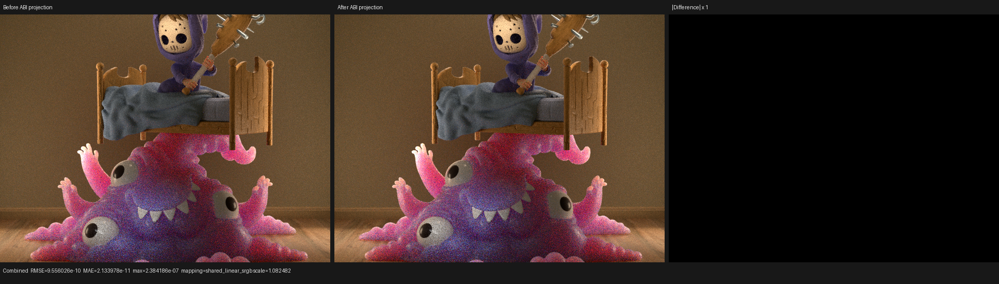

# HIP retained-callable aggregate ABI validation

## Result

LuisaCompute `next` commit `f3efd930f` adds a post-IPO ABI specialization for
large HIP `Callable` functions that LLVM intentionally kept out of line. On
the official Monster Under the Bed export at 640x480, 64 spp, the change
reduces Psycles render-only time from 2.63147 s to 2.45604 s (6.67% lower,
1.071x faster). The dominant `shade_surface` stage falls from 1146.293 ms to
970.543 ms (15.33% lower), while its scratch allocation falls from 3032 to
2632 bytes per thread. Dispatch count, coroutine topology, frame size, and the
other principal kernel resource counts are unchanged.

The profiled Cycles HIP reference for the same scene and sampling contract was
2.344 s. This checkpoint therefore leaves Psycles 4.78% slower end to end on
this workload; it does not claim general parity.

| Metric | Before | After | Change |
|---|---:|---:|---:|
| Render-only time | 2.63147 s | 2.45604 s | -6.67% |
| `shade_surface`, 313 calls | 1146.293 ms | 970.543 ms | -15.33% |
| `shade_surface` scratch/thread | 3032 B | 2632 B | -13.19% |
| `shade_surface` VGPR / SGPR | 256 / 128 | 256 / 128 | unchanged |
| `intersect_subsurface`, 102 calls | 778.516 ms | 779.291 ms | +0.10% |
| closest-intersection, 364 calls | 280.169 ms | 279.855 ms | -0.11% |
| Coroutine frame | 280 B, 70 fields | 280 B, 70 fields | unchanged |

The after run repeated at 2.45319 s without CSV output and 2.45604 s with CSV
output. This independently reproduces the earlier 2.44895 s prototype result.

## Root cause and formal transformation

The retained material callables received the complete, roughly 500--600 byte
surface aggregate by value even though each callable observed only a subset of
its leaves. LLVM could not eliminate fields across a deliberately retained
function boundary. A private-pointer experiment did not solve the problem:
ordinary optimization promoted the pointer back into the same aggregate SSA
ABI, leaving 3032 B scratch and the runtime unchanged.

The implemented transformation runs after ordinary IPO has selected the final
callable boundaries and before internal attributes are removed. For each
aggregate argument it computes the least upper bound of all uses in this
finite lattice:

```text
unused < exact finite set of leaf paths < whole aggregate
```

Only `extractvalue` and `freeze` are modeled. Any call, store, address-taking,
cycle, dead non-root aggregate chain, or other unmodeled use yields `whole
aggregate` and rejects that argument. Direct calls are rewritten only when all
function users are understood; `musttail`, varargs, address-taken functions,
personality/prefix/prologue data, and indirect uses are conservatively
rejected. An unused root aggregate becomes zero parameters. A finite leaf set
becomes exactly those scalar/vector leaf parameters, in deterministic path
order, and each call site extracts the same leaves from its original actual
argument.

This is semantics-preserving because every observable aggregate projection is
replaced by the corresponding actual leaf. One scalar `freeze` is created for
each original `(freeze, leaf-path)` pair, preserving repeated-use consistency.
The original CFG is moved unchanged so entry-block phi legality is preserved.
Function/call calling convention, attributes, metadata, operand bundles, debug
location, tail kind, and fast-math flags are copied. No optimizer runs after
the rewrite, preventing aggregate re-promotion, and one final module verifier
covers the completed HIP LLVM pipeline. The HIP shader-cache codegen revision
was incremented so an old code object cannot mask the new ABI.

## Reproduction

The scene export contains 34 geometries, 36 instances, 31 compiled materials,
and 18 staged surface keys. Shader caches were warmed before profiling; the
reported time is the renderer's synchronized render-only interval.

```bash
cmake --build build -j$(nproc) --target psycles_render_blender_scene

rocprofv3 --kernel-trace --scratch-memory-trace --stats -f csv \
  -d /var/tmp/psycles-aggregate-abi-profile -- \
  ./build/bin/psycles_render_blender_scene \
  /var/tmp/psycles-intersect-subsurface-20260813/exports-latest/monster \
  /var/tmp/psycles-aggregate-abi-profile/monster.ppm \
  hip 640 480 64 64 - 0 0 0 0 64 - 1 0 \
  wavefront-staged 32 32768 32 1 1 0 4 2 4096 0 0 0 1
```

The compact profiler evidence is in
[`monster-key-kernel-resources.csv`](reports/monster-key-kernel-resources.csv),
with complete per-kernel timing tables in
[`monster-kernel-stats-before.csv`](reports/monster-kernel-stats-before.csv)
and
[`monster-kernel-stats-after.csv`](reports/monster-kernel-stats-after.csv).

## Correctness and visual inspection

The IR-level regression has 33 assertions across four proofs:

- a nested aggregate is narrowed to exactly its observed vector and integer
  leaves, including a `freeze`, and its direct call is rewritten;
- an aggregate forwarded to an unknown callee is rejected;
- a completely unused aggregate argument is removed;
- a dead, partially extracted aggregate chain is conservatively rejected.

The existing HIP boundary/fast-math runtime suite passes 60 assertions, and
the HIP LLVM pipeline tests also pass. The final Monster output has zero
invalid pixels. Ten of fifteen recorded passes are bit-exact. The five passes
affected only by floating-point atomic ordering have relative RMSE at or below
`5.95e-9` and maximum absolute error at or below `4.77e-7`. Full metrics are in
[`monster-before-vs-after.json`](reports/monster-before-vs-after.json).

The before and after images were also inspected at native 640x480 resolution.
No structural, material, texture, geometry, lighting, or sampling difference
is visible. The right panel below is the absolute difference; the 99.5th
percentile is zero, so it remains black at the report's unit difference scale.



## Next bottleneck

After this repair, `shade_surface` still uses 256 VGPRs and 2632 B of scratch
per thread. Its retained material callables now have narrow signatures, but
the largest still receive several dozen live leaves and contain the runtime
material dispatch. The next investigation is therefore consumer
specialization/topology deduplication at the already existing 18-key staged
surface queue, plus return/live-range analysis. A global 192-VGPR cap was
measured and rejected: it improved subsurface but slowed surface enough to make
the full render about 3.5% worse.
