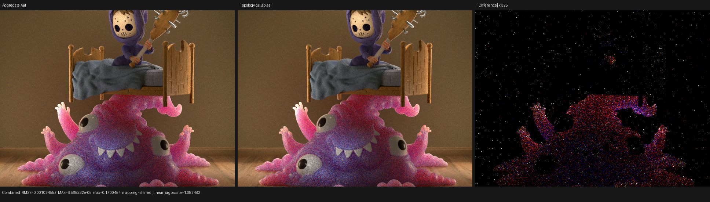
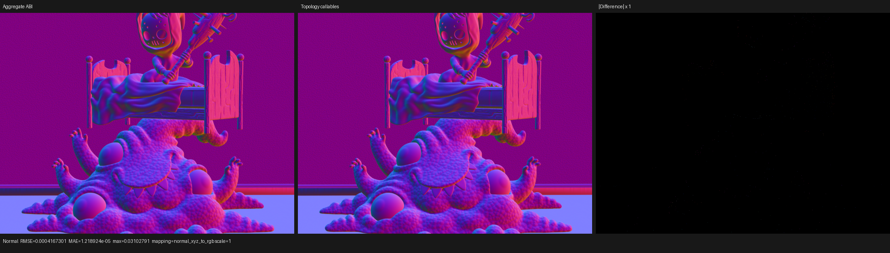
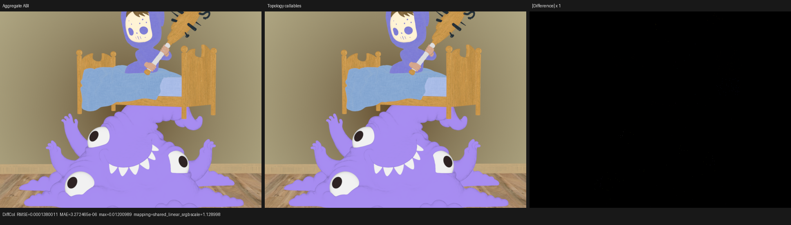

# HIP surface-topology callable validation

## Result

Psycles now records each reachable surface topology as a typed Luisa
`Callable` for preparation, light evaluation, and BSDF/BSSRDF sampling. The
runtime material tag selects one callable; it no longer expands all material
graphs into the caller's switch arms. LuisaCompute `next` commit `2d3631fd3`
formally bounds the remaining HIP inlining expansion at mutually exclusive
call frontiers.

On the official Monster Under the Bed export at 640x480, 64 spp, this reduces
the five-run warm HIP median from the preceding aggregate-ABI checkpoint's
2.45604 s to 2.24823 s: 8.46% less render time, or 1.092x throughput. The
same-device Cycles HIP reference with adaptive sampling and denoising disabled
is 2.344 s, so this checkpoint is 4.09% faster on this workload. This is not a
general parity or performance claim.

| Metric | Aggregate ABI | Topology callables | Change |
| --- | ---: | ---: | ---: |
| Render-only median | 2.45604 s | 2.24823 s | -8.46% |
| `shade_surface`, 313 calls | 970.543 ms | 788.231 ms | -18.78% |
| `shade_surface` cached binary | 1,325,874 B | 2,253,714 B | +69.98% |
| `shade_surface` scratch/thread | 2632 B | 5740 B | +118.09% |
| `intersect_subsurface`, 102 calls | 779.291 ms | 780.115 ms | +0.11% |
| closest-intersection, 364 calls | 279.855 ms | 280.418 ms | +0.20% |
| Coroutine frame | 280 B / 70 fields | 280 B / 70 fields | unchanged |

The larger callable code object and scratch allocation are explicit remaining
costs, not hidden wins. They are outweighed here by eliminating one enormous
merged live range, but the profile says the next work is subsurface and ray
query, not another scene-specific surface special case.

## Typed topology boundary

The transformation is host-stage metaprogramming over the existing surface
objects. For every topology `t`, Psycles records three typed functions:

```text
prepare_t(resources, point, query) -> SurfacePreparation
evaluate_t(resources, point, query) -> SurfaceEvaluation
sample_t(resources, point, random, query) -> SurfaceSample
```

The outer callable implements `result = implementation[tag](arguments)`.
Every valid switch arm contains one direct typed call; the material graph and
its temporaries live only inside that leaf. Empty and single-topology scenes
retain their defined zero/direct behavior. Sampling has a topology-specialized
entry point that visits the selected `Surface` directly while recording the
leaf callable. All sockets, closure trees, setup, evaluation, and sampling are
still generated from the original Blender graph. There is no host evaluator,
material baking, SVM bytecode, weak `float4` parameter ABI, or Cycles-side
precomputation.

Equivalent leaf callables are canonicalized before backend code generation.
Luisa's completed `Function` hash covers the function tag and body, return and
argument types, argument binding kinds, builtins, locals/shared variables,
usage modes, constants, curve bases, builtin operations, launch configuration,
and semantic flags. Resource payloads are deliberately call-site bindings and
are not generated code. Independent equal hashes share one XIR definition;
focused AST and XIR regressions also prove that their distinct resource
captures remain correct at the call sites.

## Formal HIP expansion bound

Let a generated-callable graph node `v` have local instruction count `I(v)`.
With a selected boundary set `B`, its modeled residual expansion is

```text
R(v) = I(v) + sum over direct call sites s of max(R(callee(s)), 1) - 1,
```

where a callee in `B` contributes only the call instruction already counted in
`I(v)`. The LLVM adapter derives alternative groups from actual CFG switch
successors. A group is accepted only when every modeled successor region has
exactly one direct generated-callable site before its common post-dominator;
an explicit unreachable default is excluded. Ambiguous regions are rejected
conservatively.

The selector first makes every recursive strongly connected component a
boundary, because its full expansion is not finite. It then repeatedly
computes all residuals and, for every over-budget node, preserves the complete
proven alternative frontier with the greatest expansion. Selecting the whole
frontier is important: preserving only a minimal subset kept most caller code
and pressure while adding call ABIs. Selection is monotone and adds at least
one boundary per nonterminal round, so it reaches a fixed point in at most
`|V|` rounds. Arithmetic saturates only at `size_t`'s representable maximum,
preserving the ordering of all representable candidates.

The rejected partial-frontier prototype made post-optimization surface IR
2.4% larger and produced a 2.44314 s median, 8.67% slower than the complete
frontier. It was not retained. The accepted surface module has 54 functions
and 20,730,297 bytes of post-optimization LLVM IR, versus 16 functions and
12,440,684 bytes before topology callables. Despite the larger modular IR,
the emitted binary is smaller than the earlier unbounded topology
prototype and the runtime is faster.

## Performance reproduction

The scene contains 34 geometries, 36 instances, 31 runtime materials, 263
exported shader nodes, and 18 staged surface keys. Each warm run used the same
cache, exact executable, scheduler, sample mapping, and synchronized render
interval:

```bash
cmake --build build -j$(nproc)

for run in 1 2 3 4 5; do
  ./build/bin/psycles_render_blender_scene \
    /var/tmp/psycles-intersect-subsurface-20260813/exports-latest/monster \
    /var/tmp/monster-${run}.ppm \
    hip 640 480 64 64 - 0 0 0 0 64 - 1 0 \
    wavefront-staged 32 32768 32 1 1 0 4 2 4096 0 0 0 1
done
```

The times were 2.25080, 2.24655, 2.24583, 2.25054, and 2.24823 s. The
profiler run was 2.27231 s. Its three dominant generated path stages were:

| Stage | Calls | Total | Share | Scratch/thread | VGPR / SGPR |
| --- | ---: | ---: | ---: | ---: | ---: |
| surface shading | 313 | 788.231 ms | 35.09% | 5740 B | 256 / 128 |
| subsurface intersection | 102 | 780.115 ms | 34.73% | 672 B | 256 / 128 |
| closest intersection | 364 | 280.418 ms | 12.48% | 464 B | 184 / 128 |

Fast-math was explicitly enabled by the final command. Psycles propagates it
through `ShaderOption` and shader cache identity into HIP LLVM `-O3`, fast
floating-point operations, and OCML control globals. On gfx1201, disassembly
of the exact profiled RT object contains `image_bvh8_intersect_ray` and
`s_wait_bvhcnt`, confirming the hardware traversal path rather than a software
fallback.

## Correctness and visual inspection

The deterministic serial film path remains the bit-exact diagnostic oracle.
Cross-kernel and cross-backend paths use the same documented `2e-5` relative
tolerance for film pixels and trace slots: floating-point atomics and backend
instruction contraction do not have a portable bit-order contract. The test
still covers Combined, Normal, Albedo, all direct/indirect light passes,
global sample indices, chunk boundaries, megakernel, per-sample, graph,
staged, queued-direct-light, tail, and persistent schedulers.

A separate AST-shape regression constructs two different surface topologies
and requires the outer preparation/evaluation/sampling callables to reference
exactly two correspondingly named topology leaves. It deliberately does not
pin the total helper count, so valid structural-hash deduplication remains
free to merge equivalent closure and shader-service endpoints.

After the final rebase and full-thread rebuild:

- the film/pass matrix passed on fallback and HIP;
- the same matrix passed on Vulkan with
  `LUISA_VULKAN_REQUIRE_NATIVE_XIR_SPIRV=1`;
- 24 closure, subsurface-exit, surface-point, physical-closure, transform,
  surface-ray, and NEE-normal tests passed across fallback/HIP/Vulkan;
- a real Monster 64x64x1 staged render completed on fallback and strict
  native Vulkan; the Vulkan log contains only XIR-to-SPIR-V compilation;
- every recorded 640x480 pass has zero invalid pixels.

The complete before/after metrics are in
[`monster-before-vs-after.json`](reports/monster-before-vs-after.json).
Combined has a 0.006370 relative RMSE and 0.9999936 mean-luminance ratio;
Normal and Diffuse Color have relative RMSE 0.0007310 and 0.0003751. Direct
and indirect pass mean-luminance ratios remain within 0.0043% of one. These
differences are consistent with path/atomic ordering after changing the
function boundary; they do not form a material, geometry, UV, transform, or
lighting structure.

The 640x480 Combined, Normal, and Diffuse Color triptychs were inspected at
native resolution. The left and center panels are visually coincident. The
Combined difference panel is amplified 325x and shows sparse stochastic
samples concentrated on the BSSRDF object; Normal and Diffuse Color are black
at unit difference scale. No coherent edge displacement, texture remapping,
closure replacement, or energy shift is visible.







## Next bottleneck

Surface shading fell by 18.78%, leaving subsurface intersection and closest
intersection at 47.21% of total profiled kernel time. The next investigation
therefore models which scene features actually require a programmable ray
query, compares the existing HIPRT query state machine with direct closest-hit
hardware traversal, and keeps alpha/procedural/curve correctness explicit.
Any accepted fast path must be selected from proven scene capabilities, retain
Cycles-compatible self-intersection behavior, and add a regression; it will
not be a backend-name or scene-name special case.
