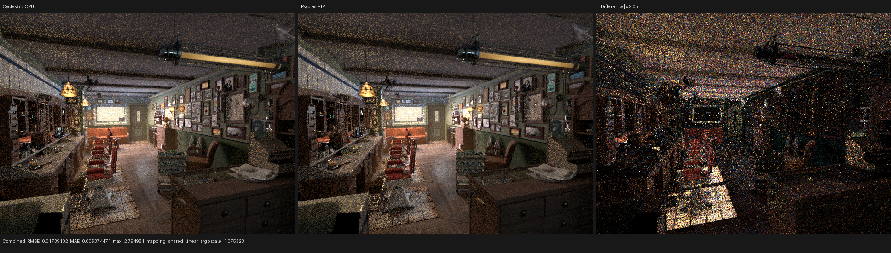
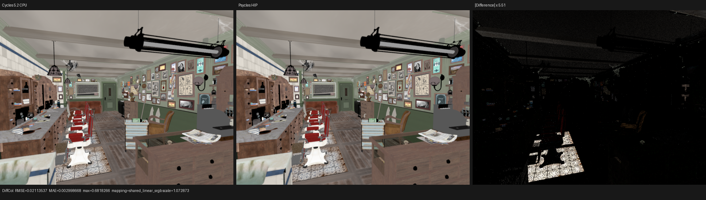
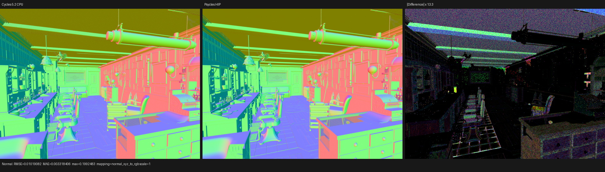
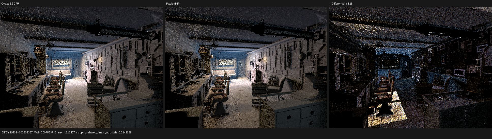
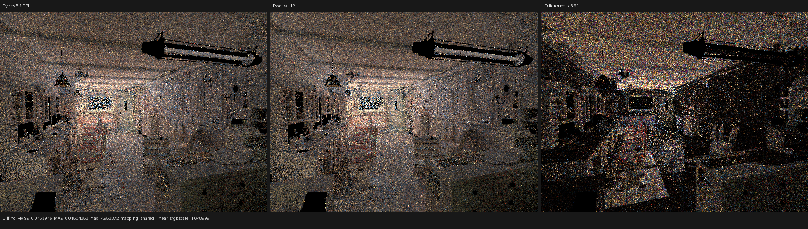
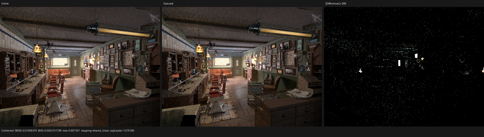
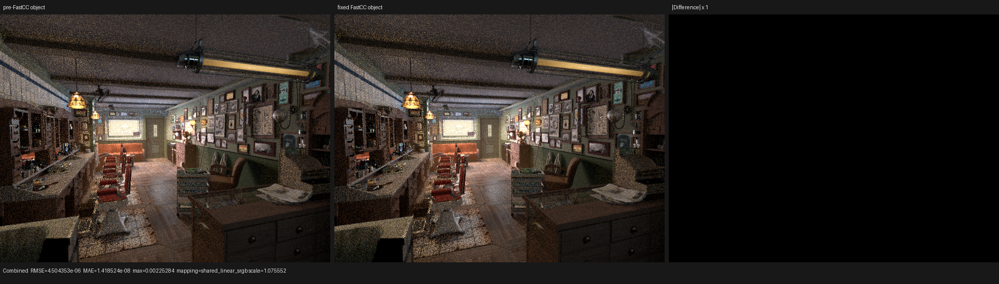

# Barbershop Blender 5.2 reference and HIP performance revalidation

## Outcome

The official Barbershop Interior file is not corrupt. The structured dark
floor, ceiling, and cupboard differences previously treated as a traversal
oracle came from comparing outputs evaluated by different Blender revisions:
a Blender 5.3 Alpha export against a Cycles reference from another build.
Re-evaluating both sides with Blender 5.2 LTS restores the expected scene and
invalidates the synthetic whole-scene candidate-completion path.

The corrected Psycles image has the same broad geometry, textures, ceiling,
floor, and cupboard structure as Cycles 5.2. At 640x480 and 64 fixed samples,
Combined relative RMSE is `0.107473` and mean luminance is `0.999559x`
Cycles CPU. Coherent indirect/glossy residuals remain and are not classified
as mere floating-point noise.

On the RX 9070 XT, the best current Psycles HIP mode is staged wavefront.
The final five-run median is `5.16578 s` for Psycles versus `1.74768 s` for
Cycles HIP at 64 spp (`2.9558x` slower, or `33.83%` of Cycles throughput).
The preceding 256-spp checkpoint was
`20.010 s` versus `6.085 s` (`3.29x` slower). These are render-only intervals
with adaptive sampling and denoising disabled.

## Exact reference identity

The input file was downloaded again from the official benchmark directory.
The old and new copies are byte-identical:

```text
SHA-256 95972b56180462cac47ec82f3a755bd9111ec18ca37a6196a319c013db994130
```

The canonical reference and export use Blender 5.2.0 LTS at
`fbe6228777e7` (`blender-v5.2-release`). The locally checked-out source is at
`/home/mike/Projects/blender-cycles`; the configured build enables HIP and
precompiled HIP kernels, disables CUDA/OptiX/oneAPI, and installs under
`/home/mike/Projects/blender-install-5.2`.

The same file produces materially different final render dependency graphs:

| evaluator | triangle meshes | curves | instances | triangles | geometry payload |
| --- | ---: | ---: | ---: | ---: | ---: |
| Blender 5.3 Alpha `ec438d7429e5` | 1,649 | 6 | 2,565 | 23.75 M | 4.9 GB |
| Blender 5.2 LTS `fbe6228777e7` | 1,055 | 4 | 1,109 | 13.00 M | 2.7 GB |

Materials, lights, and image datablocks are essentially unchanged; the
evaluated geometry/instance population is not. Toggling the 5.3 scene from
Cycles to EEVEE and back did not change its result, so the distinction is the
versioned final-depsgraph evaluation rather than a renderer-engine refresh.
The 5.2 and 5.3 Cycles Combined images have RMSE `0.087516`; 5.2 is `2.2773x`
brighter on average. Normal and Diffuse Color differ much less, which locates
the largest change in transport/visibility rather than UV orientation.

The tooling now records `{version, version_cycle, version_tuple, build_hash,
build_branch, build_type}` in both golden metadata and `scene.json`. The
benchmark runner requires exact equality before starting Psycles, including
for `--reuse-export`. It also preserves authored-disabled view layers instead
of silently enabling them. Host and Blender-side regressions cover both
contracts.

## Traversal correction

Let `E_B(ray)` be the ordered candidate sequence enumerated by acceleration
backend `B`, and `P(ray, candidate)` be the shared exact Cycles triangle
predicate, including visibility, source/light exclusion, closed interval,
and stable identity ordering. Traversal is now defined only as

```text
Accepted_B(ray) = Order(Filter(P(ray, c), c in E_B(ray))).
```

The removed implementation replaced `E_B` with a union containing host-built
whole-support and closed-AABB relations. Even though every injected candidate
was subsequently tested geometrically, the union was not the candidate set
used by Cycles' selected device backend. It could therefore manufacture a
closed-endpoint blocker that neither HIPRT nor the matched Cycles render
enumerated. This was a semantic error, not an insufficiently precise overlap
classification.

Removing completion deletes the dense/sparse source lookup, per-instance
coincident rings, primitive overlap tables, and device-side whole-scene
candidate walks. The ordinary exact per-candidate resolver, widened
closed-distance tie query, Pluecker predicate, and stable order remain. The
focused fallback/HIP/Vulkan traversal and direct-light tests all pass.

On the old mismatched 5.3 bundle, removing the synthetic scan changed
Barbershop HIP from `54.50 s` to `14.68 s` at 640x480/64 spp. That number is
useful only as evidence of the implementation cost; it is not a current
Cycles comparison. On the corrected 5.2 bundle, staged wavefront renders in
about `5.2 s`.

## Corrected image comparison

The 5.2 export contains 1,055 meshes, four curve geometries, 1,109 instances,
564 runtime materials, and 189 surface queue keys. At 640x480/64 spp:

| pass | relative RMSE | Psycles/Cycles mean luminance |
| --- | ---: | ---: |
| Combined | 0.107473 | 0.999559 |
| Normal | 0.018546 | 1.003999 |
| Diffuse Color | 0.080598 | 0.997175 |
| Diffuse Direct | 0.073545 | 0.999622 |
| Diffuse Indirect | 0.404321 | 1.004660 |
| Glossy Color | 0.004834 | 1.000667 |
| Glossy Direct | 0.176833 | 0.996218 |
| Glossy Indirect | 0.540470 | 1.001158 |
| Emission | 0.001513 | 1.000027 |
| Environment | 0.005992 | 1.000958 |

The identity orientation is decisively best for every spatial pass. Visual
inspection of the original-resolution Combined, Diffuse Color, Normal,
Diffuse Direct, and indirect/glossy triptychs confirms that the large black
ceiling/floor holes are gone and the right cupboard is no longer replaced by
a different evaluated object population. Remaining residuals are coherent in
indirect transport and high-energy glossy paths; those remain active parity
work.











## Scheduler matrix and profiler result

All modes below use the same 5.2 bundle, RX 9070 XT, 640x480, 64 samples,
Tabulated Sobol sequence, 64 samples per host batch, 32-thread continuation
blocks, and no adaptive sampling or denoising. Scene compilation and shader
JIT are excluded.

| renderer/mode | render-only | slowdown vs Cycles HIP |
| --- | ---: | ---: |
| Cycles 5.2 HIP | 1.748 s | 1.00x |
| Psycles staged wavefront | 5.166 s | 2.96x |
| Psycles per-sample megakernel | 6.605 s | 3.77x |
| Psycles pixel-loop megakernel | 8.160 s | 4.66x |
| Psycles ordinary wavefront | 10.245 s | 5.85x |
| Psycles graph wavefront | 13.600 s | 7.77x |
| Psycles persistent | 23.435 s | 13.39x |

Staged wavefront is `20.7%` lower latency than the same per-(pixel,sample)
topology without coroutines, so this checkpoint demonstrates a real scheduler
benefit. Graph counter readback is already batched: its largest 64-spp chunk
read only 8,064 bytes in 72 readbacks. Its loss comes from sweep/queue policy
and its optional giant state-machine tail, not bulk PCIe transfer.

### Matched Cycles/Psycles continuation cost

The percentages in a single Psycles profile are not a Cycles comparison. A
matched pair of rocprofv3 traces was therefore captured back-to-back on the
same RX 9070 XT with Blender/Cycles 5.2 commit `fbe6228777e7`, the 5.2 export,
640x480, 64 samples, Tabulated Sobol, and adaptive sampling and denoising
disabled. The Cycles `work_size` values below come from its trace-level
`GPU queue launch` diagnostics before HIP block rounding. The Psycles values
come from `WavefrontCoroDispatchStats::executed_count`; their sums reproduce
the 583 and 475 dispatches in the independent rocprof trace. Thus the
normalization counts logical continuation invocations rather than padded grid
lanes.

| continuation | renderer | calls | logical work | GPU time | ns/logical work | private bytes | VGPR |
| --- | --- | ---: | ---: | ---: | ---: | ---: | ---: |
| `shade_surface` | Cycles | 296 | 53,874,901 | 596.981 ms | 11.081 | 6,976 | 192 |
| `shade_surface` | Psycles | 583 | 68,938,289 | 2,687.007 ms | 38.977 | 4,288 | 256 |
| `intersect_closest` | Cycles | 334 | 73,142,950 | 469.631 ms | 6.421 | 976 | 192 |
| `intersect_closest` | Psycles | 475 | 71,117,397 | 1,653.946 ms | 23.257 | 1,344 | 256 |

The direct answers for aggregate GPU time are therefore:

- Psycles `shade_surface` is `4.501x` the Cycles time, or `350.1%` slower.
- Psycles `intersect_closest` is `3.522x` the Cycles time, or `252.2%` slower.

Those totals contain both implementation cost and different amounts of work.
Psycles executes `27.96%` more `shade_surface` continuations; after
normalization its cost is still `3.517x` per logical surface invocation. By
contrast, Psycles executes `2.77%` fewer `intersect_closest` continuations,
yet costs `3.622x` per logical intersection invocation. The latter is
therefore a direct traversal/kernel efficiency gap rather than a launch-count
artifact. HIP grid padding is only `0.014%` and `0.011%` for the two Psycles
continuations; using grid size in place of the exact counts would not change
the conclusion, but the table deliberately does not do so.

There is one semantic qualification for the surface row. With
`staged_direct_light_queue=0`, the Psycles surface continuation evaluates
direct-light visibility, transparent shadow transport, and film contribution
inline. Cycles' `integrator_shade_surface` publishes a shadow path and delegates
that work to `shade_light_nee`, `intersect_shadow`, and `shade_shadow`. The four
Cycles kernels total `865.255 ms`; comparing the current Psycles surface kernel
against that deliberately over-inclusive denominator gives `3.105x`. This is
a conservative lower bound, not an exact surface-only ratio, because Cycles'
shadow queues also contain proposals originating in volume shading.

To remove that scope mismatch, a second Psycles trace enables the staged
direct-light side queue while keeping every other scene and scheduler setting
fixed. The comparison is by semantic responsibility, not merely by similar
kernel names:

| responsibility | Cycles kernels | Cycles time | Psycles kernels | Psycles time | Psycles / Cycles |
| --- | --- | ---: | --- | ---: | ---: |
| surface population and NEE publication | `shade_surface` + `shade_light_nee` | 657.619 ms | `shade_surface` producer | 2,273.557 ms | 3.457x |
| direct-light visibility, transparent shadow, and contribution | `intersect_shadow` + `shade_shadow` | 207.636 ms | direct-light evaluator | 246.421 ms | 1.187x |
| complete surface/direct group | all four above | 865.255 ms | both above | 2,519.978 ms | 2.912x |
| closest path intersection | `intersect_closest` | 469.631 ms | `intersect_closest` | 1,684.666 ms | 3.587x |

The grouped surface/direct result is therefore `191.2%` slower, while the
queued direct-shadow portion alone is only `18.7%` slower. The dominant
remaining surface cost is the material/closure producer (`245.7%` slower than
the Cycles surface-and-NEE pair), not direct-shadow ray query. The exact
shadow invocation topologies differ, so the aggregate responsibility rows are
the valid comparison; per-invocation division across those rows would not be.
The closest-intersection result remains a direct kernel comparison and is
`258.7%` slower in this queued trace.

The queued and inline production outputs have the same visible geometry,
materials, lighting structure, and mean Combined luminance within `0.20%`.
Their p99 Combined pixel RMSE is `0.000672`; the larger global relative RMSE
of `0.1177` is concentrated in rare high-energy atomic-order outliers. Visual
inspection shows noise/highlight redistribution rather than a structured
image change. Environment and both volume passes are bit-exact.



The queue experiment also exposed a shader-cache identity bug. A Luisa SoA
member base is a function of its logical capacity; constructing the expression
from the host allocation embedded the scheduler capacity in the AST, so a
resolution change could trigger a full surface recompile. Let `C` be the
runtime frame-pool capacity, `A` the allocation capacity, and `q` a produced
slot. The corrected contract is `0 <= q < C <= A`: `C` is now a kernel
argument used both for every SoA member offset and the local bounds guard,
while the host asserts `C == A` for each auxiliary dispatch. No capacity value
is captured during shader construction.

Two independently allocated queues of capacities 7 and 19 now produce the
same structural hash and store/read the expected payload on fallback, HIP,
and Vulkan. The complete production film test forces refill and back-pressure
with capacities 6 and 3; both queued `shade_surface` variants have structural
hash `e00e2a95d8fb8470` and agree for Combined, Normal, Albedo, every light
pass, and both volume passes. The Vulkan run requires the strict native
XIR-to-SPIR-V route.

### Code-object evidence for the two dominant gaps

The responsibility-aligned timing establishes *how much* slower the two hot
continuations are; an offline disassembly of the exact traced objects narrows
*where* the excess work enters. These are static, path-dependent ISA/resource
facts rather than sampled hardware-counter attribution. `rocprofv3` PMC
collection on this gfx1201 installation aborts inside rocprofiler-sdk's packet
registration, including with an exact kernel filter, and the legacy profiler
cannot enumerate the gfx1201 GRBM-derived metrics. No occupancy, cache-miss, or
instruction-retirement number is inferred from that failed route.

| surface code object | Psycles queued producer | Cycles `shade_surface` |
| --- | ---: | ---: |
| VGPRs | 256 | 192 |
| VGPR spills reported by metadata | 3,283 | 2 |
| SGPRs / SGPR spills | 108 / 48 | 102 / 0 |
| private segment per work-item | 40,176 B | 6,976 B |
| dynamic stack | no | no |
| linked `.text` | 21,815,552 B | 7,039,616 B for the **entire** Cycles gfx1201 fatbin |

The Psycles surface object contains 572 text symbols. Of those, 571 are linked
callable symbols occupying 21,328,784 bytes. Barbershop has 189 distinct
surface topology keys, and construction currently emits three independent
typed leaf families for every key:

```text
prepare(topology[0..188])
evaluate_light(topology[0..188])
sample(topology[0..188])
```

That is 567 topology-specialized leaves before the shared dispatch callables.
Each family invokes its own `trace_surface_values` schedule. The graph IR does
topological scheduling and common-subexpression elimination *within* one such
invocation, but it cannot reuse values across the three callable boundaries.
For a bounce which prepares the surface, evaluates NEE, and samples a BSDF,
the current value-work bound is

```text
W_current = W_prepare + W_evaluate + W_sample.
```

For the pure value graph, a single populated typed closure domain would instead
evaluate the topology-closed union of demanded value nodes once:

```text
W_populated = W(D_prepare union D_evaluate union D_sample)
            <= W_prepare + W_evaluate + W_sample.
```

The inequality follows because every value instruction is pure and appears at
most once in the existing topological schedule. It is strict whenever two
consumers share a non-trivial dependency, as material texture and coordinate
subgraphs normally do. This explains both the 567-way code multiplication and
real runtime recomputation; reducing only return-value storage cannot remove
either. The planned correction follows LuisaRender's `create_closure` /
`populate_closure` / typed `evaluate` and `sample` separation: generate only
reachable closure types, populate original closure parameters once in the
topology leaf, and consume that typed state without a weakly typed `float4`
parameter VM or any Blender/Cycles prebake. Before applying the transform, its
proof obligation is to preserve automatic-bump-before-surface ordering,
closure allocation order, caustics pruning, and RNG consumption; those are
semantic effects outside ordinary value CSE.

| closest-intersection code object | Psycles `intersect_closest` | Cycles `intersect_closest` |
| --- | ---: | ---: |
| main symbol size | 57,484 B | 28,756 B |
| VGPRs | 256 | 191 |
| VGPR spills reported by metadata | 222 | 18 |
| private segment per work-item | 1,344 B | 976 B |
| dynamic stack | yes | no |
| static scratch-memory instructions in main symbol | 931 | 44 |

Static scratch instructions are control-flow dependent and therefore cannot be
multiplied directly by invocation count. The `21.2x` count nevertheless agrees
with the metadata-level spill and dynamic-stack gap. Psycles' exact resolver
currently uses HIPRT programmable ray-query callbacks plus a second query for
the Cycles-compatible equal-distance tie domain; Cycles' matched kernel uses
its software BVH traversal and has no dynamic stack. Since logical intersection
work differs by only `-2.77%` while normalized cost differs by `3.622x`, the
next intersection experiment must compare exact closest-hit, callback, and tie
resolver variants on identical rays. It must not be mixed with surface graph
work or attributed to scheduler launch padding.

This comparison changes the optimization order. `intersect_closest` can be
investigated directly against Cycles traversal because its logical workloads
already agree within 3%. For `shade_surface`, the 28% invocation-count
divergence remains relevant to the inline name-matched row, but the queued
responsibility split now localizes the main implementation gap to surface
population/material evaluation. Code generation alone is not assumed to
account for either aggregate gap.

### Continuation-local source-argument projection

The matched trace also prevents a generic compiler cleanup from being
misclassified as a renderer speedup. Let `A` be the ordered source-coroutine
argument domain and let `U_c(a)` mean that continuation `c` has an XIR use of
argument `a`. Once splitting and continuation cleanup are complete, a
continuation denotes a function of `[frame, A]` whose result is independent of
every unannotated `a` for which `U_c(a)` is false. Its signature may therefore
be projected to `[frame, {a in A | U_c(a)}]` without changing its denotation.
The scheduler frame is never projected, annotated arguments are retained, and
the complete set of continuation signatures is validated before any mutation.
The DSL wrapper receives an explicit ordered source-index map, so captured
resources and unbound C++ arguments are reconstructed without positional magic
numbers.

For the six Barbershop continuations, this removes 63 of 180 continuation
argument slots (`35%`). The coroutine frame remains 784 bytes. The
`shade_surface` kernarg segment falls from 832 to 752 bytes, while
`intersect_closest` remains 832 bytes because all of its source arguments are
live. Private storage, VGPR allocation, and the exact intersection ray-query
helpers are unchanged.

The same-command rocprofv3 A/B is intentionally reported against both the
previous Psycles object and the matched Cycles trace:

| continuation | Cycles | Psycles before | Psycles projected | projected / Cycles | change vs before |
| --- | ---: | ---: | ---: | ---: | ---: |
| `shade_surface` | 596.981 ms | 2687.007 ms | 2686.375 ms | 4.500x | -0.02% |
| `intersect_closest` | 469.631 ms | 1653.946 ms | 1663.887 ms | 3.543x | +0.60% |

Both Psycles changes are run-to-run noise. The warm render changes from the
previous five-run median of `5.16578 s` to `5.18509 s` (`+0.37%`). A cold 1x1
compile took `138.20 s` for surface LLVM code generation and `99.41 s` for the
HIPRT link, compared with the earlier `115.99 s` and `94.37 s`; a single cold
sample does not establish a regression, but it provides no compilation-speed
claim either. This transform is retained as a formally justified ABI and
resource-binding simplification, not counted toward the rendering performance
target.

The unprofiled old/new warm outputs remain within the renderer's established
atomic scheduling variation: Combined relative RMSE is `4.85e-5`, Diffuse
Indirect is `0.001353`, Glossy Indirect is `0.000366`, Environment and both
volume passes are bit-exact, and p99 pixel RMSE is zero for every color pass.
Compile-time projection tests validate the exact retained source-index sets.
Runtime tests validate captured-resource and scalar-argument routing through
state-machine, wavefront, and persistent schedulers on HIP and fallback (87
assertions per backend). The film/light and sample-partition gates also pass on
fallback, HIP, and strict native XIR-to-SPIR-V Vulkan.

At 256 spp, rocprofv3 maps the dominant continuation kernels using their
scheduler dispatch counts:

| continuation | GPU kernel time | share of 20.057 s wall | private segment per work-item | VGPR |
| --- | ---: | ---: | ---: | ---: |
| `shade_surface` | 10.570 s | 52.7% | 40,384 B | 256 |
| `intersect_closest` | 6.530 s | 32.6% | 1,344 B | 256 |
| `shade_volume` | 0.476 s | 2.4% | 1,656 B | 256 |
| `shade_light_forward` | 0.118 s | 0.6% | 1,056 B | 256 |

The first two continuations account for `85.3%` of render wall time.
`shade_surface`'s 40 KB private segment proves severe register spilling;
the 784-byte coroutine frame alone does not explain the gap. The next
performance work is therefore closure-local live-range contraction and
generation of only reachable closures, followed by HIPRT closest-hit path
experiments. Block-size or queue-readback tuning cannot cure this profile.

Graph and persistent cold compilation remain separate compiler problems. The
graph tail kernel spent about 79% of sampled host compile time in LLVM IPSCCP,
which materializes a dense per-member lattice over the giant aggregate state
machine. A formal sparse aggregate projection or an earlier demanded-mask
lowering is required; disabling SCCP for this scene would be an ad hoc fix.

## Post-IPO HIP large-return ABI correction

The 189 mutually exclusive surface-topology callables return a roughly
144-byte `SurfaceSampleCall` aggregate. AMDGPU's generated-function return
convention has only 32 32-bit VGPR locations. A return beyond that boundary is
lowered to a hidden caller stack object; because the old IR had one independent
object per static call site, the 189 alternatives accumulated linearly even
though only one executes for a hit.

The Luisa HIP backend now applies a post-IPO ABI transform to every supported
generated callable whose conservatively legalized return exceeds 32 VGPR
locations:

```text
Ret f(args...)  ->  void f(private Ret *result, args...)
```

All calls of one exact return type in a caller share one private result slot,
and each call is followed immediately by the defining load. Hence the slot
live intervals are disjoint; recursive calls still have distinct machine
frames. Running after IPO keeps the callable body in SSA form during ordinary
optimization. The pass atomically rejects external/address-taken functions,
non-default calling conventions, COMDAT/GC or exceptional ABIs, semantic
metadata, operand bundles, tail annotations, fast-math call assumptions, and
indexed `allocsize` attributes rather than partially remapping an unproved
contract. Both the default C convention and Luisa's production `fastcc`
convention are modeled and preserved exactly; all other calling conventions
remain outside the proved domain and are rejected.

A cold production-IR audit caught an integration regression before the final
measurement: all 184 surviving Barbershop material callables use `fastcc`,
whereas the first checked-in guard admitted only the default convention. An
AMDGPU `llc` boundary probe independently confirms that `fastcc` returns 32
`i32` values in VGPR0--VGPR31 and demotes 33 values to a caller-owned private
object, exactly like the convention modeled by the pass. The corrected pass
was then run offline over the complete 181 MB optimized `shade_surface` IR:
it rewrote 184 functions and 189 calls into one shared slot, reported 35,328
demoted bytes, and passed LLVM's module verifier. This production fixture
check complements the small structural unit tests and prevents a green test
suite from masking a route-selection failure.

For the production Barbershop kernel, the pass transformed 184 surviving
generated functions at 189 call sites into one shared result slot, moving
35,328 bytes of aggregate return ABI behind explicit storage. Same-command
rocprofv3 traces at 640x480/64 spp report:

| variant / continuation | calls | GPU kernel time | private segment per work-item | VGPR |
| --- | ---: | ---: | ---: | ---: |
| before / `shade_surface` | 583 | 2705.035 ms | 40,384 B | 256 |
| after / `shade_surface` | 583 | 2689.540 ms | 4,288 B | 256 |
| before / `intersect_closest` | 475 | 1671.748 ms | 1,344 B | 256 |
| after / `intersect_closest` | 475 | 1667.639 ms | 1,344 B | 256 |

Thus the static private segment falls by `89.38%`, but `shade_surface` kernel
time changes by only `-0.57%` and the warm render median by about `-0.41%`,
both near run-to-run noise. The final five fixed-object render-only samples
are `5.16170`, `5.16172`, `5.16578`, `5.16623`, and `5.17089` seconds. The old
ABI reserved 189 disjoint static objects,
while a dynamic path touched only one return; sharing removes the capacity
pathology without removing the remaining dynamic store/load work. The
unchanged 256-VGPR count identifies live-range/instruction pressure inside
surface evaluation as the next target. `intersect_closest` remains the other
large cost and is unaffected, as expected.

The final profile also audited shader-cache identity. During development, an
old object had been compiled with the same temporary codegen revision before
the `fastcc` admission fix; its 21,418,182-byte artifact still reported the
40,384-byte private segment. The clean cache was preserved outside the
worktree and regenerated with the released revision-14 backend. The resulting
21,412,550-byte artifact logs the exact 184/189/1 transform above and reports
4,288 bytes under rocprofv3. This local development collision cannot occur
when updating from the published revision 13, but the artifact-size and
private-segment checks ensure that no stale object entered the final numbers.

A no-cache 1x1 render isolates compilation from image work. The dominant
surface module took `115.99 s` in LLVM code generation, emitted a 23,098,396
byte bitcode package, and one fully cold HIPRT link took `94.37 s`; total
process time was `256.87 s` with a `19,671,996 KiB` peak RSS. A repeated link
of identical bitcode took `1.61 s`, so link caching/cold-state behavior is a
separate compiler-startup investigation rather than render throughput.

An exact old-object/fixed-object A/B was compared against two repeated fixed
runs for Combined, Normal, Albedo, all twelve light passes, and both volume
passes. The notable relative RMSE values are all smaller across the ABI change
than across the fixed-object repeat: Combined `2.7774e-5` versus `4.1930e-5`,
Diffuse Indirect `0.00134755` versus `0.00234347`, and Glossy Indirect
`0.000162856` versus `0.000215460`. Environment and both volume passes are
bit-exact. Every p99 pixel error is zero except Normal at no more than
`6.73e-11`; the remaining color/normal differences are float-ULP scale.
Therefore the isolated bright pixels are existing atomic/scheduling
nondeterminism, not the ABI transform.

Original-resolution visual inspection of the ABI Combined triptych found no
structural difference on the floor, ceiling, cupboard, lamps, or highlights;
the difference panel is visually black. The scene-level Cycles/Psycles
triptychs above remain the visual parity record.



The formal boundary and rejection-domain regressions contain 128 assertions,
including preservation of `fastcc` on both the replacement function and its
call site plus rejection of an otherwise eligible `coldcc` function.
The HIP LLVM pipeline and callable graph suites pass, as do full parallel
Luisa and Psycles builds. Film/light regressions pass on fallback, HIP, and
strict native XIR-to-SPIR-V Vulkan, together with the sample-dispatch
partition test.

## Commands and gates

The corrected staged run is:

```text
./build/bin/psycles_render_blender_scene \
  <blender-5.2-export> out.ppm hip 640 480 256 64 \
  - 0 0 0 0 256 - 1 0 wavefront-staged \
  32 32768 32 1 1 0 4 2 4096 131072 0 0 1
```

The profiler adds:

```text
LUISA_CORO_WAVEFRONT_STATS=1 rocprofv3 \
  --kernel-trace --memory-copy-trace --scratch-memory-trace --stats -- \
  <command-above>
```

All available host cores were used for builds and tests. The focused gates
cover scene planning, traversal, direct lighting, shader identity, benchmark
identity, and Blender export/golden behavior. The final traversal tests pass
on fallback, HIP, and strict native XIR-to-SPIR-V Vulkan.

The complete suite reports 264/266 passing on this host. The two failures are
existing strict Vulkan numeric baselines (`luisa_area_light_forward_vk` and
`luisa_volume_path_vk`), with stable errors between roughly `1e-5` and
`1.3e-4`. A clean worktree at the pre-change `origin/main` commit `06575e4`,
built against the identical Luisa commit and native XIR-to-SPIR-V route,
reproduces every reported value exactly on the same RX 9070 XT/RADV stack.
They are therefore recorded as a pre-existing backend/driver baseline drift,
not hidden by widening tolerances and not attributed to this traversal
change.
