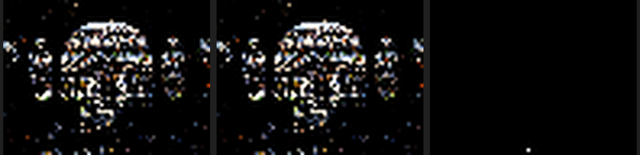

# Same-graph shadow branch and frame-liveness validation

## Result

The direct-light Cycles-stage path is now one coroutine graph. A surface
vertex may enter `SHADE_LIGHT_NEE` or bypass it, both paths join at
`INTERSECT_SHADOW`, transparent hits loop through `SHADE_SHADOW`, and the
main path resumes at `INTERSECT_CLOSEST`. No renderer-specific nested
coroutine or hand-written shadow scheduler is involved.

On the Lone Monk structural canary, releasing populated surface/closure state
before this branch reduced the fallback coroutine frame from **992 B to
352 B** and the physical field count from **223 to 87**. The graph still has
seven subroutines. This is a liveness reduction, not a packed-layout trick or
an unsafe liveness override.

## Formal control-flow model

For each suspend edge `e = (p, q)`, let `L(e)` be the values whose definitions
reach `e` and which may be used from successor `q`. Two values interfere only
when one scope or one concrete transition edge witnesses both values live.
Consequently, for

```cpp
$if (condition) {
    $suspend("A");
    // A-local work
}
$else {
    $suspend("B");
    // B-local work
};
$suspend("C");
```

the A-local and B-local values do not interfere merely because
`L(A) union L(B)` contains both. A physical slot may be shared when no single
edge or scope needs both values. Values consumed after C are different: they
are genuinely live on each predecessor edge into C.

Luisa commit `7f25e6c0d` adds the independent regression
`mutually_exclusive_suspend_edges_share_frame_storage`. It constructs the
conditional A/B graph, verifies the graph edges, and proves that the two
branch-local exported payloads resolve to the same physical frame index.

The first Psycles shadow split already produced separate surface-to-light and
surface-to-intersect edges. Its 992 B frame was therefore not caused by an
A/B live-set union. `surface_scatter` was textually and semantically after the
shadow loop, so populated surface points, closure data, and sampling
temporaries were real downstream uses and had to remain live.

The corrected order is:

1. Reduce surface NEE to a self-contained shadow task and capture the
   pre-scatter film classification.
2. Sample the BSDF continuation and reduce any BSSRDF entry to its compact
   transport state.
3. Enter the conditional light-evaluation edge and shadow state machine.
4. Accumulate NEE using the captured pre-scatter flags, visibility, and depth.
5. Consume the explicit BSDF-continuation predicate; a rejected continuation
   terminates only after the current vertex's NEE has completed.

This ordering proves that no populated surface or closure value is used below
the first shadow suspend. Megakernel and detached direct-light-queue builds
still execute shadow work before scatter, so their live ranges are not
lengthened by the coroutine-specific transformation.

## Frame evidence

The same exported Lone Monk scene and the same 1 spp sample were used for both
materializations:

| Measurement | Shadow before scatter | Scatter before shadow |
|---|---:|---:|
| Subroutines | 7 | 7 |
| Physical frame fields | 223 | 87 |
| Frame bytes | 992 | 352 |
| `shade_surface` touched values | 218 | 78 |
| surface -> `shade_light_nee` live values | 218 | 77 |
| surface -> `intersect_shadow` live values | 214 | 73 |
| `shade_light_nee` external values | 195 | 22 |
| `shade_shadow` external values | 210 | 37 |
| `shade_shadow` -> `intersect_closest` live values | 40 | 40 |

The two conditional edges remain distinct: the non-constant-light edge has 77
live values and the constant-light bypass has 73. Their branch-local values
are not combined into one interference clique. The remaining 40-value main
continuation is unchanged; those values are genuinely used after the
sequential shadow work and are not surface/closure leakage.

Reproduction:

```bash
cmake --build build -j32

LUISA_CORO_DUMP_FRAME_LAYOUT=1 \
./build/bin/psycles_render_blender_scene \
  /var/tmp/psycles-lone-monk-transmission-dbdcb17/export \
  /var/tmp/psycles-branch-wavefront-reordered-dump.ppm \
  fallback 1 1 1 1 - 0 0 0 0 1 - 1 0 wavefront 32
```

## Correctness regression

`psycles_luisa_sample_dispatch_film_tests` now includes a no-trace
`megakernel-per-sample` control with the same atomic per-(pixel, sample)
dispatch topology as the deferred-shadow coroutine. It compares Combined,
Normal, Albedo, every light pass, transmission, volume, and sample count with
numeric tolerance. This isolates the scheduling transformation from serial
film ordering and host sample chunking.

The focused fallback suite passed 6/6 tests:

```bash
ctest --test-dir build --output-on-failure -j32 -R \
  'psycles\.(luisa_path_scheduler|luisa_sample_dispatch_film_fallback|luisa_random_walk_fallback|luisa_direct_lighting_plan_fallback|luisa_surface_nee_normal_fallback|sample_dispatch_partition)'
```

The full-pass regression, including the new megakernel/coroutine comparison,
also passed directly:

```bash
./build/bin/psycles_luisa_sample_dispatch_film_tests fallback
```

## Numerical and visual check

The pre/post 64x48, 1 spp Lone Monk EXRs were compared over all 46 channels:

```bash
oiiotool --fail 0 --warn 0 --diff \
  /var/tmp/psycles-branch-wavefront.exr \
  /var/tmp/psycles-branch-wavefront-reordered.exr
```

The mean error is `6.07377e-9`, RMS error is `7.26627e-7`, and maximum error
is `1.60217e-4` in one high-energy Glossy Direct channel. There is no pass
shape or structured image difference. A current fused per-sample megakernel
comparison showed the same larger floating-point tail already present before
this scheduling reorder, so that tail is not attributed to the frame fix.

The following triptych is, from left to right, the old same-graph result, the
reordered result, and the absolute linear-Combined difference amplified
100,000 times. It was inspected at its original 792x192 resolution. Geometry,
silhouette, illumination, grass detail, and shadow placement are visually
identical; the amplified panel contains only one isolated bright pixel at this
sample count.



This small render is a structural/frame canary, not the final performance
claim. HIP 640x480+ profiling and high-spp scene comparisons remain the next
validation stage.
