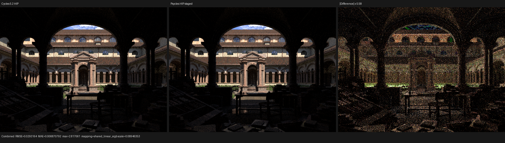
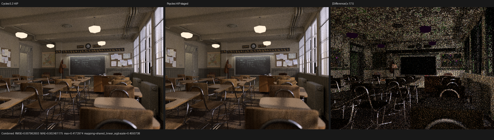
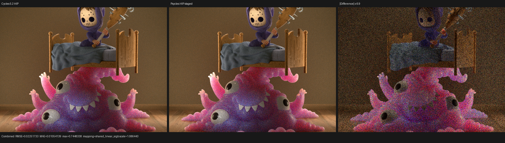
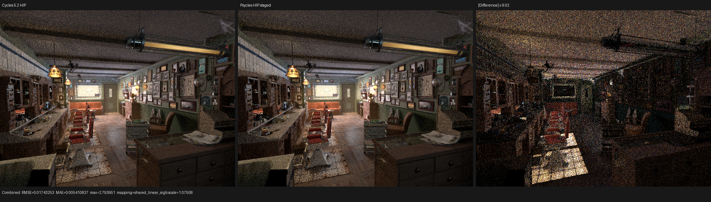
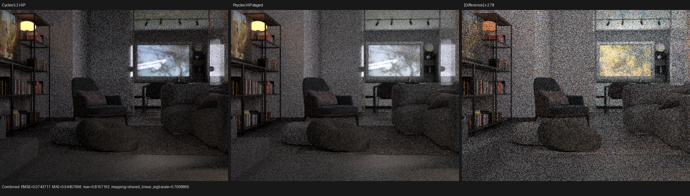

# Five-scene HIP performance checkpoint

This checkpoint measures current Psycles commit `c51c61a` and LuisaCompute
commit `7f25e6c0d` against Blender/Cycles 5.2 LTS commit `fbe6228777e7` on the
same AMD Radeon RX 9070 XT with ROCm 7.2. The requested `benchmark.zip` scene
is deliberately out of scope for this checkpoint. The completed scenes are
Lone Monk, Classroom, Monster Under the Bed, Barbershop Interior, and Flat
Archiviz. Blender 4.1 Splash is reported separately because Psycles runs out
of VRAM during HIPRT scene construction before any render kernel is launched.

Every completed render uses 640x480 pixels, 64 fixed samples, seed zero,
Tabulated Sobol, and no adaptive sampling or denoising. Lone Monk, Classroom,
and Monster were re-exported with the exact Blender 5.2 binary used for the
Cycles reference. Barbershop and Flat Archiviz use their existing 5.2 exports.

## Primary same-GPU result

Blender's `bpy.ops.render` interval includes scene and texture preparation, so
it is not a same-boundary GPU throughput metric. This is particularly severe
for Barbershop and Flat Archiviz. The primary column below instead sums all
Cycles `kernel_gpu_integrator_*` kernels and compares it with the mapped
Psycles path entry, continuation, and scheduler kernels from the same
`rocprofv3` trace. It excludes BLAS/TLAS construction, transfers, image
encoding, and host shader JIT on both sides.

| Scene | Cycles render interval | Psycles staged interval | Cycles integrator kernels | Psycles mapped path kernels | Psycles / Cycles GPU time |
|---|---:|---:|---:|---:|---:|
| Lone Monk | 1.89468 s | 1.81190 s | 854.684 ms | 1487.202 ms | **1.740x slower** |
| Classroom | 1.36751 s | 1.93869 s | 818.604 ms | 1632.014 ms | **1.994x slower** |
| Monster Under the Bed | 2.09379 s | 2.30938 s | 1021.209 ms | 1939.416 ms | **1.899x slower** |
| Barbershop Interior | 8.61308 s | 5.69578 s | 1442.898 ms | 4898.780 ms | **3.395x slower** |
| Flat Archiviz | 15.75054 s | 3.37266 s | 1011.042 ms | 2818.551 ms | **2.788x slower** |

The apparent Psycles wins in the renderer intervals for Lone Monk,
Barbershop, and Flat Archiviz are therefore not GPU wins. On matched path
kernels Psycles is currently 1.74x--3.40x slower in every completed scene.

## Work-normalized stage comparison

The profiler trace supplies each launch grid, so total stage time can be
factored exactly as

`time ratio = dispatched-work ratio * nanoseconds-per-work-item ratio`.

Grid work is rounded at most by one workgroup per launch. It is a better proxy
for active queue population than kernel-call count, but it does not claim that
the two renderers perform identical instructions for every work item.

### Surface shading

| Scene | Psycles / Cycles dispatched work | Psycles / Cycles cost per work item | Psycles / Cycles total surface time | Psycles surface time | Cycles surface time |
|---|---:|---:|---:|---:|---:|
| Lone Monk | 1.330x | 2.405x | 3.20x | 838.468 ms | 262.094 ms |
| Classroom | 1.338x | 2.903x | 3.89x | 1134.594 ms | 291.956 ms |
| Monster | 1.081x | 2.824x | 3.05x | 887.619 ms | 290.731 ms |
| Barbershop | 1.276x | 3.894x | 4.97x | 2946.102 ms | 593.072 ms |
| Flat Archiviz | 1.536x | 3.028x | 4.65x | 1925.801 ms | 414.031 ms |

This is the only hotspot that is coherently slow across all five scenes.
Psycles both produces more surface work and spends substantially more time on
each item. The effect is not explained by the coroutine scheduler alone.

The resource records reinforce the code-generation diagnosis:

| Scene | Psycles surface scratch | Cycles surface scratch | Psycles VGPR | Cycles VGPR |
|---|---:|---:|---:|---:|
| Lone Monk | 5936 B | 6976 B | 256 | 192 |
| Classroom | 12928 B | 6976 B | 256 | 192 |
| Monster | 5296 B | 6976 B | 256 | 192 |
| Barbershop | 40368 B | 6976 B | 256 | 192 |
| Flat Archiviz | 13592 B | 6976 B | 256 | 192 |

Barbershop's 40 KiB profiler-reported scratch and every Psycles surface
kernel reaching 256 VGPR are concrete targets. Lone Monk and Monster prove
that scratch alone is not the whole model: their scratch is below Cycles, but
their per-item cost remains 2.4x--2.8x higher. Instruction count, material
topology expansion, occupancy, and frame/material traffic still need separate
measurement.

### Closest intersection

| Scene | Psycles / Cycles dispatched work | Psycles / Cycles cost per work item | Psycles / Cycles total time |
|---|---:|---:|---:|
| Lone Monk | 1.000x | 0.974x | 0.97x |
| Classroom | 0.996x | 0.972x | 0.97x |
| Monster | 1.094x | 0.975x | 1.07x |
| Barbershop | 0.970x | 3.280x | 3.18x |
| Flat Archiviz | 1.182x | 1.387x | 1.64x |

This rules out a universal HIPRT closest-hit regression: the three scenes
without the Barbershop curve/complex traversal mix match Cycles per work item
within about 3%. Barbershop is the traversal outlier and must be investigated
through its curve/custom-function path rather than by slowing every scene to
an exact software resolver. Flat Archiviz is a smaller scene-specific outlier.

Monster's `intersect_subsurface` costs 1.698x per dispatched item and 1.74x in
total. Barbershop's `shade_volume` costs 3.497x per item and 3.33x in total.
Psycles shadow intersection costs 1.49x--2.43x per item across the five
scenes, although the two renderers publish different numbers of shadow-stage
items and therefore require a semantic queue audit before a total-time ratio
is treated as a micro-kernel comparison.

## Coroutine versus same-topology megakernel

The control uses the same per-(pixel, sample) 3D launch topology and the same
Psycles path implementation, but no coroutine frame or wavefront scheduler.

| Scene | Staged coroutine | Per-sample megakernel | Staged / megakernel |
|---|---:|---:|---:|
| Lone Monk | 1.81190 s | 1.47395 s | 1.229x |
| Classroom | 1.93869 s | 1.90284 s | 1.019x |
| Monster | 2.30938 s | 2.38000 s | 0.970x |
| Barbershop | 5.69578 s | 6.10687 s | 0.933x |
| Flat Archiviz | 3.37266 s | 3.02072 s | 1.117x |

Coroutine staging already improves Monster by 3.0% and Barbershop by 6.7%,
is nearly neutral on Classroom, and regresses Lone Monk and Flat Archiviz by
22.9% and 11.7%. This rejects both blanket claims that wavefront is the main
problem and that it is already universally beneficial.

Cold megakernel compilation remains a separate serious problem. The generated
AMDGPU objects and total JIT intervals were about 2.29 MB / 14.44 s for Lone
Monk, 4.13 MB / 28.63 s for Classroom, 2.57 MB / 16.24 s for Monster,
23.23 MB / 190.43 s for Barbershop, and 5.99 MB / 44.35 s for Flat Archiviz.
Barbershop spent 80.06 s in LLVM code generation and another 105.75 s linking
the 21.50 MB final code object. These values are not in render-only timings.

## Numerical and visual inspection

| Scene | Combined relative RMSE | luminance ratio, Psycles / Cycles | invalid pixels | Status |
|---|---:|---:|---:|---|
| Lone Monk | 0.0188040 | 1.0009135 | 0 | valid checkpoint |
| Classroom | 0.0205005 | 0.9992843 | 0 | valid checkpoint |
| Monster | 0.1410086 | 1.0028736 | 0 | coherent SSS residual remains |
| Barbershop | 0.1077301 | 0.9996458 | 0 | missing source images remain |
| Flat Archiviz | 0.3635470 | 1.5189565 | 0 | invalid quality oracle: IES unavailable/unsupported |

All five Combined triptychs were opened at their original 640x480 panel
resolution. Lone Monk, Classroom, Monster, and Barbershop have aligned camera,
silhouette, geometry, UV layout, and broad material structure. Lone Monk and
Classroom residuals are predominantly illumination/sampling detail. Monster
retains coherent skin, blanket, and BSSRDF residuals. Barbershop now aligns in
floor, ceiling, wall, and cabinetry structure; its remaining difference is
coherent shading and high-energy sampling rather than a global transform or
UV failure.

Flat Archiviz is systematically too bright and is not accepted as a quality
comparison. Psycles reports four reachable `TEX_IES` nodes as unsupported;
the downloaded blend also references the absent external file
`IES_profiles/three-lobe-vee.ies`, which Cycles reports as unreadable. Its
performance rows are retained as diagnostic workload measurements only.

### Lone Monk



### Classroom



### Monster Under the Bed



### Barbershop Interior



### Flat Archiviz diagnostic



The machine-readable Combined reports are stored next to each triptych.

## Splash and asset caveats

Blender 4.1 Splash completes in Cycles HIP, but the current Psycles export has
an 8.84 GB `geometry.bin`. Psycles fails while growing the HIPRT high-quality
build scratch for the seventeenth geometry on a 16 GB GPU, before shader JIT
or rendering. No performance ratio is reported for a renderer that never
enters its render interval.

The Barbershop source reports two missing image files in Cycles; the Psycles
export reports the corresponding duplicated material image identifiers. Its
performance is reproducible and its broad image structure was inspected, but
it is not a fully self-contained asset-quality oracle.

## Reproduction

Psycles staged profile shape:

```bash
LUISA_CORO_SHADER_MAP=1 LUISA_CORO_WAVEFRONT_STATS=1 \
rocprofv3 --kernel-trace --stats -f csv -d <trace-dir> -o trace -- \
./build/bin/psycles_render_blender_scene \
  <Blender-5.2-export> <output.exr> hip 640 480 64 64 \
  - 0 0 0 0 64 - 1 0 wavefront-staged \
  32 32768 32 1 1 0 4 2 4096 131072 0 0 1
```

The megakernel control changes only `wavefront-staged` to
`megakernel-per-sample`. The dispatch remains per-(pixel, sample).

Cycles profile shape:

```bash
rocprofv3 --kernel-trace --stats -f csv -d <trace-dir> -o trace -- \
/home/mike/Projects/blender-install-5.2/blender <scene.blend> \
  --background --python-exit-code 1 \
  --python tools/render_cycles_golden.py -- \
  <output.exr> 640 480 64 \
  --cycles-device HIP --device-name 'Radeon RX 9070 XT'
```

Raw profiler traces and logs are retained locally under
`/var/tmp/psycles-multiscene-perf-c51c61a`. The exact shader hashes are in
each Psycles log and were used to map anonymous `kernel_<hash>` entries back
to semantic continuation names.
