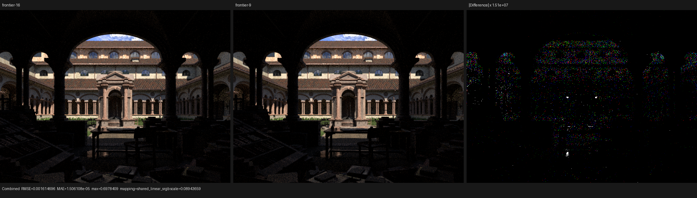
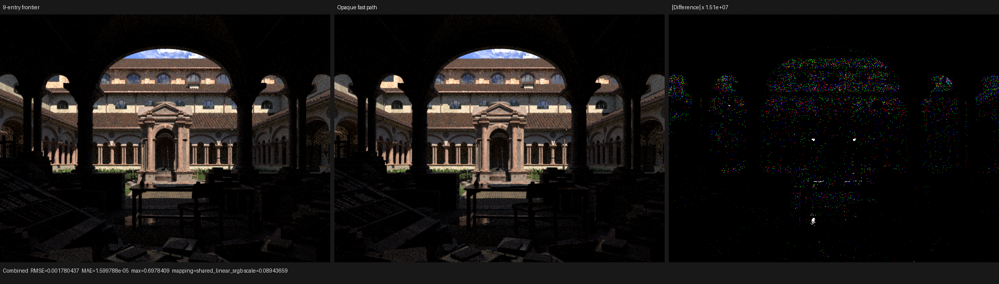
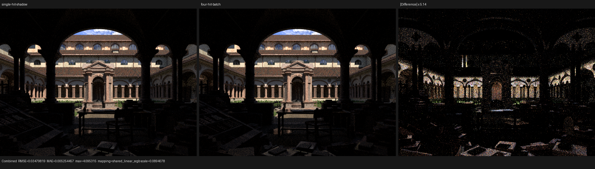
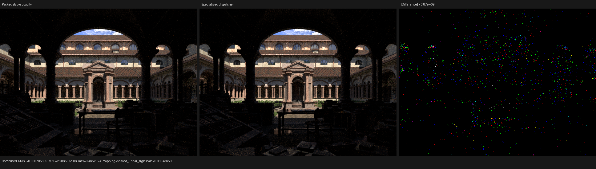
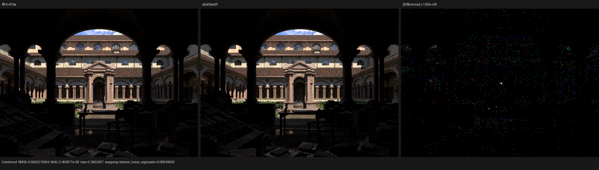
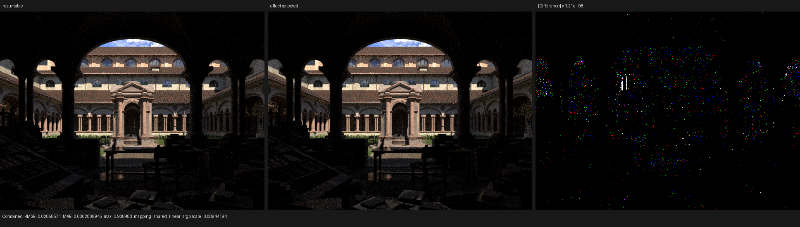
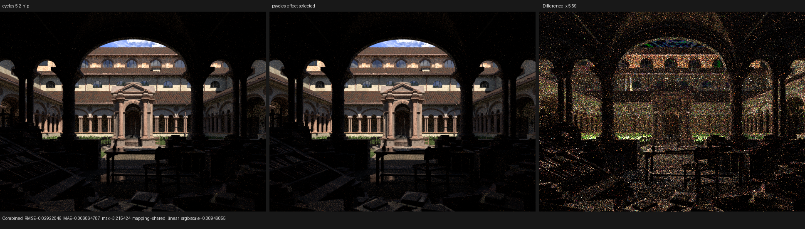

# HIP resumable RayQuery frontier validation

This checkpoint redesigns LuisaCompute's gfx12 RayQuery traversal state and
callback transport. It does not add renderer policy to the HIP backend: source
filtering, alpha evaluation, material closures, and transparent-shadow batching
remain expressed by ordinary RayQuery handlers in Psycles. The backend changes
only how the native HIPRT frontier and callback state are represented.

Machine: Radeon RX 9070 XT (`gfx1201`), ROCm 7.2.53211.

LuisaCompute commits:

- `3a556dd47` -- formally localize invocation-local RayQuery handler scratch;
- `d98735f55` -- persist resumable RayQuery on the gfx12 hardware frontier;
- `8a7a62162` -- evaluate the handler-scratch proof as sparse reachability;
- `fb2427984` -- separate RayQuery identity from callback captures;
- `e6c65fb90` -- compact the synchronous hardware frontier to the proven
  nine-entry minimum;
- `4681981ca` -- consume paired triangle candidates and transport proven-stable
  instance opacity in the native traversal node;
- `8e0efb4ff` -- specialize constant RayQuery dispatcher identities after IPO
  and merge equivalent specialized bodies;
- `931213cdc` -- match each LLVM backend's RTTI mode to the selected LLVM
  package so static RTTI-disabled ROCm LLVM remains loadable;
- `f303c3132` -- generalize constant-argument specialization to atomic tuples,
  while retaining only the measured-profitable pipeline identity in the HIP
  RayQuery production boundary;
- `ff91c47da` -- project candidate-only callback transactions into scalar
  actions while retaining the exact full-state path for observable queries;
- `a5a03ee0f` -- prove function-local RayQuery state provenance across lowered
  handler boundaries and remove the candidate-only pointer-identity escape;
- `d3b3eecc2` -- select synchronous versus resumable traversal from a closed
  proof of whether the parent observes the query post-state.

## Traversal-state model

Let `U` be the set of reachable but not yet visited BVH nodes. At every
candidate transition the implementation represents `U` as the disjoint union

```text
U = H disjoint-union S
```

where `H` is the bounded `ds_bvh_stack` frontier in LDS and `S` is either empty
or one parent-link subtree continuation `(root, parent, completed_child)`. A
complete BVH8 expansion may add eight entries, so traversal enters `S` before
expanding whenever the hardware entry count is at least `capacity - 8`.
Within `S`, descent clears `completed_child`; ascent follows the node parent and
uses the completed child as the skip token. Exhausting `root` resumes `H`.

A BLAS traversal saves the corresponding TLAS continuation separately. On a
candidate return, the RayQuery state persists both packed hardware-stack
addresses and both parent-link continuations. The candidate leaf has already
been removed from `U`, so resumption cannot replay it. An unexpected hardware
overflow traps because it would violate the partition invariant instead of
silently dropping or repeating candidates.

The former implementation persisted a 64-entry per-thread private software
stack. The new state is 224 B instead of 448 B. Both resumable and synchronous
RayQuery now use a nine-entry hardware frontier. Nine is the minimum capacity
that leaves one ordinary hardware entry plus the complete eight-child
expansion reserve; both paths use the same exact parent-link continuation when
that reserve would be crossed. Ordinary static trace retains eight entries and
its one-shot overflow fallback.

The deep regression constructs 1024 overlapping BLAS triangles and 256
overlapping TLAS instances. It verifies that every candidate callback is
observed exactly once, covering repeated `proceed`, BLAS/TLAS continuation,
paired triangles, rejection, commit, and early termination.

## Handler-local storage proof

XIR outlining previously treated every entry-block `alloca` referenced by a
candidate handler as captured state, even when the allocation was only
invocation-local scratch. The new analysis localizes an allocation only when
all of the following hold:

1. every use is a direct whole-object load or store;
2. its address never escapes through GEP, cast, call, pointer store, or return;
3. exactly one candidate-handler region owns all loads;
4. every handler load is preceded by a full store on every path from that
   handler's entry.

The implementation evaluates the fourth condition through its equivalent
counterexample graph. Starting at handler entry in the uninitialized state,
each path is cut immediately after its first full store. Localization is valid
exactly when no load is reachable in the remaining graph:

```text
unsafe(alloca) iff
    exists path(entry, load) containing no earlier full_store(alloca)
```

The traversal scans instructions through the first store and visits each block
at most once per candidate allocation. Diamond joins and cycles need no dense
fixed-point iteration: both written arms are cut, while any unwritten arm still
reaches and rejects a load. Anything not proven safe remains captured.
Regression coverage includes load-before-store, a conditional single-arm
store, stores on both diamond arms, an outside initializer killed by a
must-store, and genuinely observable cross-candidate state.

The first implementation computed a separate dense predecessor fixed point for
every captured allocation. A cold Psycles mixed triangle/curve shadow shader
exposed its pathological complexity: it remained in XIR for more than 58 s,
and a five-second `perf` sample attributed 32.45% directly to predecessor
traversal plus 24.69% to associated hashing. The sparse equivalent completes
the entire cache-disabled HIP scene-traversal regression in 1.25 s; its two
HIP LLVM codegen intervals are 443.9 ms and 340.7 ms. The regression now
explicitly disables persistent shader cache so this compiler path is exercised
on every run.

At the scratch-localization checkpoint, the cutout kernel's projected callback
environment fell from 48 B to 16 B and its linked code object from
approximately 46,836 B to 45,992 B. The corresponding Psycles split-kernel
environments were 96 B and 192 B; identity separation removes another 8 B
from each, leaving 88 B and 184 B. The analysis correctly retains all of their
genuinely cross-stage allocations.

## Callback identity and environment ABI

The follow-up redesign models a synchronous candidate callback as the product

```text
CallbackABI = QueryIdentity x UserEnvironment
```

`QueryIdentity` is not a user capture. It is the identity of the active
per-invocation traversal state and is always required by the candidate object.
AMDGPU private pointers are exactly 32 bits in the target data layout, so the
HIP LLVM RayQuery representation is now the exact `i32` state-address token
instead of the historical five-`i64`, 40 B source-layout surrogate. The token
is stored in an existing four-byte alignment hole in the 128 B synchronous
state; neither the state size nor the following ray offset changes. The native
wrapper passes a pointer to that token as a dedicated dispatcher operand.

Only `UserEnvironment` is subject to the interprocedural least-fixed-point
demand proof described above. An empty product is represented by `null`. A
single retained generic pointer is transported directly using the exact
one-field-product isomorphism `{p : ptr} <-> p`; non-pointer scalars are not
encoded as pointers. Larger products retain ordinary typed storage. This does
not merge object lifetimes or infer aliasing: it only removes representation
that has no semantic observer.

The structural regression compiles a cache-disabled RayQuery and checks the
final LLVM IR for all four properties: no 40 B query surrogate, no escaped
standalone query-token allocation, no materialized empty user environment,
and direct decoding of the 32-bit token from the dedicated dispatcher
identity operand. The semantic RayQuery suite additionally covers rejection,
commit, early termination, paired triangles, deep TLAS/BLAS continuation, and
reentrant fallback selection.

## Renderer transparent-shadow integration

Psycles now expresses the Cycles GPU shadow traversal shape with one ordinary
RayQuery per batch. The handler maintains this order-independent invariant:

```text
hits[0:count) = nearest min(total, 4) accepted candidates, sorted by ray t
```

An opaque candidate or exhausted transparent-bounce budget terminates the
query. Otherwise the shade stage evaluates the four raw material closures in
distance order. It launches another query only when `total > count`, starting
after the farthest shaded hit. No opacity or closure is baked during scene
export; the material flag is only a conservative proof that a shader cannot be
transparent and therefore may terminate without deferred closure evaluation.

The batch storage is explicitly initialized before traversal. A Luisa DSL
`Var<T>` allocates storage but does not implicitly establish a value, and the
fixed-capacity reduction eagerly reads inactive lanes before masking them with
`count`. This initialization requirement was exposed by the cache-disabled HIP
test and is now covered on fallback, HIP, and native XIR-to-SPIR-V Vulkan.

Curve candidates use the affine inverse uploaded with the Cycles instance
instead of recomputing a general matrix inverse inside every candidate. Exact
ribbon quad construction is control-dependent on the coarse cylinder test and
the subdivision loop exits immediately after the same first accepted interval
as before. XIR-shape regressions verify both properties.

## Performance

### Cutout microbenchmark

Command:

```bash
./build-tests/bin/example_path_tracing_cutout hip --offline --spp 64
```

The image is 1024x1024 and timing is render-only. The first run is treated as a
cold/cache warm-up; the following five runs determine the median.

| Configuration | Median FPS | Relative |
|---|---:|---:|
| Previous independent default-path checkpoint | 447.302 | 1.000x |
| New frontier plus XIR scratch localization | 459.962 | 1.028x |
| Compact identity/environment ABI | 485.045 | 1.084x |
| Compact nine-entry synchronous frontier | 499.724 | 1.117x |
| Opaque-hit semantic projection | 501.687 | 1.122x |
| Ordinary no-RayQuery trace | 913.061 | 2.041x throughput |

The final ABI's five warm cutout measurements were 487.461, 482.681, 485.045,
486.078, and 483.040 FPS. Its median is 5.45% above the frontier-plus-XIR
checkpoint and 8.44% above the original independent checkpoint. The remaining
cutout/direct time ratio is 1.882x, down from 1.998x. That ratio includes real
alpha fetch/evaluation and candidate callback work; it is not interpreted as
traversal overhead alone. The generated kernel uses 150 VGPRs instead of the
pre-compaction 162, and the cutout's two static user environments collapse
from 128 B total to zero.

The final nine-entry frontier's five warm measurements were 498.612, 501.135,
494.660, 499.724, and 500.938 FPS. Its 499.724 FPS median is another 3.03%
above the compact-ABI/16-entry result and 11.72% above the original checkpoint.
The remaining cutout/direct time ratio is 1.827x.

The subsequent opaque-hit projection's five warm measurements were 505.410,
501.687, 499.664, 499.931, and 503.002 FPS. Its 501.687 FPS median is 0.39%
above the nine-entry result and 12.16% above the original checkpoint. The
remaining cutout/direct time ratio is 1.820x. The 64 spp output is pixel-exact
against the retained pre-projection 64 spp outputs; a low-spp image produced
by an earlier ISA probe was explicitly rejected as an invalid comparison
baseline.

This is a semantics-preserving projection, not a scene-specific shortcut. For
a surface candidate `h`, the generic transition is
`candidate := h; callback(candidate); commit(candidate)`. Once the instance's
opaque bit proves that the RayQuery language does not expose `h` to the
callback, the observable transition is exactly `committed := h`. The gfx12
flat traversal now performs that transition directly. Non-opaque and
procedural candidates retain the complete arbitrary DSL callback semantics,
including rejection, explicit commit, termination, candidate-ray access, and
reentrant tracing. The opacity proof is evaluated at the candidate, so it is
not incorrectly promoted across an observable handler invocation.

Static code-object metadata explains why this helps and rules out private
scratch as the dominant difference:

| Kernel | VGPR | SGPR spills | Private bytes | LDS bytes |
|---|---:|---:|---:|---:|
| Ordinary closest/any trace | 140 | 24 | 2,800 | 16,384 |
| RayQuery, 16-entry frontier | 150 | 0 | 144 | 32,768 |
| RayQuery, 9-entry frontier | 150 | 0 | 144 | 18,432 |
| RayQuery, 9-entry plus opaque projection | 151 | 2 | 144 | 18,432 |

The old synchronous policy doubled LDS despite using less private scratch than
ordinary trace. Reducing the frontier therefore removes an occupancy limit
without increasing VGPRs, spills, private state, or code-object size.

The opaque projection reduces the final code-object text by 128 B, but costs
one VGPR and two SGPR spills on this gfx1201 kernel. Its small measured speedup
therefore does not justify attributing the remaining gap to the old opaque
callback boundary. This mixed resource result is retained in the evidence
rather than hidden behind the favorable timing median.

A separate forced-resumable A/B isolates the traversal-state redesign from
the default synchronous cost choice. The old private-stack implementation was
approximately 327.45 FPS and the new persistent hardware frontier was
approximately 378.29 FPS, a 15.5% gain.

### Resumable frontier-capacity A/B

Scene: current Lone Monk export, 640x480, 64 spp, staged wavefront. These runs
are only a capacity sensitivity test: the renderer source also contains the
new transparent-shadow batching work, so they must not be compared directly
with older whole-render checkpoints.

| Resumable capacity | Five-run warm median | Versus 9 entries |
|---|---:|---:|
| 9 | 1.77029 s | baseline |
| 12 | 1.77192 s | 0.09% slower |
| 16 | 1.78296 s | 0.72% slower |

Increasing the frontier does not improve render time and consumes more LDS.
The retained nine-entry capacity is therefore both the formal lower bound and
the measured optimum. Parent-link backtracking is not the current production
bottleneck.

### Synchronous frontier-capacity A/B

The same 1024x1024/64 spp cutout benchmark was rebuilt under a fresh cache
revision for every capacity. Five warm runs determine each median.

| Synchronous capacity | Median FPS | Versus 9 entries |
|---|---:|---:|
| 9 | 499.724 | baseline |
| 12 | 498.410 | 0.26% slower |
| 16 | 485.045 | 2.94% slower |

At this checkpoint nine entries were both the formal minimum and the measured
optimum. The deep semantic test with 1,024 overlapping BLAS triangles and 256
overlapping TLAS instances passes at this capacity, so the gain did not rely on
the shallow Cornell-box benchmark. A later occupancy-policy change altered the
block size and LDS tradeoff; the fresh matched A/B below retains 16 entries.

`rocprofv3 --kernel-trace` successfully measured the ordinary-trace kernel,
but consistently stalled the cutout process during the final HIPRT geometry
build, before the RayQuery kernel was loaded or dispatched. Kernel-name
filtering and PMC-only collection reproduced the stall; the legacy profiler is
unsupported on gfx1201. No incomplete profiler trace is used as evidence here.
The A/B uses in-application synchronized render timing, while the resource
counts above come directly from dumped AMDGPU code-object metadata.

### Lone Monk renderer validation

The final transparent-shadow implementation was rendered at 640x480, 64 spp,
with a 32-sample staged-wavefront dispatch on HIP:

```bash
./build/bin/psycles_render_blender_scene \
  /var/tmp/psycles-all-scenes-5.2-20260814/exports/lone-monk \
  /var/tmp/psycles-shadow-batch-final.exr hip 640 480 64 64 - \
  0 0 0 0 64 - 1 0 wavefront-staged 32 32768 32 1 1 0 4 2 \
  4096 131072 0 0 1
```

The scene contains 348 geometries, 87,534 instances, and 37 materials. Scene
upload took 4.397 s, cold JIT compilation took 11.544 s, and the pre-ABI
render-only time was 1.799 s. With the compact ABI and a warm shader cache,
scene upload took 4.167 s, session creation took 0.670 s, and render-only time
was 1.780 s, a 1.08% reduction in this matched full-scene check. The Blender
source enables adaptive sampling and denoising, while this Psycles run uses
fixed sampling; official Cycles comparisons must disable both features as
well.

With the final nine-entry synchronous frontier, five warm render-only times
were 1.78276, 1.78158, 1.77928, 1.77682, and 1.78139 s, for a 1.78139 s median.
This is within 0.08% of the preceding compact-ABI run: RayQuery is only one
part of this full renderer workload, so the microbenchmark gain is not
misreported as a whole-render speedup.

With direct opaque-hit projection, five warm render-only times were 1.77464,
1.78079, 1.77676, 1.78441, and 1.78107 s. The 1.78079 s median is 0.034% below
the nine-entry checkpoint and therefore neutral at whole-scene scale.

Against the immediately preceding initialized-batch checkpoint, Combined has
RMSE 0.0017703, relative RMSE 0.0011346, MAE 0.00001570, and a mean-luminance
ratio of 1.000022. The 95th percentile is exactly zero and the 99th percentile
is 6.88e-8; the sparse maximum of 0.6978 lies on stochastic/geometry edges.
Emission, Environment, Transmission, and volume passes are unchanged where
present.

The compact-ABI render versus the immediately preceding four-hit render has
Combined RMSE 0.0007384, relative RMSE 0.0004732, MAE 4.77e-6, luminance ratio
0.9999940, and no invalid pixels. Its p95 pixel error is zero and p99 is
4.30e-9. Normal, Albedo, and every light pass were also checked: Emission,
Environment, all Transmission passes, and both Volume passes are bit-exact;
all changed Diffuse/Glossy passes have a zero p99 pixel error and at most
0.002501 relative RMSE. Visual inspection of the triptych below finds no
coherent geometry, grass, material, shadow, or lighting change. The amplified
difference consists of sparse atomic-accumulation noise.


The nine-entry render versus the preceding 16-entry render has Combined RMSE
0.001615, relative RMSE 0.001035, MAE 1.51e-5, luminance ratio 0.9999830, and
no invalid pixels. Its p95 error is zero and p99 is 6.88e-8. Emission,
Environment, every Transmission pass, and both Volume passes are bit-exact;
all remaining differences are sparse atomic-order variation. Visual inspection
again finds no structured change.



The opaque-projection render versus the nine-entry checkpoint has Combined
RMSE 0.001780, relative RMSE 0.001141, MAE 1.60e-5, luminance ratio 1.0000234,
and no invalid pixels. Its p95 error is zero and p99 is 6.88e-8. Emission,
Environment, every Transmission pass, and both Volume passes are bit-exact;
all remaining differences are sparse atomic-order variation. The original
640x480 triptych was inspected visually: geometry, grass, materials, shadows,
and illumination remain structurally unchanged.



The triptych below compares the earlier single-hit transparent-shadow
checkpoint with the four-hit batch. Its larger Combined RMSE of 0.03480
(relative RMSE 0.02231, MAE 0.00525) reflects changed sample consumption and
Monte Carlo noise. Visual inspection finds no coherent geometry, material,
grass, roof, or illumination displacement: the amplified difference is
noise-like and follows the high-variance lit surfaces. Emission and
Environment remain bit-exact.



Machine-readable reports are retained at
`/var/tmp/psycles-shadow-batch-final-comparison.json` and
`/var/tmp/psycles-shadow-batch-vs-single-hit.json`; the compact-ABI comparison
is `/var/tmp/psycles-rq-abi-lone-monk-all-pass-comparison.json` and its rendered
EXR is `/var/tmp/psycles-rq-abi-lone-monk-warm.exr`. The frontier comparison is
`/var/tmp/psycles-rq-frontier9-lone-monk-all-pass-comparison.json`; its final
render is `/var/tmp/psycles-rq-frontier9-lone-monk-warm-5.exr`. The opaque-hit
comparison is `/var/tmp/psycles-rq-opaque-lone-monk-all-pass-comparison.json`;
its final render is `/var/tmp/psycles-rq-opaque-lone-monk-warm-e.exr`.

### Native candidate transaction and stable-opacity snapshot

The subsequent native synchronous work removes candidate costs under explicit
semantic proofs rather than scene-name or material-name tests:

1. A surface candidate emitted by the gfx12 traversal has already passed a
   valid scene instance node. The candidate-domain lookup therefore does not
   repeat the null-instance and invalid-ID checks used by defensive public
   wrapper entry points.
2. Both triangles reported by one immutable hardware triangle-packet
   intersection are consumed from that result. Before consuming the second
   triangle, traversal rechecks its interval and the current opacity. It does
   not restart the intrinsic on the same leaf.
3. Parent resolution is an overflow-only path. Marking the source helper cold
   records that frequency fact, while the HIP optimizer deliberately leaves the
   final inline decision to LLVM's cost model.
4. Stable instance opacity is projected into the HIPRT instance node only when
   the complete kernel-reachable call graph contains no
   `RAY_TRACING_SET_INSTANCE_OPACITY` operation.

The fourth rule has a simple refinement proof. Let `V` be the public eight-bit
visibility mask and `O` the instance opacity. The backend stores
`P = V | (O << 31)` in `CodegenInstance::visibility_mask`, and a scene
build/refit copies `P` to the HIPRT instance node. If whole-module analysis
proves absence of a device opacity write, `O` is invariant for the dispatch.
The traversal transports
`tag = hardware_instance_id | (node_mask & (1 << 31))`; gfx12 HIPRT instance
IDs use 24 bits, so decoding the public ID by masking those bits is injective
and cannot alter `O`. Ray visibility is masked to the public low eight bits,
so the private tag bit cannot affect culling. If the proof fails, every
candidate instead reads the authoritative `CodegenInstance::flags`, preserving
callback-visible mutation even between the two triangles of one packet.

Visibility and opacity are independently device-mutable. A host mirror may be
stale after either device write, so host updates copy only disjoint bytes: the
low byte for visibility and the high byte for packed opacity. Regressions cover
both hostile orders: device opacity followed by host visibility, and device
visibility followed by host opacity. A paired-triangle regression changes
opacity in the first callback and proves that the second triangle observes it;
the stable specialization is therefore licensed by absence, not by an assumed
material convention.

The current 1024x1024, 64 spp microbenchmark uses a 16-entry synchronous stack.
Each row is the median of five warm independent processes; FPS is the example's
reported samples-per-second rate.

| Trace mode | Before packed snapshot | Packed snapshot | Change |
|---|---:|---:|---:|
| Direct trace | 1294.509 | 1288.819 | -0.44% (noise) |
| Opaque RayQuery | 1084.672 | 1100.501 | +1.46% |
| Accept callback | 964.640 | 988.424 | +2.47% |
| Alpha cutout callback | 799.371 | 809.069 | +1.21% |

The packed cutout runs were 803.599, 802.728, 809.069, 814.227, and
812.706 FPS. The accept runs were 987.919, 987.833, 988.424, 989.279, and
989.072 FPS; the opaque runs were 1099.937, 1097.579, 1107.189, 1100.501,
and 1101.770 FPS. The direct trace varied more widely, so its -0.44% delta is
not treated as a regression. Relative to current direct throughput, the
opaque-query time gap is 17.1%, accept-query is 30.4%, and cutout-query is
59.3%.

An earlier candidate kept opacity in a separate Boolean for the entire BLAS
traversal. Although semantically valid, it expanded the live set and regressed
cutout by 1.7%, accept by 1.3%, and opaque by 1.9%; it was removed. Carrying the
bit in the already-live instance-ID register is the retained representation.
Current code-object metadata confirms the resulting tradeoff:

| Kernel | VGPR | SGPR spills | Private bytes | LDS bytes |
|---|---:|---:|---:|---:|
| Direct | 143 | 25 | 2,800 | 16,384 |
| Opaque RayQuery | 144 | 16 | 176 | 16,384 |
| Accept RayQuery | 144 | 24 | 176 | 16,384 |
| Cutout RayQuery | 144 | 22 | 192 | 16,384 |

After the occupancy-policy change, a clean Lone Monk A/B measured a 1.77695 s
median with 16 entries and 1.77935 s with nine entries. The current policy
therefore retains 16 entries; the 0.14% difference is small, but it no longer
justifies the older nine-entry choice.

The final packed-opacity Lone Monk run used the same 640x480, 64 spp staged
wavefront command shown above. Its five warm render-only times were 1.77575,
1.77993, 1.77848, 1.77859, and 1.77806 s, for a 1.77848 s median. This is only
0.09% above the immediately preceding 16-entry median and is classified as
whole-scene noise rather than a claimed speedup.

Against the retained pre-snapshot EXR, Combined has RMSE 0.00085777, relative
RMSE 0.00054975, MAE 3.60e-6, luminance ratio 1.00000139, zero invalid pixels,
and p99 pixel RMSE 4.30e-9. Emission, Environment, all Transmission passes, and
both Volume passes are exact. Normal, Diffuse, and Glossy passes have no p99
error and at most 0.001448 relative RMSE. Combined, Normal, Diffuse Color, and
the light-pass triptychs were inspected at native resolution: geometry,
silhouettes, grass, materials, normals, and shadows have no coherent change;
the amplified Combined difference is sparse atomic-order noise.


The machine-readable all-pass report is
`/var/tmp/psycles-rq-packed-all-pass-comparison.json`; the final EXR is
`/var/tmp/psycles-rq-packed.exr`. All pass triptychs are retained under
`triptychs/packed-opacity/`.

### Post-IPO constant dispatcher specialization

The next checkpoint removes a dynamic RayQuery pipeline-ID switch which IPO
left behind even though every surviving call supplies a constant identity.
This is implemented as a general LLVM transformation, not a dispatcher-name
special case. A function may opt one integer formal into specialization. The
transformation first proves that the function is local, non-recursive,
non-address-taken, and reached exclusively by direct calls with a constant
actual for that formal. Unsupported ABI features, semantic call metadata,
calling-convention disagreement, a dynamic actual, or any non-direct use
rejects the complete function before mutation.

For each distinct constant `c`, cloning under the map `formal -> c` is the
ordinary beta-reduction

```text
call f(..., c, ...) = call simplify(f[formal := c])(...)
```

so the specialized formal is removed from the ABI rather than copied into a
dead parameter. Rewritten calls preserve operand bundles, debug/semantic
metadata, tail kind, fast-math flags, and the attributes of every retained
argument at its shifted index. Local constant folding removes the dead switch
arms. Finally LLVM's structural `MergeFunctions` proof merges specialized
bodies that are equivalent after substitution; no backend hash is used as an
equivalence oracle.

The cutout kernel has two distinct pipeline identities but identical all-hit
and any-hit handler bodies. Final IR therefore contains eight direct calls to
one two-argument specialized dispatcher, no call or definition of the dynamic
three-argument dispatcher, and no internal specialization marker. Without the
final structural merge, two clones produced a 40,528 B linked object. Merging
them reduces it to 39,944 B. Relative to the packed-opacity control, the
cutout kernel's private allocation falls from 192 B to 176 B and its reported
VGPR spills fall from 22 to 15.

Current merged code-object metadata is:

| Mode | Code object | VGPR | SGPR | VGPR spills | SGPR spills | Private | LDS |
|---|---:|---:|---:|---:|---:|---:|---:|
| Direct trace | 65,216 B | 143 | 107 | 0 | 25 | 2,800 B | 16,384 B |
| Opaque RayQuery | 38,208 B | 144 | 73 | 16 | 0 | 176 B | 16,384 B |
| Accept RayQuery | 39,432 B | 144 | 75 | 22 | 0 | 192 B | 16,384 B |
| Cutout RayQuery | 39,944 B | 144 | 75 | 15 | 0 | 176 B | 16,384 B |

The matched microbenchmark used ten independent paired processes and
alternated which library ran first. The control is the same packed-opacity
source with specialization disabled; the tested library includes specialization
and equivalent-body merging.

| Trace mode | Control median | Specialized median | Change |
|---|---:|---:|---:|
| Direct trace | 1,284.619 FPS | 1,284.989 FPS | +0.03% (neutral) |
| Opaque RayQuery | 1,097.473 FPS | 1,093.209 FPS | -0.39% (layout/noise) |
| Accept RayQuery | 981.651 FPS | 980.743 FPS | -0.09% (neutral) |
| Alpha cutout RayQuery | 805.003 FPS | 809.501 FPS | +0.56% |

Cutout improved in eight of ten pairs; its paired median change is +0.75%.
Opaque traversal never invokes the specialized dispatcher, so its small
negative movement is not attributed to the transformation. Direct and accept
are neutral. This is a small but repeatable reduction of callback-boundary
cost, not the full trace-gap solution.

The same 640x480, 64 spp Lone Monk command produced five warm render-only
times of 1.77940, 1.77673, 1.78009, 1.77464, and 1.77874 s. Their 1.77874 s
median is +0.015% from the packed-opacity checkpoint's 1.77848 s and is
classified as whole-render noise. All 15 available film passes were compared.
Combined has RMSE 0.00070566, relative RMSE 0.00045226, MAE 2.29e-6, no
invalid pixels, and p99 pixel RMSE 4.30e-9. Emission, Environment, all three
Transmission passes, and both Volume passes are bit-exact. Normal, Diffuse,
and Glossy differences are sparse atomic-order variation; native-resolution
inspection of Combined, Normal, and Diffuse Color finds no coherent geometry,
grass, material, normal, shadow, or lighting change.



The all-pass report is
`/var/tmp/psycles-rq-dispatch-all-pass-comparison.json`; the rendered EXR is
`/var/tmp/psycles-rq-dispatch.exr`. All triptychs are retained under
`triptychs/constant-dispatch/`.

The first parent-project load also exposed a host ABI mismatch: the standalone
build used RTTI-enabled shared LLVM, while Psycles selected ROCm's
RTTI-disabled static LLVM. Instantiating LLVM's polymorphic `CallbackVH` helper
then emitted a typeinfo reference which that library intentionally does not
define. The common LLVM-backend CMake function now reads `LLVM_ENABLE_RTTI`
from the selected package and compiles HIP/fallback with matching RTTI policy.
Both plugins pass `ldd -r`; the RTTI-off HIP plugin loads and renders Lone Monk,
and the RTTI-off fallback plugin loads and passes the scene-traversal test.

## Pre-projection bottleneck analysis

The compact ABI, occupancy-targeted 16-entry frontier, paired-hit consumption,
and stable-opacity snapshot reduce the current cutout/direct time ratio to
1.593x. Opaque RayQuery remains 1.171x direct trace, proving there is still a
backend traversal/transaction floor even without an observable callback. The
remaining structural delta for accept and cutout is the handling of genuinely
observable non-opaque/procedural candidates: flat traversal state stays live
around a generic candidate-state transaction and an out-of-line DSL
dispatcher, while the actual alpha predicate is a small part of that
transaction.

Final LLVM IR no longer contains the dynamic pipeline-ID switch, yet opaque
RayQuery is still 1.17x the direct-trace time and alpha cutout is still about
1.59x. Constant-argument specialization was generalized formally to an atomic
tuple transform: a function is specialized only when every selected actual in
every observed tuple is constant; simultaneous substitution preserves the
original Cartesian correlation instead of independently cloning parameters,
and any dynamic selected actual rejects the whole transform.

Marking candidate kind as the second production tuple member was nevertheless
rejected by measurement. In a 12-pair alternating A/B run, accept changed from
981.245 to 985.673 FPS (+0.45%, noise-sized), while alpha cutout changed from
813.970 to 803.358 FPS (-1.30%) with all 12 pairs negative. The code object did
shrink from 39,944 to 39,432 B, but private storage grew from 176 to 192 B and
VGPR spills grew from 15 to 18; VGPR allocation remained 144 and SGPR allocation
changed from 75 to 73. The final production boundary therefore specializes only
pipeline identity and exactly restores the previous generated code and resource
allocation. The candidate-kind switch is not the dominant cost. The retained
tuple transform remains a general compiler capability, covered by both
correlated-Cartesian and partly-dynamic fail-closed regressions.

Cycles 5.2 uses a HIPRT function-table filter inside one any-hit traversal.
Luisa cannot copy that renderer-specific filter, but the backend can adopt the
same native boundary: lower each RayQuery handler to a typed device filter
thunk, carry query identity separately from its exact projected environment,
and communicate `reject`, `commit(t)`, and `terminate` directly to the active
traversal. Opaque hits remain an identity transition and procedural commits
retain their caller-supplied distance. Candidate fields should be materialized
only when demanded by the handler's fixed-point use set. Reentrancy requires
per-query identity rather than global callback state.

Merely switching back to HIPRT's generic resumable `getNextHit()` class is not
the redesign: the retained flat gfx12 traversal was introduced after that
route measured roughly 2x slower. Nor is restarting closest-hit traversal
after every rejection valid or efficient. The next prototype must preserve a
single exact frontier and integrate the generated handler at its candidate
boundary; it will be accepted only if the deep-overlap, paired-triangle, ANY,
termination, procedural, and reentrant semantic suites pass and the cutout
median materially improves.

A whole-object struct-frame experiment reduced the apparent callback product
but regressed render time by about 31%, because it destroyed LLVM lifetime
separation and stack coloring. It was discarded and is not present in the
retained history. The next design must preserve independent object lifetimes. The
candidate direction is an address-only table for proven private references,
combined with interprocedural rematerialization of immutable kernel arguments
when every call site has one identical kernel-argument provenance. Ambiguous,
external, escaping, or address-sensitive values must fail closed.

## Candidate-only transaction projection

The retained redesign starts from the observable semantics of a synchronous
candidate handler instead of changing the traversal frontier. Let `R(f)` be the
set of ray-query components read by a handler `f`, including every generated
Callable reachable by a direct function operand. The backend computes the
least conservative call-graph union and distinguishes two components which
cannot be reconstructed from the current candidate: the committed hit and the
world ray. A reachable function without an inspectable XIR definition sets
both bits, so incomplete information always selects the exact path.

When both bits are absent, the handler denotes the smaller state transition

```text
F(candidate, query_flags) =
    (candidate_committed, terminated, committed_distance)
```

Candidate kind, candidate hit, and the current termination bit are initialized
in a scalar-replaceable local query object. The ordinary generated handler is
then invoked unchanged, so nested Callables, reference captures, procedural
commit distances, explicit termination, and `RayQueryAny`'s implicit
termination keep their language semantics. The native traversal imports only
the packed action result. Surface commits use the candidate distance;
procedural commits use the distance returned by `F`. If committed state or the
world ray is observable, the existing full export/callback/import transaction
is retained exactly.

This is a projection proof, not an alpha-material special case. The traversal
frontier is neither moved nor replayed, and the candidate handler remains
ordinary Luisa DSL. The compact dispatcher's name falls under the existing
pipeline-wrapper optimization policy; no new manually marked `noinline`
boundary was added. After ordinary inlining and scalar replacement, final
cutout IR contains neither compact state-pointer calls nor the full dispatcher.
A nested-Callable regression that reads `candidate.ray()->t_max()` proves that
the interprocedural observation instead preserves the full dispatcher.

Several alternatives were rejected by measurement. Merely reducing the state
export without changing the transaction increased cutout spills from 15 to 65.
An outlined compact transaction improved throughput, but retaining it as a
call boundary left 61 spills. Four candidate-queue variants regressed cutout by
approximately 7--17% because queue traffic and extended lifetimes cost more
than the boundary they replaced. None is retained.

The final 1024x1024, 64 spp measurement uses eight independent paired
processes per mode and alternates library order. Shader caching is explicitly
disabled in the benchmark binary. The control is `f303c3132`; the candidate is
`ff91c47da`.

| Trace mode | Control median | Projected median | Throughput change |
|---|---:|---:|---:|
| Direct trace | 1,277.560 FPS | 1,275.071 FPS | -0.19% (noise) |
| Opaque RayQuery | 1,090.977 FPS | 1,160.227 FPS | +6.35% |
| Accept callback | 977.628 FPS | 1,175.589 FPS | +20.25% |
| Alpha cutout callback | 808.321 FPS | 1,019.512 FPS | +26.13% |

Every paired median agrees with the aggregate result. Relative to current
direct throughput, the remaining time ratios are 1.099x for opaque, 1.085x for
accept, and 1.251x for alpha cutout. The cutout control-to-candidate gain is
therefore structural, while the -0.19% direct movement is classified as run
noise. For the cutout kernel, the linked code object shrinks from 39,944 B to
38,208 B. VGPR allocation remains 144, SGPR allocation falls from 75 to 72,
private allocation remains 176 B, and reported VGPR spills move from 15 to 25;
the large throughput gain despite that small spill increase confirms that the
removed full-state callback transaction, not metadata size alone, was the
dominant cost.

Five complete Lone Monk 640x480, 64 spp staged-wavefront renders took 1.80029,
1.78165, 1.77959, 1.77883, and 1.78145 s, with a 1.78145 s median. This is
neutral against the preceding 1.77874 s checkpoint because ray-query candidate
handling is only part of the full renderer. All 15 film passes were compared.
Combined has RMSE 0.00040736, relative RMSE 0.00026108, MAE 1.48e-6, zero
invalid pixels, and p99 pixel RMSE 4.30e-9. Emission, Environment, all
Transmission passes, and both Volume passes are exact; every other pass has a
zero p99 error. Native-resolution visual inspection finds no coherent change
to geometry, grass, materials, normals, shadows, or illumination; the amplified
difference is sparse atomic-order noise.


The all-pass report is
`/var/tmp/psycles-rq-compact-action-all-pass-comparison.json`; the inspected
render is `/var/tmp/psycles-rq-compact-action-5.exr`. All pass triptychs are
retained under `triptychs/compact-action/`.

The remaining microbenchmark target is now the 1.085x candidate-free/accept
floor and the real alpha predicate on top of it. The next trace work must
compare the native traversal instruction mix and memory traffic directly with
Cycles' HIPRT filter path; it must not reintroduce per-candidate TLAS restart,
generic `getNextHit()` (previously about 2x slower), or renderer-specific policy
inside the backend.

## Local-state provenance and production route audit

The compact transaction originally reconstructed its local query token through
the public pointer-to-integer ABI. That representation was semantically exact,
but made the otherwise local 112 B state appear to escape and prevented LLVM
SROA. Commit `a5a03ee0f` proves local provenance from XIR use-def structure.
A query denotes the function's singleton state only when every whole-object
definition is itself local and every other use is a recognized query
operation; PHIs require the property on every incoming value, cycles and
unknown uses fail closed. Only the opaque cross-call form retains encoded
identity.

For the synthetic candidate-only kernel this changes the linked code object
from 35,392 to 32,704 B, VGPR allocation from 144 to 141, SGPR allocation from
72 to 70, private allocation from 176 to 8 B, and reported spills from 25 to
zero. Alternating A/B processes measured +18.9% for an accept callback and
+17.6% for alpha cutout. The current direct, accept, and cutout means were
1,211, 1,333, and 1,143 FPS respectively, leaving cutout at approximately
1.06x direct time in that synthetic workload.

The corresponding Lone Monk render remains visually unchanged. Combined has
RMSE 0.000521909 and MAE 2.45e-6; the amplified difference is sparse sampling
and atomic-order noise rather than a coherent visibility boundary. All 15 pass
triptychs were inspected and are retained under `triptychs/query-provenance/`.



The production audit then found why this large microbenchmark result was
neutral in Lone Monk. Cache-disabled verbose compilation reported two
projected environments:

```text
closest       144 B ->  88 B, synchronous plan rejected by 64 B budget
shadow batch  240 B -> 184 B, synchronous plan rejected by 64 B budget
```

Both production kernels therefore retried with the 224 B resumable RayQuery
ABI; the compact synchronous path was not present. Raising the threshold to
256 B was retained only as an experiment. It made shadow much faster, but made
closest substantially slower, so a global byte-threshold change was rejected.

## Effect-selected synchronous traversal

Commit `d3b3eecc2` replaces that global decision with a closed semantic proof.
For pipeline `P` over query object `q`, let `Defs(q)` be whole-object stores
whose destination is `q`. The parent query post-state is proven dead only when

```text
q is a function-local alloca
and Uses(q) is a subset of Defs(q) union {P.query_operand}.
```

A store defines state and cannot observe its old value. A load, query read or
write, second pipeline, call, address escape, non-local object, or any unknown
use rejects the proof. The test is deliberately independent of instruction
order: it may conservatively miss a dead state, but cannot classify an
observable state as dead.

The traversal plan is then

```text
synchronous native traversal
    if projected_environment <= 64 B
    or query_post_state is proven dead;
resumable traversal
    otherwise.
```

This is not a renderer or scene-name special case. `collect_shadow()` ignores
the final committed hit and communicates its result through captured batch
side effects, so its 184 B handler environment selects the synchronous native
frontier. `closest()` reads the final committed hit, so its 88 B environment
fails closed to the already efficient resumable HIPRT frontier. A paired
compiler regression constructs two 144 B callback products differing only by
one post-state read: the handler-only form must contain the native trace entry,
while the observed form must retry through `luisa_ray_query_proceed`.

### Kernel-level comparison with Cycles 5.2

The command topology was 640x480, 64 spp, fixed sampling, staged wavefront,
32-thread blocks. Cycles adaptive sampling was disabled. Psycles was profiled
with `rocprofv3 --kernel-trace --stats`; both renderers used the RX 9070 XT.
Work-normalized timing is the sum of device durations divided by dispatched
logical items, not a host wall-clock attribution.

| Kernel | Plan | Logical items | Calls | Device time | ns/item |
|---|---|---:|---:|---:|---:|
| Psycles closest, pre-selection | resumable | 55,778,144 | 309 | 419.700 ms | 7.524 |
| Psycles closest, effect-selected | resumable | 55,778,048 | 309 | 418.775 ms | 7.508 |
| Cycles closest | HIPRT filter | 55,756,800 | 90 | 406.705 ms | 7.294 |
| Psycles shadow, pre-selection | resumable | 20,369,504 | 199 | 134.446 ms | 6.600 |
| Psycles shadow, effect-selected | synchronous | 20,369,824 | 199 | 76.814 ms | 3.771 |
| Cycles shadow | HIPRT filter | 20,439,040 | 90 | 104.440 ms | 5.110 |

Closest is now within 2.9% of Cycles per logical item. Shadow is 26.2% faster
than Cycles per logical item. The two trace kernels together take 495.589 ms
in Psycles versus 511.145 ms in Cycles, so the measured production trace total
is 3.0% faster. Before semantic selection, the same Psycles total was
554.146 ms, 8.4% slower than Cycles. The shadow kernel also moves from 200
VGPRs and 352 B scratch to 128 VGPRs and 120 B scratch; closest deliberately
retains its 200-VGPR, 240 B resumable allocation.

A workgroup-size sweep ruled out block tuning as the cause of the previous
gap. With the old resumable shadow plan, 32/64/128/256-thread blocks measured
6.600/6.684/6.880/7.532 ns per ray; closest similarly regressed from 7.524 to
9.451 ns per ray. The retained block size is 32.

The cache-disabled effect-selected full render completed in 1.77093 s; a
separate profiler run completed in 1.79334 s. The prior paired unprofiled
median was approximately 1.793 s. Full-frame movement is therefore modest, as
expected from Amdahl's law, while the isolated shadow reduction is structural.

### Numeric and visual validation

All 15 film passes were compared between the preceding resumable render and
the effect-selected render. Combined has RMSE 0.0205857, relative RMSE
0.0131935, MAE 0.000200894, zero invalid pixels, and p99 pixel RMSE
8.60e-9. Emission, Environment, all Transmission passes, and both Volume
passes are exact. The difference is sparse (the 99th percentile is effectively
zero), and native-resolution inspection shows no coherent geometry, grass,
material, normal, or shadow-boundary change.



Against the retained Cycles 5.2 HIP image, Combined RMSE improves from
0.0360721 for the resumable render to 0.0292205 for the effect-selected render;
relative RMSE improves from 0.0231372 to 0.0187424 and luminance ratio from
1.000852 to 1.000438. This comparison is stochastic and is not used as an
exact-hash proof, but it rejects a coherent new shading or visibility bias.



The durable all-pass reports are
`semantic-traversal-plan-comparison.json` and
`cycles-effect-selected-comparison.json`. The profiled run is retained at
`/var/tmp/psycles-rq-semantic-profile.TJyyPY`, and the Cycles trace at
`/var/tmp/psycles-multiscene-perf-c51c61a/cycles-hip/lone-monk`.

## Validation

All checks were rebuilt with 32 parallel jobs after the final source change:

```text
test_xir_pass_lower_ray_query_loop : 212 assertions / 18 tests
test_hip_callable_abi              : 237 assertions / 16 tests
test_hip_callable_boundary hip     :  82 assertions / 4 tests
test_hip_llvm_pipeline            :  39 assertions / 12 tests
test_hip_ray_query_pipeline hip   : 1507 assertions / 8 tests
test_accel_visibility hip         :  162 assertions
test_hip_ray_query_pipeline fallback: 42 assertions / 8 tests
psycles_luisa_scene_traversal_tests fallback/hip/vk: pass
psycles_luisa_curve_ribbon_tests fallback/hip/vk   : pass
RTTI-off static-LLVM HIP/fallback module resolution : pass
```

The fallback run exercises shared semantic cases and explicitly skips only the
HIP implementation-specific stack tests. No CPU reference renderer is used;
Cycles remains the renderer reference.

The Vulkan runs set `LUISA_VULKAN_DISABLE_DXC=1`; both scene kernels were
compiled by the native XIR-to-SPIR-V route (32,463 and 37,566 optimized SPIR-V
words), with no DXC load or invocation. The HIP wrapper bitcode was rebuilt for
gfx1030, gfx1100, gfx1200, and gfx1201 before running the semantic tests.
