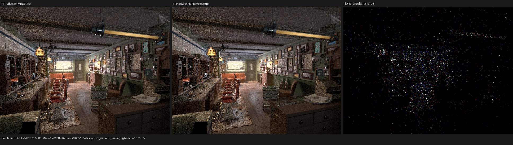

# HIP private-memory self-reference elimination

## Outcome

Luisa's HIP LLVM path now removes a stored private-allocation address only
after proving that the complete constant-offset access relation cannot observe
the stored bytes. The subsequent standard scalar cleanup eliminates the two
112-byte RayQuery handler aggregates that survived IPO in Psycles' Barbershop
shadow kernel.

This is a representation-independent compiler transform in LuisaCompute
commit `8ade983c9` on `next`. It does not recognize RayQuery types, field names,
field offsets, Psycles kernels, or scene data.

On the matched 640x480, 64-spp Barbershop profile, the shadow kernel's private
segment fell from 128 B to 8 B. The same 82 dispatches and 8,048,928 launched
lanes fell from 38.811495 ms to 38.391277 ms, a 1.083% improvement. Relative
to the earlier exact iterative query, the combined traversal and private-
memory changes improve the kernel by 1.854%.

This leaves 4.769738 ns/launched-lane versus Cycles 5.2 HIPRT's retained
3.411766 ns/launched-lane: Psycles is still 39.8% slower per launched lane in
this effectful shadow-all kernel. The spill hypothesis is therefore rejected
as the dominant remaining cause; callback instructions and metadata loads are
the next controlled comparison.

## Formal model

For a private allocation `A`, build the derived-pointer relation `P` from `A`
using only constant-offset GEPs and representation-preserving pointer casts.
The proof is complete only if every use of every `p in P` is one of:

1. another member of `P` with a proven constant byte offset;
2. a non-volatile, non-atomic load or store through `p`;
3. a lifetime marker; or
4. `ptrtoint(p)`.

Every other operation fails closed, including a dynamic offset, call, PHI,
select, comparison, return, atomic access, or pointer escape. Each integer
derived by `ptrtoint` must be used only by direct non-volatile stores back into
`A`. Let `W` be the exact byte ranges of those stores and `R` the exact ranges
of all modeled loads. The transformation is legal exactly when

```text
complete(P) and no_escape(P) and uses(ptrtoint(P)) subset store_to(A)
and for every w in W, r in R: intersection(w, r) is empty.
```

The removed operations can then affect only bytes of `A` that are never read,
while neither their pointer nor integer value is externally observable.
Erasing them is observationally equivalent. A short
`sroa -> instcombine -> simplifycfg -> dse -> adce` cleanup exposes the now
non-escaping aggregate to LLVM's general scalar reasoning; the custom pass
does not replace or duplicate SROA.

Regressions cover the positive non-overlapping case and three proof failures:
an overlapping observed identity, aggregate escape through a call, and a
dynamic subaggregate access.

## Generated-code evidence

Both dumps are the same `kernel_750b35814af0a216` shader AST with cache
disabled:

| Final LLVM IR | Bytes | Lines | alloca | loads | stores |
|---|---:|---:|---:|---:|---:|
| Before | 671,091 | 8,216 | 2 | 614 | 175 |
| After | 657,511 | 8,086 | 0 | 612 | 135 |

Before the fix, each handler branch retained one `[112 x i8]` address-space-5
allocation. Its otherwise dead `ptrtoint(A) -> store-to-A` identity write made
generic capture tracking retain the whole aggregate. After the proof removes
the identity write, both allocations disappear and the final IR is 2.02%
smaller.

## Matched HIP profile

The profiler command used a fixed sample interval `[0, 64)`, staged wavefront
scheduling, 32 samples per dispatch, and the same 640x480 Barbershop export as
the preceding profiles:

```text
rocprofv3 --kernel-trace --scratch-memory-trace --stats --output-format rocpd -- \
  psycles_render_blender_scene <barbershop-5.2> profile.exr hip \
  640 480 64 64 - 0 0 0 0 64 - 1 0 wavefront-staged \
  32 32768 32 1 1 0 4 2 4096 131072 0 0 1
```

| Shadow traversal | Calls | Lanes | Device time | ns/lane | LDS | Scratch | VGPR |
|---|---:|---:|---:|---:|---:|---:|---:|
| Effect-only baseline | 82 | 8,048,928 | 38.811495 ms | 4.821946 | 3,072 B | 128 B | 168 |
| Private-memory cleanup | 82 | 8,048,928 | 38.391277 ms | 4.769738 | 3,072 B | 8 B | 168 |
| Cycles 5.2 HIPRT shadow-all | 141 | 29,983,232 | 102.296 ms | 3.411766 | 32,768 B | 64 B | 192 |

The Cycles row has a different launched-ray population and is used only for
per-launched-lane structural guidance, not as a whole-stage speedup claim.
Psycles' closest traversal was already slightly faster per lane in the same
retained profiles; the open target remains effectful shadow-all enumeration.

## Numerical and visual validation

All 15 film passes were compared against the immediately preceding profiled
effect-only build. Environment and both volume passes are byte-identical.
Combined has mean absolute error `1.70608e-7`, RMS `5.86871e-5`, relative L1
`2.51863e-6`, and maximum error `0.0351357`. The left and middle images below
have channel-mean ratios between `0.99999815` and `0.99999851`.

The original-resolution triptych was inspected. Silhouettes, hair, floor,
ceiling, cabinetry, textures, and shadows remain aligned; the amplified panel
contains sparse stochastic/atomic-order energy rather than a coherent
visibility difference.



## Validation

All builds used 32 parallel jobs after the final source change:

```text
LuisaCompute full build                         pass
test_hip_callable_abi                         253 assertions / 20 tests
test_hip_callable_boundary hip                 91 assertions / 4 tests
test_hip_ray_query_pipeline hip              1528 assertions / 10 tests
psycles_luisa_scene_traversal_tests hip         pass
Psycles full build                              pass
git diff --check                                pass
```

The HIP shader-cache codegen revision is 75, so no pre-transform machine code
can be silently reused.
