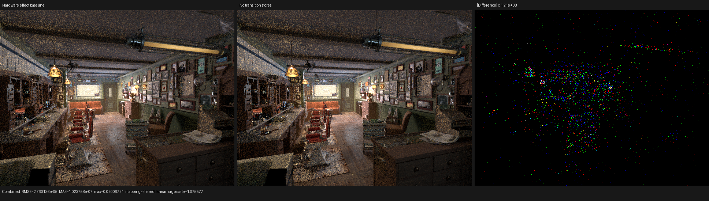
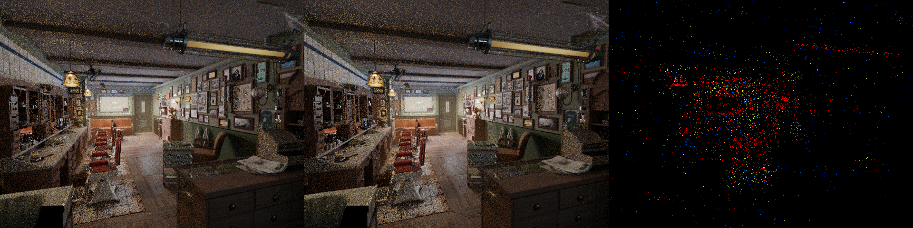

# HIP effect-only RayQuery lowering

> **2026-08-21 stability correction:** the gfx12 hardware-frontier
> specialization documented below is historical and is no longer selected.
> Multi-workgroup Monster launches exposed intermittent GPU faults and an
> indirect-visibility disagreement. LuisaCompute `next` commit `619de7aac`
> now selects HIPRT's static `hiprtGlobalStack` AnyHit traversal, matching the
> public construction used by Cycles 5.2. The formal attribution, stress test,
> real render, all-pass comparison, and triptychs are recorded in
> [hip-effect-global-stack-stability](../../2026-08-21/hip-effect-global-stack-stability/README.md).

## Outcome

Psycles' transparent-shadow collector now returns only a 12-byte
`{count, total, blocked}` summary while writing its four retained hits directly
to invocation-owned SoA storage. Luisa's HIP backend also recognizes the more
general `RayQueryAll` case whose handlers have externally visible effects but
provably never commit. On an accel proven free of opaque instances, that case
is lowered to one traversal instead of repeatedly restarting TLAS traversal.
Pre-gfx12 devices use HIPRT's dynamically assigned AnyHit stack; gfx12 now
uses the same AnyHit traversal with a statically indexed global stack.

The initial change is LuisaCompute commit `7b7275ca8`; the gfx12 specialization
is commit `345d75757`, both on `next`. Neither is a Psycles material, scene, or
ray-name special case.

## Formal model

Let `Q` be the public query state, `S` all state external to the query, and
`c_0 ... c_n` the candidate stream chosen by a conforming traversal. An
effect-only handler has transition

```text
H(S, Q, c_i) = (S', Q.reject, continue | terminate)
```

when all of the following are proven:

1. neither handler can reach `commit` or `proceed` through the active query
   reference, including through a direct Callable;
2. the query post-state is dead;
3. a handler does not jointly observe world- and object-space rays; and
4. no kernel-reachable operation can mutate instance opacity during the
   traversal.

The proof tracks active-query reference provenance interprocedurally. Reads
and `terminate` preserve the fact. Commit, proceed, aliasing, escape, an
unknown callee, or recursion fail closed. Operations unrelated to `Q`,
including arbitrary resource writes and atomics, are intentionally allowed.

HIPRT any-hit filtering implements the same fold: invoke the handler, return
`true` to reject and continue, or return `false` to terminate. The remaining
obstacle is HIPRT's implicit acceptance of opaque instances. Each HIP accel
therefore owns a monotone certificate `opacity_may_be_present` in a 16-byte
backend-private metadata prefix:

```text
certificate == 0  => no instance has ever become opaque
certificate != 0  => unknown; use the existing exact path before any callback
```

Host and device transitions to opaque set the bit; no transition clears it.
Reallocation preserves the prefix. This makes zero a durable proof without
requiring rollback or replay of handler effects. Kernels that can write
opacity are rejected statically from the native route.

The callback keeps the existing compact candidate/object-ray quotients. An
executable trap rejects a commit if the XIR proof and linked device wrapper
ever disagree. gfx12 uses the same `hiprtGlobalStack` and
`hiprtEmptyInstanceStack` construction as Cycles 5.2 HIPRT.

## Psycles storage boundary

The renderer-side API makes the lifetime rule a type invariant:

```text
RayQuery callable: external SoA writes -> ShadowIntersectionSummaryCall (12 B)
consumer:          summary + external SoA -> ShadowIntersectionBatchCall
```

`StoredShadowIntersectionComponent` composes the two stages on the host while
the generated query Callable can no longer return or allocate the four-hit
batch by accident. A structural regression checks both its return type and
the absence of a `ShadowIntersectionBatchCall` local.

## Barbershop HIP profile

The matched production command was 640x480, 64 spp, fixed sample range
`[0,64)`, `wavefront-staged`, and 32 samples per dispatch. The retained native
profile is `/var/tmp/psycles-native-effect-profile-zjRIeG`; the immediately
preceding exact profile is
`/var/tmp/psycles-shadow-summary-profile-TXwejN`. Cycles 5.2 HIPRT is retained
at `/var/tmp/cycles-hiprt-barbershop-profile.Uh2jCH` with adaptive sampling
disabled.

| Shadow traversal | Calls | Launched lanes | Device time | ns/lane | LDS | Scratch | VGPR |
|---|---:|---:|---:|---:|---:|---:|---:|
| Psycles exact iterative query | 82 | 8,048,928 | 39.117 ms | 4.85984 | 2,048 B | 240 B | 144 |
| Psycles native effect-only any-hit | 82 | 8,048,928 | 38.811 ms | 4.82195 | 3,072 B | 128 B | 168 |
| Cycles 5.2 HIPRT shadow-all | 141 | 29,983,232 | 102.296 ms | 3.41177 | 32,768 B | 64 B | 192 |

The native route removes 46.7% of private scratch but improves the Psycles
kernel by only 0.78%. It remains 41.3% slower per launched lane than Cycles;
therefore repeated TLAS restart was not the dominant cost in this scene. The
complete Psycles shadow stage is nevertheless 2.64x shorter because the two
renderers launch different shadow-ray populations. That total is useful for
frame attribution but is not an apples-to-apples traversal-efficiency claim.

The next controlled comparison must replay one identical ray/candidate set
through a minimal Luisa query kernel and a direct HIPRT shadow-all kernel. The
remaining hypotheses are callback instruction count, private payload
materialization, and extra Psycles material/identity loads. A full-render PMC
attempt was rejected: rocprofiler terminated with dangling correlation IDs
and 28 profiler kernels still active, so no counters from that run are cited.

Closest traversal is already ahead on the same retained scene profiles:
Psycles takes 3.73416 ns/lane versus Cycles HIPRT's 3.82509 ns/lane. The open
trace target is specifically effectful shadow-all enumeration, not ordinary
closest traversal.

The complete profiled Psycles render took 3.68282 s. The previous 3.6533 s run
is within run-to-run noise; no whole-frame speedup is claimed from a 0.31 ms
kernel change.

## Historical gfx12 single-frontier specialization (superseded)

This section preserves the measured experiment and its original reasoning.
It must not be read as the current backend selection; the correction linked at
the top supersedes its correctness and performance conclusion.

The native any-hit route still crossed HIPRT's intersect/filter callback
machinery and used its global traversal stack. On gfx12 the exact Luisa query
already owns a tested BVH8 frontier, so the effect-only quotient can be applied
inside that frontier instead of changing traversal implementations.

For a candidate `c`, the specialization is valid exactly when:

```text
query kind       = RayQueryAll
post query state = dead
handler action   = reject/continue | terminate (commit is unreachable)
handler rays     = not joint world-ray and object-ray observation
opacity          = stable in the reachable module
accel certificate opacity_may_be_present = 0
```

Under these premises, committed hit, committed kind, and max-distance
contraction are outside the observable quotient. The hardware loop therefore
invokes the existing typed candidate handler and immediately consumes its
termination result. Candidate order, arbitrary external writes, exact curve
intersection, and source/light filtering are unchanged. If the runtime accel
certificate is unknown, the wrapper enters the exact state machine before the
first callback, so no effect needs rollback or replay.

The hardware frontier initially measured 4.470312 and 4.499604 ns/lane. A
second liveness observation removed two callback-state stores: HIPRT needs
`candidate_committed` and `terminated` to transport a result from its
procedural intersect callback to a later filter callback, whereas the flat
frontier consumes the returned Boolean immediately and has no intervening
observer. The terminal query state is still published once when traversal
finishes.

| Barbershop shadow checkpoint | Runs (ns/lane) | Mean ns/lane | Change |
|---|---:|---:|---:|
| Static-stack native any-hit baseline | 4.716800 | 4.716800 | baseline |
| gfx12 hardware effect frontier | 4.470312, 4.499604 | 4.484958 | -4.92% |
| + eliminate dead transition publication | 4.433749, 4.463769 | **4.448759** | **-5.68%** |
| Cycles 5.2 HIPRT shadow-all | 3.411766 | 3.411766 | reference |

The final kernel has 82 calls, 8,048,928 launched lanes, 2,048 B LDS, 8 B
scratch, and 176 allocated VGPRs. It is still 30.4% slower per launched lane
than the retained Cycles kernel, but this is not an equal-work comparison:
Cycles consumes baked curve shadow transparency, while Psycles deliberately
retains raw Blender closures and records curve hits for later shader
evaluation. The triangle-only Classroom shadow query remains faster than the
Cycles HIPRT comparison (1.784757 versus 2.729419 ns/lane). The next backend
measurement must therefore replay identical rays and candidate effects rather
than attributing the Barbershop closure-work difference to HIPRT traversal.

The following controlled alternatives were measured and rejected rather than
committed:

- generic gfx12 manual traversal: 4.811009 ns/lane;
- compact curve segment and ribbon early-branch variants: 4.7565 and 4.8046
  ns/lane;
- forcing the native effect intersect callback to return false: 4.7510
  ns/lane;
- explicit field-projected shadow SoA reads: 4.531733 and 4.512770 ns/lane;
- removing the exact opacity fallback from a known-non-opaque benchmark:
  4.608176 and 4.533846 ns/lane. This reduced VGPRs from 176 to 168 but did not
  cross an occupancy threshold and was slower.

The last experiment is important: the exact fallback is not the current
bottleneck, and sacrificing unknown-opacity semantics would be both incorrect
and slower. A full-render PMC attempt also triggered a rocprofv3 7.2 internal
`AqlPacket` assertion; its incomplete counter database is not cited. Ordinary
kernel tracing remained stable and supplied every timing above.

The no-transition-store render versus the immediately preceding hardware
frontier render has Combined MAE `1.024e-7`, RMSE `2.760e-5`, relative RMSE
`1.701e-4`, zero invalid pixels, and maximum absolute error `0.02007`. At
native resolution the two images have aligned geometry, hair, textures, and
shadows; the amplified difference is sparse Monte Carlo/atomic accumulation
order noise without coherent visibility structure.



## Cutout non-regression

Five 1024x1024, 64-spp runs per mode produced these medians:

| Mode | Median samples/s |
|---|---:|
| direct | 810.210 |
| opaque-query | 743.990 |
| accept-query | 940.553 |
| cutout-query | 649.573 |

The commit-type cutout handlers cannot satisfy the effect-only proof and must
not select this route. Their results remain at the preceding baseline; this is
a routing non-regression, not an effect-only performance measurement.

## Numerical and visual inspection

The new and preceding 640x480/64-spp Combined images differ by mean absolute
`9.13e-8`, RMS `2.23e-5`, relative L1 `1.35e-6`, and maximum `0.01320`.
An older pair of two exact-path profiler runs differed more (RMS `6.21e-5`),
which bounds this change inside the renderer's parallel atomic accumulation
order. Environment and both volume passes are byte-identical.

The triptych below is, left to right, the preceding exact query, native
effect-only any-hit, and a P99-normalized linear-error heatmap. Native-size
inspection finds aligned silhouettes, hair, floor, ceiling, cabinetry,
textures, and shadows. The difference is sparse stochastic energy around
lit surfaces, with no coherent visibility structure.



## Validation

All builds used 32 parallel jobs after the final source change:

```text
LuisaCompute full build                         pass
test_hip_callable_boundary                     91 assertions / 4 tests
test_hip_ray_query_pipeline hip              1528 assertions / 10 tests
psycles_luisa_scene_traversal_tests fallback    pass
psycles_luisa_scene_traversal_tests hip         pass
psycles_luisa_scene_traversal_tests vk          pass, native XIR -> SPIR-V
Psycles full build                              pass
git diff --check                                pass
```

The Vulkan process set `LUISA_VULKAN_DISABLE_DXC=1`; the two principal scene
traversal modules optimized to 32,790 and 56,289 SPIR-V words without loading
or invoking DXC.

Runtime coverage compares the native route candidate-by-candidate with a
forced exact route across surface and procedural candidates, callback order,
termination boundaries, and compact summaries. A second accel contains an
opaque instance and proves that the monotone certificate takes the exact
fallback before any surface callback. Codegen tests cover nested Callable
termination, nested commit rejection, and reachable opacity-write rejection.

The HIP cache lowering revision is 75. The complete embedded device-wrapper
hash is also part of the cache identity, so neither the host XIR/LLVM lowering
nor the linked traversal implementation can silently reuse old machine code.
