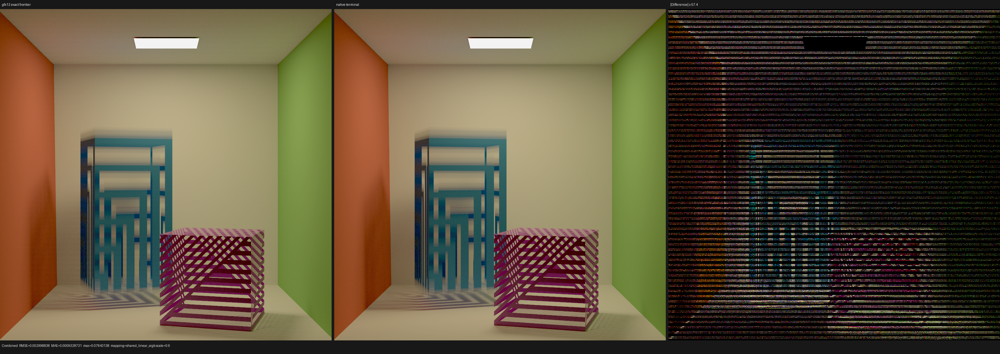

# HIP terminal RayQuery route selection

## Outcome

Luisa's HIP backend now lowers a terminal `RayQueryAny` to native HIPRT
AnyHit when its complete observable post-state is only the committed hit kind.
The semantic lowering is commit `b53cec542`; the gfx12 whole-kernel cost
selection is commit `346bc241a`, both on LuisaCompute `next`.

The first implementation selected native AnyHit for every proven terminal
query. Controlled composition tests showed that this was not uniformly
profitable on gfx12: an isolated terminal query is much faster in Luisa's
existing single-frontier hardware loop, while the native route wins when the
same kernel already contains a synchronous native closest reduction. The
final selector uses that reachable XIR property. It does not inspect scene
names, ray names, resolution, launch dimensions, or renderer options.

At 1024x1024 and 1024 spp on the RX 9070 XT, five-run medians are:

| Workload | Always-native terminal | Final selector | Exact frontier | Result |
|---|---:|---:|---:|---:|
| Full cutout, native closest co-resident | 712.547 spp/s | **711.320 spp/s** | 667.879 spp/s | final retains a 6.50% native gain |
| Direct closest + accept shadow | 814.939 spp/s | **1275.784 spp/s** | 1273.626 spp/s | final removes a 36.12% runtime regression |
| Direct closest + cutout shadow | 773.287 spp/s | **1203.564 spp/s** | 1203.560 spp/s | final removes a 35.75% runtime regression |

The final and exact direct-closest compositions differ by 0.17% and 0.0004%,
respectively. The full-cutout result is 0.17% below the preceding always-native
run and is within the observed run-to-run performance range; no extra speedup
is claimed there.

These are Luisa's deterministic cutout microbenchmark results, not a claim
that Psycles has reached Cycles on every trace workload. The retained
production profiles still show Psycles Barbershop effectful shadow traversal
at 4.448759 ns/lane versus Cycles 5.2 HIPRT at 3.411766 ns/lane, but the two
kernels do unequal curve/closure work. Triangle-only Classroom shadow is
already faster than its retained Cycles comparison (1.784757 versus 2.729419
ns/lane). An identical-ray, identical-candidate-effect replay remains required
for an apples-to-apples Cycles trace-efficiency conclusion.

## Semantic model

Let the parent-observable post-state of `RayQueryAny` be projected to

```text
K = { MISS, SURFACE, PROCEDURAL }.
```

The projection is legal only when every use of the committed result is a hit
kind or `miss()` observation. Any instance, primitive, barycentric coordinate,
distance, or object-ray observation fails closed to the exact query state.
Candidate handlers and their captures are not projected away.

For each candidate, both the exact query and native HIPRT implementation have
the same quotient transitions:

```text
reject                         -> continue in MISS
commit(surface)                -> terminate in SURFACE
commit(procedural, distance)   -> terminate in PROCEDURAL
terminate without commit       -> terminate in MISS
opaque accepted candidate      -> terminate in its primitive kind
exhaust traversal              -> terminate in MISS
```

Callback side effects occur exactly once and in traversal order. Runtime
instance-opacity changes remain live: the native callback reloads the relevant
state rather than treating TLAS opacity as immutable. The regression scene
mutates opacity in the first callback and proves that the buffered farther
candidate observes it without callback replay.

Thus route selection cannot change the defined quotient semantics. The gfx12
cost decision is deliberately separate from that proof:

```text
native_terminal = proven_terminal_quotient &&
                  (no_gfx12_hardware_frontier ||
                   reachable_synchronous_native_closest_reduction)
```

The closest property is proven over the reachable XIR call graph before LLVM
translation and then filtered by the final synchronous/resumable function
domain. A closest reduction that will be lowered to resumable state cannot
trigger the native terminal route accidentally. Pre-gfx12 has no hardware
frontier and therefore retains native AnyHit.

## Why the cost boundary exists

The native terminal cutout kernel has a larger shared traversal allocation but
a much smaller per-thread state than the old exact implementation:

| Kernel | Code object | LDS | Private | VGPR | Spills |
|---|---:|---:|---:|---:|---:|
| Exact single-frontier baseline | 38,208 B | 16,384 B | 176 B | 144 | 25 VGPR |
| Native terminal with native closest | 40,480 B | 24,576 B | 8 B | 128 | 0 |

When native closest is already present, native terminal avoids combining that
large callback transaction with a second exact query state and wins despite
the additional LDS. In a direct-closest kernel, native terminal introduces the
HIPRT callback/global-stack transaction without offsetting an existing native
closest resource envelope; the compact hardware frontier is substantially
faster.

The first implementation also grouped terminal callbacks with large
effect-only callbacks when removing `amdgpu-waves-per-eu`. That policy was
incorrect for the compact terminal callback. Separating the resource flags
improved the direct-closest native counterfactual from 739.5/698.9 to
814.9/773.3 spp/s before the final route selector recovered the exact
1275.8/1203.6 spp/s results.

## Numerical and visual inspection

The final native full-cutout route is byte-stable across all five runs. Both
final direct-closest compositions are also byte-stable and byte-identical to
their forced-exact counterparts. The deliberately forced mixed
native-closest + exact-terminal counterfactual is not byte-stable: its five
hashes differ, with pairwise 8-bit sRGB RMSE around `2.11e-3`. This is further
evidence against retaining that mixed resource state, and means it is not an
exact numerical oracle.

Comparing the native result with one representative forced-exact image gives
MAE `9.32873e-4`, RMSE `2.99884e-3`, maximum absolute error `0.0784314`, and
RGB mean ratios `1.003300/1.002956/1.003413`. Across all five exact images,
ImageMagick's RGBA-normalized RMSE lies in
`[2.59247e-3, 2.60540e-3]`; the route delta is the same order as the exact
counterfactual's own variation. There are no invalid pixels, and the identity
orientation RMSE is at least 48x smaller than every flipped orientation.

The original-resolution triptych was inspected. Room geometry, box
silhouettes, repeated cutout layers, shadows, light, and wall boundaries are
aligned. The amplified difference contains deterministic low-amplitude
floating-point/candidate-boundary bands and cutout-edge energy, but no missing
object, displaced surface, or coherent visibility change.



The image metrics are retained in [image-report.json](image-report.json); the
five-run timings and resources are retained in [report.json](report.json).

## Measurement and rejected alternatives

The clean full-cutout command was:

```text
test_path_tracing_cutout hip --offline --spp 1024 \
  --trace-mode cutout-query --max-registers 0
```

The controlled composition temporarily exposed a host-only
`--closest-direct` switch and disabled the shader cache. The switch and cache
override were removed before commit. The exact counterfactual changed only the
terminal route predicate; all scene, ray, sample, and launch inputs were held
constant. Every table entry is the median of five fresh processes.

Two smaller-looking native variants were measured and rejected before this
selector was finalized: compacting the callback payload did not improve the
terminal kernel, and replacing the shadow-ray HIPRT traversal hint with the
default hint was slower. Neither experiment was committed. Likewise,
rocprofv3 7.2 repeatedly stalled while profiling the eighth HIPRT BLAS build;
selected-region attempts also failed, so no incomplete PMC or kernel-trace
database is cited. Code-object metadata above comes from the stable HIP ISA
dump path.

## Regression and backend validation

All final builds used 32 parallel jobs:

```text
LuisaCompute full build                         pass
test_hip_callable_boundary                     95 assertions / 4 tests
test_hip_ray_query_pipeline hip              1536 assertions / 10 tests
Psycles full build                              pass
psycles_luisa_scene_traversal_tests fallback    pass
psycles_luisa_scene_traversal_tests hip         pass
psycles_luisa_scene_traversal_tests vk          pass
git diff --check                                pass
```

Static IR coverage locks down isolated gfx12 terminal -> exact frontier,
mixed terminal + native closest -> native AnyHit, pre-gfx12 terminal -> native
AnyHit, full committed-hit observation -> exact state, and mutable opacity ->
live-opacity native traversal. Runtime coverage checks surface and procedural
candidates, commit/reject/terminate/exhaust transitions, callback counts,
primitive order, opaque bypass, and callback-time opacity mutation.

The Vulkan scene test ran with `LUISA_VULKAN_DISABLE_DXC=1`. Its log contains
17 successful native SPIR-V compilations and zero DXC mentions.
