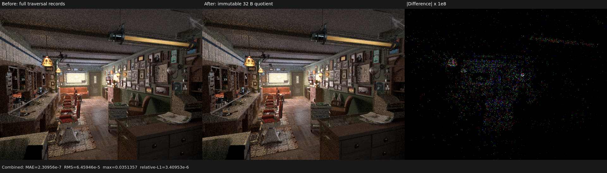
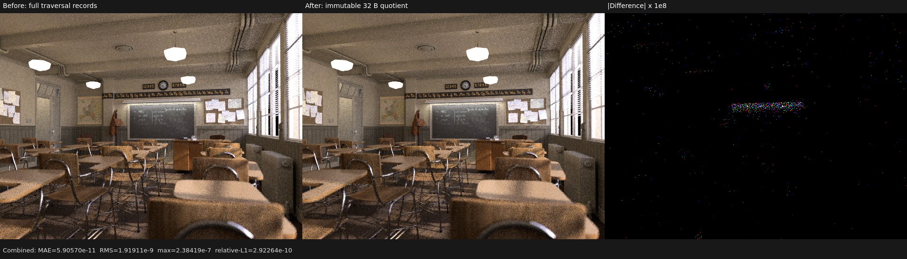

# Immutable scene-traversal quotient

## Outcome

Candidate callbacks no longer chase the 112-byte instance record, the
112-byte geometry record, and a 24-byte material binding merely to obtain
primitive identity and the conservative transparency capability. Scene upload
now constructs a read-only 32-byte per-instance traversal quotient plus a
dense `uint` material-flags table. Full bindings, raw closures, texture inputs,
and sampled opacity remain in the ordinary shading tables; this change does
not pre-bake any Cycles result.

On the RX 9070 XT, 640x480, 64 spp, fixed sampling, and the staged coroutine
topology:

| Scene / trace kernel | Before | After | Change | Cycles 5.2 HIPRT |
|---|---:|---:|---:|---:|
| Classroom shadow, triangles only | 1.814907 ns/lane | 1.784757 ns/lane | **-1.66%** | 2.729419 ns/lane |
| Classroom closest, triangles only | 1.807084 ns/lane | 1.800517 ns/lane | **-0.36%** | 4.402867 ns/lane |
| Barbershop shadow, triangles + ribbons | 4.769738 ns/lane | 4.716800 ns/lane | **-1.11%** | 3.411766 ns/lane |

Classroom has 252 triangle geometries, 838 instances, and no curves. Its
shadow callback is now 34.6% faster per launched lane than the retained Cycles
5.2 HIPRT capture. This rules out the generic triangle RayQuery traversal as
the source of the remaining Barbershop gap. Barbershop remains 38.25% slower
per launched lane in this mixed trace metric.

The Barbershop comparison is intentionally labelled mixed rather than
apples-to-apples. Cycles' curve shadow callback uses baked curve transparency
and does not retain the curve hit, while Psycles must exact-intersect the
ribbon and retain its raw hit for later closure evaluation. The project policy
forbids replacing that closure with a baked opacity shortcut. The next trace
work therefore targets callback/dispatcher overhead and curve-hit population,
not a semantic downgrade.

## Formal construction

Let `I[i]` be an immutable instance, `G[g(i)]` its geometry, `B` the base
material-binding table, and `O` the instance override table. For candidate
material slot `s`, the old callback observes:

```text
object(i) = I[i].cycles_object if valid, otherwise i
primitive(i, p) = G[g(i)].cycles_primitive_offset + p
base(i, s) = B[G.material_offset + min(s, max(G.material_count, 1) - 1)]
binding(i, s) = s < I.override_count
              ? O[I.override_offset + s]
              : base(i, s)
capability(i, s) = binding(i, s).flags
```

Scene construction already owns the invariant
`I.cycles_primitive_offset == G.cycles_primitive_offset`. The quotient stores
exactly:

```text
Q[i] = (bindless_base,
        base_flags_offset, base_flags_count,
        override_flags_offset, override_flags_count,
        object(i), cycles_primitive_offset,
        pack(primitive_kind, curve_subdivision))
F = concat(map(flags, B), map(flags, O))
```

The callback evaluates the same `min` and override predicate against `Q` and
`F`. Therefore, for an immutable valid scene, `object`, `primitive`, material
capability, curve-segment addressing, and ribbon subdivision are
observationally equal to the old tables for every candidate `(i, p, s)`.
Upload rejects invalid geometry/material ranges, inconsistent primitive
identity, 32-bit address overflow, and metadata that cannot be packed without
loss. These are construction failures, not device-side clamps.

Only the conservative `material_flag_may_be_transparent` capability is read in
the shadow callback. The actual closure graph, its parameters, and its opacity
are still evaluated from the original material binding after traversal.

## Controlled counterfactuals

Two attractive changes were measured and rejected:

- A native-only Barbershop shadow kernel was 4.783313 ns/lane, 0.28% slower
  than the official dual-path kernel, despite a roughly 46% smaller binary.
  The inactive exact branch has no measurable runtime cost, so duplicating the
  production kernel would only increase architectural complexity.
- Hand-written field-specific reads from the shadow-hit SoA measured
  4.800710 and 4.783809 ns/lane versus 4.716800 ns/lane for the ordinary
  aggregate read. LLVM already eliminates unused aggregate fields; the manual
  form duplicated address arithmetic. It was reverted.

These falsifications are important: the retained speedup comes from reducing
candidate hot-table traffic, not from code-size folklore or a benchmark-only
special case.

## Numerical and visual validation

All 15 film passes were compared with the immediately preceding profiled
build. On Barbershop, environment and both volume passes are byte-identical.
Combined has MAE `2.30956e-7`, RMS `6.45946e-5`, relative L1 `3.40953e-6`, and
maximum error `0.0351357`; its RGB energy ratios are
`1.00000131/1.00000262/1.00000286`. On Classroom, emission, environment, and
both volume passes are byte-identical. Combined has MAE `5.90570e-11`, RMS
`1.91911e-9`, relative L1 `2.92264e-10`, and maximum error `2.38419e-7`.
Per-pass numbers are retained in [report.json](report.json).

Both original-resolution triptychs were inspected. Geometry, silhouettes,
hair, floor, ceiling, cabinetry, classroom furniture, textures, lighting, and
shadows remain aligned. The third panels amplify absolute floating-point
differences by `1e8`; they show sparse atomic-order/ULP noise rather than a
visible or coherent traversal error.





## Reproduction and regressions

The matched Psycles command was:

```text
psycles_render_blender_scene <scene-export> out.exr hip \
  640 480 64 64 - 0 0 0 0 64 - 1 0 wavefront-staged \
  32 32768 32 1 1 0 4 2 4096 131072 0 0 1
```

The trace capture wrapped it with:

```text
rocprofv3 --kernel-trace --scratch-memory-trace --stats \
  --output-format rocpd -- <command>
```

The final change was built with `cmake --build build --parallel 32` and passed:

```text
psycles_luisa_scene_traversal_tests fallback
psycles_luisa_scene_traversal_tests hip
LUISA_VULKAN_DISABLE_DXC=1 psycles_luisa_scene_traversal_tests vk
```

The Vulkan log contains native XIR-to-SPIR-V compilation and no DXC load. The
test constructs the quotient independently, exercises triangle/curve shadow
and closest traversal, transparent override selection, self filtering, exact
curve intersection, and rejects invalid geometry, override, identity, and
lossy packed-metadata inputs.

Profiler databases are retained locally at:

```text
/var/tmp/psycles-traversal-quotient-barbershop-profile-20260816/archlinux/973830_results.db
/var/tmp/psycles-traversal-quotient-classroom-profile-20260816/archlinux/981100_results.db
```
