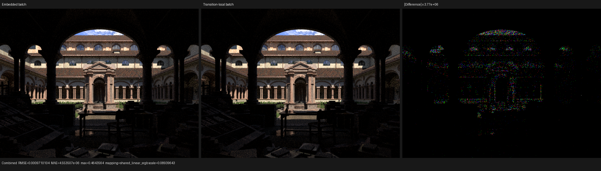
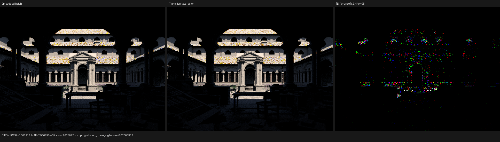

# Direct-light transition-local shadow batch

## Outcome

The four-hit transparent-shadow batch is no longer embedded in every
`DirectLightTaskCall`. It is now a value produced by `intersect_shadow`, live
across exactly one coroutine edge, and consumed by `shade_shadow`.

This is a type-level lifetime correction, not aggregate-DCE tuning. The fused
direct-light auxiliary consumer never uses a split traversal batch, so the
queue no longer allocates, initializes, writes, reads, or transports that dead
state. At a queue capacity of 1,048,576, the device SoA allocation falls by
108 MiB. A matched eight-run HIP A/B on Lone Monk shows about a 1% render-only
improvement; the memory reduction is the primary result.

The generated-callable policy was held constant across the A/B. Ordinary DSL
callables have no `alwaysinline` or `noinline` attribute and LLVM owns the
decision, as documented in
[`../hip-generated-callable-inlining/README.md`](../hip-generated-callable-inlining/README.md).
This matches the relevant Cycles 5.2 distinction: ordinary HIP `ccl_device`
functions are inline candidates, `-amdgpu-early-inline-all=false` and
`-amdgpu-function-calls=true` are enabled, and explicit no-inline spellings are
reserved for selected hand-written helpers.

## Formal lifetime model

Let `I` be the direct-light state invariant across the complete shadow path and
let `B` be one bounded four-hit batch. For shadow iteration `k`, the split
transition is

```text
I_k --intersect_shadow / B_k := collect(I_k)--> (I_k, B_k)
    --shade_shadow / (I_{k+1}, continue_k) := shade(I_k, B_k)--> I_{k+1}
```

`B_k` has one definition, one consumer, and no observer outside that edge. It
does not influence queue admission, the next light task, film state, or a later
shadow iteration. If `continue_k` is true, `B_{k+1}` dominates its own use and
replaces `B_k`; otherwise `B_k` is dead after `shade_shadow`.

Previously, the program represented the state as `T_k = I_k x B_k` even at
boundaries where `B_k` did not exist semantically. The auxiliary queue stores
`T` before any split traversal, while its fused consumer calls `trace_shadow`
and never reads `T.B`. The new representation uses two disjoint types:

```text
queued/fused state:       DirectLightTaskCall = I
split transition state:  I x ShadowIntersectionBatchCall
```

The transformation is semantics-preserving because the old assignment
`task.shadow_batch = collect(task)` is immediately followed, modulo a
coroutine suspension, by the only read in `shade_shadow(task.shadow_batch)`.
Returning the same DSL value from `intersect` and passing it to that read does
not reorder either operation. The suspension still forces `B` into the
coroutine frame when the split graph is selected; only the unrelated queue
payload loses it.

## Storage and frame result

| Representation | Embedded batch | New | Reduction |
| --- | ---: | ---: | ---: |
| C++ AoS size | 320 B | 208 B | 112 B (35.0%) |
| Device SoA scalar storage per task | 280 B | 172 B | 108 B (38.57%) |
| Device SoA at 1,048,576 tasks | 293,601,280 B | 180,355,072 B | 113,246,208 B (108 MiB) |
| Reflected top-level fields | 28 | 27 | one aggregate member |

The same-graph Cycles-like split remains 105 frame fields and 440 B before and
after the change. This negative result is expected: `B` really is live across
`intersect_shadow -> shade_shadow`, and Luisa's sub-aggregate slot coloring was
already able to reuse its storage outside that edge. Moving the value does not
change the maximum interference clique. It prevents dead queue transport; it
is not claimed as a coroutine-frame optimization.

The regression fixes the invariant at both language levels: the C++ static
assert requires 208 B, while the runtime Luisa reflection test requires 208 B
and 27 top-level members. Existing small/large-capacity structural-hash tests
also prove that queue capacity remains runtime data rather than shader AST
identity.

## Matched HIP performance

The old worktree is Psycles `942cace`; the candidate differs only in the four
source/test files for this lifetime split. Both use LuisaCompute `0d62faeae`,
Release GCC 16.2.1, system STL, ROCm LLVM from
`/opt/rocm/lib/llvm/lib/cmake/llvm`, HIP only, and only `gfx1201`. The two
`CMakeCache.txt` files were audited for identical backend, compiler, LLVM, and
GPU-target settings. Each executable loaded the HIP plugin from its own
matched `build-ab/bin` directory.

The 640x480, 64-spp Lone Monk runs used one per-(pixel,sample) dispatch,
staged wavefront, surface hint sorting, the direct-light auxiliary queue, and a
1,048,576-frame capacity. After a warm-up per binary, the interleaved samples
were:

| Payload | Render-only observations (s) | Mean | Median |
| --- | --- | ---: | ---: |
| Embedded batch | 1.34172, 1.35205, 1.36251, 1.34700, 1.35529, 1.35243, 1.34190, 1.34709 | 1.35000 | 1.34957 |
| Transition-local batch | 1.34873, 1.32889, 1.33857, 1.33241, 1.32305, 1.33584, 1.33911, 1.34238 | 1.33612 | 1.33721 |

The candidate reduces mean time by 1.03% and median time by 0.92%. The ranges
overlap, so this is recorded as a small observed benefit rather than a broad
throughput claim. The exact 108 MiB allocation reduction does not depend on
timing noise.

With scheduler statistics enabled, both variants took 244 scheduler
iterations, scanned the same 184,977,250 gather slots, compacted the same
19,248,310 slots, reached the same 1,048,576 peak active count, issued 48
auxiliary dispatches, and reached the same 657,218 peak queue occupancy. The
executed auxiliary counts differed by five out of about 21.22 million, inside
the existing cross-process path/traversal repeatability noise. The measured
scheduler elapsed times were 1304.868 ms old and 1292.926 ms new.

## Numerical and visual validation

Combined, Normal, Albedo, every diffuse/glossy/transmission light pass,
Emission, Environment, and both volume passes were compared from multilayer
EXR output. The complete machine-readable metrics are in
[`report.json`](report.json).

For Combined, old versus new has mean absolute error `4.55e-6`, RMSE
`9.71e-4`, p99 pixel RMSE `1.38e-7`, and luminance-mean ratio `0.99999915`.
Diffuse Direct has p99 pixel RMSE `1.10e-6` and luminance-mean ratio
`0.99999883`. Environment, all transmission passes, and both volume passes are
exact in this scene.

The maximum errors are sparse high-energy atomic-order outliers: a second
execution of the unchanged candidate itself reaches the same Combined maximum
error `0.464356` and RMSE `7.86e-4`. The full film regression is the semantic
oracle; cross-process floating-point atomic ordering is checked with tolerance
rather than an exact image hash.

Both retained triptychs were opened at original resolution. Geometry,
silhouettes, roof and wall textures, direct-shadow boundaries, and highlights
agree. The amplified panels contain sample-scale colored speckles without a
coherent edge, visibility, material, or lighting discrepancy.





## Backend regression matrix

The following passed after a 32-thread build:

- direct-light plan tests on fallback, HIP, and strict Vulkan;
- the complete sample-dispatch/film matrix on fallback and HIP, including
  Combined, Normal, Albedo, every light pass, split sample chunks, queue
  capacities 48/18/3, refill, backpressure, staged wavefront, graph wavefront,
  and persistent scheduling;
- the complete sample-dispatch/film matrix on Vulkan with
  `LUISA_VULKAN_REQUIRE_NATIVE_XIR_SPIRV=1`;
- Lone Monk HIP render and all-pass EXR comparison.

The strict Vulkan log contains native SPIR-V optimization and compilation for
every staged, graph, split-shadow, auxiliary-queue, and persistent kernel. No
DXC path was loaded.

## Reproduction

```bash
cmake --build build \
  --target psycles_luisa_direct_lighting_plan_tests \
           psycles_luisa_sample_dispatch_film_tests \
           psycles_render_blender_scene \
  --parallel 32

./build/bin/psycles_luisa_direct_lighting_plan_tests fallback
./build/bin/psycles_luisa_direct_lighting_plan_tests hip
LUISA_VULKAN_REQUIRE_NATIVE_XIR_SPIRV=1 \
  ./build/bin/psycles_luisa_direct_lighting_plan_tests vk

./build/bin/psycles_luisa_sample_dispatch_film_tests fallback
./build/bin/psycles_luisa_sample_dispatch_film_tests hip
LUISA_VULKAN_REQUIRE_NATIVE_XIR_SPIRV=1 \
  ./build/bin/psycles_luisa_sample_dispatch_film_tests vk

LUISA_CORO_WAVEFRONT_STATS=1 \
  ./build-ab/bin/psycles_render_blender_scene \
  /var/tmp/psycles-lone-monk-transmission-dbdcb17/export \
  /var/tmp/lone-monk-direct-light-payload.exr \
  hip 640 480 64 64 - 0 0 0 0 64 - 1 0 \
  wavefront-staged 32 32768 32 1 1 1 4 2 4096 131072 0 0 1 1048576
```

Raw EXRs and temporary profiler/build artifacts remain outside the repository;
the compact all-pass report and visually inspected triptychs are retained here.
