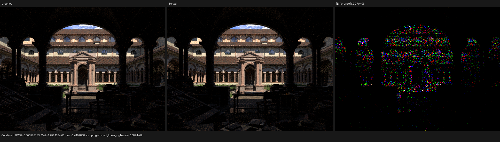
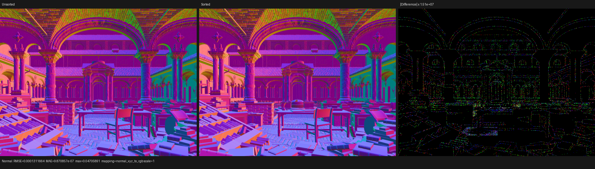

# Graph-wavefront surface coherence sorting

Date: 2026-08-20

## Outcome

The graph-wavefront scheduler can now sort a selected continuation queue by an
explicitly exported `uint coro_hint` before consuming it. Psycles enables this
only for `shade_surface`, and exports the topology-deduplicated surface tag at
the suspend immediately before surface geometry and closure population.

Lone Monk has 37 runtime material bindings but only 24 distinct surface graph
topologies. Grouping the 87 `shade_surface` launches by those 24 tags reduces
the profiled surface continuation from 2.833173505 s to 2.502562294 s, or
11.67%. The five sorting kernels total 13.052 ms, leaving a net surface-side
reduction of about 317.56 ms. A current-source, non-profiled 640x480, 64-spp
controlled pair improves render-only time from 3.93946 s to 3.65364 s
(`1.0782x`, 7.26% lower).

This change introduces no `alwaysinline`, `noinline`, or force-inline marker.
The consuming continuation has the same shader identity whether its queue view
is sorted or not; only the optional sort kernels depend on the hint range.

## Cycles reference and representation choice

Blender 5.2 Cycles records `shader_sort_key` in integrator state. Its GPU path
work scheduler builds the queued path-index array in shader order before
launching `SHADE_SURFACE`. The relevant implementation is in:

- `intern/cycles/kernel/integrator/state_flow.h`, where
  `integrator_path_init_sorted` and `integrator_path_next_sorted` publish the
  sort key and update its bucket counter; and
- `intern/cycles/integrator/path_trace_work_gpu.cpp`, where
  `compute_sorted_queued_paths` constructs the sorted path-index array and
  passes it to the shading kernel.

Cycles sorts indices, not the integrator-state records themselves. Psycles now
uses the same ownership model: queues contain stable frame-slot indices, and
sorting produces another index view. A Psycles topology tag is the appropriate
key because all runtime bindings with the same tag execute the same JIT-expanded
graph; their different scalar/vector parameter blocks remain runtime data.

This also matches Cycles' function-boundary policy without copying its SVM
implementation. Ordinary HIP helpers are inline candidates rather than forced
inline functions, while the hand-written SVM interpreter has selective
no-inline node handlers. Psycles' expanded DSL callables are not SVM handlers,
so they remain unmarked and LLVM owns their profitability decisions.

## Formal queue model

Let the active frame slots be the finite set `F`, and let every scheduler queue
be a sequence of elements from `F`. At every completed sweep:

```text
free queue + all continuation queues = a disjoint partition of F
```

Each consumed element either produces exactly one successor queue element or
returns its slot to the free queue. Hint sorting applies a permutation `pi` to
one selected source sequence:

```text
Q' = [Q[pi(0)], ..., Q[pi(n - 1)]]
```

Because `pi` is bijective, `Q'` has the same cardinality and multiset of stable
frame indices as `Q`. Frame storage is never moved. The continuation reads its
state through each index and therefore preserves the partition and successor
invariants independently of sort stability.

The radix interface requires the exact `n`. Graph-wavefront enables sorting
only when selective scheduling uses one snapshot per action and one readback
slot, making the host-observed selected queue population exact. Speculative or
batched snapshots disable the optimization instead of guessing a range.

Configuration is also checked against the coroutine graph's relocation
certificate. A continuation is eligible only if its node relocates the exported
`coro_hint` field, which means that field is live on every incoming edge under
the graph's must-property validation. Merely finding a same-named slot in the
global frame layout is insufficient: a continuation that does not carry it
could otherwise observe an older occupant's hint. Such targets are rejected at
construction time.

The same checkpoint removes a separate capacity scan from queue carry. If
`C_i` is the cardinality of unselected queue `i` and `M = max_i C_i`, every
required copy range `[0, C_i)` is contained in `[0, M)`. The carry kernel now
scans `[0, M)` rather than the full frame capacity. This changes no queue
cardinality and is the smallest shared rectangular launch domain.

For Lone Monk's 24-key bucket mode and the default 1,048,576-frame capacity,
the persistent sort allocation is three `uint` buffers (12 MiB) plus about
27 KiB of bucket temporary storage. This is an explicit memory-for-coherence
tradeoff; it is allocated only when a valid hint configuration is active.

## HIP measurements

All rows used the RX 9070 XT (`gfx1201`), the same exported Lone Monk scene,
640x480, 64 fixed spp, fast math, a 1,048,576-frame graph scheduler, 131,072
workers, exact selective scheduling, and no adaptive sampling.

| Measurement | Unsorted | Sorted | Change |
| --- | ---: | ---: | ---: |
| current-source render-only | 3.93946 s | 3.65364 s | -7.26% |
| profiled `shade_surface`, 87 calls | 2.833173505 s | 2.502562294 s | -11.67% |
| sort work, 87 groups | 0 | 13.052 ms | +13.052 ms |
| scheduler sweeps/readbacks | 377 / 377 | 377 / 377 | unchanged |
| `shade_surface` dispatches | 87 | 87 | unchanged |

The profiled sorting work consists of 10.762500 ms, 1.861885 ms,
0.157920 ms, 0.135920 ms, and 0.133600 ms across its five kernels. The matching
sweep and dispatch counts show that the speedup comes from better execution
coherence, not less path work or a changed scheduling topology.

The dominant surface continuation is still roughly a 2 MiB-class generated
kernel and consumes 2.50 s of the profile. Sorting therefore improves locality
but does not solve the structural code-footprint problem. The next optimization
must reduce material execution representation or specialize stage bodies; a
new blanket callable attribute would merely move the same problem.

## Regression and image validation

The new oversubscribed regression uses 193 logical instances, 32 frame slots,
five workers, a dynamic 64-key `coro_hint`, and a cyclic `sort_me` continuation.
It proves exact output/frame association, 576 self-edge resumes, one sort per
selected hinted dispatch, and zero sorts for `finish`. The test deliberately
requests sorting for `finish`; its missing relocation certificate must reject
that target while retaining the valid cyclic `sort_me` target.
After a 32-thread rebuild:

- HIP: 778 assertions in 27 tests, all passed;
- fallback: 777 assertions in 27 tests, all passed; and
- the Psycles all-film scheduler regression passes on HIP and fallback. It
  compares megakernel, per-sample, wavefront, graph-wavefront (including this
  sorted path and its tail drain), staged, and persistent execution over
  Combined, Normal, Albedo, every light/volume pass, and sample count;
- the complete Psycles render target builds successfully.

The sorted and unsorted multilayer EXRs were compared across Combined, Normal,
Albedo-derived color passes, emission/environment, all direct/indirect light
passes, transmission, and volume. Every pass has zero invalid pixels. Combined
RMSE is `5.75143e-4`, relative RMSE is `3.68768e-4`, luminance ratio is
`1.00000187`, and p99 pixel RMSE is `2.75302e-7`. Normal RMSE is
`1.31166e-4`; environment, all transmission passes, and both volume passes are
exact.

I inspected Combined and Normal at native resolution. Camera, silhouettes,
grass, materials, texture placement, lighting, and shadows coincide. The
amplified difference contains sparse accumulation-order speckles but no
coherent geometry, material, or lighting feature. Queue ordering changes the
order of floating-point atomic film additions, so an exact cross-order image
hash is neither expected nor used as the semantic proof; the integer queue
bijection regression remains exact.

The complete metrics are in
[`comparison.json`](comparison.json).





## Reproduction

```bash
cmake --build third_party/LuisaCompute/build-tests \
  --target test_coro_wavefront --parallel 32
./third_party/LuisaCompute/build-tests/bin/test_coro_wavefront hip
./third_party/LuisaCompute/build-tests/bin/test_coro_wavefront fallback

cmake --build build \
  --target psycles_luisa_sample_dispatch_film_tests \
           psycles_render_blender_scene --parallel 32
./build/bin/psycles_luisa_sample_dispatch_film_tests hip
./build/bin/psycles_luisa_sample_dispatch_film_tests fallback

./build/bin/psycles_render_blender_scene \
  /var/tmp/psycles-lone-monk-transmission-dbdcb17/export \
  /var/tmp/psycles-graph-hint-sort-lone-monk-640x480-64spp.exr \
  hip 640 480 64 64 - 0 0 0 0 64 - 1 0 \
  wavefront-graph 32 32768 32 1 1 0 1 1 4096 131072 1 0 1 1048576
```

The controlled unsorted command changes only `staged-surface-sorting` from the
first `1` after `persistent-fetch-size` to `0`. The profiler command wrapped
the sorted invocation with:

```bash
rocprofv3 --kernel-trace --stats -f csv \
  -d /var/tmp/psycles-graph-hint-sort-profile-20260820 \
  -o trace -- <render command above>
```

Raw EXRs and profiler traces remain under `/var/tmp`; only the compact report
and visually inspected triptychs are checked in.
