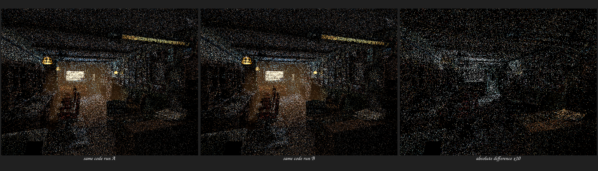

# HIP generated-callable inlining validation

## Result

Luisa HIP no longer assigns `noinline` or `alwaysinline` to a generated DSL
`Callable`. The former 500,000-instruction budget, alternative-frontier graph,
and fixed-point boundary selector were removed rather than retuned. A callable
marker now records provenance only; LLVM IPO and the AMDGPU target choose every
ordinary generated call boundary.

The final Barbershop surface module contains 507 `callable.*` definitions. All
507 reference the same attribute set, containing only `target-cpu=gfx1201` and
`target-features=+wavefrontsize32`; none carries `noinline`, `alwaysinline`, or
the internal provenance marker after cleanup. The shader-cache codegen revision
was incremented, so an object compiled with the removed policy cannot be reused
under the same AST hash.

This correction does **not** by itself solve the large-kernel problem. The final
surface code object is 22,554,128 bytes, 0.12% larger than the preceding
frontier-policy object. The real structural source is still 189 live staged
surface topology keys, each contributing preparation, light-evaluation, and
sampling code. After IPO, 507 implementations remain. Cycles' complete gfx1201
HIPRT kernel object is 2,676,664 bytes, so further work must change the material
execution representation, not invent another backend inlining threshold.

## Cycles reference

Blender 5.2 Cycles makes two distinct choices in
`intern/cycles/kernel/device/hiprt/CMakeLists.txt`:

```text
-mllvm -amdgpu-early-inline-all=false
-mllvm -amdgpu-function-calls=true
```

Its HIP compatibility layer defines an ordinary `ccl_device` as an inline
candidate and provides separate force-inline and no-inline spellings. Explicit
`ccl_device_noinline` uses are selective and concentrated in hand-written SVM,
noise, and other shared helpers. Cycles does not construct a scene-dependent
graph that turns hundreds of generated material implementations into mandatory
ABI boundaries.

The corresponding Luisa invariant is:

```text
generated Callable => no manual inline directive
backend correctness wrapper => preserve an existing explicit boundary only
kernel entry => noinline ABI root
```

The final cleanup therefore preserves `noinline` only when a function already
has it and is one of the modeled ray-query, motion-query, or stack-overflow
fallback wrappers. It never infers a boundary from a callable name, marker,
instruction count, scene, backend name, or call-graph frontier.

## Measurements

These are single diagnostic runs on the RX 9070 XT (`gfx1201`). IR dumping was
enabled for the cold compiler measurements, so they are shape evidence rather
than a stable throughput benchmark.

| Metric | Frontier policy | No generated-callable attributes |
| --- | ---: | ---: |
| Final callable definitions | 571 | 507 |
| Callable definitions with `noinline` | 555 | 0 |
| Surface code object | 22,527,864 B | 22,554,128 B |
| Cold LLVM codegen with IR dumps | 40.06 s | 53.19 s |
| Cold HIP link | 107.30 s | 125.66 s |
| Barbershop 640x480, 1 spp render-only | 0.151281 s | 0.149851 s |

The render-only difference is noise at this duration. Removing the forced
boundaries fixes ownership of the decision but is not a performance win. The
larger cold compile time and almost unchanged object size reinforce that the
next representation should share one pruned material evaluator/SVM-like body,
or otherwise avoid emitting three bodies per topology, while continuing to
transport and evaluate original closure graphs without baking.

The final cached canary reported 1,055 geometries, 1,109 instances, 564 runtime
materials, an 848-byte coroutine frame, 50.96 s of host shader construction/JIT
work, and 0.149851 s synchronized render-only time. The roughly 51-second host
cost is not GPU render time.

## Regression and complex-scene checks

The following checks passed after a 32-thread rebuild:

- HIP policy regression: 16 assertions in five tests, including the rule that
  even a preexisting `noinline` on an ordinary callable is not promoted through
  final cleanup;
- HIP callable ABI regression: 253 assertions in 20 tests;
- Psycles surface-topology AST/lowering regression;
- real HIP vector-mapping, texture-sampling, and Principled-setup callable
  kernels on gfx1201;
- a complete 640x480, 1 spp Barbershop staged-wavefront render with Combined,
  Normal, Albedo, all light passes, and multilayer EXR output.

The Barbershop image was inspected at native resolution. Its camera, geometry,
lighting layout, materials, and texture placement are structurally recognizable;
at one sample per pixel it is intentionally too noisy for quality comparison.

The complex-scene check also exposed an independent repeatability limitation.
Two 640x480, 1 spp staged-wavefront runs loading the exact same
`hip_kernel_a03a333ff2215f01` object differ in 31,977 Combined pixels (10.4%) at
`1e-6`; mean absolute error is 0.0158644 and RMS error is 0.222106. Therefore a
cross-process staged-wavefront image diff is not used as the semantic proof for
this compiler-policy change. The deterministic IR and focused callable tests
are the acceptance oracle until the renderer's complex-scene scheduling/build
repeatability is isolated.

The triptych below records that finding rather than hiding it. Left and center
are two executions of the same code object; the right panel is their linear
absolute difference amplified 10x. Visual inspection finds the same coherent
scene structure in both runs, while the difference panel confirms that their
sample paths are not repeatable enough for an exact compiler A/B.



## Reproduction

```bash
cmake --build build --target psycles_render_blender_scene --parallel 32

./build/bin/psycles_render_blender_scene \
  /var/tmp/psycles-official-redownload-20260814/exports/barbershop-5.2 \
  /var/tmp/psycles-zero-callable-final-20260820/barbershop.exr \
  hip 640 480 1 1 - 0 0 0 0 1 - 1 0 \
  wavefront-staged 32 32768 32 1 1 0 4 2 4096 131072 0 0 1
```

The final IR audit used the dumped 188,800,692-byte surface module and checked
all attribute groups referenced by `define ... @callable.*`. Every definition
uses only the target CPU/features group described above.
