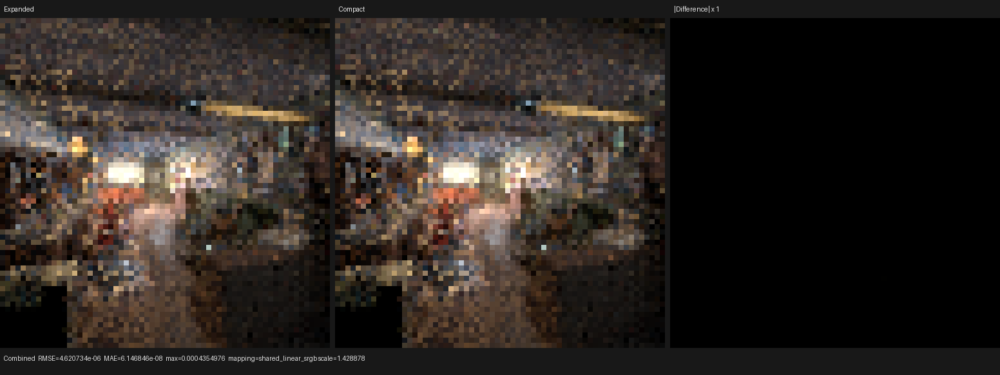
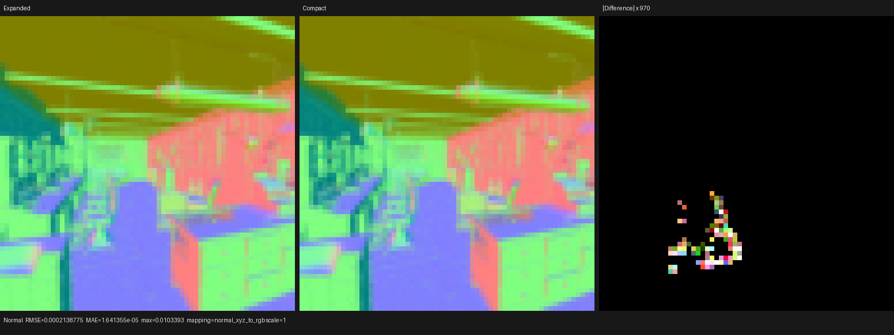

# Compact surface execution in the real HIP renderer

## Scope

This validation wires the typed compact surface-value program into the real
Psycles path tracer behind `PSYCLES_COMPACT_SURFACE_VALUES=1`. The established
expanded path remains the default. The input is the Blender 5.2 Barbershop
export, and both sides use the same Psycles revision, HIP device, render
settings, original shader closures, and scene data. No material is baked or
replaced by a CPU reference.

The experiment answers two separate questions:

1. Can the compact program preserve the expanded path's observable rendering?
2. Does compacting only the value/preparation stage improve the complete path
   tracer?

The answer is yes for rendering equivalence, but no for runtime. The latter is
an architectural result: preparation alone is the wrong fusion boundary.

## HIP generated-callable ABI correction

The real renderer exposed a deterministic fixed-lane corruption after LLVM IPO
retained a generated callable with a scalarized argument list larger than the
AMDGPU function calling convention's 32 input VGPR locations. The correction
is defined over ABI locations rather than C++ types or observed material cases:

- recursively legalize each argument into its exact 32-bit ABI-location count;
- select the maximal source-ordered direct prefix whose locations plus the
  private record pointer fit in the 32-location window;
- copy the remaining suffix into one exactly laid-out caller-private record;
- replace the callee suffix with the record pointer and load the original SSA
  values in the callee;
- run after large-return demotion, so an inserted result pointer consumes the
  same input budget;
- reuse a caller slot only when call records have disjoint synchronous live
  intervals, and reject unsupported ABI constructs transactionally.

This preserves the source argument order and all values while preventing an
implicit machine-stack suffix. It is not a lane-specific workaround. The HIP
unit regressions cover the exact-32 boundary, a 33-scalar overflow, packed
half-width values, return-pointer accounting, distinct callees sharing a legal
slot, and unsupported `musttail` rejection. Current result: 27 tests / 400
assertions for callable ABI and 4 tests / 9 assertions for the LLVM pipeline.

## Command topology

The stable render comparison used one sample per 3D dispatch because the
64-frame cap must contain a complete 64-pixel row:

```text
psycles_render_blender_scene <scene> <output> hip 64 64 64 1 - \
  0 0 0 0 64 - 1 0 megakernel 32 32768 32 1 1 0 4 2 4096 0 0 0 1 1048576 64
```

The compact side additionally set:

```text
PSYCLES_COMPACT_SURFACE_VALUES=1
```

Both sides rendered the absolute sample range `[0, 64)`.

## HIP performance

Hardware: AMD Radeon RX 9070 XT (`gfx1201`), ROCm 7.2.53211.

| Measurement | Expanded | Compact preparation | Compact / expanded |
|---|---:|---:|---:|
| 64x64, 64 spp render-only | 21.0637 s | 30.1613 s | 1.4319x |
| Warm shader JIT | 1.38985 s | 1.23633 s | 0.8896x |
| Cold complete shader JIT | 173.181 s | 169.825 s | 0.9806x |
| HIP code object | 22,024,432 B | 18,325,272 B | 0.8320x |
| Main kernel VGPR spills | 1,412 | 2,092 | 1.4816x |
| Main kernel private segment | 37,840 B | 37,872 B | 1.0008x |

The code object is 16.8% smaller and complete cold JIT is 2.0% faster, but the
render is 43.2% slower. The compact preparation callable itself is 732,660 B,
versus 358,428 B for expanded preparation. Its typed `Local` banks and
runtime-variant dispatch increase private traffic and spills, while light
evaluation and BSDF sampling still independently replay the expanded material
graph. This pays the interpreter cost without receiving the populate-once
benefit.

The fallback backend did not reach rendering: compiling this giant combined
machine function spent 67.4% of sampled time in LLVM
`MachineRegisterInfo::clearKillFlags`, predominantly below `MachineLICM` and
machine-instruction hashing/CSE. That is recorded as a compile scalability
failure, not as a fallback rendering result.

## Numerical and visual comparison

The full report is [report.json](report.json). The comparison covers Combined,
Normal, Albedo-related outputs, all direct/indirect light passes, Emission,
Environment, Transmission, and Volume passes.

- Combined: RMSE `4.6207e-6`, maximum absolute error `4.3550e-4`, p99 pixel
  RMSE `1.0754e-9`, mean luminance ratio `1.00000127`.
- Normal: RMSE `2.1388e-4`, maximum absolute error `1.0339e-2`; differences are
  sparse and localized at automatic-bump boundaries.
- Environment, transmission color, and both volume passes are exact in this
  comparison. Other passes are exact or near float/atomic accumulation noise,
  apart from sparse indirect-pass outliers represented in the report.





The triptychs use expanded, compact, and amplified absolute difference panels.
Manual inspection found no coherent material, geometry, texture, or lighting
difference. Combined is visually identical at native resolution. Normal is
also visually identical without amplification; its difference panel shows a
small set of bump-boundary pixels rather than a structured shading change.

## Cycles 5.2 execution-model comparison

The reference source is local Blender/Cycles tag `v5.2.0`, commit
`fbe6228777e7d9afefcd61a413844e790ae75db7`.

Cycles does not generate one shader implementation per material topology:

- `kernel/svm/svm.h::svm_eval_nodes` runs one sequential bytecode loop and one
  semantic opcode switch. Material identity selects a program offset.
- `scene/svm.cpp::generate_svm_nodes` uses `nodes_done` value numbering and a
  Sethi-Ullman-style DAG schedule; stack slots are released after their last
  unscheduled consumer.
- `kernel/integrator/surface_shader.h::surface_shader_eval` runs SVM once and
  populates the original closure records in local `ShaderData`. Paths which
  only need shadow, termination, or emission allocate no closure slots.
- `kernel/integrator/shade_surface.h::integrate_surface` consumes that same
  local closure set for passes, direct-light BSDF evaluation, and BSDF/BSSRDF
  sampling before scheduling the compact continuation state.

Psycles' current compact experiment implements only the first half of that
model: compact typed value execution feeds preparation, but `evaluate_light`
and `sample` still use separate topology-expanded callables. The validated
next architecture is therefore:

1. one semantic opcode implementation per node family, with static node
   options stored as bytecode data rather than cloned switch cases;
2. one surface-local population of canonical original closure records;
3. preparation, NEE evaluation, path tracing diagnostics, and BSDF sampling
   consuming the populated set without replaying the graph;
4. the populated set scoped entirely inside the shade-surface segment, before
   any shadow/path suspension, so it cannot enlarge a coroutine frame;
5. pressure-aware host scheduling and last-consumer slot reuse, with closure
   families pruned only from proven scene capabilities.

Until that complete dataflow is validated, the compact route remains an
explicit diagnostic A/B option and is not selected by default.
