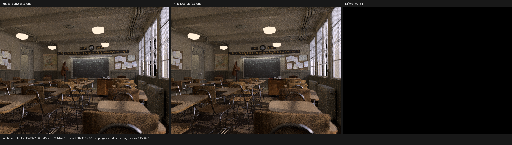
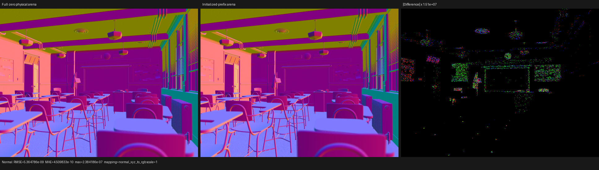

# Counted closure prefixes in coroutine lifetime analysis

## Result

Luisa's coroutine lifetime contraction now proves the initialized prefix of a
counted local array directly on XIR. Psycles can therefore keep the physical
closure container's exact contract—initialize the empty-set sentinel, append a
whole closure, then publish the incremented count—without clearing its unused
suffix and without carrying that suffix through coroutine continuations.

For the production Barbershop staged path, the initialized-prefix
implementation retains the 848-B frame obtained by the former full-zero
workaround. Without either the new proof or the workaround, the same three
closure arrays produced a 2,960-B frame. The proof therefore prevents a
2,112-B (71.35%) regression, or 2.0625 GiB at the configured 1,048,576-frame
capacity. It does not change closure data, sampling, transport, scheduler
topology, or scene capabilities.

The compiler change is generic. It does not recognize Psycles types, closure
kinds, material IDs, or a particular shader graph.

## Formal model

For a fixed array `A[0..K)` and unsigned counter `C`, the analysis proves the
Must invariant

```text
Prefix(A, C) := forall i, 0 <= i < C implies Initialized(A[i]).
```

The accepted abstract transition system is intentionally closed:

1. `C = 0` establishes `Prefix(A, C)` vacuously.
2. A whole-element store `A[C] = v`, with the current counter snapshot and a
   finite proof that `C < K`, creates a pending extension.
3. A following non-wrapping `C = C + 1` consumes that exact pending extension.
4. At CFG joins, prefix and pending-extension facts use Must intersection. The
   finite counter upper bound uses the maximum incoming bound, which remains a
   conservative upper bound.
5. A dynamic read is legal only when ordinary aggregate facts already define
   it, or when its index is the exact select between an initialized static
   sentinel and an index guarded by that same counter snapshot's `i < C`.

Pointer escape, Phi pointers, calls, atomics, partial element stores, unknown
counter writes, unsupported arithmetic, possible counter wrap, a mismatched
read predicate, and observations before the proposed lifetime start all reject
the proof. Rejection happens before mutation. The pass introduces no new IR
entity: it analyzes existing XIR and only moves an existing alloca after the
proof succeeds.

The worklist terminates over a finite semantic-CFG slice. Must bits only lose
facts at joins, while the counter upper bound increases monotonically within
the finite array dimension. Single-store scalar snapshots are resolved only
inside one linear basic-block execution, so a temporary or dynamic GEP from a
prior loop iteration cannot be reused as memory SSA.

## Soundness audit and regressions

The audit found one important matcher error before submission: a store through
`A[C].field` was initially being classified as a whole `A[C]` definition. That
is unsound because publishing `C + 1` would make the other fields observable.
The final recognizer requires the store target itself to be the top-level array
GEP; seeing that GEP anywhere in a longer pointer chain is insufficient.

The dedicated XIR target now has 31 tests / 338 assertions. Its positive case
proves append-or-skip control flow and removes the array from the frame. The
negative cases formally cover:

- increment-before-store ordering;
- the nested subaggregate-store counterexample;
- an unrelated read bound;
- arbitrary counter replacement; and
- a branch where only one predecessor performs the pending extension.

XIR verification is run at the beginning and end of the pass/test transform,
not after every internal step. The full `unit_xir` label passes 57/57 tests.
The runtime counted-array kernel passes 1,028 assertions on HIP and another
1,028 on fallback.

## Production proof and frame result

The focused Psycles surface-population coroutine reports:

```text
allocas=3061 contracted=3061 definite_proofs=646 prefix_proofs=3
rejected_prior_lifetime=0 prefix_block_evaluations=120
```

Those three prefix proofs are the three packed physical-closure arrays. The
focused kernel has zero logical frame values after contraction. The complete
Barbershop shader also remains at 176 fields / 848 B; in that larger graph,
ordinary definite-initialization already proves the relevant placement, so the
prefix domain correctly records no redundant proof.

| Production frame | Historical prefix, no proof | Full-zero workaround | Prefix proof |
|---|---:|---:|---:|
| Barbershop fields | 209 | 176 | 176 |
| Barbershop bytes | 2,960 | 848 | 848 |
| Storage at 1,048,576 frames | 2,960 MiB | 848 MiB | 848 MiB |

## Numerical and visual validation

The direct megakernel comparison on non-overlapping Classroom and Monster
fixtures is byte-identical across all 15 linear PFM passes. Their staged
wavefront comparison differs only by floating atomic order, with Combined
maximum absolute error `1.1920929e-7` at 32x32, 64 spp. Fallback megakernel is
also byte-identical on the Classroom fixture.

The higher-resolution visual oracle uses Classroom at 640x480, 64 spp and
compares full-zero against initialized-prefix builds from the same checkout.
All 307,200 pixels are finite in every pass. Combined RMSE is `1.8499e-9`, its
maximum absolute error is `2.3842e-7`, and its mean luminance ratio is exactly
`1.0`. Normal RMSE is `5.3648e-9`. The largest maximum error among all passes is
`1.4305e-6` in Diffuse Direct; Emission, Environment, Volume Direct, and Volume
Indirect are exact.

Both triptychs were opened at native panel resolution. Combined is visually
identical and its unamplified difference panel is black. Normal is also
visually identical; the `1.51e7` difference amplification exposes only
low-order arithmetic noise, with no coherent geometry, material, texture, or
lighting change.





Barbershop is deliberately not used as the pixel-identity oracle. It contains
exactly coincident floor-panel instances. At pixel `(4, 3)`, sample 103, the two
code shapes reach the same distance and barycentrics but HIPRT selects two
different equal-distance supports whose geometry is coincident while UV and
material identity differ. Cycles CPU and HIP likewise need not choose the same
member of that equivalence class. This is an equal-hit ordering ambiguity, not
an initialized-prefix semantic difference.

## HIP performance

Hardware is an AMD Radeon RX 9070 XT (`gfx1201`) with ROCm 7.2.53211. Timings
are render-only; scene import, upload, and HIPRT acceleration-structure build
are excluded. Both sides use one 64-sample dispatch and staged wavefront
scheduling.

| Scene, 640x480, 64 spp | Full-zero | Initialized prefix | Observation |
|---|---:|---:|---|
| Classroom | 2.35860 s | 2.35255 s | prefix 0.26% faster |
| Barbershop run 1 | 3.44885 s | 3.59001 s | prefix cold/outlier run |
| Barbershop run 2 | 3.44772 s | 3.44690 s | matched |
| Barbershop run 3 | 3.44689 s | 3.45195 s | matched |
| Barbershop steady mean | 3.44782 s | 3.44943 s | prefix 0.047% slower |

The honest conclusion is no measurable render-time change once both variants
have the same 848-B frame. The optimization is structural: it removes the need
to falsify the container contract with redundant suffix stores in order to
obtain the small frame. The earlier nearly 2x gain came from 2,960 B to 848 B,
not from full-zero versus initialized-prefix stores at equal frame size.

## Backend gates

- complete 495-target Psycles build with `--parallel $(nproc)`;
- surface population and physical closure tests: 6/6 across HIP, fallback,
  and Vulkan;
- complete film/scheduler matrix, including Combined, Normal, Albedo, every
  light pass, graph/staged wavefront, direct-light queue, and persistent modes,
  passes on HIP, fallback, and Vulkan;
- Vulkan strict native-route guard: 3/3 assertions in a separate build with
  `LUISA_COMPUTE_VULKAN_ENABLE_DXC_COMPATIBILITY=OFF`.

The Vulkan canary selected `AMD Radeon RX 9070 XT (RADV GFX1201)` and completed
through native XIR-to-SPIR-V. DXC compatibility was unavailable by
construction, so this result cannot be a hidden HLSL/DXC fallback.

Machine-readable metrics are in [report.json](report.json).

