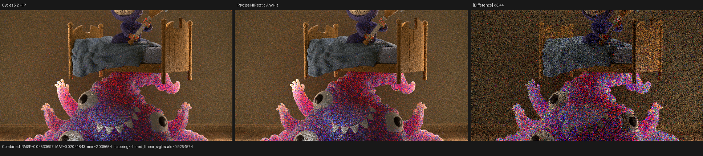
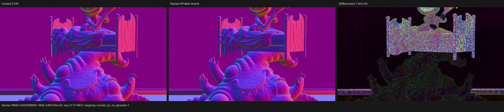
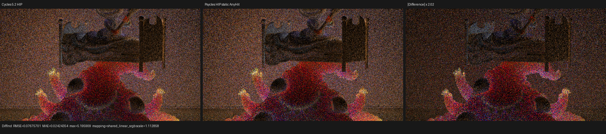

# HIP gfx12 effect-only global-stack stabilization

## Outcome

LuisaCompute `next` commit `619de7aac` removes the gfx12 effect-only
RayQuery selection from the separately maintained hardware-frontier wrapper.
The proven effect-only quotient now executes through HIPRT's public
`hiprtSceneTraversalAnyHitCustomStack` with a statically indexed
`hiprtGlobalStack`. This is the same traversal and stack construction used by
Cycles 5.2 on HIPRT, while Psycles continues to execute its own raw closure and
transparent-shadow callbacks.

The change fixes both observed defects of the old route:

- a 272-logical-lane Monster launch faulted intermittently once execution
  crossed one workgroup; and
- successful old-route launches could disagree with the public HIPRT route in
  indirect visibility.

The old wrapper remains available to backend development but is no longer a
codegen selection for this quotient. No scene, material, ray name, or Psycles
kernel is special-cased.

## Reference construction

Cycles 5.2 was checked at Blender commit `fbe6228777`. Its HIPRT
implementation uses:

```text
Stack          = hiprtGlobalStack
Instance stack = hiprtEmptyInstanceStack
scene query    = hiprtSceneTraversalAnyHitCustomStack / ClosestCustomStack
global entries = 64 integers per concurrent path
shared entries = 24 integers per thread
workgroup      = 256 threads
```

The relevant Cycles source is:

- `intern/cycles/kernel/device/hiprt/globals.h` for stack aliases and the
  64/24/256 sizing contract;
- `intern/cycles/kernel/device/hiprt/bvh.h` for traversal construction; and
- `intern/cycles/device/hiprt/queue.cpp` for global-stack allocation and
  kernel launch.

Luisa's selected wrapper now has the corresponding construction:

```text
hiprtGlobalStackBuffer global{stack_size, stack_count, stack_data};
hiprtSharedStackBuffer shared{24, shared_stack};
hiprtGlobalStack stack{global, shared};
hiprtEmptyInstanceStack instances;
hiprtSceneTraversalAnyHitCustomStack traversal{...};
```

The renderer and backend still have different payloads. Matching Cycles here
means reusing the public traversal algorithm and stack protocol, not copying a
Cycles kernel or pre-evaluating a Blender material.

## Formal selection argument

Let `Q` be the query state, `S` externally observable callback state, and
`c_0 ... c_n` the candidate sequence produced by a conforming traversal. The
effect quotient is eligible only when static analysis proves:

```text
post-state(Q) is dead
every handler transition is reject-and-continue or terminate
commit and proceed are unreachable through every active-query alias
world-ray and object-ray are not jointly observed
instance opacity cannot change in the reachable module
```

The observable fold is then:

```text
(S_i, c_i) -> S_(i+1), continue | terminate
```

Committed-hit materialization and distance contraction are outside the
quotient. HIPRT AnyHit implements exactly this fold through its filter return
value. A runtime monotone opacity certificate still guards the proof: zero
proves the accel has never contained an opaque instance; nonzero enters the
existing exact query before the first callback, so effects are never replayed
or rolled back.

On gfx12 the previous implementation replaced HIPRT's traversal with a Luisa
BVH8 state machine. That added an independent proof obligation for every
frontier transition, overflow marker, TLAS pop, instance transform, and
candidate resume state. The production failure showed that obligation was not
met. The stable fix removes the duplicated state machine from the selected
path rather than adding a scene-shaped condition.

One proposed frontier-state repair was deliberately rejected. It retained the
previous node whenever the hardware instruction returned a new valid node.
The deep-TLAS regression produced 213 failures, and re-reading the gfx12
protocol showed why: a valid returned node replaces that history; only the
invalid/overflow branch retains it for the later pop. The experiment was
reverted in full. This is evidence against the candidate, not a patch hidden
behind the passing case.

## Failure attribution and stability

Parent-source bisection with a fixed Luisa revision found:

```text
c51c61a  good
5b7d129  first bad: Render transparent shadows in one RayQuery batch
```

The failing Monster window was `34x8` logical pixels at `(0,24)`: 272 useful
lanes, rounded to 512 physical lanes by the 256-thread block size. The old
gfx12 hardware-frontier route succeeded 6 of 10 repeated launches and faulted
4. A one-block launch generally succeeded, which localized the defect to
per-workgroup/frontier state rather than scene loading or a particular pixel.

Changing only the selected traversal to HIPRT's static global stack produced:

| Workload | Result |
|---|---:|
| 34x8 exact window, repeated | 20 / 20 pass |
| 640x360, 16 spp full Monster | 6 / 6 pass |
| PPM identity across full runs | 1 unique SHA-256 |
| Each of 15 PFM passes across full runs | 1 unique SHA-256 per pass |

The sixth full render was rebuilt after rebasing Luisa from `d276b8b` to the
then-current `db8ad92`; its PPM and every PFM remained byte-identical to the
first five.

The successful old-frontier window and static-stack window are not merely two
equivalent implementations with different stability. Their 1-spp comparison
was:

| Pass | RMSE | Maximum absolute error |
|---|---:|---:|
| Combined | 0.0111687 | 0.568893 |
| Diffuse Indirect | 0.0361562 | 1.65661 |
| Diffuse Direct | 2.56e-9 | 1.19e-7 |
| Glossy Direct | 6.39e-10 | 2.98e-8 |
| Glossy Indirect | 1.04e-9 | 5.96e-8 |
| Normal, Diffuse Color, Glossy Color, Emission | 0 | 0 |

Thus the old route also had an observable indirect-visibility disagreement.
Its occasional successful launch is not a correctness oracle.

## Real-render cost

All runs used an RX 9070 XT (`gfx1201`) and the megakernel baseline:

```text
build/bin/psycles_render_blender_scene \
  /home/mike/Projects/psycles-benchmarks/monster-640x360-16spp/export \
  <output.ppm> hip 640 360 16 1
```

| Measurement | Result |
|---|---:|
| warm render-only, run 1 | 0.718166 s |
| warm render-only, runs 2-5 | 0.720302 / 0.723798 / 0.722045 / 0.723285 s |
| post-rebase render-only, run 6 | 0.719726 s |
| final linked HIP code object | 1,660,528 B |
| old hardware-frontier object | 1,543,288 B |

The public traversal grows this already large renderer object by 7.60%. It
does not regress steady render time outside measurement noise in this test,
but it is not presented as the final kernel-size solution. Shader translation
and the compact closure/SVM work remain the structural route for reducing the
megakernel.

## Cycles differential and visual inspection

[report.json](report.json) compares all 15 available Psycles passes against
the retained Cycles 5.2 HIP EXR at 640x360 and 16 spp. Combined has RMSE
`0.04533697`, mean absolute error `0.02041843`, no invalid pixels, and a mean
luminance ratio of `1.003349`. Normal has RMSE `0.0003089901`, no invalid
pixels, and channel-mean ratios within `0.038%` of one.

The Normal orientation check is decisive for structural alignment:

```text
identity RMSE = 0.00030899
flip-x RMSE   = 0.348837
flip-y RMSE   = 0.405213
flip-xy RMSE  = 0.415153
```

Native-resolution inspection found aligned geometry, silhouettes, UV texture
regions, normals, the bed, monster, and shadow topology. Combined/direct and
indirect differences are spatially noisy rather than coherent missing or
extra visibility regions. The energy agreement is close, but this low-spp
render is not an exact Cycles sampling match: Cycles CPU versus HIP Combined
RMSE is `0.00318784`, much smaller than Psycles versus Cycles HIP. RNG and
path-sampling alignment therefore remains open and is not hidden by the
traversal fix.







## Regression coverage

The focused runtime regression launches 513 query instances with an explicit
256-thread block: two complete workgroups and one partial workgroup. It repeats
the launch eight times and compares the native route with an exact
post-state-observing RayQuery for every invocation:

- callback count and surface/procedural partition;
- callback order and checksum;
- terminate boundary;
- opaque-certificate fallback; and
- per-workgroup stack-index reuse.

Final validation on Luisa base `db8ad92` plus `619de7aac`:

```text
LuisaCompute full system-STL build                 pass
test_hip_callable_boundary                         95 assertions / 4 tests
test_hip_ray_query_pipeline hip                 11776 assertions / 10 tests
Psycles full build                                 pass
psycles_luisa_scene_traversal_tests fallback       pass
psycles_luisa_scene_traversal_tests hip            pass
psycles_luisa_scene_traversal_tests vk             pass
Vulkan route                                       strict native XIR -> SPIR-V
DXC loaded in Vulkan canary                         no
git diff --check                                   pass
```

The Vulkan command set both
`LUISA_VULKAN_REQUIRE_NATIVE_XIR_SPIRV=1` and
`LUISA_VULKAN_DISABLE_DXC=1`.
