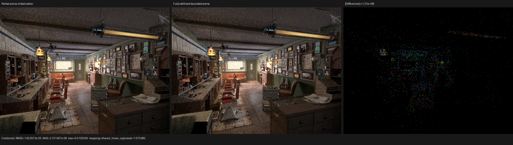

# Physical closure arena coroutine lifetime

## Result

The populated Barbershop surface path no longer carries its three bounded
physical-closure arrays through unrelated coroutine continuations. On the RX
9070 XT, the staged path frame falls from 2,960 B to 848 B and the matched
640x480, 64-spp HIP render improves from a two-run median of 7.825210 s to
3.976455 s, a **1.9679x speedup**. The material graph, closure parameters,
transport algorithm, sample mapping, scheduler topology, and frame capacity
are unchanged.

This is a container-initialization correction, not a material special case and
not a relaxation of the coroutine analysis.

## Formal model and root cause

For the physical closure profile, let the fixed capacity be `K = 12`, let
`A_0`, `A_1`, and `A_2` be the three arrays of packed `float4x4` blocks, and
let `n` be the retained-closure count. A retained source closure performs the
transaction

```text
A_0[n] = pack_0(c)
A_1[n] = pack_1(c)
A_2[n] = pack_2(c)
n = n + 1
```

and consumers dynamically read `A_j[i]` only while `0 <= i < n`. The old
constructor initialized only `A_j[0]`. The program-level initialized-prefix
invariant was therefore enough for renderer semantics, but the generic XIR
alloca-scope proof does not contain the relational fact `i < n`. A dynamic
array read conservatively observes the complete aggregate mask. Elements
`A_j[1..K-1]` consequently appeared to require an incoming value, so each of
the 33 matrices was materialized in the coroutine frame.

The corrected bounded-container invariant is

```text
for j in [0, 3), q in [0, K): A_j[q] = zero
n = 0
```

before the first append. This gives the existing Must-definition analysis a
complete aggregate definition in the synchronous `shade_surface` segment.
Every valid observation is unchanged because the append transaction overwrites
the selected slot before increasing `n`; invalid entries are already masked by
`SurfaceClosureSet::entry()`. The fix therefore defines previously dormant
storage without changing the retained closure sequence or any physical
closure value.

The constructor now performs 36 local matrix stores per surface instead of
three, an incremental cost of 33 stores. The benefit is removal of the 33
old-value matrices from every frame and from the transition I/O. The HIP
measurements below establish that the latter dominates at scene scale.

## Structural regression

`psycles_luisa_surface_population_tests` now constructs a focused coroutine:

```text
suspend("shade-surface")
construct physical SurfaceClosureSet(K)
dynamically append K records
dynamically consume fields from all three packed blocks
suspend("after-surface")
```

The test asserts that this synchronous arena contributes zero user frame
fields. With the old constructor restored, the test fails with:

| Frame quantity | Old constructor | Corrected constructor |
|---|---:|---:|
| user fields | 33 `float4x4` | 0 |
| payload | 2,112 B | 0 B |
| complete frame including 28-B header | 2,144 B | 28 B |

The complete Barbershop coroutine contains other legitimate path state, so its
corresponding production frame is:

| Frame quantity | Old constructor | Corrected constructor | Change |
|---|---:|---:|---:|
| logical values | 237 | 204 | -33 |
| physical slots | 202 | 169 | -33 |
| fields including scheduler header | 209 | 176 | -33 |
| frame size | 2,960 B | 848 B | -2,112 B |

At the configured 1,048,576-frame cap, storage falls from 2,960 MiB to
848 MiB, saving 2,112 MiB (2.0625 GiB).

## HIP performance

Hardware is an AMD Radeon RX 9070 XT (`gfx1201`) on ROCm 7.2.53211. Both
executables were built from the same base revision; one retained the old
index-zero-only implementation solely for the A/B oracle. Each run used the
same Blender 5.2 Barbershop export, fixed sample range `[0, 64)`, one
64-sample dispatch, staged wavefront scheduling, and a 1,048,576-frame cap.

| 640x480, 64 spp render-only | Old frame | Corrected frame |
|---|---:|---:|
| run A | 7.83783 s | 3.97309 s |
| run B | 7.81259 s | 3.97982 s |
| two-run median | 7.825210 s | 3.976455 s |
| relative result | 1.0000x | **1.9679x** |

`rocprofv3 --kernel-trace --stats` maps anonymous kernels through
`LUISA_CORO_SHADER_MAP=1`:

| GPU component | Old | Corrected | Result |
|---|---:|---:|---:|
| `shade_surface`, 372 dispatches | 6,647.269 ms | 2,893.754 ms | 2.2971x |
| frame compaction, 26 dispatches | 141.040 ms | 53.725 ms | 2.6252x |
| `intersect_closest`, 351 dispatches | 321.645 ms | 322.993 ms | unchanged (+0.42%) |

The surface and compaction reductions explain 99.43% of the profiled
render-time reduction. Unrelated traversal work is stable, directly tying the
speedup to the eliminated closure-frame traffic rather than to scene-build,
HIPRT, or sampling variation.

The reproduced command is:

```bash
PSYCLES_POPULATE_SURFACE_ONCE=1 \
./build/bin/psycles_render_blender_scene \
  <barbershop-5.2-export> output.exr hip 640 480 64 64 \
  - 0 0 0 0 64 - 1 0 wavefront-staged \
  32 32768 32 1 1 0 4 2 4096 0 0 0 1 1048576
```

The profile additionally prefixes the command with:

```bash
LUISA_CORO_SHADER_MAP=1 LUISA_CORO_WAVEFRONT_STATS=1 \
rocprofv3 --kernel-trace --stats --
```

Raw A/B and profiler logs remain under
`/var/tmp/psycles-surface-arena-{partial,zeroed,profiler-*}`.

## Numerical and visual validation

At 8x8 and 256 spp, all 15 linear PFM passes, including Combined, pass `idiff`
with a `1e-3` absolute failure threshold. The full 640x480 comparison has zero
invalid pixels and the following Combined metrics:

| Metric | Old versus corrected |
|---|---:|
| RMSE | 1.65297e-5 |
| relative RMSE | 1.01949e-4 |
| maximum absolute error | 0.0139209 |
| p99 pixel RMSE | 8.60319e-9 |
| mean luminance ratio | 0.999999674 |
| pixels above `1e-6` | 4 / 307,200 |

The sparse differences are inside the renderer's existing concurrent
accumulation/scheduling repeatability envelope. Two corrected runs differ by
Combined RMSE `5.92104e-5`, maximum `0.0355442`, and five pixels over `1e-6`;
two old runs differ by RMSE `6.14698e-5`, the same maximum `0.0355442`, and
four pixels over `1e-6`. The cross-version residual is smaller than either
same-version repeatability sample.

The triptych was opened at native 640x480 panel resolution. The old and
corrected images have the same geometry, textures, materials, lighting,
shadows, and sample-noise structure. No coherent spatial or closure-family
difference is visible. The third panel amplifies the tiny absolute residual by
about `1.21e8`; its sparse low-order accumulation noise is not visible in
either render panel.



The machine-readable metrics are in [report.json](report.json).

## Build and backend gates

The complete Psycles build used all available host threads. The focused
closure-collection and population matrix passes on fallback, HIP, and Vulkan:

```bash
cmake --build build --parallel $(nproc)
ctest --test-dir build --parallel $(nproc) --output-on-failure \
  -R 'psycles\.luisa_surface_(closure_collection|population)_(fallback|hip|vk)$'
```

The Vulkan population canary was also run explicitly with
`LUISA_VULKAN_USE_XIR=1`, `LUISA_VULKAN_REQUIRE_NATIVE_XIR_SPIRV=1`, and
`LUISA_VULKAN_DISABLE_DXC=1`. It completed through native XIR-to-SPIR-V; its
log contains SPIR-V optimization/codegen records and no DXC load.
