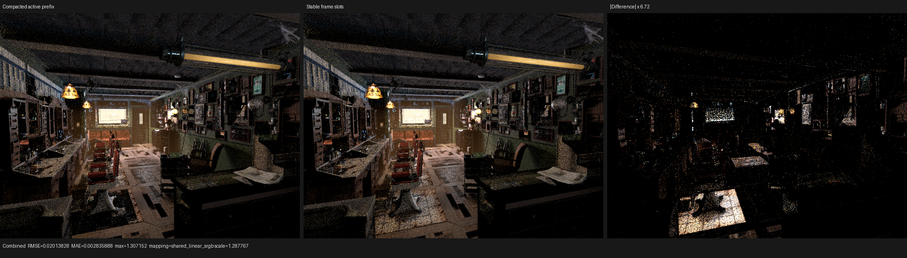

# Stable-frame incremental wavefront queues

## Result

Luisa's incremental wavefront scheduler now supports non-compacting frame
storage. Frames remain in fixed physical slots, continuation dispatches keep
using indirect frame indices, and refill obtains a bijective free-slot index
queue instead of moving live frames. The implementation is available in
LuisaCompute `next` at `12c07e556` and has exact oversubscribed-refill,
branch, and dynamic self-loop regression coverage.

The capability is deliberately **not** selected by Psycles' production staged
wavefront configuration yet. On the 640x480, 64-spp Barbershop workload, three
warm HIP measurements give a 3.71415 s compact-prefix median and a 3.87231 s
stable-slot median. Stable slots are 4.26% slower. Eliminating physical frame
relocation is real, but it expands selected/free-slot scans and gives up the
active-prefix locality that currently benefits the 848-byte SoA frame. The
existing compact policy therefore remains the measured production default.

## Formal state model

Let the fixed frame domain be `F = [0, capacity)` and let

```text
token : F -> {0, ..., node_count - 1}
```

where token zero is the unique free/terminated state. For every nonterminal
token `t`, the scheduler maintains the exact cardinality

```text
C[t] = |{f in F : token(f) = t}|.
```

Queue zero is derived, not incrementally maintained:

```text
free = capacity - sum(C[t], t != 0).
```

For a selected continuation `i`, one gather invocation is associated with each
physical slot. It emits `f` exactly when `token(f) == i`; atomic output ranks
are unique, so the resulting index queue is a bijection with that set. Resuming
the complete selected set `S` obeys the finite-state conservation law

```text
C' = C - |S| e_i + sum(f in S) e_target(f).
```

The subtraction and histogram updates are scheduler-owned ordered kernels.
This covers sparse token values, termination, branches, and self-edges. At
refill, the same gather is applied to token zero. Generation and generated-
count publication consume exactly the same free-index mapping, so no free slot
can be omitted or used twice. Before the first admission the free-index queue
is the identity permutation and is initialized together with frame tokens,
avoiding a contended initial atomic gather.

This model requires neither frame relocation nor a new coroutine-frame field.
The user continuation kernels retain their existing argument ABI. Only the
scheduler-owned initialization, gather, and publication kernels know whether
frame storage is compact or stable.

## Regression coverage

The extended Luisa test dispatches 257 logical instances through a 31-frame
pool. Every instance crosses an initial refill alignment point, takes one of
two sparse-token branches, executes zero to three iterations of a continuation
self-edge, and writes an exact result plus a one-visit counter. The same test
runs with frame compaction both disabled and enabled.

- fallback full `test_coro_wavefront`: 28/28 tests, 782 assertions;
- HIP targeted stable/compact regression with
  `LUISA_CORO_WAVEFRONT_VERIFY_QUEUES=1`: 2/2 assertions;
- Vulkan targeted regression: 2/2 assertions through strict native
  XIR-to-SPIR-V with DXC disabled;
- Psycles film/sample/surface matrix: 14/14 tests across fallback, HIP, and
  strict native Vulkan where registered. It covers absolute sample mapping,
  light-pass accumulation, surface population/preparation, and dispatch
  partitioning.

The queue verifier independently materializes token counts at every scheduler
boundary. It is diagnostic-only and is not enabled in performance runs.

## HIP A/B

Hardware is an AMD Radeon RX 9070 XT (`gfx1201`) with ROCm 7.2.53211. Both
variants use the same exported Barbershop scene, 640x480, 64 spp,
`wavefront-staged`, samples-per-dispatch 32 after the host's geometric startup
chunks, and a 1,048,576-frame ceiling. Reported renderer times exclude scene
import, acceleration construction, and shader compilation.

| Policy | Run 1 | Run 2 | Run 3 | Median | Gather slots, median | Relocation scan, median |
|---|---:|---:|---:|---:|---:|---:|
| compact active prefix | 3.76797 s | 3.71415 s | 3.71212 s | 3.71415 s | 1,030,694,590 | 15,499,435 |
| stable physical slots | 3.87328 s | 3.86064 s | 3.87231 s | 3.87231 s | 1,182,859,264 | 0 |

The stable policy increases render-only time by 4.26%, scheduler elapsed time
by 4.29%, and gathered slot examinations by 14.76%. `compact_scan=0` proves
that the relocation kernel is absent; the negative total result shows that
removing it in isolation is not an optimization for this workload. A future
stable-frame production attempt must maintain real per-token index queues or a
hierarchical membership structure and must re-establish frame-access locality;
merely replacing relocation with full-domain token scans is insufficient.

## Visual inspection

The retained triptych compares one compact-prefix run with one stable-slot run.
I inspected it at its native 1936x550 resolution. Camera, geometry, floor and
ceiling structure, textures, cabinets, materials, and lighting are coherent in
both source panels. The amplified residual is stochastic and concentrated on
high-energy transport, emissive fixtures, and the known equal-distance
Barbershop support geometry; it does not form a missing-object, transform,
texture-coordinate, or material-class pattern.

At 64 spp, independent compact-policy runs already have Combined RMSE 0.01340
because equal-distance primitive selection and atomic accumulation order are
not byte deterministic. Compact versus stable has RMSE 0.02014, MAE 0.00284,
zero invalid pixels, and identity orientation is the minimum-error orientation
by a wide margin. The exact scheduler regression above, rather than this noisy
scene, is the semantic oracle.



## Reproduction

```sh
cmake --build build-luisa-tests --target test_coro_wavefront \
  --parallel "$(nproc)"

env LUISA_CORO_WAVEFRONT_VERIFY_QUEUES=1 \
  ./build-luisa-tests/bin/test_coro_wavefront fallback

env LUISA_CORO_WAVEFRONT_VERIFY_QUEUES=1 \
  ./build-luisa-tests/bin/test_coro_wavefront hip \
  wavefront_incremental_counts_conserve_sparse_transitions

env LUISA_CORO_WAVEFRONT_VERIFY_QUEUES=1 \
  LUISA_VULKAN_USE_XIR=1 \
  LUISA_VULKAN_REQUIRE_NATIVE_XIR_SPIRV=1 \
  LUISA_VULKAN_DISABLE_DXC=1 \
  ./build-luisa-tests/bin/test_coro_wavefront vk \
  wavefront_incremental_counts_conserve_sparse_transitions
```

The renderer command, individual timing samples, hashes, and machine-readable
metrics are in [report.json](report.json). The raw visual comparison metrics
are in [visual-report.json](visual-report.json).
