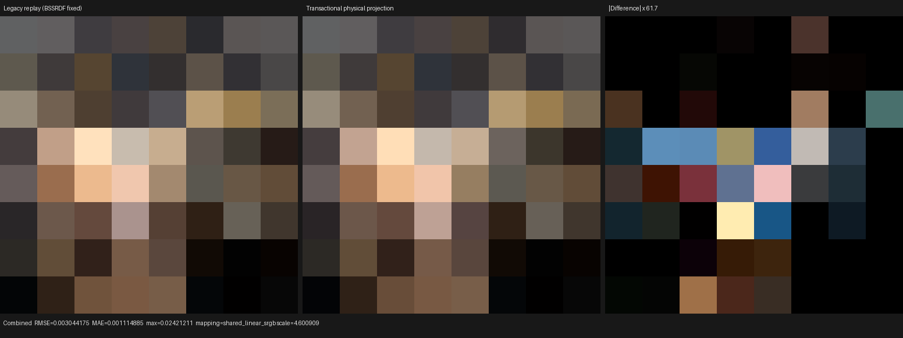
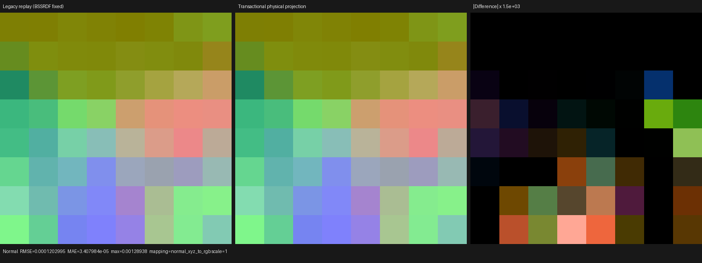
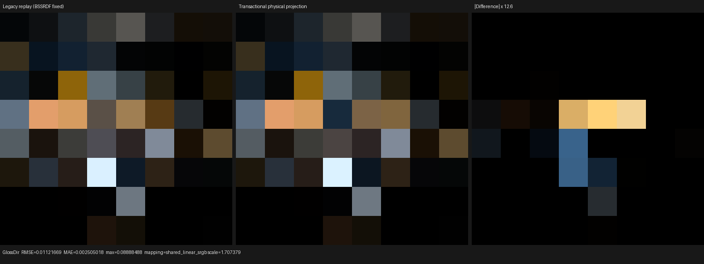

# Single-evaluation surface population and physical projection

## Model

`PSYCLES_POPULATE_SURFACE_ONCE=1` now executes a hit's original typed material
graph once and makes every surface consumer observe that one population. It
does not evaluate materials on the host, bake closures, or delegate material
evaluation to Blender/Cycles.

Let the material emit source-ordered closure candidates
`C = (c_0, ..., c_m)` and let `K` be the Cycles-compatible closure capacity.
The retained subsequence is defined by the recurrence

```text
n_0 = 0
keep_i = scattering(c_i)
         and allocation_weight(c_i) >= closure_weight_cutoff
         and n_i < K
n_(i + 1) = n_i + (keep_i ? 1 : 0)
S = (c_i | keep_i), preserving source order
```

For each retained closure, one device conditional now performs the following
transaction in order:

```text
store physical(c_i); fold runtime_flags(c_i); fold camera_aov(c_i); ++n
```

The callback is recorded inside the same `$if(keep_i)` as storage and count
advancement. This is important at the exact-capacity boundary: returning a
predicate and materializing it after `++n` caused the final accepted closure
to be stored but omitted from the reductions. The implementation now has one
predicate evaluation and no independently mutable snapshot.

The arena retains the exact `SurfaceClosurePhysicalRecord` projection in three
`float4x4` blocks. Setup-only albedo fields are reduced while their expressions
are live and do not cross the dependency cut. Directional BSDF evaluation and
sampling still consume the original closure parameters; no response is
precomputed. The population query is captured by the collector, and
`PopulatedSurfaceShader::preparation()` takes no second query, so population
and reduction policies cannot diverge.

For a material value DAG `G = (V, E)` and endpoint sets `P` (physical closures)
and `M` (emission), graph population evaluates the topologically closed union

```text
D = ancestors(P union M)
```

once per hit. A scheduled value node is therefore recorded once even when it
feeds several closures or emission.

## Correctness fixes and regressions

The work found a pre-existing ABI defect: the complete closure profile packed
all BSSRDF fields but `SurfaceClosureSet::entry()` never decoded them. Random
walk method, radius, albedo, IOR, roughness, and anisotropy are now restored.
The old full-render images in this directory's previous revision are not valid
semantic references because they exercised that loss.

The focused regressions cover:

- complete and physical round trips with distinct BSSRDF sentinels;
- a capacity-one transactional append, proving that the accepted closure folds
  once and the overflow closure neither stores nor folds;
- two complex materials over eight dynamic query scenarios, comparing 32
  output records for emission, flags, every camera AOV, evaluation, light
  evaluation, sampling, BSSRDF selection, and closure identity;
- a shared Image Texture input feeding multiple endpoints, whose graph-record
  counter must remain one;
- disabled runtime-flags and AOV queries, including the zero roughness result.

Final matrix:

```text
ctest --test-dir build -j6 --output-on-failure \
  -R 'psycles\.luisa_surface_(closure_collection|population)_(fallback|hip|vk)$'
```

All six fallback, HIP, and Vulkan tests pass. The Vulkan test is the configured
strict native XIR to SPIR-V canary, not DXC.

Focused generated kernels independently demonstrate the smaller dependency
cut:

| Backend | Complete closure arena | Transactional physical arena | Reduction |
|---|---:|---:|---:|
| HIP code object | 114,368 B | 73,664 B | 35.6% |
| native-XIR SPIR-V | 133,701 words | 63,967 words | 52.2% |

## Real Barbershop HIP result

The Blender 5.2 Barbershop export used here reports 1,649 geometries, 2,565
instances, and 564 deduplicated material topologies. Both routes use the same
revision and RX 9070 XT (`gfx1201`), with an 8x8 image, 256 spp, megakernel
scheduler, and one sample per dispatch:

```text
psycles_render_blender_scene <barbershop-export> <output.exr> hip \
  8 8 256 1 - 0 0 0 0 256 - 1 0 megakernel \
  32 32768 32 1 1 0 4 2 4096 0 0 0 1 1048576
```

The physical route additionally sets `PSYCLES_POPULATE_SURFACE_ONCE=1`. The
small launch isolates compiler and per-path work: the current giant
megakernel's dynamic private stack still faults the HIP driver at 64x64 on
both routes, which is a separate open defect.

| Measurement | Legacy replay, BSSRDF fixed | Transactional physical | Result |
|---|---:|---:|---:|
| warm render-only | 1.91992 s | 1.00731 s | **1.906x faster** |
| cold render-only | 2.07340 s | 1.13257 s | **1.831x faster** |
| Luisa to HIP LLVM | 25.668 s | 31.072 s | 1.211x slower |
| HIP LLVM input | 14,906,832 B | 5,169,352 B | 65.3% smaller |
| LLVM to AMDGPU object | 85.886 s | 470.331 s | **5.476x slower** |
| main HIP code object | 15,861,328 B | 5,162,760 B | 67.5% smaller |
| full cold shader JIT | 120.427 s | 511.043 s | **4.244x slower** |
| fixed private segment | 36,512 B | 7,088 B | 80.6% smaller |
| SGPR / VGPR | 108 / 256 | 107 / 256 | effectively unchanged |
| peak host RSS | 12,764,064 KiB | 12,764,980 KiB | effectively unchanged |

Relative to the preceding complete populate-once implementation, the
transactional projection reduces the COMGR phase from 498.008 s to 470.331 s
(5.6%) but grows the object from 4,965,768 B to 5,162,760 B (4.0%). This is a
useful runtime and private-state boundary, but it does not solve cold
compilation.

A ten-second `perf` sample of the earlier 534-second physical-arena experiment
placed 64.4% of samples in one stripped AMD COMGR optimizer routine. COMGR used
one CPU core at roughly 97% and about 11.8 GiB RSS. Together with the already
65% smaller LLVM input, this identifies optimizer complexity in the expanded,
dynamically indexed material arena rather than host source-file size.

## Numerical and visual inspection

[report.json](report.json) compares a BSSRDF-fixed legacy run with the final
transactional physical run over all available light passes. Combined has RMSE
`0.00304417`, maximum absolute error `0.0242121`, and mean-luminance ratio
`1.0014517`. Normal has RMSE `0.000120299` and maximum absolute error
`0.00128938`. Emission and Environment are equal to approximately `2e-8` and
`2e-10` maximum error respectively.

This full render is not deterministic after enabling the formerly lost BSSRDF
payload. Across all 46 channels, two physical runs differ by RMS `0.00480429`
and maximum `0.0888361`; legacy versus physical differs by RMS `0.00534452`
and maximum `0.109413`. A repeated legacy pair previously measured RMS
`0.00385356` and maximum `0.109393`. The cross-route residual is therefore in
the same stochastic envelope, while deterministic focused tests compare every
closure field and consumer directly. The nondeterministic full-render path is
tracked separately and is not described as exact-hash equivalence.

The regenerated triptychs were opened at native nearest-neighbor scale.
Legacy and physical panels have the same geometry, material regions, normals,
and lighting structure. Visible residuals are sparse stochastic direct and
indirect samples; no coherent topology, texture, or transform difference was
found. The 8x8 image is a compiler-focused canary, not a quality benchmark.







## Why Cycles still compiles differently

Cycles 5.2 does not instantiate one giant control-flow copy per material
topology. `svm_eval_nodes` interprets a fixed sequential instruction stream;
the scene compiler uploads node words and jump offsets, assigns and reuses
stack slots per material, and allocates tagged `ShaderClosure` records from a
compact base-slot arena with typed tail payloads. Scene-wide feature constants
remove unused opcode and closure families from the interpreter.

Psycles currently deduplicates equal topologies and schedules each value DAG in
topological order, but still expands all 564 distinct Barbershop topologies into
one shader AST. Its asymptotic kernel construction remains

```text
O(sum of material-topology AST sizes)
```

The next production translation route must instead make topology and parameters
data, with kernel IR bounded by

```text
O(interpreter implementation + closure families used by the scene).
```

The typed expanded route remains as an exact diagnostic and small-scene
specialization. The SVM route will reuse Psycles' Luisa DSL node and closure
implementations rather than copy or text-translate Cycles kernels.
