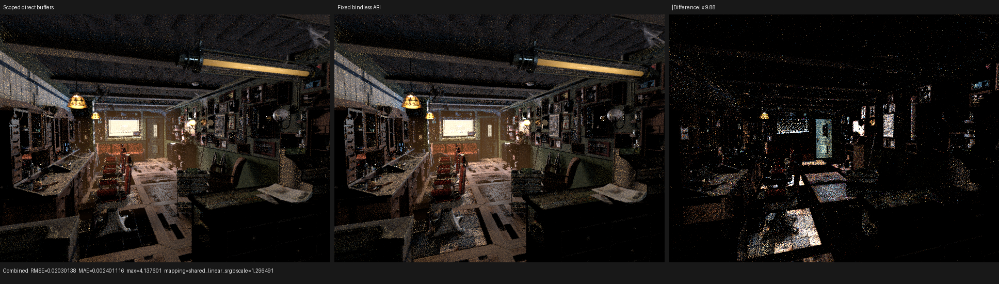

# Compact surface runtime resource ABI

## Result

The compact surface interpreter now exposes its fourteen immutable program
buffers to generated shaders through one fixed semantic bindless view. The
host-side buffers remain independently typed and owned for construction and
upload; only the shader callable ABI is consolidated.

On the production Barbershop path this reduces the largest generated callable
argument storage from 328 B to 184 B, the `shade_surface` private segment from
6,496 B to 6,160 B, and the hot HIP code-object cache artifact from 1,024,400 B
to 1,013,671 B. The coroutine graph remains 9 subroutines, 176 frame fields,
and 848 B: this is a synchronous shader-working-set optimization, not a frame
layout change.

## Semantic model

Let the original immutable resource tuple be

```text
R = (R_0, ..., R_13), where R_i : Index_i -> T_i.
```

The host constructs a bindless view `D` and a compile-time injective slot map
`s : {0, ..., 13} -> {0, ..., 13}` such that

```text
D[s(i)] = R_i.
```

Every shader read is transformed uniformly as

```text
R_i[j]  ==>  D.buffer<T_i>(s(i), untyped, uniform_slot)[j].
```

The slot is a semantic enum value, not a material-dependent integer. It is
constant over every invocation, so the generated access explicitly marks the
descriptor index uniform. `D.update()` is sequenced after all buffer uploads
on the same stream. Therefore, for every valid index `j`, the transformed read
has the same element type, address, and stream-visible contents as the direct
read. No closure, surface-program, or texture data is changed, and no backend
path is removed.

The `BindlessArray` member is declared after all bound buffers. C++ reverse
member destruction consequently releases the view before its resources. The
binding code names all fourteen slots and derives the view capacity from the
enum sentinel, so extending the tuple requires an explicit semantic slot and
binding rather than a magic-number convention.

## HIP profile

Hardware is an AMD Radeon RX 9070 XT (`gfx1201`) with ROCm 7.2.53211. The
measurement uses the same 640x480, 64-spp Barbershop export, one
`(width,height,64)` sample dispatch, staged wavefront scheduling, and a
1,048,576-frame capacity. Times exclude scene import and acceleration-
structure construction. The final row was re-profiled from source commit
`47a2c97` after the uniform-slot property was part of the generated AST.

| Variant | Callable argument storage | Frame | `shade_surface` private | `shade_surface` GPU time | Render-only |
|---|---:|---:|---:|---:|---:|
| scoped direct buffers | 328 B | 848 B | 6,496 B | 2,549.211 ms | 3.97421 s |
| thirteen-buffer view, static table direct | 200 B | 848 B | 6,208 B | 2,525.156 ms | 3.86068 s |
| fixed fourteen-buffer view | 184 B | 848 B | 6,160 B | 2,386.217 ms | 3.72942 s |
| expanded evaluator baseline | 160 B | 848 B | 5,264 B | 2,021.080 ms | 3.50017 s |

Relative to the pushed scoped-buffer baseline, the final implementation
reduces render-only time by 6.16% and hot-kernel time by 6.39%. Together with
the preceding bank-lifetime contraction, the compact implementation is 10.69%
faster end-to-end and 15.53% faster in `shade_surface` than the initial
1,072-B-frame version. The remaining matched-scene gap to the expanded
baseline is 6.55% end-to-end and 18.07% in `shade_surface`.

The final profiler recorded 414 `shade_surface` dispatches. The nearby 412-call
run is not used for the final comparison: this Barbershop export contains
equal-distance coincident support geometry, so HIPRT may select a different
but equivalent primitive and slightly perturb queue population across fresh
processes.

## Correctness and visual inspection

The surface population and compact preparation matrix passes 6/6 on HIP,
fallback, and strict native Vulkan XIR to SPIR-V. The sample/film matrix passes
8/8 and covers absolute sample mapping, chunk boundaries, Combined, Normal,
Albedo, every light pass, and serial versus atomic accumulation behavior.

The retained triptych compares the scoped direct-buffer and fixed-view
Barbershop renders. I inspected it at its native 1936x550 resolution. Camera,
geometry, textures, materials, lighting, and dark floor/support structure are
coherent between the two panels. The amplified residual is concentrated on
high-variance light transport and the known equal-distance primitive-choice
regions; it does not expose a new missing object, transformed surface, or
material class. Identity orientation is the minimum-error orientation by a
wide margin. Both variants use the same export and therefore the same known
missing optional image set; this comparison is an implementation regression
check, not a Cycles conformance oracle.



## Reproduction

```sh
cmake --build build --target \
  psycles_render_blender_scene \
  psycles_luisa_surface_population_tests \
  psycles_luisa_compact_surface_preparation_tests \
  psycles_luisa_sample_dispatch_film_tests \
  --parallel "$(nproc)"

ctest --test-dir build --output-on-failure --parallel "$(nproc)" \
  -R 'psycles\.luisa_(surface_population|compact_surface_preparation)_(fallback|hip|vk)$'

ctest --test-dir build --output-on-failure --parallel "$(nproc)" \
  -R 'psycles\.(luisa_(sample_dispatch_film|cycles_sample_mapping|cycles_film_light)_(fallback|hip|vk)|sample_dispatch_partition)$'
```

The exact renderer and profiler commands, hashes, and machine-readable metrics
are in [report.json](report.json).
