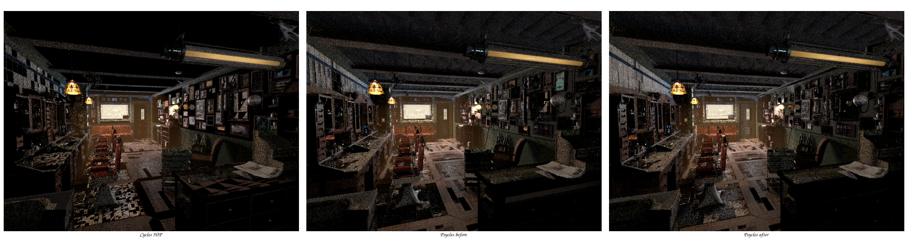

# Surface selection observes populated closures

## Result

Surface closure selection is now a pure observer of an already populated
physical closure. The final closure normal is produced once during closure
setup and is no longer recomputed during either categorical-measure pass.

This is primarily a Cycles-semantics and code-ownership fix. On the measured
Barbershop workload it does not produce a statistically meaningful render
speedup, and this checkpoint does not claim one.

## Formal boundary

Let `P(raw, point)` be physical closure population and let `C = P(raw, point)`
be the retained closure sequence. Population establishes the invariant

```text
C[i].normal = the final Cycles ShaderClosure normal for retained closure i.
```

For query `q`, categorical selection is the finite measure

```text
p(i | C, q) = eligible(C[i], q) * C[i].sample_weight / W,
W = sum_j eligible(C[j], q) * C[j].sample_weight.
```

It may read closure identity, setup validity, sample weight, final normal and
the query's lobe/glossy-filter policy. It must not apply another transformation
to `C[i].normal`. In particular, the old relation

```text
selection_normal = ensure_valid(Ng, wi, C[i].normal)
```

was not a valid observer: `ensure_valid` is not generally idempotent, and it
incorrectly extended a glossy setup operation to diffuse and thin-subsurface
closures.

Blender 5.2 Cycles uses the same ownership boundary:

- `intern/cycles/kernel/svm/closure.h` and OSL closure setup assign the final
  `ShaderClosure::N`, including `maybe_ensure_valid_specular_reflection()` for
  the closure families that require it;
- `surface_shader_bsdf_bssrdf_pick()` in
  `intern/cycles/kernel/integrator/surface_shader.h` performs the two
  sample-weight scans over populated `ShaderClosure` records and returns the
  selected record without correcting its normal again.

## Implementation

- `SurfaceClosureSelectionContext` now contains only `lobe_mask` and
  `glossy_filter_roughness`.
- The shared selection callable ABI drops geometric normal, incoming direction
  and bump-correction inputs: 15 arguments become 12.
- `surface_closure_selection()` returns the stored closure normal.
- Both the runtime-indexed arena evaluator and topology-specialized visitor use
  the same canonical selection context and input projection.

The regression in `test_luisa_surface_closure_collection.cpp` supplies a stored
normal deliberately unsuitable for an implicit setup transform and verifies
that selection returns it unchanged on fallback, HIP and native XIR-to-SPIR-V
Vulkan.

## Validation

Build (all host threads):

```sh
cmake --build build \
  --target psycles_render_blender_scene \
           psycles_luisa_surface_population_tests \
           psycles_luisa_surface_closure_collection_tests \
           psycles_luisa_principled_thin_wall_tests \
           psycles_luisa_principled_setup_callable_tests \
  --parallel "$(nproc)"
```

Backend regression matrix:

```sh
ctest --test-dir build --output-on-failure \
  -R 'psycles\.luisa_(surface_(population|closure_collection)|principled_(thin_wall|setup_callable))_(fallback|hip|vk)$' \
  -j1
```

All 12 tests passed. The Vulkan entries use the configured native
XIR-to-SPIR-V route.

Barbershop command, with the production per-`(pixel,sample)` coroutine launch
and 64 samples per dispatch:

```sh
env PSYCLES_COMPACT_SURFACE_VALUES=1 \
    PSYCLES_POPULATE_SURFACE_ONCE=1 \
    LUISA_LOG_LEVEL=warning \
./build/bin/psycles_render_blender_scene \
  /home/mike/Projects/psycles-benchmarks/barbershop-480p-64spp/export \
  OUTPUT.exr hip 640 480 64 64 - 0 0 0 0 64 - 1 0 \
  wavefront-staged 32 32768 32 1 1 0 4 2 4096 0 0 0 1 1048576
```

Matched unprofiled render-only results:

| variant | render time |
|---|---:|
| before | 3.74977 s |
| pure selection observer | 3.74773 s |

Matched `rocprofv3 --kernel-trace --scratch-memory-trace --stats` results:

| metric | before | after |
|---|---:|---:|
| shade invocations | 67,963,200 | 67,950,752 |
| shade time | 2,417.672 ms | 2,425.075 ms |
| shade time/invocation | 35.573 ns | 35.689 ns |
| private scratch | 6,160 B | 6,160 B |
| HIP code-object payload | 998,912 B | 998,144 B |
| render-only | 3.75391 s | 3.75115 s |

The normalized shade difference is +0.33%, which is noise at this sampling
level; code-object payload decreases by 768 B. The earlier 7.5-second readings
used `max_samples_per_dispatch=1` and are a separate scheduler sweep point, not
a valid comparison with the production value 64.

## Visual inspection



At 640x480 and 64 spp, old and new Psycles images are visually
indistinguishable at whole-frame scale. The already documented scene-level
gap to the Cycles reference remains visible, especially in overall exposure
and some floor/wall transport; this change neither hides nor worsens that
remaining alignment work. Direct old/new EXR comparison reports mean absolute
error `6.59966e-4` and RMS `2.48161e-2`, dominated by sparse stochastic glossy
paths. The fixed regression, rather than an exact full-frame hash, pins the
normal ownership invariant deterministically across all three backends.
