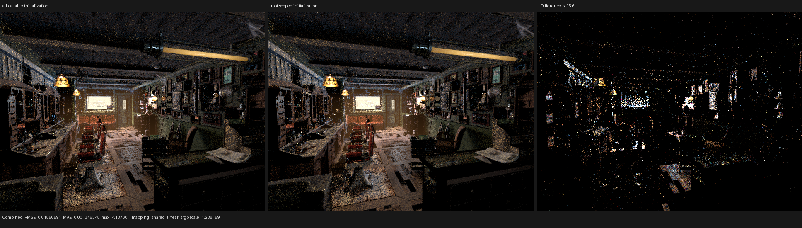

# Surface value bank coroutine lifetime

## Result

The compact surface interpreter's typed local banks no longer cross the
`shade_surface` coroutine boundary. On the production Barbershop path this
reduces the frame from 179 fields / 1,072 B to 176 fields / 848 B. At the
configured 1,048,576-frame capacity that removes 224 MiB of global frame
storage.

The change is deliberately scoped to the coroutine-root population path.
Height and preparation callables already own their banks inside a synchronous
callable lifetime, so they do not emit redundant initialization stores.

## Formal argument

Let `P` be a host-compiled surface value program and `B_t[0..K_t)` one of its
typed device-local banks. The surface compiler emits a topological schedule
and rejects malformed operands, establishing

```text
Valid(P) => every observed read B_t[i] is dominated by a write B_t[i]
```

The generic XIR pass cannot use that fact because the schedule and operands
arrive through immutable device buffers; to XIR, a runtime index may denote
any bank element. Consequently its Must analysis correctly refused to move
the three bank allocas below the cut.

At the coroutine-root population boundary Psycles now establishes the stronger
device-visible invariant

```text
Defined(B_t) := for every i in [0, K_t), B_t[i] has a reaching definition.
```

Full initialization is sufficient for every runtime-indexed read. For a valid
program it is observationally neutral because the host proof says the value is
overwritten before it is observed. It also gives malformed bytecode a
deterministic zero rather than undefined storage, although malformed programs
remain rejected on the host. With `Defined(B_t)` available on every path into
surface evaluation, all later observations are confined to the
`shade_surface` region and Luisa can soundly contract each existing alloca's
lifetime. No new XIR entity or test-specific matcher is introduced.

The initialization policy is a host/JIT enum. It cannot become a device-side
branch or enter runtime scheduler state:

- coroutine-root population selects `full_bank`;
- callable-local preparation selects `program_prefix`;
- Bump height callables retain their existing program-defined bank contract.

## Frame and HIP profile

Hardware is an AMD Radeon RX 9070 XT (`gfx1201`) with ROCm 7.2.53211. The
Barbershop measurement is 640x480, 64 spp, one `(width,height,64)` dispatch,
staged wavefront scheduling, and a 1,048,576-frame capacity. Times exclude
scene import and acceleration-structure construction.

| Variant | Frame | `shade_surface` private segment | `shade_surface` GPU time | Render-only |
|---|---:|---:|---:|---:|
| compact, opaque-buffer proof unavailable | 179 fields / 1,072 B | 6,720 B | 2,824.95 ms | 4,175.83 ms |
| compact, root-scoped definition | 176 fields / 848 B | 6,496 B | 2,549.21 ms | 3,974.21 ms |
| expanded evaluator baseline | 176 fields / 848 B | 5,264 B | 2,021.08 ms | 3,500.17 ms |

The frame contraction saves 224 B (20.9%), reduces the profiled compact render
by 4.83%, and reduces profiled `shade_surface` time by 9.76%. The remaining
gap to the expanded `shade_surface` kernel is 26.1%; equal frame size therefore
does not explain the rest. The next target is the compact interpreter's local
working set and retained callable ABI, not scheduler tuning.

An intermediate experiment initialized every `SurfaceValueLocals` instance.
It reached the same 848-B frame and 6,496-B private segment, but generated the
stores in callables that could not contribute to the frame proof. Restricting
the stronger invariant to the root preserves the measured frame and the same
1,024,400-B hot HIP code object while keeping callable semantics and AST size
cleaner. Runtime differences between these equal-frame variants were within
run-to-run noise.

## Correctness and visual inspection

The surface population and compact preparation matrix passes 6/6 on HIP,
fallback, and strict native Vulkan. The sample/film regressions pass 8/8 and
cover absolute sample mapping, chunk boundaries, Combined, Normal, Albedo, all
light passes, and deterministic serial versus atomic accumulation policies.

The 640x480, 64-spp Barbershop render was also inspected visually. The two
images have the same camera, geometry, material, texture, and lighting
structure. Their cross-process difference contains stochastic path noise and
the scene's known equal-distance coincident-support choices; it is not used as
the semantic oracle. The in-process regression fixtures are the correctness
gate.



## Reproduction

```sh
cmake --build build --target psycles_render_blender_scene --parallel "$(nproc)"
ctest --test-dir build --output-on-failure --parallel "$(nproc)" \
  -R 'psycles\.luisa_(surface_population|compact_surface_preparation)_(fallback|hip|vk)$'
ctest --test-dir build --output-on-failure --parallel "$(nproc)" \
  -R 'psycles\.(luisa_(sample_dispatch_film|cycles_sample_mapping|cycles_film_light)_(fallback|hip|vk)|sample_dispatch_partition)$'
```

The exact renderer and profiler commands plus machine-readable results are in
[report.json](report.json).
